## 1、介绍

1、概述


总计：zookeeper=文件系统+通知机制

2、操作

（1）统一命名服务（Name Service如Dobbu服务注册中心）

（2）配置管理（Configuration Management）

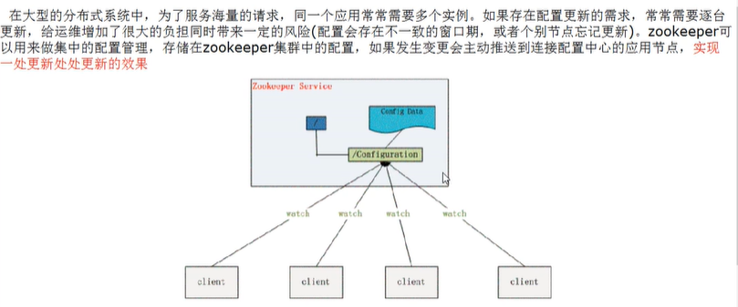

（3）集群管理（Group Membershio，如Hadoop分布式集群管理）

（4）Java操作API。

## 2、zk-setup

1、安装步骤

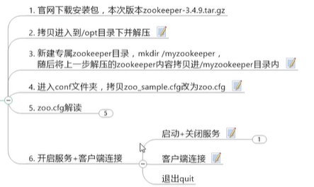

2、zoo.cfg解读

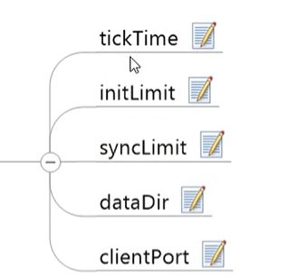

文件显示：

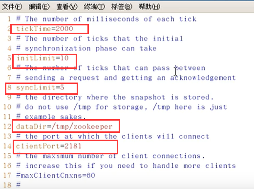

（1）tickTime

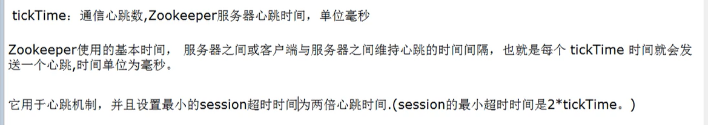

（2）initLimit

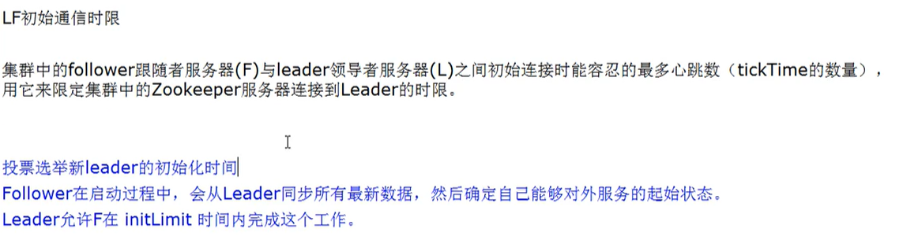

（3）synclimit

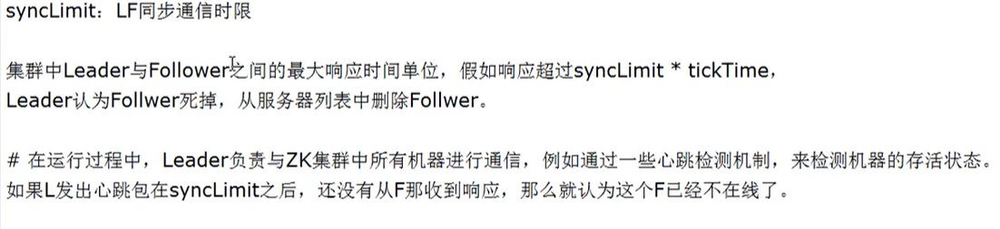

（4）dataDir-数据目录

（5）clientPort-默认端口

3、开启服务+客户端链接

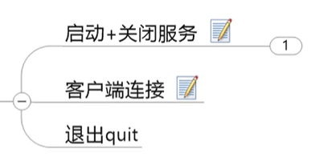

​		当启动zookeeper服务器之后，可以通过下面的命令来测试该服务器是否成功启动：

```shell
echo ruok | nc 127.0.0.1 2181
```

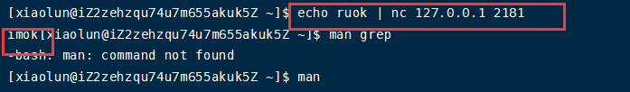

## 3、数据节点znode节点深入讲解

1、介绍

（1）zookeeper维护一个类似文件系统的数据结构。

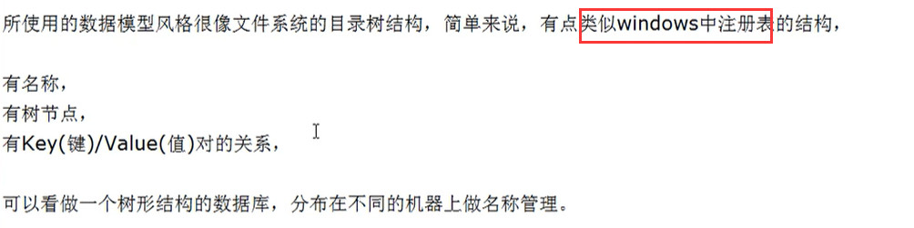

（2）初始zonde节点

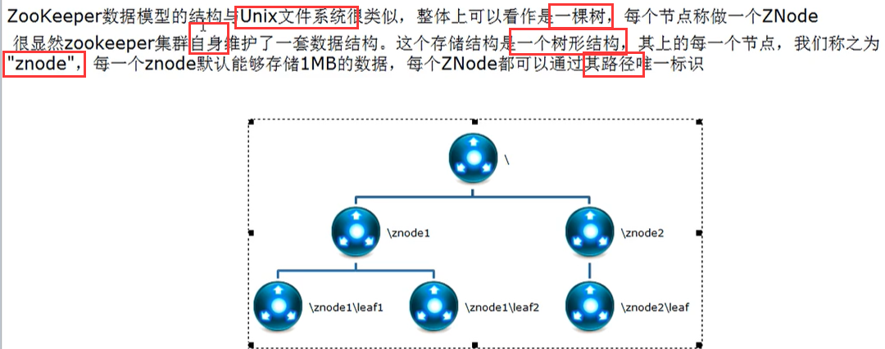

（3）概述

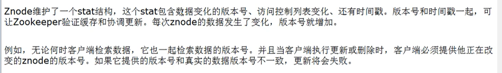

zookeeper的Stat结构体：

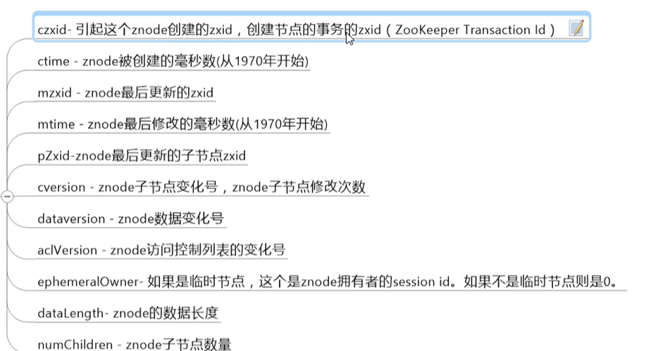

czxid介绍：

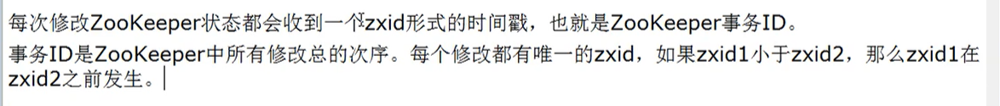

（4）总结

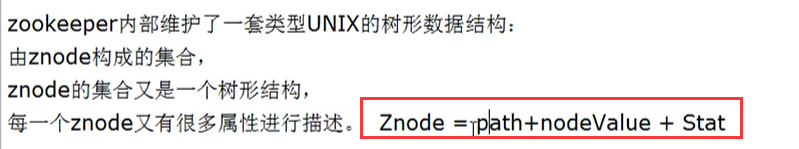

2、znode中的存在类型

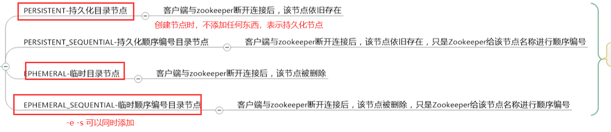

临时/持久图：

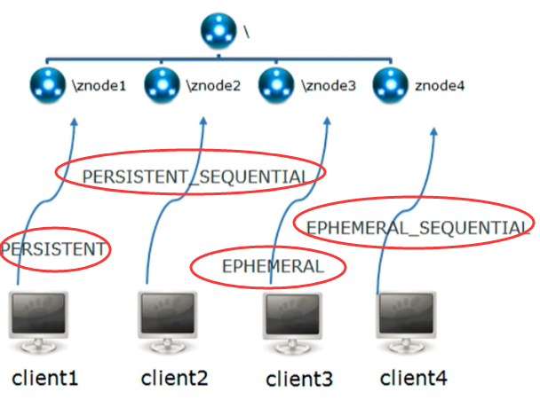

介绍：

​		znode是由客户端创建的，它和创建它的客户端的内在联系，决定了它的存在性。

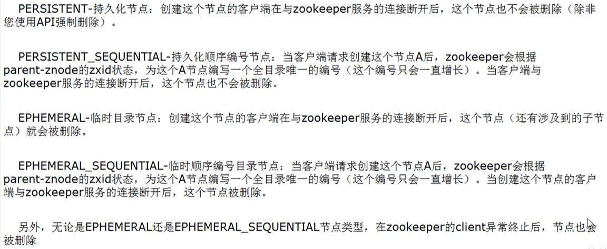

## 4、客户端操作

1、zkCli常用命令操作

（1）总结：和Redis的KV键值对类似，只不过key变成了一个路径节点值，value就是data。

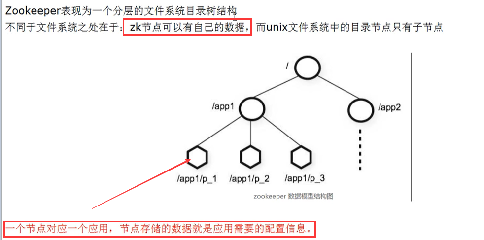

（2）常用命令：

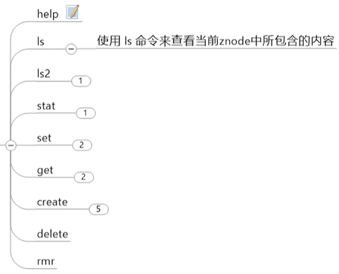

2、四字命令

（1）介绍

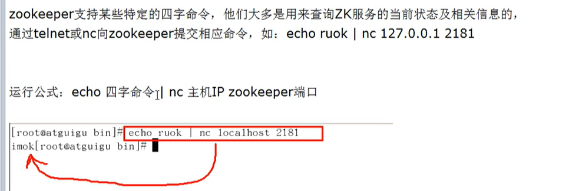

（2）常用

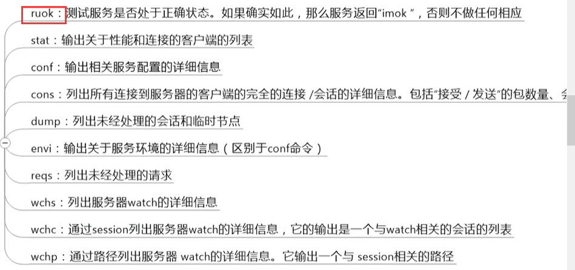

## 5、通知机制

1、session

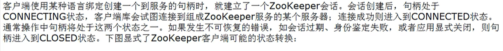

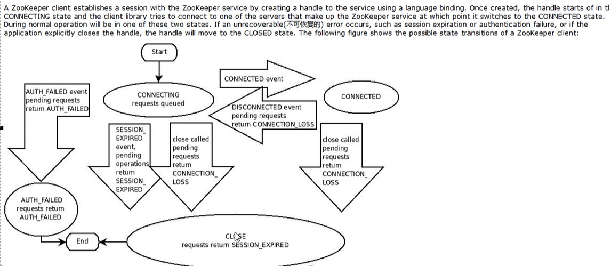

2、watch

（1）通知机制

客户端注册监听它关心的目录节点，当目录节点发生变化（数据改变、被删除、子目录节点增加或删除）时，zookeeper会通知客户端。

（2）观察者的功能

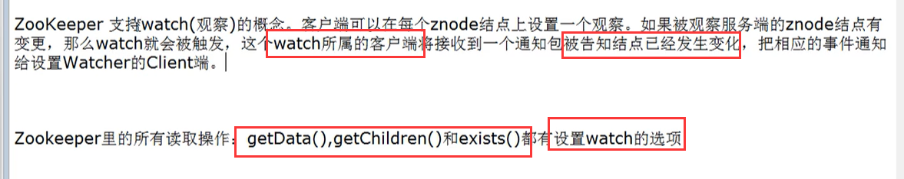

总结：异步+回调+触发机制。

（3）watch事件的理解

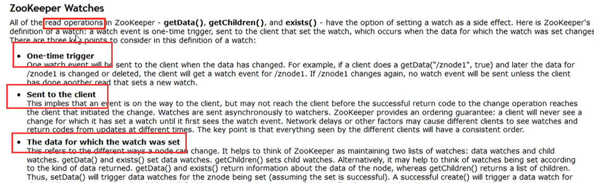

步骤：

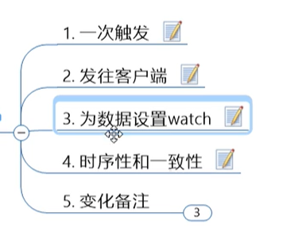

（a）一次触发


（b）发往客户端

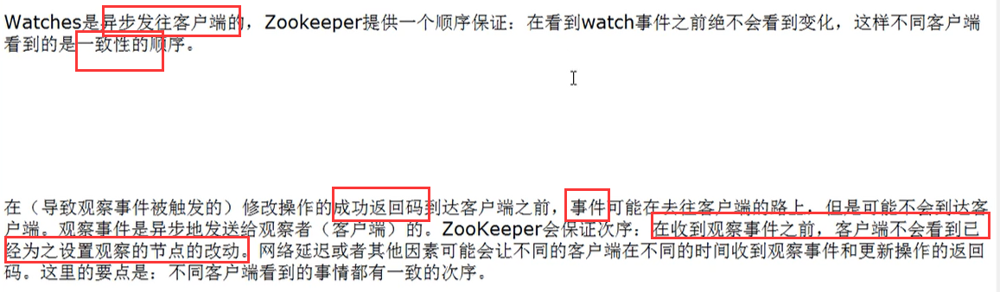

（c）为数据设置watch

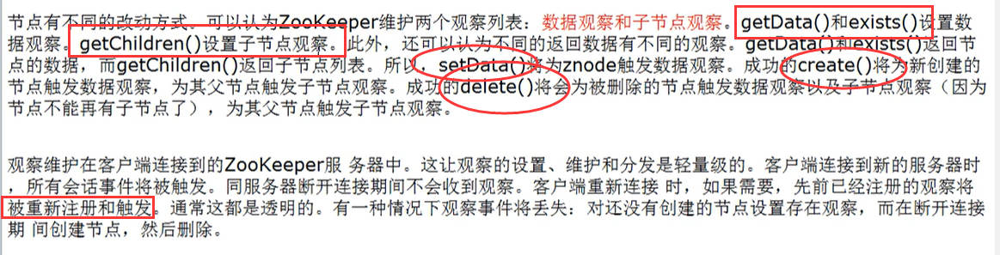

（d）变化备注

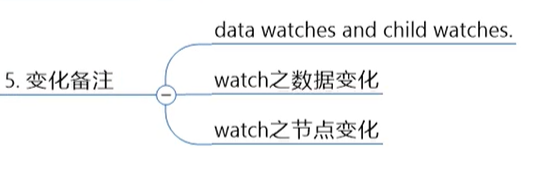

## 6、zkCluster

1、介绍

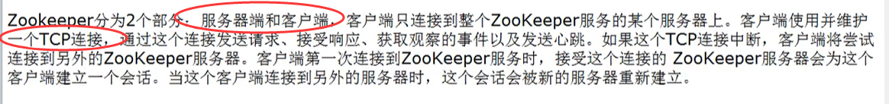

2、伪分布式单机配置

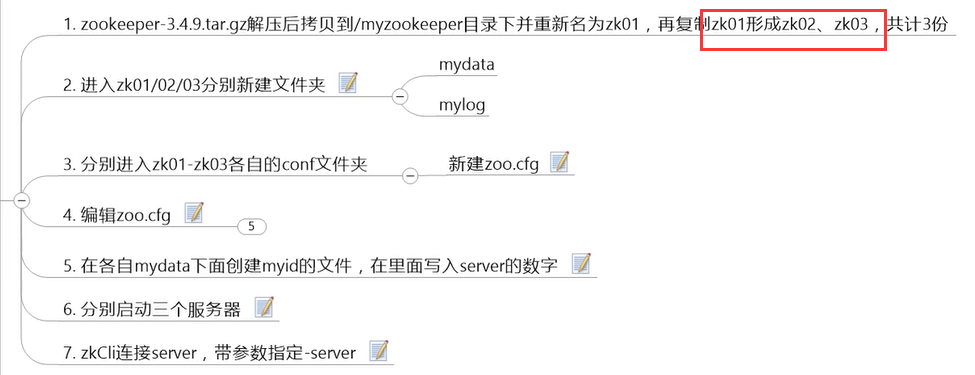