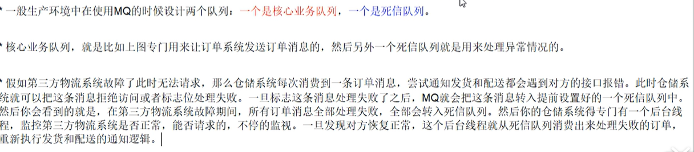
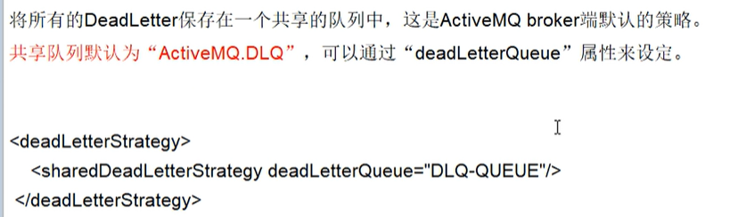

## 1、ActiveMQ的多节点集群

### 1、介绍

1、概述

基于zookeeper和LevelDB搭建ActiveMQ集群。集群仅提供主备方式的高可用集群功能，避免单点故障。

引入消息中间件后可以保证其高可用。

2、三种集群方式对比

网址：

```http
http://activemq.apache.org/masterslave
```


下面是三种集群的方式：

（1）基于shareFileSystem共享文件系统（KahaDB）。

（2）基于JDBC。

（3）基于可复制的LevelDB。

LevelDB，5.6版本之后推出了LecelDB的持久化引擎，它使用了自定义的索引代替常用的BTree索引，其持久化性能高于KahaDB，虽然默认的持久化方式还是KahaDB，但是LevelDB可能会是趋势。

在5.9版本还提供了基于LevelDB和Zookeeper的数据复制方式，作为Master-Slave方式的首选数据复制方案。

3、ShareFileSystem


### 2、zookeeper+replicated-leveldb-store的主从集群

#### 1、介绍

1、概述

网址：

```http
http://activemq.apache.org/replicated-leveldb-store
```

从ActiveMQ5.9开始,ActiveMQ的集群实现方式取消了传统的Masster-Slave方式。增加了基于Zookeeper+LevelDB的Master-Slave实现方式,从5.9版本后也是官网的推荐。

基于Zookeeper和LevelDB搭建ActiveMQ集群,集群仅提供主备方式的高可用集群功能,避免单点故障。

2、官方集群原理图


使用Zookeeper集群注册所有的ActiveMQ Broker，但只有其中一个Broker可以提供服务，它将被视为Master,其他的Broker处于待机状态被视为Slave。

如果Master因故障而不能提供服务，Zookeeper会从Slave中选举出一个Broker充当Master。Slave连接Master并同步他们的存储状态，Slave不接受客户端连接。所有的存储操作都将被复制到连接至Maste的Slaves。如果Master宕机得到了最新更新的Slave会变成Master。故障节点在恢复后会重新加入到集群中并连接Master进入Slave模式。

所有需要同步的消息操作都将等待存储状态被复制到其他法定节点的操作完成才能完成。因此，如果你配置了replicas=3，name法定大小是（3/2）+1 = 2。Master将会存储更新然后等待（2-1）=1个Slave存储和更新完成，才汇报success，至于为什么是2-1，阳哥的zookeeper讲解过自行复习。

有一个node要作为观察者存在。当一个新的Master被选中，你需要至少保障一个法定node在线以能够找到拥有最新状态的node，这个node才可以成为新的Master。

因此，推荐运行至少3个replica nodes以防止一个node失败后服务中断。

#### 2、部署规划和步骤

1、环境和版本

```ini
Centos 6.8
JDK 1.8.0_255
zookeeper-3.4.10
apache-activemq-5.16.0
```

2、关闭防火墙并保证各个服务器能够ping通

3、要求具备zk集群并可以成功启动

4、集群部署规划表

| zookeeper集群端口   | AMQ集群绑定端口            | AMQ消息tcp端口 | 管理控制台端口 | AMQ节点安装目录      |
| ------------------- | -------------------------- | -------------- | -------------- | -------------------- |
| 192.168.10.101:2181 | bind="tcp://0.0.0.0:63631" | 61616          | 8161           | /mq_cluser/mq_node01 |
| 192.168.10.102:2181 | bind="tcp://0.0.0.0:63632" | 61617          | 8162           | /mq_cluser/mq_node02 |
| 192.168.10.103:2181 | bind="tcp://0.0.0.0:63633" | 61618          | 8163           | /mq_cluser/mq_node03 |

其中，zookeeper集群在hadoop101，hadoop102，hadoop103中，而ActiveMQ是一个伪集群，在hadoop101这一台机器上。

5、创建3台集群目录

就是一台电脑复制三份ActiveMQ到hadoop101机器的/mq_cluser目录中。

```shell
[root@hadoop101 mq_cluser]# cp -r /opt/apache-activemq-5.16.0 mq_node01
```

6、修改管理控制台端口8161

就是ActiveMQ后台管理页面的访问端口。

位置：

```ini
conf/jetty.xml
```


7、hostname名字映射

如果不映射，只需要吧mq配置文件的hostname改成当前主机ip。


红框部分表示：修改为自己的IP和地址映射。

8、ActiveMQ集群配置

配置文件里面的BrokerName要全部一致。

位置：

```ini
conf/activemq.xml

# 将其BrokerName改成下面的内容，配置localhost不太好，会搞混
xlBroker
```


此外，必须要持久化配置。

```xml
<persistenceAdapter>
   <replicatedLevelDB
         directory="${activemq.data}/leveldb"
         replicas="3"
         bind="tcp://0.0.0.0:63631"
zkAddress="hadoop101:2181,hadoop102:2181,hadoop103:2181"
         hostname="hadoop101"
         zkPath="/activemq/leveldb-stores"
         />
  </persistenceAdapter>


<persistenceAdapter>
   <replicatedLevelDB
         directory="${activemq.data}/leveldb"
         replicas="3"
         bind="tcp://0.0.0.0:63631"
         zkAddress="hadoop101:2181,hadoop102:2181,hadoop103:2181"
         hostname="hadoop101"
         zkPath="/activemq/leveldb-stores"
         />
  </persistenceAdapter>
```

9、修改各个节点的消息端口

真实的三台机器不用管。

只需要将mq_node02/mq_node03的端口改成61617和61618即可，此时mq_node01原本就是默认的61618，默认即可。


10、首先将/data的历史数据全部删除，然后按顺序启动3个ActiveMQ节点,到这步前提是zk集群已经成功启动运行。

即先启动Zk，在启动ActiveMQ。

（1）启动三台activemq的脚本

脚本名字：amq_batch.sh，位置/myCommand。同样对应的有一个停止脚本的名字：amp_batch_stop.sh

```sheLl
#!/bin/bash

cd /mq_cluser/mq_node01/apache-activemq-5.16.0/bin
./activemq start

cd /mq_cluser/mq_node02/apache-activemq-5.16.0/bin
./activemq start

cd /mq_cluser/mq_node03/apache-activemq-5.16.0/bin
./activemq start
```

（2）启动三台zk的脚本

脚本名字：zk_batch.sh，位置/myCommand。同样对应的有一个停止脚本的名字：zk_batch_stop.sh

```shell
#!/bin/bash

cd /myzookeeper/zk01/bin
./zkServer.sh start

cd /myzookeeper/zk02/bin
./zkServer.sh start

cd /myzookeeper/zk03/bin
./zkServer.sh start
```

11、zk集群节点状态说明

（1）3台Zk连接任意一台验证三台ActiveMQ是否注册上了Zookeeper

```shell
# 使用zkCli.sh连接一台Zookeeper
bin/zkCli.sh -server hadoop101:2181
```


（2）查看master


集群启动之后对zookeeper数据的抓图，可以看到ActiveMQ有三个节点，分别是00001，00002，0003，其中第一张图000001的值可以看到elected的值不为null，说明这个节点是Master，其他两个节点是Slave。

#### 3、集群可用性测试

1、正常模式下

如果要使用集群，我们需要在生产者和消费者的代码中配置故障转移的配置模式：

```java
private static final String ACTIVEMQ_URL = "failover:(tcp://192.168.10.101:61616,tcp://192.168.10.101:61617,tcp://192.168.10.101:61618)";
private static final String ACTIVEMQ_QUEUE_NAME = "Queue-Cluter";
```

先启动生产者，将消息推送到MQ集群，此时，前端控制台显示界面：

网址对应Master配置的端口8161：

```http
http://192.168.10.101:8161/admin
```


2、将ActiveMQ集群中的Master杀死，模拟异常情况。

（1）zookeeper此时的slave成功上位


（2）查看此时的Java代码中的消费者情况：


已经将原来的61616端口切换到了61617端口。

## 2、高级特性

### 1、异步投递

#### 1、介绍

引入消息队列之后该如何保证其高可用性，采用zookeeper+Replicated LevelDB的方法。

1、概述

ActiveMQ支持同步，异步两种发送的模式将消息发送到broker，模式的选择对发送延时有巨大的影响。producer能达到怎么样的产出率（产出率=发送数据总量/时间）主要受发送延时的影响，使用异步发送可以显著提高发送的性能。

ActiveMQ默认使用**异步发送的模式**：除非明确指定使用同步发送的方式或者在**未使用事务的前提下发送持久化的消息**，这两种情况都是同步发送的。如果你没有使用事务且发送的是持久化的消息，每一次发送都是同步发送的且会阻塞producer知道broker返回一个确认，表示消息已经被安全的持久化到磁盘。确认机制提供了消息安全的保障，但同时会阻塞客户端带来了很大的延时。

很多高性能的应用，允许在失败的情况下有少量的数据丢失。如果你的应用满足这个特点，你可以使用异步发送来提高生产率，即使发送的是持久化的消息。

异步发它可以最大化producer端的发送效率。我们通常在发送消息量比较密集的情况下使用异步发送，它可以很大的提升Producer性能；不过这也带来了额外的问题，就是需要消耗更多的Client端内存同时也会导致broker端性能消耗增加；此外它不能有效的确保消息的发送成功。在`userAsyncSend=true`的情况下客户端需要容忍消息丢失的可能。

 2、官网

```http
http://activemq.apache.org/async-sends
```

对于一个Slow Consumer，使用同步发送消息可能出现Producer堵塞的情况，慢消费者适合使用异步发送。

3、官网配置


4、异步消息如何确定发送成功

异步发送丢失消息的场景是：生产者设置`userAsyncSend=true`，使用producer.send(msg)持续发送消息。如果消息不阻塞，生产者会认为所有send的消息均被成功发送至MQ。如果MQ突然宕机，此时生产者端内存中尚未被发送至MQ的消息都会丢失。

因此，正确的异步发送方法是需要接收回调的。

同步发送和异步发送的区别就在此，同步发送等send不阻塞了就表示一定发送成功了，**异步发送需要客户端回执并由客户端再判断一次是否发送成功**。

#### 2、测试

```java
package com.xiaolun.activemq.mysql;

import org.apache.activemq.ActiveMQConnectionFactory;
import org.apache.activemq.ActiveMQMessageProducer;
import org.apache.activemq.AsyncCallback;

import javax.jms.*;
import java.util.UUID;

public class Producer_AsyncSned {
   private static final String ACTIVEMQ_URL = "failover:(tcp://192.168.10.101:61616,tcp://192.168.10.101:61617,tcp://192.168.10.101:61618)";
   private static final String ACTIVEMQ_QUEUE_NAME = "Queue-异步投递回调";

   public static void main(String[] args) throws JMSException {
      ActiveMQConnectionFactory activeMQConnectionFactory = new ActiveMQConnectionFactory();
      activeMQConnectionFactory.setBrokerURL(ACTIVEMQ_URL);
      //开启异步投递
      activeMQConnectionFactory.setUseAsyncSend(true);
      Connection connection = activeMQConnectionFactory.createConnection();
      connection.start();

      Session session = connection.createSession(false, Session.AUTO_ACKNOWLEDGE);
      Queue queue = session.createQueue(ACTIVEMQ_QUEUE_NAME);
      //向上转型到ActiveMQMessageProducer
      ActiveMQMessageProducer activeMQMessageProducer = (ActiveMQMessageProducer) session.createProducer(queue);

      for (int i = 1; i <= 3; i++) {
         TextMessage textMessage = session.createTextMessage("message-" + i);
         //添加标识ID
         textMessage.setJMSMessageID(UUID.randomUUID().toString() + "----orderXiaolun");
         String textMessageId = textMessage.getJMSMessageID();
         //使用ActiveMQMessageProducer的发送消息,可以创建回调
         activeMQMessageProducer.send(textMessage, new AsyncCallback() {
            @Override
            public void onSuccess() {
               System.out.println(textMessageId + "发送成功");
            }

            @Override
            public void onException(JMSException exception) {
               System.out.println(textMessageId + "发送失败");
            }
         });
      }
      activeMQMessageProducer.close();
      session.close();
      connection.close();
   }
}
```

执行上面的程序后，前端控制台输出为：


此时控制台输出为：


表示客户端异步发送后，消息推送到MQ服务器后会有一个回执，进而可以看到客户端推送到MQ服务器的数据丢失情况。

### 2、延迟投递和定时投递

#### 1、介绍

1、官网

```http
http://activemq.apache.org/delay-and-schedule-message-delivery.html
```

2、四大属性的说明


#### 2、案例演示

1、activemq.xml中配置schedulerSupport属性为true

```ini
schedulerSupport="true"
```


2、使用Java代码里面封装的辅助消息类型：ScheduledMessage

```java
package com.xiaolun.activemq.mysql;

import org.apache.activemq.ActiveMQConnectionFactory;
import org.apache.activemq.ScheduledMessage;

import javax.jms.*;

public class Producer_Delay {
   private static final String ACTIVEMQ_URL = "tcp://192.168.10.101:61616";
   private static final String QUEUE_NAME = "Queue-delay";

   public static void main(String[] args) throws JMSException {
      ActiveMQConnectionFactory activeMQConnectionFactory = new ActiveMQConnectionFactory();
      activeMQConnectionFactory.setBrokerURL(ACTIVEMQ_URL);
      Connection connection = activeMQConnectionFactory.createConnection();
      connection.start();
      Session session = connection.createSession(false, Session.AUTO_ACKNOWLEDGE);
      Queue queue = session.createQueue(QUEUE_NAME);
      //向上转型到ActiveMQMessageProducer
      MessageProducer messageProducer = session.createProducer(queue);
      long delay = 3 * 1000;      //延迟投递的时间
      long period = 4 * 1000;     //每次投递的时间间隔
      int repeat = 5;                     //投递的次数

      for (int i = 1; i <= 3; i++) {
         TextMessage textMessage = session.createTextMessage("message-延时投递" + i);
         //给消息设置属性以便MQ服务器读取到这些信息,好做对应的处理
         textMessage.setLongProperty(ScheduledMessage.AMQ_SCHEDULED_DELAY, delay);
         textMessage.setLongProperty(ScheduledMessage.AMQ_SCHEDULED_PERIOD, period);
         textMessage.setIntProperty(ScheduledMessage.AMQ_SCHEDULED_REPEAT, repeat);
         messageProducer.send(textMessage);
      }
      messageProducer.close();
      session.close();
      connection.close();
   }
}
```

当生产者将数据发送到MQ服务器后，消费者端接收消息的情况是：延迟3秒钟发送，每次发送间隔4秒钟，一共投递5次消息消息，共15条数据。


### 3、重试机制

#### 1、介绍

1、官网

```http
http://activemq.apache.org/redelivery-policy
```


2、面试题

```ini
具体哪些情况会引发消息重发
1：Client用了transactions且再session中调用了rollback
2：Client用了transactions且再调用commit之前关闭或者没有commit
3：Client再CLIENT_ACKNOWLEDGE的传递模式下，session中调用了recover
 
请说说消息重发时间间隔和重发次数
间隔：1
次数：6
 每秒发6次
有毒消息Poison ACK
一个消息被redelivedred超过默认的最大重发次数（默认6次）时，消费的回个MQ发一个“poison ack”表示这个消息有毒，告诉broker不要再发了。这个时候broker会把这个消息放到DLQ（私信队列）。
```


3、整合Spring


属性说明：


### 4、死信队列

1、介绍

（1）官网

```http
http://activemq.apache.org/message-redelivery-and-dlq-handling.html
```

（2）概述


2、使用

处理失败的消息。




3、死信队列的配置介绍


（1）SharedDeadLetterStrategy



（2）IndividualDeadLetterStrategy

把DeadLetter放入各自的死信队列中：


（3）配置案例

自动删除过期消息：


存放非持久化消息到队列中：


### 5、幂等性

网络延迟传输中，会造成进行MQ重试，在重试过程中，可能会造成重复消费。

 如果消息是做数据库的插入操作，给这个消息一个唯一的主键，那么就算出现重复消费的情况，就会导致主键冲突，避免数据库出现脏数据 。 

  如果不是，可以用redis 等的第三方服务，给消息一个全局 id ，只要消费过的消息，将 id ，message 以 K-V 形式写入 redis ，那消费者开始消费前，先去 redis 中查询有没消费的记录，如果有，说明重复消费，反之，不存在重复消费。 

```ini
# 客户端查询操作写法如下
redis.set(id,message);
```

