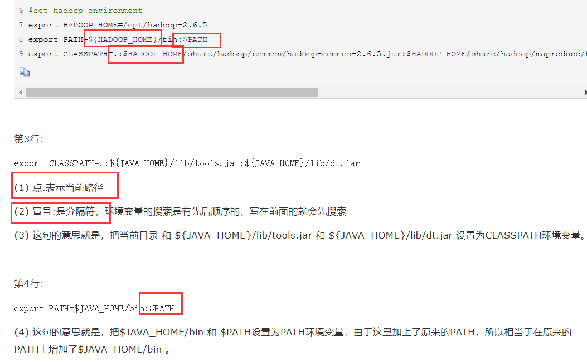
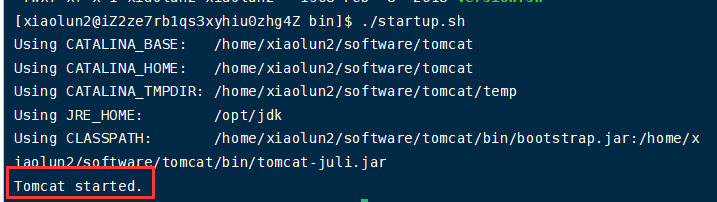
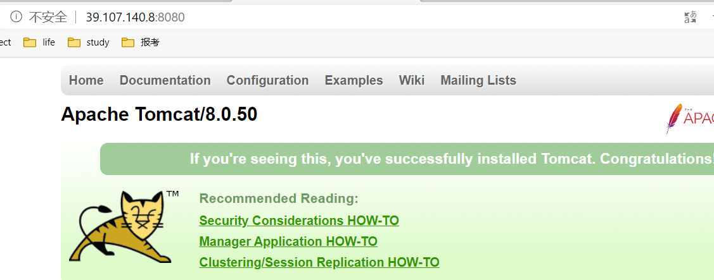
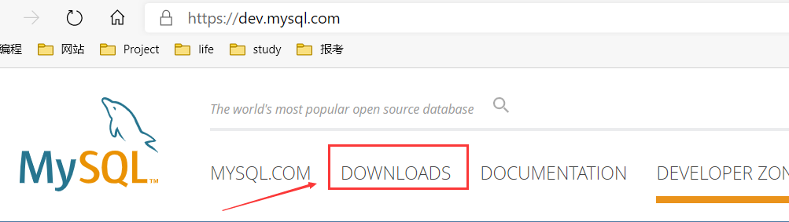
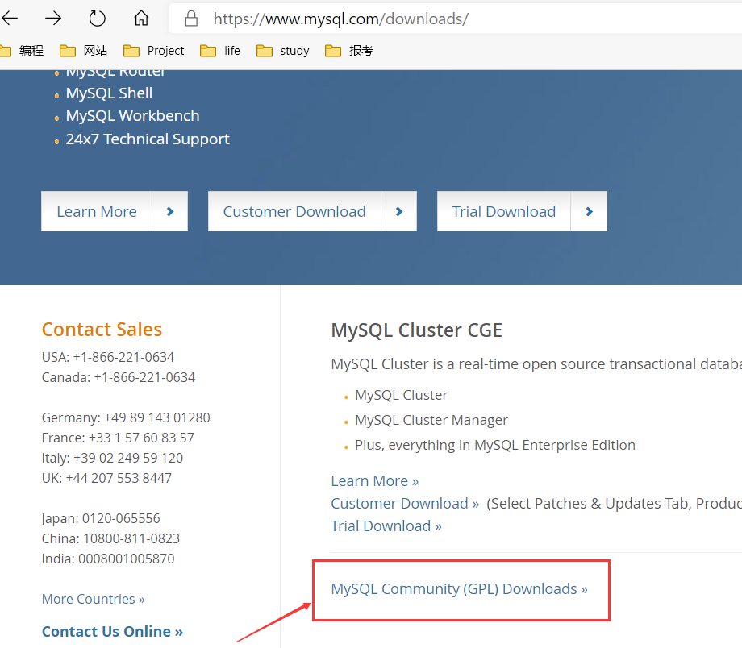
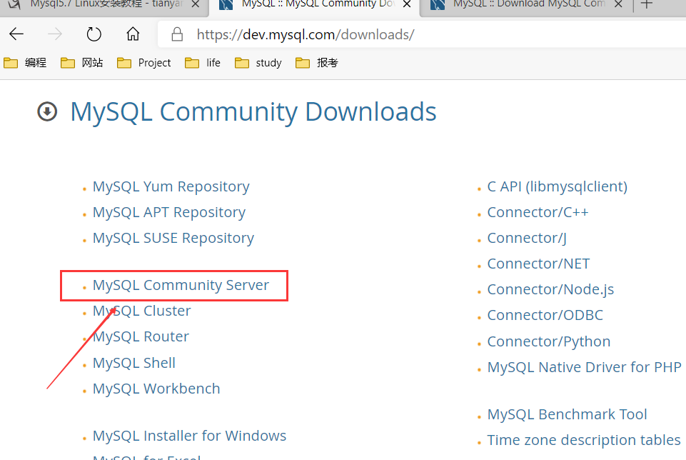

# 1 Xshell的安装

​	 Xshell 是目前最好的远程登录到Linux操作的软件，流畅的速度并且完美解决了**中文乱码**的问题， 是目前程序员首选的软件。也可以在Windows界面下用来访问远端不同系统下的服务器，从而比较好的达到远程控制终端的目的。

特别说明，如果安装好Xshell 就可以远程访问Linux系统的话，需要一个前提，那就是Linux启动了SSHD服务。服务器会监听22号端口。

## 1.1 安装步骤

以管理员身份运行下面的文件，实现需要将放到联想杀毒软件的保护目录中。


基本上是傻瓜式安装，一步步点击，往下进行就可以了。


安装完成界面：


此时，不要进行运行该软件，将nssock.dll文件放到白名单中进行保护。


## 1.2 连接到远程Linux主机

1. 我们使用命令`ifconfig`找到Linux注解的ip地址：


2. 使用Xshell进行连接：


此时，Xshell界面如下。


# 2 XFtp5的安装

​		使用了 Xftp 以后，windows 用户能安全地在 UNIX/Linux 和 Windows PC 之间传输文件。

##  2.1 安装步骤


同样，需要将安装文件nssock2.dll放到联想杀毒的保护名单中。


当运行时，是这个界面就说明Xftp5安装成功了。

## 2.2 配置


由于我们使用root身份登录，连接完成后Linux就会切换到对应的那个目录下：


可以看到有乱码出现，我们需要配置一下：


传输文件：


# 3 SecureCRT的安装

​		该工具是用于远程登录Linux的软件。SecureCRT 也是一款常用的远程登录Linux的软件，在大数据开发中使用较多。

**快捷键**

https://blog.csdn.net/weixin_41615494/article/details/79735869

|     快捷键      |      描述      |
| :-------------: | :------------: |
|    ctrl + a     | 移动光标到行首 |
|    ctrl + e     | 移动光标到行尾 |
| ctrl+ shift + c |      复制      |
| ctrl+ shift + v |      粘贴      |
|    ctrl+tab     |  切换不同窗口  |

## 3.1 安装

​		该软件使用的是绿色安装版，我们只需要将文件拷贝到指定的目录就可以了。

## 3.2 配置


在配置好进行连接之后，配置界面如下：


乱码问题的解决方法如下：


# 4 Java安装和配置

如果在`Linux`下进行`JavaEE`的开发，我们需要安装如下软件：

+ mysql-5.6.14.tar.gz
+ jdk-7u79-linux-x64.gz
+ eclipse-jee-mars-2-linux-gtk-x86_64.tar.gz
+ apache-tomcat-7.0.70.tar.gz

下载路径：https://www.oracle.com/technetwork/java/javase/downloads/jdk8-downloads-2133151.html

选择下载tar包：


**安装JDK的步骤**

1. 先将软件通过xftp5上传到`/opt/`路径下
2. 解压缩到/opt/路径下
3. 配置环境变量的配置文件，

```ini
1. 位置：`vim /etc/profile`
2.  JAVA_HOME=/opt/jdk1.7.0_79
3. PATH=/opt/jdk1.7.0_79/bin:$PATH
4.  export JAVA_HOME PATH
```

4. 需要注销用户，环境变量才能生效

5. 测试是否安装成功，编写一个简单的hello.java，查看能否输出"hello, world!"。

## 1、上传软件到/opt/


## 2、将文件解压缩到/opt/路径下

命令：

```ini
tar -zxvf jdk-8u251-linux-x64.tar.gz
```

解压出来一个新目录：


## 3、配置环境变量

1、进入下面的目录，然后在编辑模式下配置环境变量。

```ini
vim /etc/profile 
```


其中，`export`指令的作用是输出环境变量，让变量生效。

```SHEll
#1、写入下面的内容
JAVA_HOME=/opt/jdk1.8.0_251
PATH=/opt/jdk1.8.0_251/bin:$PATH
export JAVA_HOME PATH

#2、保存退出后，使用下面的命令使文件生效
#当复制另一个服务器标签，使用下面的指令时，当前的服务器配置并不会奏效。
source /etc/profile 

#3、输入下面的内容测试是否安装成功
java -version
```

2、Linux中PATH、CLASSPATH等环境变量配置格式详解。



## 4、注销用户，让环境变量生效。

​		如果运行级别为3，使用`logout`就可以；如果运行级别为5，注销后即可。这样的话，就可以在任何目录下可以使用`java`和`javac`有东西输出。


## 5、 测试是否输出成功。

编写一个简单的hello.java,输出“hello world!”


# 5 Tomcat安装和配置

下载网址：https://tomcat.apache.org/download-90.cgi


**安装步骤**

1. 解压缩到/opt/路径下

```ini
tar -zxvf apach-tomcat-7.0.70.tar.gz
```

2. 启动tomcat ./startup.sh，先进入tomcat的bin目录：

```ini
cd apach-tomcat-7.0.70/bin/
```

3. 开放端口，这样外网才能访问tomcat

```ini
vim /etc/sysconfig/iptables
增加一行：A INPUT -m state --state NEW -m tcp -p tcp --dport 8080 -j ACCEPT
重启防火墙：service iptables restart
```

	4. 测试是否安装成功

在windows或linux下访问http://linuxip:8080。

## 1、解压缩到/opt/路径下


## 2、启动tomcat

首先进入tomcat的bin目录。


然后在火狐浏览器中进行访问：http://localhost:8080，弹出下面界面：


## 3、开放端口

​		使用本地是可以访问到tomcat的，但是我们希望外网也能访问tomcat，比如在windows的浏览器中访问tomcat。


重启防火墙：


## 4、测试是否成功

windows浏览器上输入：http://192.168.10.130:8080/，显示：


windows控制台输入：

```ini
telnet 192.168.10.130 8080
```

可以进入下面的界面：


## 5、阿里云服务器上安装

1、在默认情况下，Linux不会开放端口号，为了能够能够让外界访问，我们需要在安全组中设置一组规则，将8080端口开放。（应该不用开放防火墙就可以）

2、启动安装目录下的tomcat。



3、使用ip+端口的形式进行访问阿里云服务器上的tomcat，如果出现图标，则表明tomcat安装成功。



# 6 Eclipse安装

**安装步骤**

1. 解压缩到/opt/路径下

```ini
tar -zxvf eclipse-jee-mars-2-linux-gtk-x86_64.tar.gz
```

2.  启动eclipse，配置`jre`和`server`
3. 编写jsp页面，并测试

https://archive.eclipse.org/technology/epp/downloads/release/luna/SR2/eclipse-jee-luna-SR2-linux-gtk-x86_64.tar.gz

## 1、解压


## 2、 启动eclipse，配置`jre`和`server`

启动方式：


启动成功界面：


## 3、编写jsp页面，并测试


运行后显示：


当运行代码时，可能会遇到端口被占用的情况，我们需要将apache关闭：


# 7 Mysql的配置和安装

## 7.1 安装

mysql安装时间很长。

下载地址：https://dev.mysql.com/downloads/mysql/5.7.html

参考文档：https://www.cnblogs.com/xuange306/p/8301669.html








通过源代码安装高版本的5.6.48。

CentOS 7安装地址：https://www.cnblogs.com/chxuyuan/p/7707392.html。

1. 使用下面的命令检查是否安装有MySQL Server

```ini
rpm -qa | grep mysql
```


2. 删除存在的mysql

```ini
rpm -e mysql-libs  --普通删除模式
rpm -e --nodeps mysql-libs	--强力删除模式，如果使用上面命令删除时，提示有依赖的其他文件，则用该命令可以对其进行强力删除
```

3. 安装编译代码所需要的环境

```ini
yum -y install make gcc-c++ cmake bison-devel ncurses-devel
```


4. 解压mysql文件


5.  编译安装（源码）

编译过后才能够安装，进入mysql-5.6.48目录下执行下面的编译安装的指令，

```ini
cmake -DCMAKE_INSTALL_PREFIX=/usr/local/mysql -DMYSQL_DATADIR=/usr/local/mysql/data -DSYSCONFDIR=/etc -DWITH_MYISAM_STORAGE_ENGINE=1 -DWITH_INNOBASE_STORAGE_ENGINE=1 -DWITH_MEMORY_STORAGE_ENGINE=1 -DWITH_READLINE=1 -DMYSQL_UNIX_ADDR=/var/lib/mysql/mysql.sock -DMYSQL_TCP_PORT=3306 -DENABLED_LOCAL_INFILE=1 -DWITH_PARTITION_STORAGE_ENGINE=1 -DEXTRA_CHARSETS=all -DDEFAULT_CHARSET=utf8 -DDEFAULT_COLLATION=utf8_general_ci
```

报错：


执行下面的命令：

```ini
yum -y install openssl-devel --安装openssl-devel
```

6. 编译并安装

```ini
make && make install --整个过程需要30分钟左右
```

## 7.2 配置

1. 查看是否有mysql用户及用户组

```ini
cat /etc/passwd		--查看用户列表
cat /etc/group		--查看用户组列表
```

如果没有的话，使用下面的命令进行创建：

```ini
#创建mysql用户，并将其加入mysql组中。原始passwd：mysql
groupadd mysql
useradd -g mysql mysql
```

  		2. 修改/usr/local/mysql权限

我们可以事先看看有没有下面的目录：/usr/local/mysql


```ini
chown -R mysql:mysql /usr/local/mysql --改变所有者和组
```

​		

3. 初始化配置

需要进入到安装路径(再执行下面的指令)，执行初始化配置脚本，创建系统自带的数据库和表。

```ini
cd /usr/local/mysql     --切换到安装目录下
scripts/mysql_install_db --basedir=/usr/local/mysql --datadir=/usr/local/mysql/data --user=mysql  -- 执行配置脚本
```


		注意：

(1)在启动MySQL服务时，会按照一定次序搜索`my.cnf`，先在/etc/目录下查找，找不到则会搜索"$basedir/my.cnf"，在本例中是`/usr/local/mysql/my.cnf`，这是新版MySQL的配置文件的默认位置！

(2)在CentOS 6.8 版操作系统的最小安装完成后，在/etc/目录下会存在一个`my.cnf`，需要将此文件更名为其他的名字，如：`/etc/my.cnf.bak`，否则，该文件会干扰源码安装的MySQL的正确配置，造成无法启动。

```ini
mv /etc/my.cnf /etc/my.cnf.bak  --没有该文件的话就不执行了。
```

4. 启动mysql

启动 MySQL，添加服务，拷贝服务脚本到init.d目录，并设置开机启动（在`/usr/local/mysql`下执行）。

```ini
cp support-files/mysql.server /etc/init.d/mysql
chkconfig mysql on         --配置其为自启动
service mysql start			--手动启动MySQL一次
```


5. 修改root密码

```ini
cd /usr/local/mysql/bin  --进入该目录下进行操作
./mysql -u root -p --第一次进入时没有密码，进入后设置密码
SET PASSWORD = PASSWORD('123');
```


添加环境变量：

通过vim /etc/profile来添加：


也可以参照下面的博客进行安装：

https://www.cnblogs.com/tianyamoon/p/9484828.html


