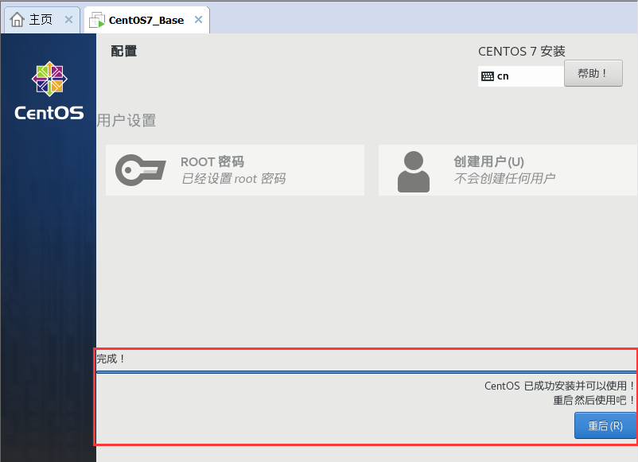

### 1、创建虚拟机

1、自定义安装


然后我们选择稍后安装操作系统。

2、选择客户机操作系统


3、选择网络类型


4、选择I/O控制器类型


5、创建新的虚拟磁盘


点击下一步，忘记安装即可：


### 2、安装centos7

1、下载网址

```http
http://mirrors.aliyun.com/centos/7.9.2009/isos/x86_64/
```


2、安装iso的镜像操作系统


3、点击开启此虚拟机，系统就会安装操作系统


4、开机后，进入下面的界面选择语言


5、选择时区和调整时间


6、选择自动配置分区


7、选择最小安装


在创建root用户密码123后就可以进行下面的安装了。


可能会等几分钟，安装完成后的界面如下：



重启后，使用root账号和上面设置好的密码登录即可。

8、为虚拟机添加静态ip地址

（1）进入下面的文件目录

```shell
vi /etc/sysconfig/network-scripts/ifcfg-ens33
```

添加下面的配置信息：

```shell
# ONBOOT表示在系统启动时是否激活网卡，只有在激活状态的网卡才能去连接网络，进行网络通讯
ONBOOT=yes
# 使用静态IP地址，默认为dhcp
BOOTPROTO=static
NETMASK=255.255.255.0
	# 默认网关，与本地保持一致
GATEWAY=192.168.10.2
# DNS服务器，可以只配置一个
DNS1=192.168.10.2
# 设置的IP地址
IPADDR=192.168.10.10
```

在添加配置信息的时候，需要遵循下面的规范：


在更改完成后，重启网络

```shell
systemctl restart network
```

能够ping通下面网址即可：

```
ping www.baidu.com
```

然后，修改ssh远程连接的ip地址即可。

（2）下面的地址相对应


### 3、简要配置

1、安装ipconfig的软件包

```shell
yum search ifconfig
yum install -y net-tools.x86_64
```

2、安装vim命令包

```shell
yum install -y vim
```

3、修改hostname

```shell
vi /etc/hostname 添加主机名(centos7_01)

# 添加IP和hostname对应关系
vi /etc/sysconfig/network 
192.168.10.11  centos7_01

# 重启reboot生效即可
```

4、永久关闭防火墙

```shell
systemctl status firewalld.service
systemctl disable firewalld.service
```

5、克隆centos7

选择完整克隆，然后在/etc/sysconfig/network-scripts/ifcfg-ens33路径中，将ip地址和uuid简要修改一下即可，建议下次将克隆的centos放到一个新建的文件路径下。


