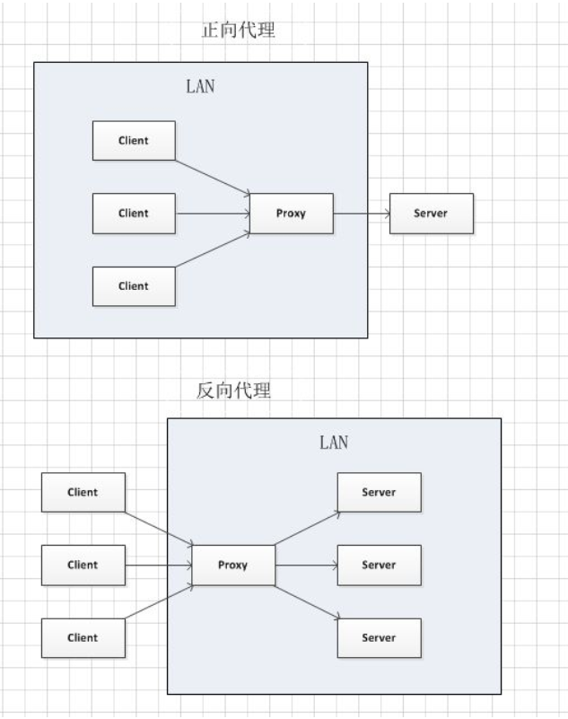
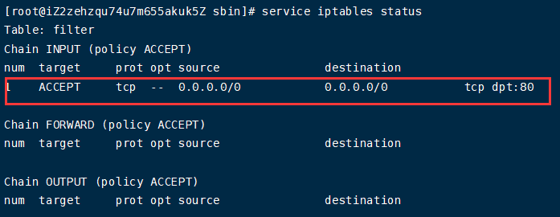
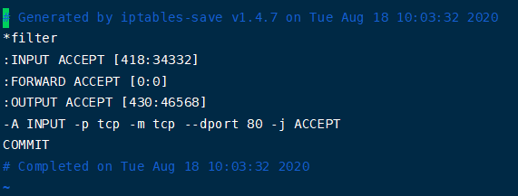
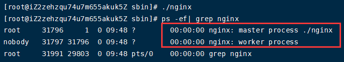
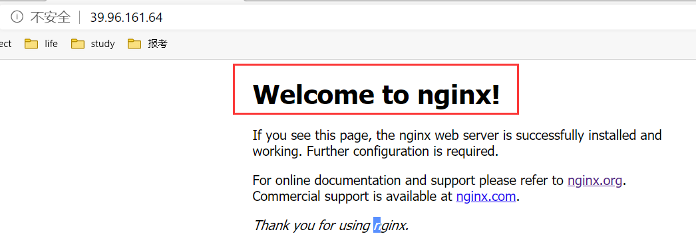

# 1 介绍

## 1、概述

​		Nginx ("engine x") 是一个高性能的 HTTP 和反向代理服务器,特点是占有内存少，并发能力强， 事实上nginx的并发能力确实在同类型的网页服务器中表现较好， 中国大陆使用nginx网站用户有：百度、京东、新浪、网易、腾讯、淘宝等。

## 2、Nginx作为web服务器

​		Nginx 可以作为静态页面的 web 服务器，同时还支持 CGI 协议的动态语言，比如 perl、php等。 但是不支持 java。 Java 程序只能通过与 tomcat 配合完成。 Nginx 专为性能优化而开发，性能是其最重要的考量，实现上非常注重效率 ，能经受高负载的考验,有报告表明能支持高达 50000 个并发连接数。

## 3、正向代理 

​		正向代理：如果把局域网外的 Internet 想象成一个巨大的资源库，则局域网中的客户端要访问 Internet，则需要通过代理服务器来访问，这种代理服务就称为正向代理。 


​		在客户端（浏览器）配置代理服务器，通过代理服务器进行互联网的访问。

​		反向代理和正向代理的区别，参考网址：https://www.cnblogs.com/taostaryu/p/10547132.html。



​		正向代理中，proxy和client同属一个LAN，对server透明；反向代理中，proxy和server同属一个LAN，对client透明。

​		实际上proxy在两种代理中做的事都是代为收发请求和响应，不过从结构上来看正好左右互换了下，所以把后出现的那种代理方式叫成了反向代理

## 4、反向代理

​		反向代理，其实客户端对代理是无感知的，因为客户端不需要任何配置就可以访问，我们只需要将请求发送到反向代理服务器， 由反向代理服务器去选择目标服务器获取数据后， 再返回给客户端， 此时反向代理服务器和目标服务器对外就是一个服务器， 暴露的是代理服务器地址，隐藏了真实服务器 IP 地址。


## 5、负载均衡

​		客户端发送多个请求到服务器，服务器处理请求，有一些可能要与数据库进行交互，服务器处理完毕后，再将结果返回给客户端。 
  这种架构模式对于早期的系统相对单一， 并发请求相对较少的情况下是比较适合的， 成本也低。但是随着信息数量的不断增长，访问量和数据量的飞速增长，以及系统业务的复杂度增加，这种架构会造成服务器相应客户端的请求日益缓慢，并发量特别大的时候，还容易造成服务器直接崩溃。 
​		首先想到的可能是升级服务器的配置， 比如提高 CPU 执行频率， 加大内存等提高机器的物理性能来解决此问题， 但是我们知道摩尔定律的日益失效， 硬件的性能提升已经不能满足日益提升的需求了。最明显的一个例子，天猫双十一当天，某个热销商品的瞬时访问量是极其庞大的，那么类似上面的系统架构，将机器都增加到现有的顶级物理配置，都是不能够满足需求的。 
​		上面的分析我们去掉了增加服务器物理配置来解决问题的办法， 也就是说纵向解决问题的办法行不通了， 那么横向增加服务器的数量呢？这时候集群的概念产生了， 单个服务器解决不了，我们增加服务器的数量，然后将请求分发到各个服务器上，将原先请求集中到单个服务器上的情况改为将请求分发到多个服务器上， 将负载分发到不同的服务器， 也就是我们所说的负载均衡。 


## 6、动静分离

​		为了加快网站的解析速度， 可以把动态页面和静态页面由不同的服务器来解析， 加快解析速度。降低原来单个服务器的压力。 


# 2 Nginx部署

## 1、安装

1、进入官网，下载压缩包

http://nginx.org/2019.html

为了安装nginx，我们还需要安装 prce-xx.tar.gz、openssl-xx.tar.gz和zlib-xx.tar.gz（prce-xx.tar.gz为了重写rewrite，zlib-xx.tar.gz为了gzip压缩）。

2、安装pcre

推荐以root身份进行安装，不然会有类似权限等的许多问题。

（1）执行命令

```shell
wget http://downloads.sourceforge.net/project/pcre/pcre/ 8.37 /pcre-8.37.tar .gz 
```

但是一直报404错误，我就将压缩包下载下来后进行安装的。

（2）进入pcre安装包目录，编译安装  

```shell
#第一步
./configure

#第二步
make && make install
```

遇到下面的报错时：

```shell
configure: error: You need a C++ compiler for C++ support
```

说明我们系统中缺少c++环境。

我们在联网的情况下，root身份执行下面的命令：

```shell
yum install -y gcc gcc-c++
```

3、安装openssl 、zlib 

执行下面的命令进行安装：

```shell
yum -y install make zlib zlib-devel gcc-c++ libtool  openssl openssl-devel 
```

4、安装nginx

```shell
#进入解压缩目录
./configure

#编译安装
make && make install 
```

5、防火墙配置

在nginx中（conf/nginx.conf），服务器的监听端口默认为80,因此，我们要在防火墙中开放该端口


（1）查看防火墙中开放的端口号

```shell
#方法1
service iptables status

#方法2
/etc/init.d/iptables status
```



（2）设置开放端口号80并保存

```shell
[root@centos xx]# /sbin/iptables -I INPUT -p tcp --dport 80 -j ACCEPT

[root@centos xx]# /etc/rc.d/init.d/iptables save

[root@centos xx]# /etc/init.d/iptables restart
```

此时在`/etc/sysconfig/iptables`中会有如下的配置：



## 2、常用命令

1、启动命令

​		在`/usr/local/nginx/sbin` 目录下执行，下面几个目录也都是在这个目录下执行的。

```shell
./nginx 
```

通过下面的指令可以查看启动状态：

```shell
 ps -ef| grep nginx
```



此外，我们也可以通过下面的网址来查看nginx是否启动（默认端口80）：

```http
http://39.96.161.64/
proxy_pass http://39.107.140.8:8080;
```



2、停止nginx

```shell
 ./nginx  -s  stop
```

3、重新加载nginx

​		针对nginx中conf/nginx.conf文件改动后，不使用重启操作，使用重新加载操作来完成系统的重启。

```shell
./nginx -s reload 
```

出现下面的报错：

```ini
nginx: [error] open() ＂/usr/local/nginx/logs/nginx.pid＂ failed
```

我们使用nginx -c的参数指定nginx.conf文件的位置：

```shell
/usr/local/nginx/sbin/nginx -c /usr/local/nginx/conf/nginx.conf
```

4、查看nginx版本号

```shell
./nginx -v
```

## 3、配置文件

​		nginx 安装目录下，其默认的配置文件都放在这个目录的 conf 目录下，而主配置文件 nginx.conf 也在其中，后续对 nginx 的使用基本上都是对此配置文件进行相应的修改 。

nginx.conf  配置文件分为三部分： 

1、全局块

​		从配置文件开始到 `events` 块之间的内容，主要会设置一些影响 nginx 服务器整体运行的配置指令，主要包括配置运行 Nginx 服务器的用户（组）、允许生成的 worker process 数，进程 PID 存放路径、日志存放路径和类型以及配置文件的引入等。 

比如：

```ini
worker_processes  1;
```

​		这是 Nginx 服务器并发处理服务的关键配置，worker_processes 值越大，可以支持的并发处理量也越多，但是会受到硬件、软件等设备的制约。

2、events块

​		events 块涉及的指令主要影响 Nginx 服务器与用户的网络连接，常用的设置包括是否开启对多 work process 下的网络连接进行序列化，是否允许同时接收多个网络连接，选取哪种事件驱动模型来处理连接请求，每个 word 
process 可以同时支持的最大连接数等。 

```ini
events {
    worker_connections  1024;
}
```

​		上述例子就表示每个 `work process` 支持的最大连接数为 1024.。这部分的配置对 Nginx 的性能影响较大，在实际中应该灵活配置。 

3、http块

​		这是 Nginx 服务器配置中最频繁的部分， 代理、 缓存和日志定义等绝大多数功能和第三方模块的配置都在这里。 需要注意的是：http 块也可以包括 http 全局块、server 块。 

（1）http全局块

​		http 全局块配置的指令包括文件引入、MIME-TYPE 定义、日志自定义、连接超时时间、单链接请求数上限等。 

（2）server 块 

​		这块和虚拟主机有密切关系，虚拟主机从用户角度看，和一台独立的硬件主机是完全一样的，该技术的产生是为了节省互联网服务器硬件成本。 
​		每个 http 块可以包括多个 server 块，而每个 server 块就相当于一个虚拟主机。  而每个 server 块也分为全局 server 块，以及可以同时包含多个 locaton块。

（a）全局 server 块

最常见的配置是本虚拟机主机的监听配置和本虚拟主机的名称或 IP 配置。

（b）location块

​		一个 server 块可以配置多个 location 块。 

​		这块的主要作用是基于 Nginx  服务器接收到的请求字符串（比如：server_name/uri-string），对虚拟主机名称（也可以是 IP 别名）之外的字符串（例如 前面的 /uri-string）进行匹配，对特定的请求进行处理。地址定向、数据缓存和应答控制等功能，还有许多第三方模块的配置也在这里进行。 

# 3 反向代理

## 1、案例1

1、实现效果

使用 nginx 反向代理，访问 www.123.com 直接跳转到 127.0.0.1:8080 。