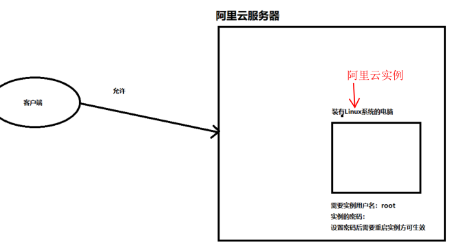
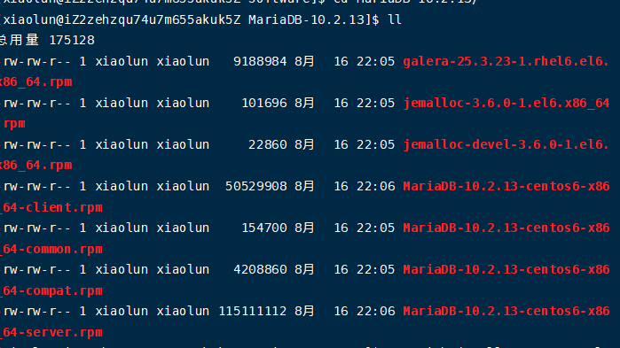
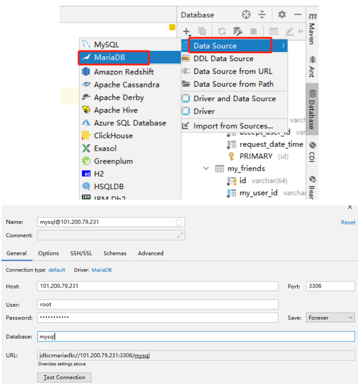

# 1、介绍

## 1、购买地址

阿里云服务器活动地址：

https://www.aliyun.com/minisite/goods?userCode=0phtycgr

云翼计划：

https://promotion.aliyun.com/ntms/act/campus2018.html?spm=a2c4e.11153940.0.0.5e452d8eErMtHP&source=5176.11533457&userCode=ahxhg8oc&type=copy#stage

香港服务器不要备案，到那时尽量不要自己挂VPN，会被封。

## 2、宝塔配置

1、使用xshell进行连接测试

​		第一次连接时，获取服务器公网ip地址，修改实例名称和密码。第一次修改要重启服务器。

我们可以使用xshell远程连接，连接完成之后就是Linux的标准使用。


2、安全组介绍

（1）添加安全组：

​		这一步，阿里云服务器很重视，为了使用宝塔Linux部署环境，我们需要使用安全组开启8888端口。


（2）通过下图描述客户端是如何访问阿里云服务器的实例



​		安全组概述：安全组是一种虚拟防火墙，具备状态检测和数据包过滤能力，用于在云端划分安全域。通过配置安全组规则，您可以控制安全组内一台或多台ECS实例的入流量和出流量。

​		安全组和安全规则的关系：安全组中包含若干个安全规则，例如：学校的门卫和门卫职责的关系。

3、安装宝塔

宝塔安装：https://www.bt.cn/download/linux.html

​		我们需要在`xhsell`控制面板上执行下面的命名进行安装宝塔Linux，此时会在远程服务器上安装宝塔面板。

```ini
yum install -y wget && wget -O install.sh http://download.bt.cn/install/install_6.0.sh && sh install.sh
```

​		在远程服务器下载完成之后，我们可以在`Xshell`工具上就得到一个地址，我们需要在宝塔的网站中进行登录。


使用地址、用户名和密码登录到宝塔的控制面板上即可查看。

# 2、安装数据库（MariaDB）

​		mysql 与Maria DB的区别：Maria DB 是mysql的一个分支，二者使用起来几乎没有区别，包括命令等，主要由于mysql 被oracle收购，社区担心mysql有闭源的风险，因此未了避开这个分享，所以采用分支方式使mysql。

1、输入指令

```shell
[xiaolun@iZ2zehzqu74u7m655akuk5Z ~]$ sudo  yum install rsync nmap lsof perl-DBI nc
```

推荐以**root**的身份进项mysql数据库的安装（以下全是root的身份进行安装）。

2、安装自己下载的相应的MariaDB 软件包

（1）首先安装下面的顺序进行安装，压缩包中的5个。最后再安装xx.server.rpm。

```shell
rpm -ivh jemalloc-3.6.0-1.el6.x86_64.rpm

rpm -ivh jemalloc-devel-3.6.0-1.el6.x86_64.rpm

rpm -ivh MariaDB-10.2.13-centos6-x86_64-client.rpm  --force --nodeps

rpm -ivh MariaDB-10.2.13-centos6-x86_64-compat.rpm --force --nodeps

rpm -ivh  MariaDB-10.2.13-centos6-x86_64-common.rpm  --force --nodeps

rpm -ivh galera-25.3.23-1.rhel6.el6.x86_64.rpm --force --nodeps
```



3、导入key

```shell
rpm --import http://yum.mariadb.org/RPM-GPG-KEY-MariaDB
```

4、安装server

```shell
 rpm -ivh MariaDB-10.2.13-centos6-x86_64-server.rpm 
```

5、启动服务

用root命令启动，不然会报一些奇怪的错误。

```shell
service mysql start
```

可以使用下面的命令进行查看该服务是否启动：

```shell
ps aux|grep mysql
```

6、安全方面的考虑

```ini
#进入根目录下
cd

#在mysql服务启动的情况下，我们才可以进行下面的安装操作。
mysql_secure_installation
```

7、为用户授权

在进入mysql命令行时操作：

```shell
#第1步
[root@iZ2zehzqu74u7m655akuk5Z ~]# mysql -u root -p

#第2步
grant all privileges on *.* to 'root'@'%' identified by 'xx' with grant option;
```

8、IDEA 进行远程连接MariaDB



如果点击test connection 按钮无法连接时，需要进行上面的授权操作。