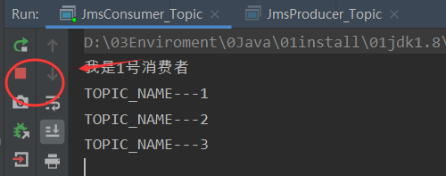

## 1、介绍

1、生活案例

（1）之前学习案例


（2）学生请教老师


2、系统中引入消息中间件的原因

（1）系统之间直接调用实际工程落地和存在的问题

微服务架构后，链式调用是我们在写程序时候的一般流程,为了完成一个整体功能会将其拆分成多个函数(或子模块)，比如模块A调用模块B,模块B调用模块C,模块C调用模块D。但在大型分布式应用中，系统间的RPC交互繁杂，一个功能背后要调用上百个接口并非不可能，从单机架构过渡到分布式微服务架构的通例。

会造成下面的问题：

（a）系统之间接口耦合比较严重

每新增一个下游功能，都要对上游的相关接口进行改造。

举个例子：如果系统A要发送数据给系统B和系统C，发送给每个系统的数据可能有差异，因此系统A对要发送给每个系统的数据进行了组装，然后逐一发送；当代码上线后又新增了一个需求：把数据也发送给D，新上了一个D系统也要接受A系统的数据，此时就需要修改A系统，让他感知到D系统的存在，同时把数据处理好再给D。

在这个过程你会看到，每接入一个下游系统，都要对系统A进行代码改造，开发联调的效率很低。其整体架构如下图：


（b）面对大流量并发时，容易被冲垮

每个接口模块的吞吐能力是有限的，这个上限能力如果是堤坝，当大流量（洪水）来临时，容易被冲垮。

举个例子秒杀业务：上游系统发起下单购买操作，我就是下单一个操作,下游系统完成秒杀业务逻辑如下：
（读取订单，库存检查，库存冻结，余额检查，余额冻结，订单生产，余额扣减，库存减少，生成流水，余额解冻，库存解冻）

（c）等待同步存在性能问题

RPC接口上基本都是同步调用，整体的服务性能遵循“木桶理论”，即整体系统的耗时取决于链路中最慢的那个接口。

比如A调用B/C/D都是50ms，但此时B又调用了B1，花费2000ms，那么直接就拖累了整个服务性能。


（2）因此，我们需要一种东西能够摆平上面的情况：

根据上述的几个问题，在设计系统时可以明确要达到的目标：

（1）要做到系统解耦，当新的模块接进来时，可以做到代码改动最小；能够解耦

（2）设置流量缓冲池，可以让后端系统按照自身吞吐能力进行消费，不被冲垮；能削峰

（3）强弱依赖梳理能将非关键调用链路的操作异步化并提升整体系统的吞吐能力；能够异步

3、定义

（1）简介

面向消息的中间件（message-oriented middleware）MOM能够很好的解决以上问题，是指利用高效可靠的消息传递机制与平台无关的数据交流，并基于数据通信来进行分布式系统的集成。

通过提供消息传递和消息排队模型在分布式环境下提供应用解耦，弹性伸缩，冗余存储、流量削峰，异步通信，数据同步等功能。大致的过程是这样的：

发送者把消息发送给消息服务器，消息服务器将消息存放在若干**队列/主题topic**中，在合适的时候，消息服务器回将消息转发给接受者。在这个过程中，发送和接收是异步的，也就是发送无需等待，而且发送者和接受者的生命周期也没有必然的关系；尤其在发布pub/订阅sub模式下，也可以完成一对多的通信，即让一个消息有多个接受者。


（2）特点

（a）采用异步处理模式

消息发送者可以发送一个消息而无须等待响应。消息发送者将消息发送到一条虚拟的通道（主题或者队列）上；消息接收者则订阅或者监听该通道。一条消息可能最终转发给一个或者多个消息接收者，这些消息接收者都无需对消息发送者做出同步回应。整个过程都是异步的。

案例：也就是说，一个系统跟另一个系统之间进行通信的时候，假如系统A希望发送一个消息给系统B，让他去处理。但是系统A不关注系统B到底怎么处理或者有没有处理好，所以系统A把消息发送给MQ，然后就不管这条消息的“死活了”，接着系统B从MQ里面消费出来处理即可。至于怎么处理，是否处理完毕，什么时候处理，都是系统B的事儿，与系统A无关。


这样的一种通信方式，就是所谓的“异步”通信方式，对于系统A来说，只需要把消息发送给MQ，然后系统B就会异步的去进行处理了，系统A不需要“同步”的等待系统B处理完成。这样的好处是什么呢？两个字：解耦。

（b）应用系统之间解耦合

发送者和接受者不必了解对方，只需要确认消息。发送者和接受者不必同时在线。

（c）整体架构


4、作用

+ 解耦
+ 削峰
+ 异步

5、下载

```http
http://activemq.apache.org/
```

6、操作

+ 实现高可用，高性能，可伸缩，易用和安全的企业级面向消息服务的系统。
+ 异步消息的消费和处理。
+ 控制消息的消费顺序。
+ 可以和Spring或者SpringBoot整合简化代码。
+ 配置集群容错的MQ集群。

## 2、ActiveMQ安装和控制台

1、Linux安装

（1）将安装包上传到/opt文件夹下，进行解压，然后新建文件夹/myActivemq，将解压的文件放到/myActivemq文件夹中即可。

（2）启动

（a）普通启动

进入/myActivemq/activemq/bin文件夹下，执行下面的命令来启动activemq服务：

```shell
[root@hadoop101 bin]# ./activemq start

# 关闭启动的服务
[root@hadoop101 bin]# ./activemq stop
```


（b）带日志启动

```shell
[root@hadoop101 bin]# ./activemq start > /myActivemq/run_activemq.log
```

2、Apache ActiveMQ控制台查看运行情况

（1）将防火墙关闭，windows客户端和Linux服务器之间可以ping通。

（2）修改配置文件 /conf/jetty.xml，将当前服务器访问权限改为外部访问

```xml
 <bean id="jettyPort" class="org.apache.activemq.web.WebConsolePort" init-method="start">
  <!-- the default port number for the web console -->
   <!--将本机的127.0.0.1修改为外网IP即可访问-->
        <property name="host" value="192.168.10.101"/>  
        <property name="port" value="8161"/>
</bean>
```

（3）输入下面的网址进行访问

```http
http://192.168.10.101:8161/admin
```

此时，用户名和密码都是admin，admin。


3、备注

ActiveMQ采用61616端口提供JMS服务。

ActiveMQ采用8161端口提供管理控制台服务。

## 3、Java编码实现ActiveMQ通讯

### 1、JMS编码总体架构

1、JMS编码结构图


2、JDBC编码步骤

```java
第一步:注册驱动(仅仅只做一次)
Class.forName("com.mysql.jdbc.com");

第二步:建立连接(Connection)
DriverManager.getConnection(url,user,password);

第三步:创建运行SQL语句(Statement)
connection.createStatement();

第四步:运行语句
rs.executeQuery(sql);

第五步:处理结果集(ResultSet)
  
第六步:释放资源
```

3、参考队列入门案例和JDBC的编码步骤，我们可以得出JMS开发的基本步骤


```java
1：创建一个connection factory
2：通过connection factory来创建JMS connection
3：启动JMS connection
4：通过JMS connection创建JMS session
5：创建JMS destination（目的地 队列/主题）
6：创建JMS producer或者创建JMS consume并设置destination
7：创建JMS consumer或者注册一个JMS message listener
8：发送(send)或者接收(receive)JMS message
9：关闭所有JMS资源
```

### 2、队列（Queue）和主题（Topic）两大模式介绍

1、概述图


2、队列介绍

在点对点的消息传递域中,目的地被称为队列(queue)。

点对点消息传递域的特点如下：

（1）每个消息只能有一个消费者，类似于1对1的关系。好比个人快递自己领自己的。

（2）消息的生产者和消费者之间没有时间上的相关性。无论消费者在生产者发送消息的时候是否处于运行状态，消费者都可以提取消息。好比我们的发送短信，发送者发送后不见得接收者会即收即看。

（3）消息被消费后队列中不会再存储，所以消费者不会消费到已经被消费掉的消息。


3、主题介绍

在发布订阅消息传递域中,目的地被称为主题(topic)。

发布/订阅消息传递域的特点如下：

（1）生产者将消息发布到topic中，每个消息可以有多个消费者，属于1：N的关系；

（2）生产者和消费者之间有时间上的相关性。订阅某一个主题的消费者只能消费自它订阅之后发布的消息。

（3）生产者生产时，topic不保存消息它是无状态的不落地，假如无人订阅就去生产，那就是一条废消息，所以，一般**先启动消费者再启动生产者**。

JMS规范允许客户创建持久订阅，这在一定程度上放松了时间上的相关性要求。持久订阅允许消费者消费它在未处于激活状态时发送的消息。一句话，好比我们的微信公众号订阅。


### 3、入门案例-队列queue

1、创建工程activemq2020

项目结构：


2、添加pom文件

```xml
   <!--  activemq  所需要的jar 包-->
<dependency>
  <groupId>org.apache.activemq</groupId>
  <artifactId>activemq-all</artifactId>
  <version>5.16.0</version>
</dependency>

<!--  activemq 和 spring 整合的基础包 -->
<dependency>
  <groupId>org.apache.xbean</groupId>
  <artifactId>xbean-spring</artifactId>
  <version>4.15</version>
</dependency>

<dependency>
  <groupId>org.slf4j</groupId>
  <artifactId>slf4j-api</artifactId>
  <version>1.7.25</version>
</dependency>
```

3、消息生产者编码

（1）向MQ发送三条消息

```java
package com.xiaolun.activemq.queue;

import org.apache.activemq.ActiveMQConnectionFactory;
import javax.jms.*;

public class JmsProduce {
	private static final String ACTIVEMQ_URL = "tcp://192.168.10.101:61616";
	private static final String QUEUE_NAME = "queue01";

	public static void main(String[] args) throws JMSException {
		//1.创建连接工厂，按照给定的URL，采用默认的用户名密码
		ActiveMQConnectionFactory activeMQConnectionFactory = new ActiveMQConnectionFactory(ACTIVEMQ_URL);
		//2.通过连接工厂,获得connection并启动访问
		Connection connection = activeMQConnectionFactory.createConnection();
		connection.start();  //注意这个入门案例start方法的位置

		//3.创建会话session
		//两个参数transacted=事务,acknowledgeMode=确认模式(签收)
		Session session = connection.createSession(false, Session.AUTO_ACKNOWLEDGE);
		//4.创建目的地(具体是队列queue还是主题topic)
		Queue queue = session.createQueue(QUEUE_NAME);
		//5.创建消息的生产者
		MessageProducer messageProducer = session.createProducer(queue);
		//6.通过使用消息生产者,生产三条消息,发送到MQ的队列里面
		for (int i = 1; i <= 3; i++) {
			//7.创建消息
			TextMessage textMessage = session.createTextMessage("msg---hello" + i);//理解为一个字符串
			//8.通过messageProducer发送给MQ队列
			messageProducer.send(textMessage);
		}
		//9.关闭资源
		messageProducer.close();
		session.close();
		connection.close();
		System.out.println("****消息发布到MQ队列完成");
	}
}
```

（2）测试

执行上面的程序后，输入下面的网址进入控制台：

```http
http://192.168.10.101:8161/admin
```

点击Queues标签，可以看到该生产者发送到MQ中的消息：


```ini
Number Of Pending Messages=等待消费的消息，这个是未出队列的数量，公式=总接收数-总出队列数。
Number Of Consumers=消费者数量，消费者端的消费者数量。
Messages Enqueued=进队消息数，进队列的总消息量，包括出队列的。这个数只增不减。
Messages Dequeued=出队消息数，可以理解为是消费者消费掉的数量。
总结：
当有一个消息进入这个队列时，等待消费的消息是1，进入队列的消息是1。
当消息消费后，等待消费的消息是0，进入队列的消息是1，出队列的消息是1。
当再来一条消息时，等待消费的消息是1，进入队列的消息就是2。
```

4、消息消费者编码

该编码存有两种消费方式，分别如下：

（1）同步阻塞方式(receive)

订阅者或接收者抵用MessageConsumer的receive()方法来接收消息，receive方法在能接收到消息之前（或超时之前）将一直阻塞。

阻塞式消费者代码如下：

```java
package com.xiaolun.activemq.queue;

import org.apache.activemq.ActiveMQConnectionFactory;
import javax.jms.*;

/**
 * 简单消息消费者
 */
public class JmsConsumer {
   private static final String ACTIVEMQ_URL = "tcp://192.168.10.101:61616";
   private static final String QUEUE_NAME = "queue01";

   public static void main(String[] args) throws JMSException {
      //1.创建连接工厂，按照给定的URL，采用默认的用户名密码
      ActiveMQConnectionFactory activeMQConnectionFactory = new ActiveMQConnectionFactory(ACTIVEMQ_URL);
      //2.通过连接工厂,获得connection并启动访问
      Connection connection = activeMQConnectionFactory.createConnection();
      connection.start();
      //3.创建会话session
      //两个参数transacted=事务,acknowledgeMode=确认模式(签收)
      Session session = connection.createSession(false, Session.AUTO_ACKNOWLEDGE);
      //4.创建目的地(具体是队列queue还是主题topic)
      Queue queue = session.createQueue(QUEUE_NAME);
      //5.创建消息的消费者,指定消费哪一个队列里面的消息
      MessageConsumer messageConsumer = session.createConsumer(queue);
      //循环获取
      while (true) {
         //6.通过消费者调用方法获取队列里面的消息(发送的消息是什么类型,接收的时候就强转成什么类型)
         TextMessage textMessage = (TextMessage) messageConsumer.receive();
         if (textMessage != null) {
            System.out.println("****消费者接收到的消息:  " + textMessage.getText());
         } else {
            break;
         }
      }
      //7.关闭资源
      messageConsumer.close();
      session.close();
      connection.close();
   }
}
```

（2）异步非阻塞方式（监听器onMessage()）

订阅者或接收者通过MessageConsumersetMessageListener(MessageListener listener)注册一个消息监听器，当消息到达之后，系统会自动调用监听器MessageListener的onMessage(Message message)方法。

异步监听式消费者代码如下：

```java
package com.xiaolun.activemq.queue;

import org.apache.activemq.ActiveMQConnectionFactory;

import javax.jms.*;
import java.io.IOException;

/**
 * 监听模式下的消费者
 */
public class JmsConsumer2 {
   private static final String ACTIVEMQ_URL = "tcp://192.168.10.101:61616";
   private static final String QUEUE_NAME = "queue01";

   public static void main(String[] args) throws JMSException, IOException {
      //1.创建连接工厂，按照给定的URL，采用默认的用户名密码
      ActiveMQConnectionFactory activeMQConnectionFactory = new ActiveMQConnectionFactory(ACTIVEMQ_URL);
      //2.通过连接工厂,获得connection并启动访问
      Connection connection = activeMQConnectionFactory.createConnection();
      connection.start();
      //3.创建会话session
      //两个参数transacted=事务,acknowledgeMode=确认模式(签收)
      Session session = connection.createSession(false, Session.AUTO_ACKNOWLEDGE);
      //4.创建目的地(具体是队列queue还是主题topic)
      Queue queue = session.createQueue(QUEUE_NAME);
      //5.创建消息的消费者,指定消费哪一个队列里面的消息
      MessageConsumer messageConsumer = session.createConsumer(queue);
      //6.通过监听的方式消费消息
        /*
        异步非阻塞式方式监听器(onMessage)
        订阅者或消费者通过创建的消费者对象,给消费者注册消息监听器setMessageListener,
        当消息有消息的时候,系统会自动调用MessageListener类的onMessage方法
        我们只需要在onMessage方法内判断消息类型即可获取消息
         */
      messageConsumer.setMessageListener(new MessageListener() {
         @Override
         public void onMessage(Message message) {
            if (message != null && message instanceof TextMessage) {
               //7.把message转换成消息发送前的类型并获取消息内容
               TextMessage textMessage = (TextMessage) message;
               try {
                  System.out.println("****消费者接收到的消息:  " + textMessage.getText());
               } catch (JMSException e) {
                  e.printStackTrace();
               }
            }
         }
      });
      //保证控制台不关闭,阻止程序关闭
      System.in.read();
      //关闭资源
      messageConsumer.close();
      session.close();
      connection.close();
   }
}
```

5、测试

（1）先启动生产者JmsProduce，再启动消费者JmsConsumer后，前端控制台显示：


后端控制台显示：


表示消费者能够消费到数据，带消费完数据之后，处于一直阻塞状态。

（2）先启动消费者JmsConsumer，再启动生产者JmsProduce，和（1）一样，消费者JmsConsumer能够消费生产者JmsProduce数据。

（3）先启动两个消费者JmsConsumer/msConsumer2，再启动生产者JmsProduce（改变循环，由原本的3个循环变成6个循环，产生6个数据），发现两个消费者能够实现负载均衡，交替接收数据：


（4）先启动生产者JmsProduce，再依次启动消费者JmsConsumer/msConsumer2，发现消费者JmsConsumer将原本生产者JmsProduce发送的数据全部接收，而消费者JmsConsumer2却不能接收到任何数据。

（5）先启动生产者JmsProduce将生产者的数据发送到MQ服务器中，然后将MQ服务器宕机，在启动，可以看到前端控制台中显示如下，即此时的生产者发送到MQ服务器中的数据仍然存在，但是进入队列数的数据消失了。


最后启动消费者JmsConsumer，发现该消费者可以消费MQ服务器中的数据：


### 4、入门案例-主题topic

1、发布主题生产者

```java
package com.xiaolun.activemq.topic;

import org.apache.activemq.ActiveMQConnectionFactory;

import javax.jms.*;

public class JmsProducer_Topic {
   private static final String ACTIVEMQ_URL = "tcp://192.168.10.101:61616";
   public static final String TOPIC_NAME = "topic01";

   public static void main(String[] args) throws JMSException {

      //1.创建连接工厂，按照给定的URL，采用默认的用户名密码
      ActiveMQConnectionFactory activeMQConnectionFactory = new ActiveMQConnectionFactory(ACTIVEMQ_URL);
      //2.通过连接工厂,获得connection并启动访问
      Connection connection = activeMQConnectionFactory.createConnection();
      connection.start();
      //3.创建会话session
      //两个参数transacted=事务,acknowledgeMode=确认模式(签收)
      Session session = connection.createSession(false, Session.AUTO_ACKNOWLEDGE);
      //4.创建目的地(具体是队列queue还是主题topic)
      Topic topic = session.createTopic(TOPIC_NAME);
      //5.创建消息的生产者
      MessageProducer messageProducer = session.createProducer(topic);
      //6.通过使用消息生产者,生产三条消息,发送到MQ的队列里面
      for (int i = 1; i <= 3; i++) {
         //7.通过session创建消息
         TextMessage textMessage = session.createTextMessage("TOPIC_NAME---" + i);
         //8.使用指定好目的地的消息生产者发送消息
         messageProducer.send(textMessage);
      }
      //9.关闭资源
      messageProducer.close();
      session.close();
      connection.close();
      System.out.println("****TOPIC_NAME消息发布到MQ完成");
   }
}
```

运行程序之后，前端控制台输出如下，表示可以将主题数据推送到MQ中：


2、订阅主题消费者

```java
package com.xiaolun.activemq.topic;

import org.apache.activemq.ActiveMQConnectionFactory;

import javax.jms.*;
import java.io.IOException;

public class JmsConsumer_Topic {
   public static final String ACTIVEMQ_URL = "tcp://192.168.10.101:61616";
   public static final String TOPIC_NAME = "topic01";

   public static void main(String[] args) throws JMSException, IOException {
      System.out.println("我是1号消费者");
      //1.创建连接工厂，按照给定的URL，采用默认的用户名密码
      ActiveMQConnectionFactory activeMQConnectionFactory = new ActiveMQConnectionFactory(ACTIVEMQ_URL);
      //2.通过连接工厂,获得connection并启动访问
      Connection connection = activeMQConnectionFactory.createConnection();
      connection.start();
      //3.创建会话session
      //两个参数transacted=事务,acknowledgeMode=确认模式(签收)
      Session session = connection.createSession(false, Session.AUTO_ACKNOWLEDGE);
      //4.创建目的地(具体是队列queue还是主题topic)
      Topic topic = session.createTopic(TOPIC_NAME);
      //5.创建消息的消费者
      MessageConsumer messageConsumer = session.createConsumer(topic);
      //5.创建消息的消费者,指定消费哪一个队列里面的消息
      messageConsumer.setMessageListener(message -> {
         if (message instanceof TextMessage) {
            try {
               String text = ((TextMessage) message).getText();
               System.out.println(text);
            } catch (JMSException e) {
               e.printStackTrace();
            }
         }
      });
      System.in.read();
   }
}
```

3、测试

（1）先启动订阅者JmsConsumer_Topic，再启动生产者JmsProducer_Topic，前端控制台输出如下：


后台输出：




（2）先启动生产者JmsProducer_Topic，再启动订阅者JmsConsumer_Topic，可以发现生产者再启动订阅者之前发送的消息是废消息：


后台处于阻塞，无数据。

（3）先启动两个订阅者JmsConsumer_Topic/JmsConsumer_Topic2，再启动生产者JmsProducer_Topic，可以发现两个订阅者消费了同样的数据，前端控制台输出：


4、queue和topic比较

| 比较项目   | Topic队列模式                                                | Queue队列模式                                                |
| ---------- | ------------------------------------------------------------ | ------------------------------------------------------------ |
| 工作模式   | "订阅-发布"模式，如果当前没有订阅者，消息将会被丢弃，如果有多个订阅者，那么这些订阅者都会收到消息 | "负载均衡"模式，如果当前没有消费者，消息也不会丢弃；如果有多个消费者，那么一条消息也只会发送给其中一个消费者，并且要求消费者ack信息 |
| 有无状态   | 无状态                                                       | Queue数据默认会在mq服务器上已文件形式保存，比如Active MQ一般保存在$AMQ_HOME\data\kr-store\data下面，也可以配置成DB存储 |
| 传递完整性 | 如果没有订阅者，消息会被丢弃                                 | 消息不会被丢弃                                               |
| 处理效率   | 由于消息要按照订阅者的数量进行复制，所以处理性能会随着订阅者的增加而明显降低，并且还要结合不同消息协议自身的性能差异 | 由于一条消息只发送给一个消费者，所以就算消费者再多，性能也不会有明显降低。当然不同消息协议的具体性能也是有差异的 |

## 4、JMS规范和落地产品

### 1、JavaEE介绍

1、概述

JavaEE是一套使用Java进行企业级应用开发的大家一致遵循的13个核心规范工业标准。JavaEE平台提供了一个基于组件的方法来加快设计，开发。装配及部署企业应用程序。

+ JDBC（Java Databease）数据库连接
+ JNDI（Java Naming and Directory Interfaces）Java的命令和目录接口
+ EJB（Enterprise JavaBean）
+ RMI（Remote Method Invoke）远程方法调用
+ Java IDL（Interface Description Language）/CORBA（Common Object Broker Architecture）接口定义语言/共用对象请求代理程序体系结构
+ JSP（Java Server Page）
+ Servlet
+ XML（Extensible Markup Language）可标记白标记语言
+ JMS（Java Message Service）Java消息服务
+ JTA（Java Transaction API）Java事务API
+ JTS（Java Transaction Service）Java事务服务
+ JavaMail
+ JAF（JavaBean Activation Framework）

2、JMS介绍

Java Message Service(Java消息服务)是JavaEE中的一个技术。

Java消息服务指的是两个应用程序之间进行异步通信的API，它为标准协议和消息服务提供了一组通用接口，包括创建、发送、读取消息等，用于支持Java应用程序开发。在JavaEE中，当两个应用程序使用JMS进行通信时，它们之间不是直接相连的，而是通过一个共同的消息收发服务组件关联起来以达到解耦/异步削峰的效果。


### 2、MQ中间件的其他落地产品

1、落地产品


2、消息队列的详细比较

| 特性              | ActiveMQ       | RabbitMQ | Kafka          | RocketMQ     |
| ----------------- | -------------- | -------- | -------------- | ------------ |
| PRODUCER-CUMSUMER | 支持           | 支持     | 支持           | 支持         |
| PUBLISH-SUBSCRIBE | 支持           | 支持     | 支持           | 支持         |
| REQUEST-REPLY     | 支持           | 支持     | -              | 支持         |
| API完备性         | 高             | 高       | 高             | 低(静态配置) |
| 多语言支持        | 支持，Java优先 | 语言无关 | 支持，Java优先 | 支持         |
| 单机吞吐量        | 万级           | 万级     | 十万级         | 万级         |
| 消息延迟          | -              | 微秒级   | 毫秒级         | -            |
| 消息重复          | -              | 可控制   | 理论上会有重复 | -            |
| 文档的完备性      | 高             | 高       | 高             | 中           |
| 提供快速入门      | 有             | 有       | 有             | 无           |
| 首次部署难度      | -              | 低       | 中             | 高           |

### 3、JMS的组成结构和特点

1、JMS Provider

实现JMS接口和规范的消息中间件，也就是我们说的MQ服务器。

2、JMS Producer

消息生产者，创建和发送JMS消息的客户端应用。

3、JMS Consumer

消息消费者，接收和处理JMS消息的客户端应用。

4、JSM Message

（1）消息头

+ JMSDestination

消息发送的目的地，主要是指Queue和Topic。

+ JMSDeliveryMode

持久模式和非持久模式。

一条持久性的消息：应该被传送“一次仅仅一次”，这就意味着如果JMS提供者出现故障，该消息并不会丢失，它会在服务器恢复之后再次传递。

一条非持久的消息：最多会传递一次，这意味着服务器出现故障，该消息将会永远丢失。

+ JMSExpiration

可以设置消息在一定时间后过期，默认是永不过期。

消息过期时间，等于Destination的send方法中的timeToLive值加上发送时刻的GMT时间值。

如果timeToLive值等于0，则JMSExpiration被设为0，表示该消息永不过期。如果消息发送后，在消息过期时间之后还没有被发送到目的地，则该消息被清除。

+ JMSPriority

消息优先级，从0-9十个级别，0-4是普通消息5-9是加急消息。

JMS不要求MQ严格按照这十个优先级发送消息但必须保证加急消息要先于普通消息到达。默认是4级。

+ JMSMessageID

唯一标识每个消息的标识由MQ产生。

（2）消息属性

表示封装具体的消息数据。发送和接收的消息体类型必须一致对应。

有五种消息格式，其中最常用的是前面两种：

+ TxtMessage

普通字符串消息，包含一个String。

+ MapMessage

一个Map类型的消息，key为Strng类型，而值为Java基本类型。

+ BytesMessage

二进制数组消息，包含一个byte[]。

+ StreamMessage

Java数据流消息，用标准流操作来顺序填充和读取。

+ ObjectMessage

对象消息，包含一个可序列化的Java对象。

（3）消息体

如果需要除消息字段以外的值，那么可以使用消息属性。识别/去重/重点标注等操作非常有用的方法。

```java
textMessage.setStringProperty(String name,String value);
```

### 4、JMS的可靠性

1、持久化Queue

（1）程序

在生产者com.xiaolun.activemq.queue.JmsProduce中添加下面的非持久化配置：

```java
//5.创建消息的生产者
MessageProducer messageProducer = session.createProducer(queue);
		messageProducer.setDeliveryMode(DeliveryMode.NON_PERSISTENT); //非持久化
```

持久化配置为：

```java
messageProducer.setDeliveryMode(DeliveryMode.PERSISTENT);
```

在非持久化配置下，当生产者JmsProduce生产消息，将其发送到MQ服务器，当服务器宕机后，重新启动MQ服务器，会发现发送者发送到queue中消息已经不存在了，此时启动消费者JmsConsumer，消息也消费不到。

（2）结论

Queue默认是持久化配置。

持久化消息是队列的默认传递模式，此模式保证这些消息只被传送一次和成功使用一次。对于这些消息，可靠性是优先考虑的因素。

可靠性的另一个重要方面是确保持久性消息传送至目标后，消息服务在向消费者传送它们之前不会丢失这些消息。

2、持久化topic

（1）持久的发布主题生产者

```java
package com.xiaolun.activemq.topic;

import org.apache.activemq.ActiveMQConnectionFactory;

import javax.jms.*;

/**
 * 持久化Topic生产者
 */
public class JmsProducer_Topic_Persist {
   private static final String ACTIVEMQ_URL = "tcp://192.168.10.101:61616";
   private static final String ACTIVEMQ_TOPIC_NAME = "Topic-Persist";

   public static void main(String[] args) throws JMSException {
      //1.创建连接工厂，按照给定的URL，采用默认的用户名密码
      ActiveMQConnectionFactory activeMQConnectionFactory = new ActiveMQConnectionFactory(ACTIVEMQ_URL);
      //2.通过连接工厂,持久化的topic必须在生产者创建并设置持久化完成后调用start
      Connection connection = activeMQConnectionFactory.createConnection();
      //3.创建会话session
      //两个参数transacted=事务,acknowledgeMode=确认模式(签收)
      Session session = connection.createSession(false, Session.AUTO_ACKNOWLEDGE);
      //4.创建目的地(具体是队列queue还是主题topic)
      Topic topic = session.createTopic(ACTIVEMQ_TOPIC_NAME);
      //5.创建消息的生产者
      MessageProducer messageProducer = session.createProducer(topic);
      //6.设置生产者生产持久化的Topic
      messageProducer.setDeliveryMode(DeliveryMode.PERSISTENT);

      //7.启动连接！表示启动的是一个持久化的生产者的主题
      connection.start();
      //8.通过使用持久化Topic消息生产者,生产三条消息,发送到MQ的队列里面
      for (int i = 1; i <= 3; i++) {
         //7.通过session创建消息
         TextMessage textMessage = session.createTextMessage("msg-persist" + i);
         //8.使用指定好目的地的消息生产者发送消息
         messageProducer.send(textMessage);
      }
      //9.关闭资源
      messageProducer.close();
      session.close();
      connection.close();
      System.out.println("****TOPIC_NAME消息发布到MQ完成");
   }
}
```

（2）持久的定阅主题消费者

```java
package com.xiaolun.activemq.topic;

import org.apache.activemq.ActiveMQConnectionFactory;

import javax.jms.*;
import java.io.IOException;

/**
 * 持久化Topic消费者
 */
public class Jms_Topic_Consumer_Persist {
   private static final String ACTIVEMQ_URL = "tcp://192.168.10.101:61616";
   private static final String ACTIVEMQ_TOPIC_NAME = "Topic-Persist";

   public static void main(String[] args) throws JMSException, IOException {
      System.out.println("*******我是1号消费者");
      //1.创建连接工厂，按照给定的URL，采用默认的用户名密码
      ActiveMQConnectionFactory activeMQConnectionFactory = new ActiveMQConnectionFactory(ACTIVEMQ_URL);
      //2.通过连接工厂,获得connection,设置connectionID
      Connection connection = activeMQConnectionFactory.createConnection();
      connection.setClientID("1号ID"); //客户端ID，表示是谁订阅了主题Topic-Persist
      //3.创建会话session
      //两个参数transacted=事务,acknowledgeMode=确认模式(签收)
      Session session = connection.createSession(false, Session.AUTO_ACKNOWLEDGE);
      //4.创建目的地(具体是队列queue还是主题topic)
      Topic topic = session.createTopic(ACTIVEMQ_TOPIC_NAME);
      //5.通过session创建持久化订阅，参数2是一个备注
      TopicSubscriber topicSubscriber = session.createDurableSubscriber(topic, "1号消费者");
      //6.启动连接
      connection.start();
      //7.接收消息
      topicSubscriber.setMessageListener(message -> {
         if (message instanceof TextMessage) {
            TextMessage textMessage = (TextMessage) message;
            try {
               System.out.println("收到的持久化订阅消息: " + textMessage.getText());
            } catch (JMSException e) {
               e.printStackTrace();
            }
         }
      });

   
      System.in.read();
      session.close();
      connection.close();
   }
}
```

（3）测试

（a）先启动消费者Jms_Topic_Consumer_Persist，再启动生产者JmsProducer_Topic_Persist向消费者发送3条消息，此时前端控制台界面如下：

Topics界面：


Subscribers界面：


（b）先启动消费者Jms_Topic_Consumer_Persist注册到MQ服务器上，然后关闭，启动生产者JmsProducer_Topic_Persist向消费者发送3条消息，然后再启动消费者，可以发现该消费者可以接收到这3条消息：


（4）总结

一定要先运行一次消费者，类似于像MQ注册,我订阅了这个主题， 然后再运行主题生产者，无论消费着是否在线,都会接收到，在线的立即接收到，不在线的等下次上线把没接收到的接收。
       3、事务-transaction

事务偏生产者，签收偏消费者。

当producer提交时的事务设置为true时，先执行send再执行commit，消息才被**真正**提交到队列中，此外消息需要需要批量提交，需要缓冲处理。

当producer提交时的事务设置为false时，只要执行send，就进入到队列中。此外，当我们关闭事务时，那第2个签收参数的设置需要有效。

（1）生产者

```java
package com.xiaolun.activemq.tracation;

import org.apache.activemq.ActiveMQConnectionFactory;

import javax.jms.*;

public class Jms_TX_Producer {
   private static final String ACTIVEMQ_URL = "tcp://192.168.10.101:61616";
   private static final String ACTIVEMQ_QUEUE_NAME = "Queue-TX";


   public static void main(String[] args) throws JMSException {
      //1.创建连接工厂，按照给定的URL，采用默认的用户名密码
      ActiveMQConnectionFactory activeMQConnectionFactory = new ActiveMQConnectionFactory(ACTIVEMQ_URL);
      //2.通过连接工厂,获得connection并启动访问
      Connection connection = activeMQConnectionFactory.createConnection();
      connection.start();
      //3.创建会话session
      //两个参数transacted=事务,acknowledgeMode=确认模式(签收)
      //开启事务需要commit
      Session session = connection.createSession(true, Session.AUTO_ACKNOWLEDGE);
      //4.创建目的地(具体是队列queue还是主题topic)
      Queue queue = session.createQueue(ACTIVEMQ_QUEUE_NAME);
      //5.创建消息的生产者,并设置不持久化消息
      MessageProducer producer = session.createProducer(queue);
      //6.通过使用消息生产者,生产三条消息,发送到MQ的队列里面
      try {
         for (int i = 1; i <= 3; i++) {
            TextMessage textMessage = session.createTextMessage("tx msg--" + i);
            producer.send(textMessage);
         }
         //7.提交事务
         session.commit();
         System.out.println("消息发送完成");
      } catch (Exception e) {
         System.out.println("出现异常,消息回滚");
         session.rollback();
      } finally {
         //8.关闭资源
         producer.close();
         session.close();
         connection.close();
      }

   }
}
```

（2）消费者

```java
package com.xiaolun.activemq.tracation;

import org.apache.activemq.ActiveMQConnectionFactory;

import javax.jms.*;
import java.io.IOException;

public class Jms_TX_Consumer {
   private static final String ACTIVEMQ_URL = "tcp://192.168.10.101:61616";
   private static final String ACTIVEMQ_QUEUE_NAME = "Queue-TX";

   public static void main(String[] args) throws JMSException, IOException {
      //1.创建连接工厂，按照给定的URL，采用默认的用户名密码
      ActiveMQConnectionFactory activeMQConnectionFactory = new ActiveMQConnectionFactory(ACTIVEMQ_URL);
      //2.通过连接工厂,获得connection并启动访问
      Connection connection = activeMQConnectionFactory.createConnection();
      connection.start();
      //3.创建会话session
      //两个参数transacted=事务,acknowledgeMode=确认模式(签收)
      //消费者开启了事务就必须手动提交，不然会重复消费消息
      Session session = connection.createSession(true, Session.AUTO_ACKNOWLEDGE);
      //4.创建目的地(具体是队列queue还是主题topic)
      Queue queue = session.createQueue(ACTIVEMQ_QUEUE_NAME);
      //5.创建消息的消费者,指定消费哪一个队列里面的消息
      MessageConsumer messageConsumer = session.createConsumer(queue);
      //6.通过监听的方式消费消息
      messageConsumer.setMessageListener(new MessageListener() {
         int a = 0;
         @Override
         public void onMessage(Message message) {
            if (message instanceof TextMessage) {
               try {
                  if (a == 2) {
                     System.out.println(1 / 0);
                  }
                  TextMessage textMessage = (TextMessage) message;
                  System.out.println("***消费者接收到的消息:   " + textMessage.getText());
                  session.commit();
                  a = a + 1;
               } catch (Exception e) {
                  System.out.println("出现异常，消费失败，放弃消费");
                  try {
                     session.rollback();
                     a = 0;
                  } catch (JMSException ex) {
                     ex.printStackTrace();
                  }
               }
            }
         }
      });
      //7.关闭资源
      System.in.read();
      messageConsumer.close();
      session.close();
      connection.close();
   }
}
```

（3）测试

先启动消费者Jms_TX_Consumer，再启动生产者Jms_TX_Producer，此时前端控制台如下：


后台控制台如下：


虽然执行了回滚操作，但是，消费者是从第三条拿到的数据，并不是从回滚的起点拿到的数据。

4、签收

自动签收（默认）：

```java
Session.AUTO_ACKNOWLEDGE
```

手动签收，此时客户端需要调用acknowledge方法手动签收，不然会有重复消费

```java
Session.CLIENT_ACKNOWLEDGE
```

生产者-消费者事务客户端签收方式代码：

（1）消息生产者

```java
package com.xiaolun.activemq.acknowledge;

import org.apache.activemq.ActiveMQConnectionFactory;

import javax.jms.*;

public class Jms_Transaction_AUTOACK_Producer {
   private static final String ACTIVEMQ_URL = "tcp://192.168.10.101:61616";
   private static final String ACTIVEMQ_QUEUE_NAME = "Queue-ACK-Transaction";

   public static void main(String[] args) throws JMSException {
      ActiveMQConnectionFactory activeMQConnectionFactory = new ActiveMQConnectionFactory(ACTIVEMQ_URL);
      Connection connection = activeMQConnectionFactory.createConnection();
      connection.start();
      Session session = connection.createSession(true, Session.AUTO_ACKNOWLEDGE);
      Queue queue = session.createQueue(ACTIVEMQ_QUEUE_NAME);
      MessageProducer producer = session.createProducer(queue);

      for (int i = 1; i <= 3; i++) {
         TextMessage textMessage = session.createTextMessage("Transaction_AUTOACK-msg:   " + i);
         producer.send(textMessage);
      }
      session.commit(); //提交事务
      System.out.println("发送完成");
      producer.close();
      session.close();
      connection.close();
   }
}
```

（2）消息消费者

```java
package com.xiaolun.activemq.acknowledge;

import org.apache.activemq.ActiveMQConnectionFactory;

import javax.jms.*;
import java.io.IOException;

public class Jms_Transaction_CLIENTACK_Consumer {
   private static final String ACTIVEMQ_URL = "tcp://192.168.10.101:61616";
   private static final String ACTIVEMQ_QUEUE_NAME = "Queue-ACK-Transaction";

   public static void main(String[] args) throws JMSException, IOException {
      ActiveMQConnectionFactory activeMQConnectionFactory = new ActiveMQConnectionFactory(ACTIVEMQ_URL);
      Connection connection = activeMQConnectionFactory.createConnection();
      connection.start();
      //消费者设置了手动签收,就必须自己签收,向服务器发送我已经收到消息了
      //开启事务如果不提交,就算手动签收,也是无效的
      Session session = connection.createSession(true, Session.CLIENT_ACKNOWLEDGE);
      Queue queue = session.createQueue(ACTIVEMQ_QUEUE_NAME);
      MessageConsumer messageConsumer = session.createConsumer(queue);
      messageConsumer.setMessageListener(new MessageListener() {
         @Override
         public void onMessage(Message message) {
            if (message instanceof TextMessage) {
               TextMessage textMessage = (TextMessage) message;
               try {
                  //Session.CLIENT_ACKNOWLEDGE客户端需要下面的方法手动签收，不然会有手动消费
                  textMessage.acknowledge();
                  System.out.println(textMessage.getText());
                  session.commit();
               } catch (JMSException e) {
                  e.printStackTrace();
               }
            }
         }
      });
      //7.关闭资源
      System.in.read();
      messageConsumer.close();
      session.close();
      connection.close();
   }
}
```

（3）测试

（a）消费者接收消息(使用acknowledge)后没有提交事务

```java
session.commit(); //注释
```


由于消费者开启了事务，没有提交事务(就算手动签收也没用)，MQ服务器认为，消费者没有收到消息，当消费者下次启动的时候，仍然会接收到消息，造成重复消费。

（b）消费者提交事务但是没有使用acknowledge接收消息

```java
textMessage.acknowledge(); //注释
```

和上图一样可以接收消息。

（c）生产者-消费者非事务客户端签收方式测试

更改为下面的配置：

```java
private static final String ACTIVEMQ_QUEUE_NAME = "Queue-ACK-NoTransaction";

Session session = connection.createSession(false, Session.CLIENT_ACKNOWLEDGE);

//消费端不手动签收，下面的进行注释
textMessage.acknowledge();
```

此时前台控制台输出：


当消费者再次启动时，会有重复消费。

### 5、JMS的点对点总结

点对点模型是基于队列的，生产者发送消息到队列，消费者从队列接收消息，队列的存在使得消息的异步传输成为可能。和我们平时给朋友发送短信类似。

1、如果在Session关闭时有部分消息被收到但还没有被签收（acknowledge），那当消费者下次连接到相同的队列时，这些消息还会被再次接收

2、队列可以长久的保存消息直到消费者收到消息。消费者不需要因为担心消息会丢失而时刻和队列保持激活的链接状态，充分体现了异步传输模式的优势。

### 6、JMS的发布订阅总结

 JMS Pub/Sub 模型定义了如何向一个内容节点发布和订阅消息，这些节点被称作topic主题可以被认为是消息的传输中介，发布者（publisher）发布消息到主题，订阅者（subscribe）从主题订阅消息。

主题使得消息订阅者和消息发布者保持互相独立不需要解除即可保证消息的传送。

1、非持久订阅 

 非持久订阅只有当客户端（消费者）处于激活状态，也就是和MQ保持连接状态才能收发到某个主题的消息。

如果消费者处于离线状态，生产者发送的主题消息将会丢失作废，消费者永远不会收到。

一句话：先订阅注册才能接受到发布，只给订阅者发布消息。

 2、持久订阅

 客户端首先向MQ注册一个自己的身份ID识别号，当这个客户端处于离线时，生产者会为这个ID保存所有发送到主题的消息，当客户再次连接到MQ的时候，会根据消费者的ID得到所有当自己处于离线时发送到主题的消息。

非持久订阅状态下，不能恢复或重新派送一个未签收的消息。

持久订阅才能恢复或重新派送一个未签收的消息。

 因此，当所有的消息必须被接收，则用持久订阅。当消息丢失能够被容忍，则用非持久订阅。

 

 

 
