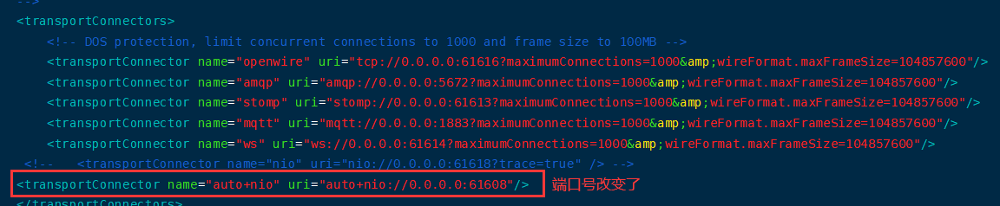

## 1、ActiveMQ的传输协议

### 1、介绍

1、面试题

默认的61616端口如何更改？你生产上的连接协议如何配置的？使用tcp吗？

2、官网

```http
http://activemq.apache.org/configuring-version-5-transports.html
```

其中配置Transport Connector的文件在ActiveMQ安装目录的conf/activemq.xml中的< transportConnector s>标签之内。
见下图实际配置：


在上文给出的配置信息中，URI描述信息的头部都是采用协议名称：例如

描述amqp协议的监听端口时，采用的URI描述格式为“amqp://······”；

描述Stomp协议的监听端口时，采用URI描述格式为“stomp://······”；

唯独在进行openwire协议描述时，URI头却采用的“tcp://······”。这是因为ActiveMQ中默认的消息协议就是openwire

2、协议介绍

（1）Transmission Control Protocol(TCP)默认

```ini
1.这是默认的Broker配置，TCP的Client监听端口61616
2.在网络传输数据前，必须要先序列化数据，消息是通过一个叫wire protocol的来序列化成字节流。
3.TCP连接的URI形式如：tcp://HostName:port?key=value&key=value，后面的参数是可选的。
4.TCP传输的的优点：
    (4.1)TCP协议传输可靠性高，稳定性强
    (4.2)高效率：字节流方式传递，效率很高
    (4.3)有效性、可用性：应用广泛，支持任何平台
5.关于Transport协议的可选配置参数可以参考官网http://activemq.apache.org/configuring-version-5-transports.html
```

（2）New I/O API Protocol(NIO)

```ini
1.NIO协议和TCP协议类似，但NIO更侧重于底层的访问操作。它允许开发人员对同一资源可有更多的client调用和服务器端有更多的负载。
2.适合使用NIO协议的场景：
    (2.1)可能有大量的Client去连接到Broker上，一般情况下，大量的Client去连接Broker是被操作系统的线程所限制的。因此，NIO的实现比TCP需要更少的线程去运行，所以建议使用NIO协议。
    (2.2)可能对于Broker有一个很迟钝的网络传输，NIO比TCP提供更好的性能。
3.NIO连接的URI形式：nio://hostname:port?key=value&key=value
4.关于Transport协议的可选配置参数可以参考官网http://activemq.apache.org/configuring-version-5-transports.html
```

（3）AMQP协议

```ini
Advanced Message Queuing Protocol，一个提供统一消息服务的应用层标准高级消息队列协议，是应用层协议的一个开放标准，为面向消息的中间件设计。基于此协议的客户端与消息中间件可传递消息，并不受客户端/中间件不同产品，不同开发语言等条件限制。
```

（4）Stomp协议

```ini
STOP，Streaming Text Orientation Message Protocol，是流文本定向消息协议，是一种为MOM(Message Oriented Middleware，面向消息中间件)设计的简单文本协议。
```

（5）Secure Sockets Layer Protocol(SSL)

（6）MQTT协议

```ini
MQTT(Message Queuing Telemetry Transport，消息队列遥测传输)是IBM开发的一个即时通讯协议，有可能成为物联网的重要组成部分。该协议支持所有平台，几乎可以把所有联网物品和外部连接起来，被用来当作传感器和致动器(比如通过Twitter让房屋联网)的通信协议。

# 可以参考github中的配置
https://github.com/fusesource/mqtt-client
```

（7）WS协议(websocket)

（8）总结


### 2、nio案例演示

1、官网地址

```http
http://activemq.apache.org/configuring-version-5-transports.html
```

2、修改配置文件

```xml
<transportConnectors>
      <transportConnector name="nio" uri="nio://0.0.0.0:61618?trace=true" />
</transportConnectors>
```

如果你不特别指定ActiveMQ的网络监听端口，那么这些端口都将使用BIO网络IO模型，所以为了首先提高单节点的网络吞吐性能，我们需要明确指定ActiveMQ网络IO模型。

如下图所示：URI格式头以“nio”开头，表示这个端口使用以TCP协议为基础的NIO网络IO模型。


3、生产者和消费者协议代码修改

```java
private static final String ACTIVEMQ_URL = "nio://192.168.10.101:61618";
private static final String QUEUE_NAME = "Queue-NIO";
```

4、测试

依次运行下图中的生产者和消费者：


在消费者端可以接收来自生产者发送的数据。


### 3、nio案例演示增强

1、介绍

上诉NIO性能不错了，我们可以进一步优化。

URI格式以"nio"开头，代表这个端口使用TCP协议为基础的NIO网络模型。但是这样的设置方式，只能使这个端口支持Openwire协议。

因此，我们优化的方向是让这个端口既支持NIO网络模型，又让他支持多个协议。

实现的效果如下：


2、配置

（1）官网

```http
http://activemq.apache.org/auto
```


即可以使用"+"符号来为端口设置多种特性。

（2）如果我们既需要使用某一个端口支持NIO网络模型,又需要它支持多个协议，需要在配置文件中添加下面的配置：

```http
<transportConnector name="auto+nio" uri="auto+nio://0.0.0.0:61608"/>
```

我们可以将nio案例中的添加的配置进行注释，效果图如下：




（3）测试

在生产者和消费者中修改端口号，添加下面的代码：

```java
private static final String ACTIVEMQ_URL = "nio://192.168.10.101:61608";
private static final String QUEUE_NAME = "Queue-NIO";
```

此时，消费者可以接收到来自生产者发送的数据。

## 2、ActiveMQ的消息存储和持久化

### 1、介绍

（1）官网

```http
http://activemq.apache.org/persistence
```

（2）回忆Redis持久化机制有几种

RDB和AOF。

（3）概述

为了避免意外宕机以后丢失信息，需要做到重启后可以恢复消息队列，消息系统一半都会采用持久化机制。

ActiveMQ的消息持久化机制有JDBC，AMQ，KahaDB和LevelDB，无论使用哪种持久化方式，消息的存储逻辑都是一致的。就是在发送者将消息发送出去后，消息中心首先将消息存储到本地数据文件、内存数据库或者远程数据库等。再试图将消息发给接收者，成功则将消息从存储中删除，失败则继续尝试尝试发送。

消息中心启动以后，要先检查指定的存储位置是否有未成功发送的消息，如果有，则会先把存储位置中的消息发出去。

一句话：ActiveMQ宕机了，消息不会丢失的机制。

### 2、持久化方法

1、AMQ Mesage Store(了解）

基于文件的存储方式，是以前的默认消息存储，现在不用了。

AMQ是一种文件存储形式，它具有写入速度快和容易恢复的特点。消息存储再一个个文件中文件的默认大小为32M，当一个文件中的消息已经全部被消费，那么这个文件将被标识为可删除，在下一个清除阶段，这个文件被删除。AMQ适用于ActiveMQ5.3之前的版本。

2、KahaDB消息存储(默认)

（1）介绍

基于日志文件，从ActiveMQ5.4开始默认的持久化插件。

官网：

```http
http://activemq.aache.org/kahadb
```


（2）验证


（3）说明

```http
http://activemq.aache.org/kahadb
```

KahaDB是目前默认的存储方式，可用于任何场景，提高了性能和恢复能力。消息存储使用一个事务日志和仅仅用一个索引文件来存储它所有的地址。

KahaDB也是一个专门针对消息持久化的解决方案，它对典型的消息使用模型进行了优化。

数据被追加到data logs中。当不再需要log文件中的数据的时候，log文件会被丢弃。


（4）存储原理

KahaDB在消息保存的目录中有4类文件和一个lock，跟ActiveMQ的其他几种文件存储引擎相比，这就非常简洁了。


（a）db-number.log

KahaDB存储消息到预定大小的数据纪录文件中，文件名为db-number.log。当数据文件已满时，一个新的文件会随之创建，number数值也会随之递增，它随着消息数量的增多，如没32M一个文件，文件名按照数字进行编号，如db-1.log，db-2.log······。当不再有引用到数据文件中的任何消息时，文件会被删除或者归档。


（b）db.data
    该文件包含了持久化的BTree索引，索引了消息数据记录中的消息，它是消息的索引文件，本质上是B-Tree（B树），使用B-Tree作为索引指向db-number。log里面存储消息。

（c）db.free
    当问当前db.data文件里面哪些页面是空闲的，文件具体内容是所有空闲页的ID

（d）db.redo

用来进行消息恢复，如果KahaDB消息存储再强制退出后启动，用于恢复BTree索引

（e）lock
    文件锁，表示当前kahadb独写权限的broker。

3、JDBC消息存储

消息基于JDBC存储的。

4、LevelDB消息存储(了解)

官网地址：

```http
http://activemq.apache.org/leveldb-store
```

这种文件系统是从ActiveMQ5.8之后引进的，它和KahaDB非常相似，也是基于文件的本地数据库存储形式，但是它提供比KahaDB更快的持久性。

但它不使用自定义B-Tree实现来索引独写日志，而是使用基于LevelDB的索引。

默认配置如下：

```xml
<persistenceAdapter>
      <levelDB directory="activemq-data"/>
</persistenceAdapter>
```

5、JDBC Message Store with ActiveMQ Journal

### 3、IDBC存储消息

1、架构图

```http
http://activemq.apache.org/persistence
```


2、添加mysql数据库的驱动包到lib文件夹

```shell
wget   -P    /myActivemq/activemq/lib  https://repo1.maven.org/maven2/mysql/mysql-connector-java/8.0.17/mysql-connector-java-8.0.17.jar

wget -P /myActivemq/activemq/lib  https://repo1.maven.org/maven2/mysql/mysql-connector-java/5.7.27/mysql-connector-java-5.7.27.jar
```


3、jdbcPersistenceAdapter配置

修改activemq.xml配置文件。

```xml
<--修改前的KahaDB-->
<persistenceAdapter>
        <kahaDB directory="${activemq.data}/kahadb"/>
</persistenceAdapter>

<--修改后的jdbcPersisteceAdapter-->
<persistenceAdapter> 
       <jdbcPersistenceAdapter dataSource="#mysql-ds" /> 
</persistenceAdapter>
```


4、数据库连接池配置

```xml
<bean id="mysql-ds" class="org.apache.commons.dbcp2.BasicDataSource" destroy-method="close"> 
    <property name="driverClassName" value="com.mysql.cj.jdbc.Driver"/> 
    <property name="url" value="jdbc:mysql://192.168.43.4:3306/activemq?relaxAutoCommit=true&amp;serverTimezone=GMT%2B8"/> 
    <property name="username" value="root"/> 
    <property name="password" value="123"/> 
    <property name="poolPreparedStatements" value="true"/> 
</bean>

```


5、建库SQL和创表说明

（1）建一个名为activemq的数据库。

（2）三张表的说明

ACTIVEMQ_MSGS说明：

| 关键字     | 描述                                                       |
| ---------- | ---------------------------------------------------------- |
| ID         | 自增的数据库主键                                           |
| CONTAINER  | 消息的Destination                                          |
| MSGID_PROD | 消息发送者的主键                                           |
| MSG_SEQ    | 是发送消息的顺序，MSGID_PROD+MSG_SEQ可以组成JMS的MessageID |
| EXPIRATION | 消息的过期时间，存储的是从1970-01-01到现在的毫秒数         |
| MSG        | 消息本体的Java序列化对象的二进制数据                       |
| PRIORITY   | 优先级，从0-9，数值越大优先级越高                          |

消息表，缺省表名ACTIVEMQ_MSGS，Queue和Topic都存在里面，结构如下：


ACTIVEMQ_ACKS说明：


ACTIVEMQ_LOCK说明：

表ACTIVEMQ_LOCK在集群环境下才有用，只有一个Broker可以获取消息，称为Master Broker，其他的只能作为备份等待Master Broker不可用，才可能成为下一个Master Broker。这个表用于记录哪个Broker是当前的Master Broker。


（3）如果新建数据库ok，上述配置ok，activemq重启后运行ok，3张表会自动生成。


如果表没生成，可能需要自己创建：

```mysql
-- auto-generated definition
create table ACTIVEMQ_ACKS
(
    CONTAINER     varchar(250)     not null comment '消息的Destination',
    SUB_DEST      varchar(250)     null comment '如果使用的是Static集群，这个字段会有集群其他系统的信息',
    CLIENT_ID     varchar(250)     not null comment '每个订阅者都必须有一个唯一的客户端ID用以区分',
    SUB_NAME      varchar(250)     not null comment '订阅者名称',
    SELECTOR      varchar(250)     null comment '选择器，可以选择只消费满足条件的消息，条件可以用自定义属性实现，可支持多属性AND和OR操作',
    LAST_ACKED_ID bigint           null comment '记录消费过消息的ID',
    PRIORITY      bigint default 5 not null comment '优先级，默认5',
    XID           varchar(250)     null,
    primary key (CONTAINER, CLIENT_ID, SUB_NAME, PRIORITY)
)
    comment '用于存储订阅关系。如果是持久化Topic，订阅者和服务器的订阅关系在这个表保存';

create index ACTIVEMQ_ACKS_XIDX
    on ACTIVEMQ_ACKS (XID);

 
-- auto-generated definition
create table ACTIVEMQ_LOCK
(
    ID          bigint       not null
        primary key,
    TIME        bigint       null,
    BROKER_NAME varchar(250) null
);

 
-- auto-generated definition
create table ACTIVEMQ_MSGS
(
    ID         bigint       not null
        primary key,
    CONTAINER  varchar(250) not null,
    MSGID_PROD varchar(250) null,
    MSGID_SEQ  bigint       null,
    EXPIRATION bigint       null,
    MSG        blob         null,
    PRIORITY   bigint       null,
    XID        varchar(250) null
);

create index ACTIVEMQ_MSGS_CIDX
    on ACTIVEMQ_MSGS (CONTAINER);

create index ACTIVEMQ_MSGS_EIDX
    on ACTIVEMQ_MSGS (EXPIRATION);

create index ACTIVEMQ_MSGS_MIDX
    on ACTIVEMQ_MSGS (MSGID_PROD, MSGID_SEQ);

create index ACTIVEMQ_MSGS_PIDX
    on ACTIVEMQ_MSGS (PRIORITY);

create index ACTIVEMQ_MSGS_XIDX
    on ACTIVEMQ_MSGS (XID);
```

6、测试

（1）队列

生产者代码：

```java
package com.xiaolun.activemq.mysql;

import org.apache.activemq.ActiveMQConnectionFactory;

import javax.jms.*;

public class Producer {
	private static final String ACTIVEMQ_URL = "nio://192.168.10.101:61616";
	private static final String ACTIVEMQ_QUEUE_NAME = "Queue-JdbcPersistence";

	public static void main(String[] args) throws JMSException {
		ActiveMQConnectionFactory activeMQConnectionFactory = new ActiveMQConnectionFactory();
		activeMQConnectionFactory.setBrokerURL(ACTIVEMQ_URL);
		Connection connection = activeMQConnectionFactory.createConnection();
		Session session = connection.createSession(true, Session.AUTO_ACKNOWLEDGE);
		Queue queue = session.createQueue(ACTIVEMQ_QUEUE_NAME);
		MessageProducer messageProducer = session.createProducer(queue);
		//一定要开启持久化
		messageProducer.setDeliveryMode(DeliveryMode.PERSISTENT);
		connection.start();
		for (int i = 0; i < 3; i++) {
			TextMessage textMessage = session.createTextMessage("Queue-JdbcPersistence测试消息" + i);
			messageProducer.send(textMessage);
		}
		session.commit();
		System.out.println("消息发送完成");
		messageProducer.close();
		session.close();
		connection.close();
	}
}
```

消费者代码：

```java
package com.xiaolun.activemq.mysql;

import org.apache.activemq.ActiveMQConnectionFactory;

import javax.jms.*;
import java.io.IOException;

public class Consumer {
	private static final String ACTIVEMQ_URL = "nio://192.168.10.101:61616";
	private static final String ACTIVEMQ_QUEUE_NAME = "Queue-JdbcPersistence";

	public static void main(String[] args) throws JMSException, IOException {
		ActiveMQConnectionFactory activeMQConnectionFactory = new ActiveMQConnectionFactory();
		activeMQConnectionFactory.setBrokerURL(ACTIVEMQ_URL);
		Connection connection = activeMQConnectionFactory.createConnection();
		Session session = connection.createSession(true, Session.AUTO_ACKNOWLEDGE);
		Queue queue = session.createQueue(ACTIVEMQ_QUEUE_NAME);
		MessageConsumer messageConsumer = session.createConsumer(queue);
		connection.start();
		messageConsumer.setMessageListener(new MessageListener() {
			@Override
			public void onMessage(Message message) {
				if (message instanceof TextMessage) {
					TextMessage textMessage = (TextMessage) message;
					try {
						session.commit();
						System.out.println("消费者收到消息" + textMessage.getText());
					} catch (JMSException e) {
						e.printStackTrace();
					}
				}
			}
		});
		System.in.read();
	}
}
```

测试：

首先执行生产者，向MQ发送3条数据，此时会在前端控制台和数据库中看到，然后启动消费者，MQ中的3条数据被消费，数据库保存数据被删除。

注意：

上面的测试是在生产者设置数据持久化之后发生的，如果生产者中数据非持久化，在首先执行生产者代码后，在数据库中看不到数据。

结论：

```ini
在点对点类型中
当DeliveryMode设置为NON_PERSISTENCE时，消息被保存在内存中
当DeliveryMode设置为PERSISTENCE时，消息保存在broker的相应的文件或者数据库中。

而且点对点类型中消息一旦被Consumer消费，就从数据中删除。
```

消费前的消息,会被存放到数据库：


 上面的消息被消费后被MQ自动删除：


（2）主题

代码和队列类似，同样也要在生产者代码中添加持久化配置：

```java
messageProducer.setDeliveryMode(DeliveryMode.PERSISTENT);
```

设置了持久订阅数据库里面会保存订阅者的信息，即Topic内的消息是不会被删除的，而Queue的消息在被删除后，会在数据库中被删除，如果需要保存Queue，应该使用其他方案解决。


ACTIVEMQ_ACKS表中的LAST_ACKED_ID记录了CLIENT_ID最后签收的一条消息：


而LAST_ACKED_ID和ACTIVEMQ_MSGS的ID字段是外键关联关系，这样就可以实现，Topic的消息保存到ACTIVEMQ_MSGS表内，还能根据ACTIVEMQ_ACKS表中的持久订阅者查到该订阅者上次收到的最后一条消息是什么：


7、总结

（1）对于queue

在没有消费者消费的情况下会将消息保存到activemq_msgs表中，只要有任意一个消费者消费了，就会删除消费过的消息

（2）对于topic

一般是先启动消费订阅者然后再生产的情况下会将持久订阅者永久保存到qctivemq_acks，而消息则永久保存在activemq_msgs，在acks表中的订阅者有一个last_ack_id对应了activemq_msgs中的id字段，这样就知道订阅者最后收到的消息是哪一条。

 8、开发中需要注意的问题

（1）数据库jar包

注意把对应版本的数据库jar或者你自己使用的非自带的数据库连接池jar包。加入当我们使用阿里巴巴的连接池，那么此时就不止导入一个mysql的jar包，还需要导入其他包。

（2）reateTablesOnStartup属性

默认为true，每次启动activemq都会自动创建表，在第一次启动后，应改为false，避免不必要的损失。

（3）java.lang.IllegalStateException: LifecycleProcessor not initialized

确认计算机主机名名称没有下划线。

### 4、JDBC Message store with ActiveMQ Journal配置

1、介绍

（1）概述


（2）说明

这种方式克服了JDBC Store的不足，JDBC每次消息过来，都需要去写库读库。
ActiveMQ Journal，使用高速缓存写入技术，大大提高了性能。

当消费者的速度能够及时跟上生产者消息的生产速度时，journal文件能够大大减少需要写入到DB中的消息。

举个例子：

生产者生产了1000条消息，这1000条消息会保存到journal文件，如果消费者的消费速度很快的情况下，在journal文件还没有同步到DB之前，消费者已经消费了90%的以上消息，那么这个时候只需要同步剩余的10%的消息到DB。如果消费者的速度很慢，这个时候journal文件可以使消息以批量方式写到DB。

2、配置

```xml
<!--修改前的配置-->
<persistenceAdapter> 
       <jdbcPersistenceAdapter dataSource="#mysql-ds" /> 
</persistenceAdapter>

<!--修改后的配置-->
<persistenceFactory>        
      <journalPersistenceAdapterFactory 
      journalLogFiles="5" 
      journalLogFileSize="32768" 
      useJournal="true" 
      useQuickJournal="true" 
      dataSource="#mysql-ds" 
      dataDirectory="activemq-data" /> 
</persistenceFactory>
```


3、测试

以前是实时写入mysql，在使用了journal后，数据会被journal处理，如果在一定时间内journal处理（消费）完了，就不写入mysql，如果没消费完，就写入mysql，起到一个缓存的作用。

因此，当我们先启动生产者的时候，向MQ推送数据，在MySQL端此时看不到数据，因为此时的数据放到了journal的高速缓存中，只有等一段时间，消费者没有将数据消费完，journal才会将高速缓存中的数据放到MySQL。


### 5、ActiveMQ持久化机制小总结

持久化消息主要指的是：

MQ所在服务器宕机了消息不会丢试的机制。

持久化机制演变的过程：

从最初的AMQ Message Store方案到ActiveMQ V4版本退出的High Performance Journal（高性能事务支持）附件，并且同步推出了关于关系型数据库的存储方案。ActiveMQ5.3版本又推出了对KahaDB的支持（5.4版本后被作为默认的持久化方案），后来ActiveMQ 5.8版本开始支持LevelDB，到现在5.9提供了标准的Zookeeper+LevelDB集群化方案。

ActiveMQ消息持久化机制有：

```inn
AMQ              基于日志文件
KahaDB            基于日志文件，从ActiveMQ5.4开始默认使用
JDBC              基于第三方数据库
Replicated LevelDB Store 从5.9开始提供了LevelDB和Zookeeper的数据复制方法，用于Master-slave方式的首选数据复制方案。
```

