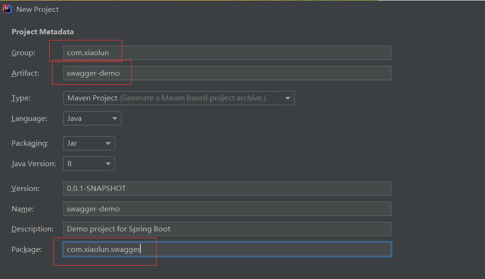
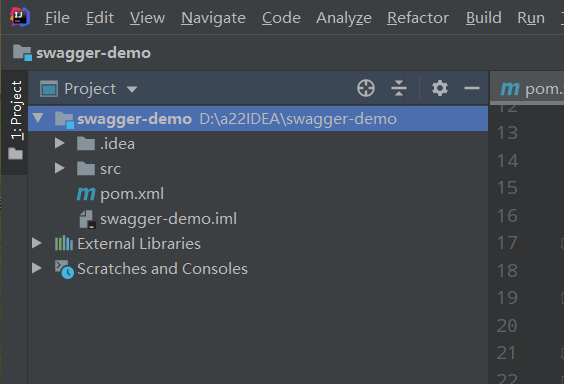
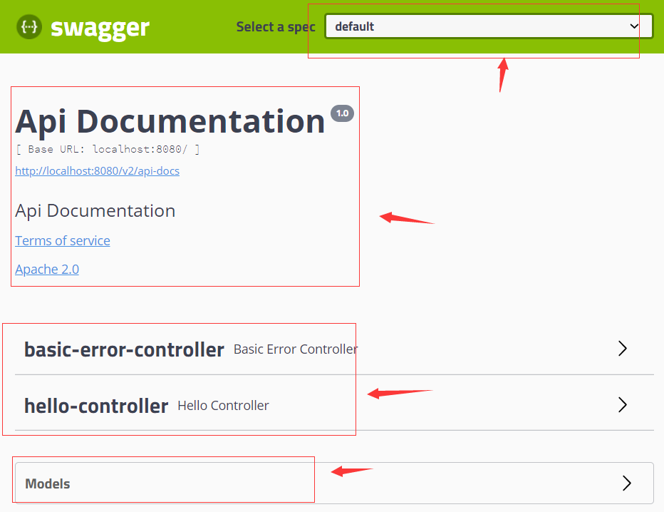
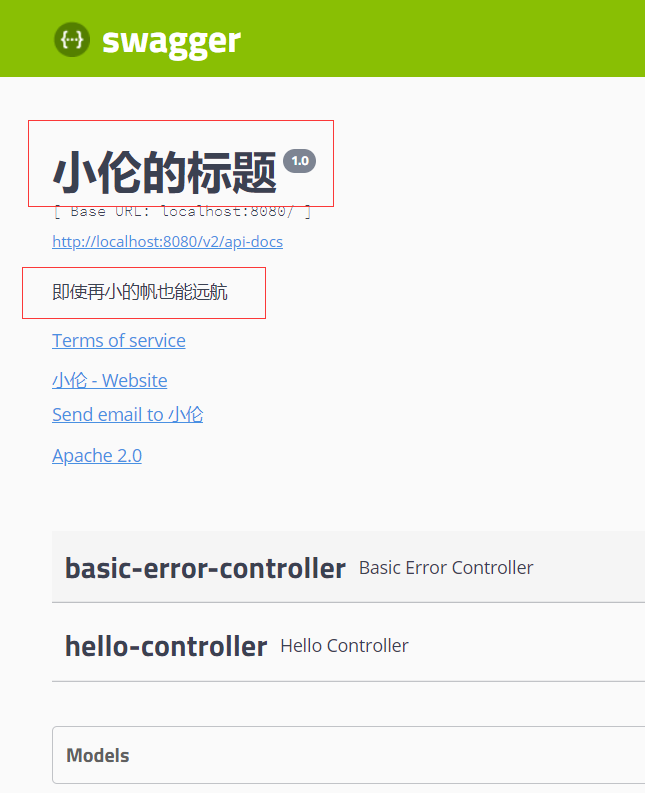
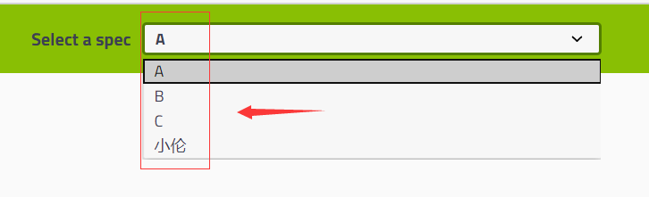

# 1 介绍

Swagger是世界上最流行的Api框架，Restful API文档在线自动生成工具，（可以实现API文档与API定义同步更新），直接运行，可以在线测试API接口。

在前后端集成联调的过程中，前端人员和后端人员无法做到“及时协商，尽早解决”，会导致问题的集中爆发。

+ 解决方案：
  + 指定一个schema[计划的提纲]，实时更新API,降低集成的风险。
  + 早些年，指定word计划文档。

## 1.1 创建项目

1. 创建项目



通过上面的原始信息的书写，再删除一些无效的结构，保留下面一个干净的项目结构：




2. 导入和Swagger相关的依赖

```html
	<properties>
        <java.version>1.8</java.version>
	</properties>

    <dependencies>
        <!--01web依赖-->
        <dependency>
            <groupId>org.springframework.boot</groupId>
            <artifactId>spring-boot-starter-web</artifactId>
        </dependency>、
        
 		<!--02swagger2依赖-->
        <dependency>
            <groupId>io.springfox</groupId>
            <artifactId>springfox-swagger2</artifactId>
            <version>2.9.2</version>
        </dependency>
        
 		<!--03swagger-ui依赖-->
        <dependency>
            <groupId>io.springfox</groupId>
            <artifactId>springfox-swagger-ui</artifactId>
            <version>2.9.2</version>
        </dependency>
  </dependencies>
```

+ swagger2依赖和swagger-ui依赖的网址为：https://mvnrepository.com/artifact/io.springfox

3. 配置Swagger

```java
@Configuration //添加到注释中
@EnableSwagger2 //开启Swagger2
public class SwaggerConfig {
}
```

5. 测试运行

访问swagger文档：http://localhost:8080/swagger-ui.html，会弹出这样的界面：



# 2 配置Swagger

## 2.1配置controller

```java
//HelloController
@RestController
@RequestMapping(value = "/hello")
public class HelloController {

    @GetMapping
    public String getHello(){
        return "hello";
    }
    @PostMapping
    public String  setHello(String hello){
        return hello;
    }
}

```

```java
//UserController
@RestController
@RequestMapping("/user")
public class UserController {

    @GetMapping
    public String getUser(){
        return "zhangsan";
    }

    @PostMapping
    public String  addUser(String userName){
        return userName;
    }
}
```

**该步骤下的项目结构**


1. 配置Swagger的bean实例Docket。

```java
@Configuration //添加到注释中
@EnableSwagger2 //开启Swagger2
public class SwaggerConfig {

    //配置Swagger的Docket的bean实例
    @Bean
    public Docket docket(){
        return new Docket(DocumentationType.SWAGGER_2)
                .apiInfo(apiInfo());
    }

    //配置Swagger信息（创建文档的信息）：apiInfo();
    private ApiInfo apiInfo(){
        //作者信息
        Contact contact = new Contact("小伦", "https://www.baidu.com", "3493826518@qq.com");
        //返回已经创建的文档信息
        return new ApiInfo(
                "小伦的标题",
                "即使再小的帆也能远航",
                "1.0",
                "https://www.baidu.com",
                contact,
                "Apache 2.0",
                "http://www.apache.org/licenses/LICENSE-2.0",
                new ArrayList());
    }
}
```

+ 有关Swagger的基本信息被保存在Docket里面，只需要进行重新构建，并将其注入容器即可。

+ 访问：http://localhost:8080/swagger-ui.html，会弹出这样的界面：



经过测试，经过上面的配置确实能够显示上面的信息，但是当加入其他的代码时，显示的信息有可能不一定显示。

2. **对Docket配置的api/paths等方法进行测试**

```java
    @Bean
    public Docket docket(){
        return new Docket(DocumentationType.SWAGGER_2)
                .apiInfo(apiInfo())
//                .groupName("小伦") //分组
                .select() // 初始化并返回一个API选择构造器
                .apis(RequestHandlerSelectors.basePackage("com.xiaolun.swagger.controller")) //添加路径选择条件(包下的所有接口的进行扫描)
                .paths(PathSelectors.ant("/hello/**")) //在对应的包下过滤请求（只要hello路径下的接口）
//                .apis(RequestHandlerSelectors.withClassAnnotation(RestController.class)) //基于类上的注解进行扫描
//                .apis(RequestHandlerSelectors.withMethodAnnotation(GetMapping.class)) //基于方法上的注解进行扫描
                .build(); //构建
    }
```

+ 前端界面输出结果如下，再经过上面的配置后，确实能够过滤`hello`路径下的接口。


```ini
 /**
     * RequestHandlerSelectors:配置要扫描接口的方式。
     * basePackage：指定要扫描的包
     * any:扫描全部
     * none:一个也不扫描
     * withClassAnnotation:扫描类上的注解，参数是一个注解的反射对象。
     * withMethodAnnotation:扫描方法上的注解。
     */
```

3. **配置要忽略的请求参数**

```java
 public Docket docket(){
        return new Docket(DocumentationType.SWAGGER_2)
                .apiInfo(apiInfo())
             //是否开启swagger,true标识开启，如果时false，swagger中就不会在浏览器中被访问了。
                .enable(true) 
            //主要借助ignoredParameterTypes()来实现。
                .ignoredParameterTypes(String.class,int.class, HttpServlet.class)
//                .groupName("小伦") //分组
                .select() // 初始化并返回一个API选择构造器
                .apis(RequestHandlerSelectors.basePackage("com.xiaolun.swagger.controller")) //添加路径选择条件(包下的所有接口的进行扫描)
                .paths(PathSelectors.ant("/hello/**")) //在对应的包下过滤请求（只要user路径下的接口）
                .build(); //构建
    }
```

```java
@PostMapping 
public String  setHello(String hello, int id, HttpServlet h1){
    return hello;
}
```

+ 经过测试在前端界面，该`HelloController`中的没有返回参数。

+ 如果Swagger没有使用`ignoredParameterTypes`来忽略请求参数，那么请求参数会展示在页面。如果忽略了，就不会进行展示。

## 2.2 让Swagger在不同环境中使用

问题描述：让Swagger在生产环境中使用，在发布的时候不使用。

1. 解决方法

+ 判断是不是生产环境，设置标志位 `flag = false`。

+ 注入`enable(flag)`。

2. 创建`application-dev.properties`文件

```properties
 # 该文件内容
server.port=8081
```

3. `application.properties`中激活`dev`环境

```properties
spring.profiles.active=dev
```

4. 配置Swagger的Docket的bean实例

```java
//配置Swagger的Docket的bean实例
    @Bean
    public Docket docket(Environment environment){
        //设置要显示的Swagger环境
        Profiles profiles = Profiles.of("dev","test");

        //通过environment.acceptsProfiles(profiles)判断自己所处的环境，如果时dev/test就返回true，开启swagger。
        boolean flag = environment.acceptsProfiles(profiles);

        return new Docket(DocumentationType.SWAGGER_2)
                .apiInfo(apiInfo())
                .enable(flag) //是否开启swagger,true标识开启。
                .select()
                .apis(RequestHandlerSelectors.basePackage("com.xiaolun.swagger"))
                .build();
    }
```

+  `boolean flag = environment.acceptsProfiles(profiles);`核心代码，在dev环境中返回true。
+  在项目中新建两个环境配置文件。


+ 当使用`prod`环境进行测试时，不能进行访问，前端界面如下。


##  2.3 分组

```java
@Configuration //添加到注释中
@EnableSwagger2 //开启Swagger2
public class SwaggerConfig {
	//分组1：多个Docket实例
    @Bean
    public Docket docket1(){
        return new Docket(DocumentationType.SWAGGER_2).groupName("A");
    }

    //配置Swagger的Docket的bean实例
    @Bean
    public Docket docket(){
        return new Docket(DocumentationType.SWAGGER_2)
                .apiInfo(apiInfo())
                .groupName("小伦") //分组2：配置API文档的分组
                .select()
                .apis(RequestHandlerSelectors.basePackage("com.xiaolun.swagger"))
                .build();
    }
}
```

+ 通过写不同的Bean来配置多个分组，我们可以在前端界面的“选择一个规格”选项进行选择，从而可以给用户展示不同的界面。
+ 访问：http://localhost:8081/swagger-ui.html，控制台输出：



## 2.4 全局参数配置

```java
@Bean
public Docket docket(){
    //token作为一个全局参数，其中name:参数名字
    Parameter token = new ParameterBuilder().name("token")
                        .description("用户登录指令")//参数描述信息
                        .parameterType("header")  //作为一个请求头参数
                        .modelRef(new ModelRef("String"))//类型是什么
                        .required(true) //表示这个令牌是必须被填写的
                        .build();
    ArrayList<Parameter> parameters = new ArrayList<>();
    parameters.add(token);
    return new Docket(DocumentationType.SWAGGER_2)
            .globalOperationParameters(parameters); //构建
}
```

+ 前端界面输出：


## 2.5 接口和参数配置

1. 类和方法中的配置

```java
@Api(tags = "用户相关请求")
@RestController
@RequestMapping("/user")
public class UserController {

    @ApiOperation("获取用户信息")
    @ApiImplicitParams({
            @ApiImplicitParam(name = "username",value = "用户名",
                    dataType = "String",paramType = "header",defaultValue = "zhangsan",example = "lisi"),
            @ApiImplicitParam(name = "password",value = "用户密码")
    })
    @GetMapping
    public String getUser(String username,String password){
        return "zhangsan";
    }

    @PostMapping
    public String  addUser(String userName,int id){
        return userName;
    }
}
```

```ini
@ApiImplicitParam注解说明
name--参数名【可以写与参数不同的名字，但是最好不要】
value–参数说明 
dataType–数据类型
defaultValue--默认参数
paramType–参数类型 
example–举例说明
required--表示是否必须填写

@ApiImplicitParams注解可以包含多个@ApiImplicitParam注解。

@Api：作用于类,用于表示这个类是Swagger的资源。
tags--表示说明

@ApiOperation用于描述方法，表示一个Http请求的操作。
value--用于方法描述【请求的描述信息】
notes--用于提示内容
tags--可以重新分组
```


+ 前端界面输出


### 2.5.1 实体信息配置

`Swagger`可以将我们使用到的实体进行显示，两种方法显示：

+ 通过入参来进行：这种`Swagger`并不会直接添加，需要一些注解，才能被添加到`Models`选项卡里面【可以通过`@RequestBody`来进行添加】
+ 通过返回值来进行：这种`Swagger`可以直接扫描到，并且添加到`Models`选项卡里面。

```java
//实体类信息配置
@ApiModel("用户实体")
public class User {
    @ApiModelProperty("用户名")
    private String username;
    @ApiModelProperty(value = "用户年龄",example = "1")
    private String age;

    public String getUsername() {
        return username;
    }

    public void setUsername(String username) {
        this.username = username;
    }

    public String getAge() {
        return age;
    }

    public void setAge(String age) {
        this.age = age;
    }
}
```

```java
// controller中的使用
@ApiOperation("删除用户")
@DeleteMapping
public User  addUser(@RequestBody User user){
    return user;
}
```

```ini
@ApiModel：作用在类上，表示对类进行说明，用于参数，用实体类接收
value–表示对象名 
description–描述

@ApiModelProperty：用于方法或者字段，表示对model属性说明或者数据操作变更。
value--字段说明
name–重写属性名字 
dataType–重写属性类型 
required–是否必填 
example–举例说明 
hidden–隐藏
上面两个注解要联合使用。
```

+ 前端界面


#    3 NumberFormatException异常

​		由于Swagger进行类型转换的时候，会将`example`（注解的一个参数），进行一个类型转换，它的默认值为“”，如果你当时的字段类型为`int`类型，此时类型不匹配，那么在进行转换的时候就会出现类型转换的异常。

​		当然，上面的异常在低版本的时候会出现，在我的这个配置中，未出现这种异常。异常的原因如下：

```java
//AbstractSerializableParameter类中的方法（有异常的低版本）
@JsonProperty("x-example")
public Object getExample() {
    if (this.example == null) {
        return null;
    } else {
        try {
            //这里example=""的问题并没有进行处理。
            if ("integer".equals(this.type)) {
                return Long.valueOf(this.example);
            }
```

第一种方法，我们直接在程序运行的时候就设置有可能出现异常的值：

```java
//为example设置一定的值，而不是为“”。
@ApiModelProperty(value = "用户名",example = "xiaohei")
private String username;
```

第二种方式，换成高版本的swagger-models的包（比1.5.0高即可）。

`pom`文件中的更改配置如下：

```xml
   <dependency>
            <groupId>io.springfox</groupId>
            <artifactId>springfox-swagger2</artifactId>
            <version>2.9.2</version>
            <!--将io.springfox中的io.swagger:swagger-models进行删除，换上下面版本为1.5.22的swagger-models(高版本)-->
            <exclusions>
                <exclusion>
                    <groupId>io.swagger</groupId>
                    <artifactId>swagger-models</artifactId>
                </exclusion>
            </exclusions>
        </dependency>
        <dependency>
            <groupId>io.swagger</groupId>
            <artifactId>swagger-models</artifactId>
            <version>1.5.22</version>
        </dependency>
```


```java
//高版本中的源码
@JsonProperty("x-example")
public Object getExample() {
    //这里会判断是否为空串 && 是否为null，来判断是否进行类型转换
    //而低版本的并不是判断是否为空串，所以可能会导致类型转换异常
    if (this.example != null && !this.example.isEmpty()) {
        try {
            if ("integer".equals(this.type)) {
                return Long.valueOf(this.example);
            }
```

