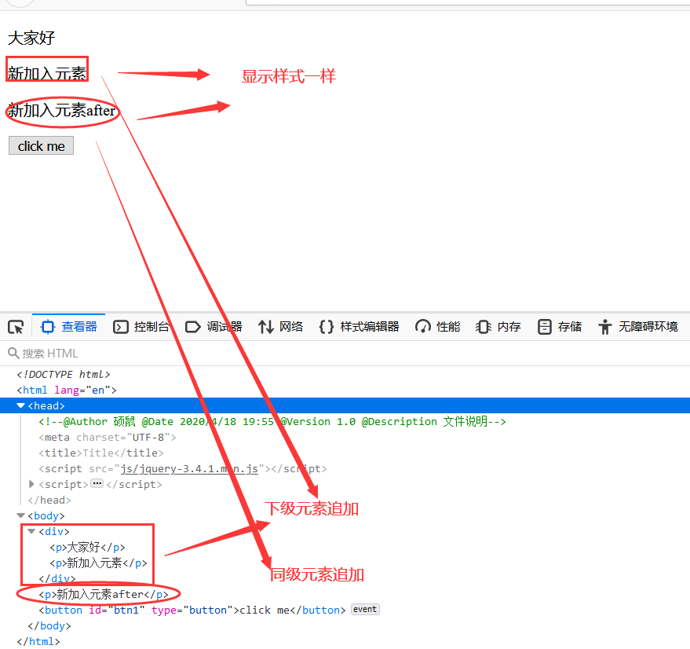

# 1 介绍

jQuery是一个封装了JavaScript的函数库，可以通过一行简单的标记被添加到网页中。W3S网站可以参考。

1. 快速开始

```javascript
<!--  引入jquery  -->
<script src="jquery-3.4.1.min.js"></script>
<script>
        $(document).ready(function () {
        	$('button').click(function () { //将所有的button标签
            $('p').hide(); //隐藏所有<p>标签
        });
    });
</script>
</head>
<body>
    <p>hello1</p>
    <p>hello2</p>
    <button type="button" id="btn1">click me</button>
</body>
```

+  `$(document).ready(function () {});`文档准备函数，主要作用是防止在文档完全加载之前运行jQuery代码。
+ $().ready(function(){}); 写法2。
  + **$(function(){});**写法3。
  
+ `\$('#btn1')`等价于`document.getElementById('#btn');`,其中`btn1`表示的是一个id。

+  `$('button')`等价于`document.getElementsByTagName('button')`。

# 2 jQuery选择器

## 2.1 基本选择器

|         |      示例      |         说明          |
| :-----: | :------------: | :-------------------: |
|    *    |     $('*')     |       所有元素        |
|   #id   | $('#lastname') |  id='lastname'的元素  |
| .class  |  $('.intro')   | class = 'intro'的元素 |
| element |     $('p')     |      所有<p>元素      |

组合使用

+ $(‘p.intro’) //选取所有class = 'intro'的<p>元素。
+ $('p#demo') //选取所有id='demo'的<p>元素。

## 2.2 过滤选择器

|                 |           示例           |                           说明                            |
| :-------------: | :----------------------: | :-------------------------------------------------------: |
|     :first      |       $('p:first')       |                       第一个<p>元素                       |
|      :last      |       $('p:last')        |                      最后一个<p>元素                      |
|      :even      |       $('tr:even')       |                    所有偶数的<tr>元素                     |
|      :odd       |       $('tr:odd')        |                    所有奇数的<tr>元素                     |
|   :eq(index)    |     $('ul li:eq(3)')     |             列表中的第4个元素（index从0开始）             |
|     :gt(no)     |     $('ul li:gt(3)')     |                     列表中大于3的元素                     |
|     :lt(no)     |     $('ul li:lt(3)')     |                     列表中小于3的元素                     |
| :not(selectot)  |  $('input:not(:empty)')  |                   所有不为空的input元素                   |
| :contains(text) | $(:contains('W3School')) |                 包含指定字符串的所有元素                  |
|     :empty      |        $(:empty)         | 选择器选取空的元素,空元素指的是不包含子元素或文本的元素。 |

+ 过滤选择器示例

```javascript
<script src="js/jquery-3.4.1.min.js"></script>
<script>
    $(function () {
    $('#btn1').click(function () {
        // console.log($('p:first').text());//获取第一个<p>元素
        // console.log($('p:last').text());
        // $('p:even').text('大家好'); //更改偶数标签显示的值。元素个数从0开始
        // $('p:contains("p")').text('大家好'); //<p>标签中包含”p“这个字符的。（注意双单引号）
        $(':empty').text('大家好'); //选择器选取空的元素
    });
});
</script>
</head>
<body>
    <p>p1</p>
    <p>p2</p>
    <p>p3</p>
    <div>
        <div>下雨了</div>
        <div></div>
    </div>
    <button type="button" id="btn1">click me</button>
</body>
```

## 2.3 可见选择器

|          |        示例        |       说明        |
| :------: | :----------------: | :---------------: |
| :hidden  |   $('p:hidden')    | 所有隐藏的<p>元素 |
| :visible | $('table:visible') |  所有可见的表格   |

## 2.3 属性选择器

|                    |        示例         |                          说明                           |
| :----------------: | :-----------------: | :-----------------------------------------------------: |
|    [attribute]     |     $('[href]')     |                 所有带有herf属性的元素                  |
| [attribute=value]  |   $('[href="#"]')   | 所有herf属性值=“#”的元素，[attribute !=value]表示取反。 |
| attribute $=value] | $('[href$=".jpg"]') |      所有herf属性的元素的值包含以“.jpg”结尾的元素       |

```javascript
 <script src="js/jquery-3.4.1.min.js"></script>
<script>
     $(function () {
     $('#btn1').click(function () {
         console.log($('[href]').length); //获取所有带有herf属性的元素
         console.log($('[href $= ".cn"]').text()); //获取所有带有herf属性中以cn为后缀名结尾的元素。
     });
 });
</script>
</head>
<body>
    <a href="http:www.baidu.com">百度</a>
    <a href="http:www.sina.cn">新浪</a>
    <button type="button" id="btn1">click me</button>
</body>
```

## 2.4 表单选择器

|           |      示例      |              说明               |
| :-------: | :------------: | :-----------------------------: |
|  :input   |  $(':input')   |          所有input元素          |
|   :text   |   $(':text')   | 所有type = "text"的<input>元素  |
| :password |                |              同上               |
|  :radio   |                |              同上               |
| :checkbox |                |              同上               |
|  :submit  |                |              同上               |
|  :reset   |                |              同上               |
|  :button  |                |              同上               |
|  :image   |                |              同上               |
|   :file   |                |              同上               |
| :enabled  | $(':enabled')  |      所有激活的<input>元素      |
| :disabled | $(':disabled') |      所有禁用的<input>元素      |
| :selected | $(':selected') | 所有被选取的<input>元素(多选框) |
| :checked  | $(':checked')  | 所有被选中的<input>元素(单选框) |

+ :selected使用

```javascript
<script src="js/jquery-3.4.1.min.js"></script>
<script>
     $(function () {
     $('#btn1').click(function () {
         console.log($('select[name="列表名称"] option:selected').text()); //将获取到的option的文本值打印
     });
 });
</script>
</head>
<body>

<p>下拉框：
    <select name="列表名称" id="">
        <option value="china">中国</option>
        <option value="US" selected>美国</option>
        <option value="eth">瑞士</option>
    </select>
</p>
    <button type="button" id="btn1">click me</button>
</body>
```

+ xx.text()纯文本打印,xx.html()将文本等信息原样打印。

# 3 jQuery事件

## 3.1 常用事件函数

|            Event函数            |                   绑定函数至                   |
| :-----------------------------: | :--------------------------------------------: |
|   $(document).ready(function)   | 将事件绑定到文档的就绪事件（当文档加载完成后） |
|   $(selector).click(function)   |      触发或将函数绑定到被选元素的点击事件      |
|  $(selector).dbclick(function)  |      触发或将函数绑定到被选元素的双击事件      |
|   $(selector).fous(function)    |     触发或将函数绑定到被选元素获得焦点事件     |
| $(selector).mouseover(function) |     触发或将函数绑定到被选元素鼠标悬停事件     |
|   $(selector).bind(function)    |       向匹配元素附加一个或更多事件处理器       |

+ bind()函数

```javascript
<script src="js/jquery-3.4.1.min.js"></script>
    <script>
        $(function () {
            // $('#btn1').click(function () {
            // });
            $('#btn1').bind('click',function () { //和上述函数一样的效果
                alert('你好');
            });
        });
    </script>
</head>
<body>
    <button type="button" id="btn1">click me</button>
</body>
```

# 4 jQuery DOM

## 4.1 操作内容

+ text()：设置或返回所选元素的文本内容。
+ html()：设置或返回所选元素的内容（包括HTML标记）。
+ val()：设置或返回表单字段的内容。

## 4.2 操作属性

+ arr():用于获取和设置属性值。
+ prop():用于设置或返回被选元素的属性和值。

对于HTML元素本身就带有的固有属性，在处理时，使用prop()方法；对于HTML元素我们自定义的DOM属性，在处理时，使用attr()方法。

1. 固有属性

```javascript
<a href ="http://www.baidu.com" target="_self" class ="btn">百度</a>
```

+ 这个例子里的<a>元素的DOM属性有”href,target和class“,这些属性就是<a>元素本身就带有的属性，或者说IDE里能够智能提示出的属性，也叫固有属性。处理这些属性时，建议使用prop()方法。

2. prop()方法

```javascript
<script>
        $(function () {
            $('#btn1').click(function () {
                console.log($('#chk1').prop("checked")); //返回结果为”false“
                console.log($('#chk2').prop("checked")); //返回结果为”true“
            });

        });
    </script>
</head>
<body>
    <input id="chk1" type="checkbox">
    <!--  checked:预先选定复选框或单选按钮  -->
    <input id="chk2" type="checkbox" checked="checked">
    <button type="button" id="btn1">click me</button>
</body>
```

## 4.3 操作样式

常见操作样式方法：

+ addClass():向被选元素添加一个或多个类。
+ removeClass():从被选元素中删除一个或多个类。
+ toggleClass()：对被选元素进行添加/删除类的切换工作。
+ css():设置或返回样式属性。

```javascript
<!--  导入样式  -->
<style>
    .import{
        font-weight: bold;
        font-size: xx-large;
    }
	.blue{
    color: blue;
}
</style>
    <script src="js/jquery-3.4.1.min.js"></script>
<script>
        $(function () {
        $('#btn1').bind('click',function () {
            $('p').addClass('blue');//给<p>标签添加一个样式
        }).bind('dblclick',function () {//添加双击事件
            $('p').removeClass('blue');//给<p>标签添加一个样式
        });
    });
</script>
</head>
<body>
    <p class="import">大家好</p>
    <button type="button" id="btn1">click me</button>
</body>
```

## 4.4 操作元素

1. 添加元素

+ append():在被选元素的结尾插入内容（下级）。
+ prepend():在被选元素的开头插入内容（下级）。
+ after():在被选元素之后插入内容（同级）。
+ before():在被选元素之前插入内容（同级）。

```javascript
 <script src="js/jquery-3.4.1.min.js"></script>
    <script>
        $(function () {
            $('#btn1').bind('click',function () {
                $('div').append('<p>新加入元素</p>');//追加元素
                $('div').after('<p>新加入元素after</p>');//追加同级元素
            });
        });
    </script>
</head>
<body>
    <div>
        <p >大家好</p>
    </div>
    <button type="button" id="btn1">click me</button>
</body>
```

+ 显示的效果图：



2. 删除元素

+ remove()：删除所选元素（及其子元素）。
+ empty()：从被选元素中删除子元素（下面的内容）。

# 5 遍历

## 5.1 遍历父元素

+ parent():返回被选元素的直接父元素。
+ parents():返回所选元素的所有祖宗元素，一路向上直到文档的根元素。
+ parentsUntil()：返回介于两个给定元素之间的所有祖宗元素。

```javascript
<script src="js/jquery-3.4.1.min.js"></script>
<script>
    $(function () {
        console.log($('li').parent().html()); //   <li>java</li>
        console.log($('li').parents()); //到达<html>标签
        console.log($('li').parentsUntil().html());//   <li>java</li>
	});
</script>
</head>
<body>
    <div>
        <ul>
            <li>java</li>
        </ul>
    </div>
</body>
```

## 5.2 遍历子元素

+ children():返回所选元素的所有直接子元素。
+ find():返回所选元素的后代元素。

## 5.3 遍历同级元素

+ siblings()

  返回被选元素的所有同胞元素。

+ next()

  返回被选元素的下一个同胞元素。

+ nextAll()

  返回被选元素之后的所有同胞元素。

+ nextUntil()

  返回介于两个给定元素之间的每个元素之后的所有同级元素。

+ prev()

  返回被选元素的上一个同胞元素。

+ prevAll()

  返回被选元素之前的所有同胞元素。

+ prevUntil()

  返回介于两个给定元素之间的每个元素之前的所有同级元素。

```javascript
<script src="js/jquery-3.4.1.min.js"></script>
<script>
    $(function () {
    $('#btn1').click(function () {
        $('#a4').siblings().each(function () { //返回被选所有的所有同胞元素
            console.log($(this).html());
        });
    });
    $('#btn2').click(function () {
        $('#a4').next().each(function () { //返回被选所有的下一个同胞元素A5
            console.log($(this).html());
        });
    });
    $('#btn3').click(function () {
        $('#a4').nextUntil('#a8').each(function () { //介于两个给定元素之间的每个元素A5,A6,A7
            console.log($(this).html());
        });
    });
});
</script>
</head>
<body>
    <div>
        <ul>
            <li>A1</li>
            <li>A2</li>
            <li>A3</li>
            <li id="a4">A4</li>
            <li>A5</li>
            <li>A6</li>
            <li>A7</li>
            <li id="a8">A8</li>
        </ul>
    </div>
    <div id="result">

    </div>
    <div>
        <input type="button" value="A4所有同胞" id="btn1">
        <input type="button" value="A4下一级同胞" id="btn2">
        <input type="button" value="A4-A8之间的所有同胞元素" id="btn3">
    </div>
</body>
```

## 5.4 遍历过滤

+ first() 返回被选元素的第一个元素。
+ last() 返回被选元素的最后一个元素。
+ eq() 返回被选元素中带有指定索引号的元素，下标从0开始。
+ filter() 允许你定义一个标准，将匹配的元素返回。
+ not() 返回不匹配的所有元素。

```javascript
<script src="js/jquery-3.4.1.min.js"></script>
<script>
    $(function () {
    $('#btn1').click(function () {
        console.log($('li').first().text());//A1
        console.log($('li').eq(4).text()); //A5
     	console.log($('li').filter('.style').text()); //A4

    });
});
</script>
</head>
<body>
<div>
    <ul>
        <li>A1</li>
        <li>A2</li>
        <li>A3</li>
        <li id="a4" class="style">A4</li>
        <li>A5</li>
        <li>A6</li>
        <li>A7</li>
        <li id="a8">A8</li>
    </ul>
</div>
<div id="result">

</div>
<div>
    <input type="button" value="点击" id="btn1">
</div>
</body>
```

# 6 jQuery JSON

## 6.1 JSON对象和JSON字符串

在数据传输中，JSON是以字符串的形式进行传输的，而JS操作的是JSON对象，所以JSON对象和JSON字符串之间的相互转化是关键。

1. JSON字符串

```javascript
var jsonStr = '{"name":"Liza","password":"123"}';
```

2. JSON对象

```javascript
var jsonObject = {"name":"Liza","password":"123"};
```

3. JSON字符串转化为JSON对象

```javascript
var jsonObject = JSON.parse(jsonStr); //JavaScript格式
var jsonObject = $.parseJSON(jsonStr); //jQuery格式
```

4. JSON对象转化为JSON字符串

```javascript
var jsonStr = JSON.stringify(jsonObject); //JavaScript格式
```


