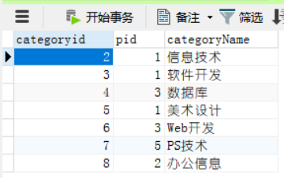
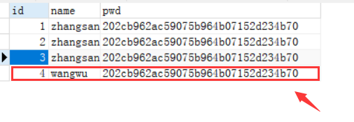
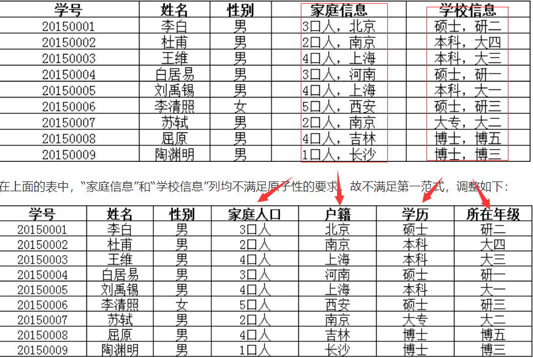
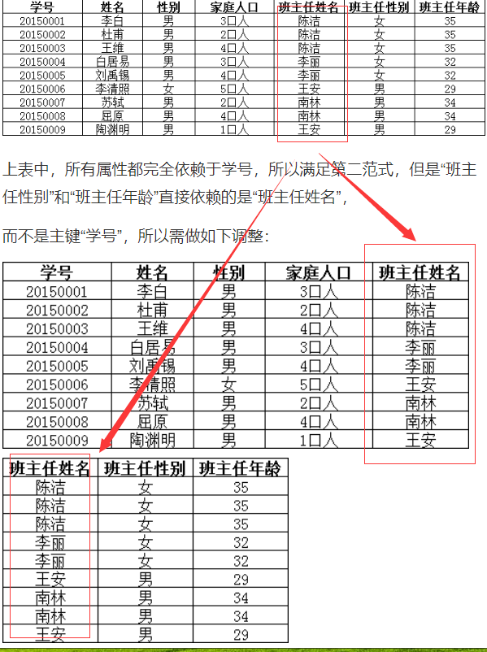

# 1 介绍

1. 数据库分类

+ 关系型数据库（SQL）
  + MySQL、Oracle、sql Server、SQLite。
  + 通过表和表之间，行和列之间的关系进行数据的存储。
+ 非关系型数据库(NoSQL)
  + Redis、MongDB
  + 对象存储，通过对象的自身的属性来决定。

2. DBMS数据库管理系统

+ 数据库管理软件，科学有效的管理我们的数据，维护和获取数据。

## 1.1 环境安装

### 1.1.1 Mysql安装

1. 将压缩包解压到我的安装目录。D:\03Enviroment\05mysql\01install
2. 修改环境变量path。


3. 在D:\03Enviroment\05mysql\01install\mysql-8.0.19下新建核心配置文件my.ini。

```ini
# 我少输了一个“d”,在输入密码选项就报错。
[mysqld]
# 目录要换成自己的；后面的地址要加上“\”
basedir=D:\03Enviroment\05mysql\01install\mysql-8.0.19\
# 不要在这个目录下新建“data”,文件初始化时会自动生成。
datadir=D:\03Enviroment\05mysql\01install\mysql-8.0.19\data\
port=3306
# 跳过密码验证
skip-grant-tables
```

4. 启动**管理员模式**的`cmd`（我们此时要向注册表里面注册服务），并将目录切换到mysql的bin目录，然后输入下面的命令进行安装。


不过在执行这个安装语句时，弹出缺少组件报错信息：


我们运行云盘中的“微软常用运行库合集”后即可解决。

```ini
# install前面有一个空格。
mysqld -install
```


5. 初始化文件

```ini
myaqld --initialize-insecure --user=mysql
```

6. 启动mysql，

```ini
net start mysql
```

 


使用下面的命令，进入mysql管理界面修改密码（密码可为空）

```ini
# -p后面不要加空格，不然会报错
mysql -u root -p
```

7. 输入命令语句，更新密码

```ini
# mysql5.0版本
update mysql.user set authentication_string=password('123') where user='root' and Host='localhost';
# mysql8.0.19（修改成功），当我们的密码输入错误的时候，可以使用它来更改。
# alter user '用户名'@'登录主机' identified by '密码(自定义)';
alter user 'root'@'localhost' IDENTIFIED BY '123';
```


8. 刷新权限

```ini
flush privileges;
```

9. 修改my.ini文件，删除（或者添加#注释）下面的代码

```ini
skip-grant-tables
```

10. 重启mysql,进行连接测试。

```ini
net stop mysql
net start mysql
```

按照下图进行操作：


最后使用`exit`命令退出就可以了。

### 1.1.2 Navicat安装

**安装**

1. 首先安装云盘压缩包中的navicat。


2. 在安装完毕之后，点击上图的第二个文件，选中navicat安装目录下的exe文件，打开即可。

**连接**

1. 在使用navicat连接数据库（mysql8.0.19）的过程中，会出现一个1251错误：

```ini
Client does not support authentication protocol。
```

主要原因是：mysql8 之前的版本中加密规则是mysql_native_password,而在mysql8之后,加密规则是caching_sha2_password。

我们需要将用户登录密码加密规则还原成mysql_native_password.即可。

+ 使用管理员模式后，进入mysql的bin目录，输入密码

```ini
mysql -u root -p
```

+ 更改策略

```ini
# 'password'不要改成自己的密码，这句话之后我们的密码就被更改为'password'，我们还需要更改我们的密码。
ALTER USER 'root'@'localhost' IDENTIFIED BY 'password' PASSWORD EXPIRE NEVER;
```

+ 刷新权限

```ini
flush privileges;
```

+ 更改会原来的密码

```ini
alter user 'root'@'localhost' IDENTIFIED BY '123';
```

然后进行连接测试后就可以连接上了。

**注：**

1. 我在IDEA上加载的是我maven项目中的驱动，在测试连接的过程中会遇到这个问题：

```ini
Server returns invalid timezone. Go to 'Advanced' tab and set 'serverTimezone' property manually. 
```

时区错误，MySQL默认的时区是UTC时区，比北京时间晚`8`个小时。因此，我们需要进入管理员命令界面，在使用密码登录mysql后，我们需要输入下面的命令让其运行：

```sql
set global time_zone='+8:00'; 
```

这样的话，就可以连接成功了。

## 1.2 基本的命令行操作

```sql
mysql -uroot -p123 --链接数据库。
 
update user set password=password('123') where user='root' and host='localhost';  --修改用户密码。
flush privileges; --刷新权限。

-----------------------------------
show database; --查看所有的数据库。
mysql> use db1; --切换数据库，use 数据库名。
show tables; -- 查看数据库中所有的表。
describe t_user; --显示表中对应的所有信息。

-------------------------------------
-- 单行注释
/*(多行注释)
XXX
*/
```

1. 数据库语言

+ DDL 定义
+ DML 操作
+ DQL 查询
+ DCL 控制

# 2 操作数据库语句

1. MySQL关键字不区分大小写。

## 2.1 操作数据库

1. 创建数据库

```sql 
CREATE DATABASE IF NOT EXISTS test01;
```

2. 删除数据库

```sql
DROP DATABASE IF EXISTS test01;
```

3. 使用数据库

```sql
use test01;
```

+ 如果你的表名或者字段名是一个特殊字符（会有高亮显示），就需要带tab 键上面的飘``。

2. 查询数据库创建操作

```SQL
SHOW CREATE DATABASE DATABASE school; --查看创建数据库的语句。
SHOW CREATE TABLE student; --查看创建数据库的语句。
DESC student --显示表的结构。
```

+ 在navicat中输入上述命令行语句。

## 2.2 列的数据类型讲解

1. 数值

+ tinyint：十分小的数据，1字节。
+ smallint：2字节。
+ mediumint：3字节。
+ int：4字节（标准的整数）。
+ big：8字节（较大的数据）
+ float：  浮点数   4字节。
+ double ：浮点数 8字节。
+ decimal ：字符串形式的浮点数，金融计算的时候使用。

2. 字符串

+ char： 字符串固定大小 0~255。
+ varchar : 可变字符串0 -65535，对应变量：String。
+ tinytext：微型文本，2^8 - 1（博客）;
+ text： 文本串，2^16 - 1，保存大文本；

3. 时间日期

+ date：YYYY-MM-DD 日期 （java.util.Date）。
+ time:  HH:mm:ss 时间格式。
+ datetime ： YYYY-MM-DD  HH:mm:ss，最常用的时间格式。
+ timestamp:时间戳，1970.1.1到现在的毫秒数。
+ year:年份表示。

4. null

+ 没有值，未知。

## 2.3 数据库的字段属性

+ unsigned：无符号整数，声明了该列不能声明为负数。
+ zerofill:不足的位数，使用0来填充。

## 2.4 创建数据库表

```sql
CREATE TABLE `student` (
  `id` int NOT NULL AUTO_INCREMENT,
  PRIMARY KEY (`id`)
) ENGINE=InnoDB DEFAULT CHARSET=utf8mb4 COLLATE=utf8mb4_0900_ai_ci;
```

+ 使用英文（），表的名称和字段尽量使用‘’括起来。

+ 格式

```sql
CREATE TABLE [IF NOT EXISTS] `表名` (
  `字段名` 列类型 [属性] [索引] [注释]
) [表类型][字符集设置][注释];
```

## 2.5 MyISAM和InnoDB的区别

1. 数据库引擎：MyISAM和InnoDB。

|            | MyISAM | InnoDB |
| :--------: | :----: | :----: |
|  事务支持  | 不支持 |  支持  |
| 数据行锁定 | 不支持 |  支持  |
|  外键约束  | 不支持 |  支持  |
|  全文索引  |  支持  | 不支持 |
| 表空间大小 |  较小  |  较大  |

2. 优缺点比较

+ MyISAM:节约空间，速度较快。
+ InnoDB：安全性高，事务的处理，多表多用户操作。

3. 在物理空间存在的位置

+ 所有的数据库文件都存放到data目录下。
+ InnoDB在数据库库表中只有一个`*.frm`文件，以及上级目录下的`ibdata1`文件。
+ MyISAM对应文件
  + `*.frm` ：表结构的定义文件。
  + *.MYD:数据文件（Data）。
  + *.MYI:索引文件（Index）。

4. 设置数据库的字符集编码

```sql
CHARSET=utf8mb4 
```

+ 不设置时，系统会使用默认编码，不支持中文。

## 2.6 修改删除表

```sql
ALTER TABLE `student` RENAME AS `student1`; --修改表名

ALTER TABLE `student1` ADD `age` int; --增加表的字段

ALTER TABLE `student1` MODIFY `age` VARCHAR(11); -- 修改表的字段（修改约束）

ALTER TABLE `student1` CHANGE `age` `age1` VARCHAR(11); -- 字段重命名

ALTER TABLE `student1` DROP `age1`; --删除表的字段

DROP TABLE IF EXISTS `student1`; -- 删除表
```

+ CHANGE用来字段重命名，不能修改类型和约束。
+ MODIFY不能用来字段重命名，只能修改类型和约束。
+ 所有的创建和删除操作尽量加上字段，以免报错。

## 2.7 外键

1. 方式1：在创建表的时候，增加约束（比较复杂）

```sql
CREATE TABLE IF NOT EXISTS `grade` (
    `gradeid1` int NOT NULL AUTO_INCREMENT COMMENT '年级id',
    `gradename` VARCHAR(30) NOT NULL COMMENT '年级名称',
    PRIMARY KEY (`gradeid1`)
) ENGINE=InnoDB DEFAULT CHARSET=utf8mb4 COLLATE=utf8mb4_0900_ai_ci;

-- 学生表的gradeid字段去引用年级表的gradeid
-- 定义外键key
-- 给外键添加约束（执行引用）
DROP TABLE IF EXISTS `student`;
CREATE TABLE IF NOT EXISTS `student` (
    `id` int NOT NULL AUTO_INCREMENT,
    `name` varchar(30) NOT NULL DEFAULT '匿名' COMMENT '姓名',
    `sex`  varchar(2) NOT NULL DEFAULT '男' COMMENT '性别',
    `gradeid` int NOT NULL  COMMENT '学生的年级',
    PRIMARY KEY (`id`),
    KEY `FK_gradeid` (`gradeid`),
    CONSTRAINT `FK_gradeid` FOREIGN KEY (`gradeid`) REFERENCES `grade` (`gradeid1`) 
) ENGINE=InnoDB DEFAULT CHARSET=utf8mb4 COLLATE=utf8mb4_0900_ai_ci;
```

+ Navicat界面显示


+ 子表（学生表）的外键，必须是主表（年级表）的主键。

+ （假设学生表（学号，姓名，性别，专业号），专业表（专业号，专业名称），则学生表中的专业号为学生表的外键，其与专业表中“专业号”属性相关联，因此，专业表为主表，学生表为从表。）

+ 删除主表必须先删除子表，要删除主表的记录必须先删除子表关联的记录，不能更新主表主键字段的值。

  即删除有外键关系的表的时候，必须先删除引用别人的表（从表“student”）,再删除被引用的表（主表“grade”）。

+ 遇到问题： `...incompatible with sql_mode=only_full_group_by`

```sql
--解决方法
select @@sql_mode;
-- 控制台输出：ONLY_FULL_GROUP_BY,STRICT_TRANS_TABLES,NO_ZERO_IN_DATE,NO_ZERO_DATE,ERROR_FOR_DIVISION_BY_ZERO,NO_AUTO_CREATE_USER,NO_ENGINE_SUBSTITUTION

-- 执行下面两个命令，去掉 sql_mode 的 ONLY_FULL_GROUP_BY。
mysql> set global sql_mode='STRICT_TRANS_TABLES,NO_ZERO_IN_DATE,NO_ZERO_DATE,ERROR_FOR_DIVISION_BY_ZERO,NO_ENGINE_SUBSTITUTION';
mysql> set session sql_mode='STRICT_TRANS_TABLES,NO_ZERO_IN_DATE,NO_ZERO_DATE,ERROR_FOR_DIVISION_BY_ZERO,NO_ENGINE_SUBSTITUTION';


CREATE TABLE IF NOT EXISTS `student` (
  `id` int NOT NULL AUTO_INCREMENT,
	`name` VARCHAR(30) NOT NULL DEFAULT `匿名` COMMENT `姓名`,
  PRIMARY KEY(`id`)
) ENGINE=InnoDB DEFAULT CHARSET=utf8mb4 COLLATE=utf8mb4_0900_ai_ci;
```

2. 方式2 创建表成功之后，增加约束

```sql
DROP TABLE IF EXISTS `grade`;
CREATE TABLE IF NOT EXISTS `grade` (
	`gradeid1` int NOT NULL AUTO_INCREMENT COMMENT '年级id',
  `gradename` VARCHAR(30) NOT NULL COMMENT '年级名称',
  PRIMARY KEY (`gradeid1`)
) ENGINE=InnoDB DEFAULT CHARSET=utf8mb4 COLLATE=utf8mb4_0900_ai_ci;

-- 学生表的gradeid字段去引用年级表的gradeid
-- 给外键添加约束（执行引用）
DROP TABLE IF EXISTS `student`;
CREATE TABLE IF NOT EXISTS `student` (
  `id` int NOT NULL AUTO_INCREMENT,
  `name` varchar(30) NOT NULL DEFAULT '匿名' COMMENT '姓名',
	`sex`  varchar(2) NOT NULL DEFAULT '男' COMMENT '性别',
	`gradeid` int NOT NULL  COMMENT '学生的年级',
  PRIMARY KEY (`id`)
) ENGINE=InnoDB DEFAULT CHARSET=utf8mb4 COLLATE=utf8mb4_0900_ai_ci;

-- 创建表的时候没有外键关系
ALTER TABLE `student`
ADD CONSTRAINT `FK_gradeid` FOREIGN KEY (`gradeid`) REFERENCES `grade` (`gradeid1`);

--ALTER TABLE `表名`
--ADD CONSTRAINT `约束名` FOREIGN KEY (`作为外键的列`) REFERENCES `那个表` (`表的那个字段`);
```

+ 以上操作都是物理外键，数据库级别的外键，不建议使用！（避免数据库过多造成困扰）
+ 最佳实践
  + 数据库就是单纯的表，只能来存数据，只有行（记录）和列（字段）。
  + 我们想使用多张表的数据，想使用外键（程序去实现）。

## 2.8 DML语言

DML：Data Manipulation Language ,数据库操作语言。

+ Insert

+ update

+ delete

  ```sql
  TRUNCATE `student`; 
  ```

+ 完全清空一个数据表，表的结构和索引约束不会改变。

## 2.9 DQL语言

+ DQL：Data QueryLanguage，数据库查询语言。
+ 数据库中核心的语言，最重要的语句。

+ SELECT的完整语法：

```sql
select [ALL | DISTINCT]
from table_name [as table_alias]
	[left | right | inner join table_name2]  --联合查询
	[where...] --指定结果需满足的条件
	[group by ...] --指定结果按照哪几个字段来分组
	[having ...] --过滤分组的记录必须满足的次要条件
	[order by 列名[asc | desc]] --指定查询记录按一个或者多个条件进行排序
	[limit [offset,] rows | rows OFFSET offset]
	
	--注：[]代表可选的，{}代表必选。
```

1. 数据去重

```sql
SELECT *FROM `student`;
SELECT `name` FROM `student`; -- 查询学生表中的名字
SELECT DISTINCT `name` FROM `student`; -- 发现重复数据，去重。
```

+ DISTINCT :将查询出来的结果中重复的数据去掉，重复数据只显示一条。

2. 数据库的列

```sql
SELECT VERSION(); --查询系统版本（函数）
SELECT 100*3 AS `计算结果`; -- 用来计算（表达式）
SELECT @@auto_increment_increment; --查询自增的步长（变量）

SELECT `gradeid`+ 1 AS 'id加1后' FROM `student`; --查询结果加1
```

### 2.9.1 where条件子句

+ 检索数据中符合条件的值。搜索的条件由一个或者几个表达式组成，结果为布尔值。

  | 运算符  |  语法   |              描述              |
  | :------ | :-----: | :----------------------------: |
  | and &&  | a and b |  逻辑与，两个都为真，即为真。  |
  | or \|\| | a or b  | 逻辑与，其中一个为真，即为真。 |
  | not !   |  not a  |    逻辑非，真为假，假为真。    |

+ 尽量使用英文字母。

### 2.9.2 模糊查询操作

|    运算符    |       语法        |                    描述                     |
| :----------: | :---------------: | :-----------------------------------------: |
|   IS NULL    |     a IS NULL     |        如果操作符为NULL，结果为真。         |
| IS  NOT NULL |                   |                                             |
|   BETWEEN    | a BETWEEN b AND c |       如果a在b,c结果之间，结果为真。        |
|     Like     |     a LIKE b      |           如果a匹配b,则结果为真。           |
|      IN      |  a IN(a1,a2,...)  | 假设a在a1，或者a2..其中的一个值，结果为真。 |

```sql
-- 查询姓刘的学生
-- like 结合 %（代表0到任意一个字符） _（一个字符）
SELECT `name` FROM `student`
WHERE `name` LIKE '刘%';

-- 查询名字中有“志”的学生
SELECT `name` FROM `student`
WHERE `name` LIKE '%志%';

-- 查询gradeid为（1，3，4）的学生。
SELECT `name`,`gradeid` FROM `student`
WHERE `gradeid为（1，3，4）的学生` in(1,3,4);
-- 查询gradeid中数据为空的学生。
SELECT `name`,`gradeid` FROM `student`
WHERE `gradeid`= '' OR `gradeid`IS NULL ;
```

### 2.9.3 联表查询

1. 联表查询图示


2. 思路

+ 分析需求，及需要查询的字段来自那些表（连接查询）。
+ 确定使用那种连接查询（7种方式）。
+ 确定交叉点（两个表中那些数据是相同的）。
  + 判断条件：学生表中 studentNo = 成绩表中 studentNo。

#### 2.9.3.1 创建测试项目

1. 左连接查询。

+ 是以左表为基础，根据ON后给出的两表的条件将两表连接起来。结果会将左表所有的查询信息列出，而右表只列出ON后条件与左表满足的部分。
+ 左连接全称为左外连接，是外连接的一种。

```sql
SELECT  *FROM `student`AS s
LEFT JOIN `result` AS r
ON s.studentNo = r.studentNo;
```

+ `studnt`表的记录全部查询出来,如果`grade`没有`s.studentNo = r.studentNo`的记录时右侧显示为空，`grade`表中只有`s.studentNo = r.studentNo`的记录查询出来了。

2. 右连接查询

+ 是以右表为基础，根据ON后给出的两表的条件将两表连接起来。结果会将右表所有的查询信息列出，而左表只列出ON后条件与右表满足的部分。
+ 右连接全称为右外连接，是外连接的一种。

```sql
SELECT  *FROM `student`AS s
RIGHT JOIN `result` AS r
ON s.studentNo = r.studentNo;
```

3. 内连接查询

+ 使用比较运算符根据每个表共有的列的值匹配两个表中的行。

```sql
SELECT  *FROM `student`AS s
INNER JOIN `result` AS r
ON s.studentNo = r.studentNo;
```

+ 只显示`s.studentNo = r.studentNo`的记录。

|    操作    |                    描述                    |
| :--------: | :----------------------------------------: |
| LEFT JOIN  | 即使表中没有匹配，也会从左表中返回记录行。 |
| RIGHT JOIN | 即使表中没有匹配，也会从右表中返回记录行。 |
| INNER JOIN |   如果表中至少有一个匹配，就返回记录行。   |

### 2.9.4 自连接查询

+ 自己的表和自己的表连接，核心是：将一张表拆成两张表。

```sql
CREATE TABLE `category`(
	`categoryid` int NOT NULL AUTO_INCREMENT COMMENT '主题id',
	`pid` int NOT NULL COMMENT '父类id',
	`categoryName` VARCHAR(30)	NOT NULL COMMENT '主体名字',
	PRIMARY KEY (`categoryid`)
)ENGINE = INNODB  DEFAULT CHARSET = UTF8

INSERT INTO `category` (`categoryid`,`pid`,`categoryName`)
VALUES ('2','1','信息技术'),
('3','1','软件开发'),
('4','3','数据库'),
('5','1','美术设计'),
('6','3','Web开发'),
('7','5','PS技术'),
('8','2','办公信息');
```

+ 数据库显示



+ 父类表

| categoryid | categoryName |
| :--------: | :----------: |
|     2      |   信息技术   |
|     3      |   软件开发   |
|     5      |   美术设计   |

+ + 主要通过`pid`的“1”来确定父类的主体id(`categoryid`)。

+ 子类表

| pid  | categoryid | categoryName |
| :--: | :--------: | :----------: |
|  3   |     4      |    数据库    |
|  2   |     8      |   办公信息   |
|  3   |     6      |   Web开发    |
|  5   |     7      |    PS技术    |

+ + 子类表通过`pid`来和父类表进行关联。

+ 操作：查询父类和子类的对应关系。

  |   父类   |   子类   |
  | :------: | :------: |
  | 信息技术 | 办公信息 |
  | 软件开发 |  数据库  |
  | 软件开发 | Web开发  |
  | 美术设计 |  PS技术  |

```sql
SELECT a.`categoryName` AS '父栏目',b.`categoryName` AS '子栏目'
FROM `category` AS a ,`category` AS b
WHERE a.`categoryid` = b.`pid`;
```

+ 控制台输出：


### 2.9.5 分页和排序

+ 分页可以缓解数据库压力，增加良好的用户体验。

```sql
SELECT *FROM `student`
ORDER BY `id` ASC
LIMIT 1,5;
```

+ 语法：limit  记录行的偏移量, 记录行的最大数目。注:初始记录行的偏移量是 0(而不是 1)。

+ 第N页  （n - 1）* pageSize,pageSize;

  + （n - 1）* pageSize：起始页（记录行的偏移量）
+ pageSize:页面大小（记录行的最大数目）
  + n:当前页。
  + 总页数 = 数组总数/页面大小。

### 2.9.6 子查询

+ where(计算出来的值)，本质是在where语句中嵌套一个子查询语句。

1. 将

```sql
SELECT `name`,`sex`
FROM `student`
WHERE `studentNo` = (
-- 查询result中的学生成绩的学号
	SELECT `studentNo` FROM `result` where `studentResult` = '20'
)
```

+ 查询学生中考试成绩为20分的学生的姓名和性别。考试成绩到成绩表（`result`）中查询，姓名和性别到学生表（`student`）中查询。
+ `studentNo`不能返回两个值，不然会报错。

```sql
SELECT `name`,`sex`
FROM `student`
WHERE `studentNo` = (
-- 查询
	SELECT `studentNo` FROM `result` where `subjectNo` = '2'
)
```

+ 
+ 解决方法：添加关键字`ANY`

```sql
SELECT `name`,`sex`
FROM `student`
WHERE `studentNo` = ANY(
-- 查询
	SELECT `studentNo` FROM `result` where `subjectNo` = '2'
)
```

## 2.10 MySQL函数

### 2.10.1 常用函数

+ 官网地址：

  https://dev.mysql.com/doc/refman/8.0/en/func-op-summary-ref.html

1. 举例：

```sql
SELECT ABS(-8);
```

+ 返回x的绝对值。

### 2.10.2 聚合函数

| 函数名称 |  描述  |
| :------: | :----: |
| COUNT()  |  计数  |
|  SUM()   |  求和  |
|  AVG()   | 平均值 |
|  MAX()   | 最大值 |
|  MIN()   | 最小值 |

1. COUNT函数

```sql
-- count(`字段`)
SELECT COUNT(`gradeid`) FROM `student`;
SELECT COUNT(*) FROM `student`;
SELECT COUNT(1) FROM `student`;
```

+ 都能够统计表中的数据。count(`字段`)回忽略表中的所有`null`值。而后者不会忽略，会计算行数。

2. SUM函数

```sql
SELECT SUM(`gradeid`) AS '总和' FROM `student`;
```

## 2.11 数据库级别的MD5加密

+ MD5具有增强算法复杂度和不可逆性。

```sql
CREATE TABLE `testmd5`(
    `id` INT NOT NULL,
    `name` VARCHAR(20) NOT NULL,
    `pwd` VARCHAR(50) NOT NULL,
    PRIMARY KEY(`id`)
)ENGINE = INNODB DEFAULT CHARSET = utf8

-- 明文密码
-- INSERT INTO `testmd5` VALUES(1,'zhangsan','123'),(2,'zhangsan','123'),(3,'zhangsan','123');

-- 加密
UPDATE `testmd5` SET `pwd` = MD5(`pwd`);

-- 插入的时候加密（比较常见）
INSERT INTO `testmd5` VALUES (4,'wangwu',MD5('123'));

-- 校验方法，在后台写的。将用户传过来的密码，进行md5加密，然后比对加密后的值。
SELECT *FROM `testmd5` WHERE `name` = 'wangwu' AND `pwd`= MD5('123');
```

+ 加密后输出：


+ 密码那一项在设计表结构时，如果长度较小，出现的问题如下：


+ 插入记录时加密：



# 3 规范设计一个数据库

## 3.1 介绍

1. 糟糕数据库设计:

+ 数据冗余，浪费空间。
+ 数据库插入和删除都会麻烦、异常（屏蔽使用物理外键）。

2. 软件开发中，关于数据库的设计

+ 分析需求：分析业务和需要处理的数据库的需求。
+ 概要设计：设计关系图E-R图。

3. 设计数据库步骤（个人博客）

+ 收集信息，分析需求
  + 用户表（用户登录注销，用户的个人信息）。
  + 文章表（文章的信息）。
  + 友情链接表。
+ 标识实体，把上述宽泛的需求落地到每个字段。

## 3.2 三大范式

1. 规范化的原因

+ 避免信息重复。
+ 避免更新异常。
+ 避免插入异常。
  + 无法正常显示信息。（数据插入不完整）
+ 避免删除异常。

2. 三大范式

+ 第一范式（1NF）
  + 要求数据库表的每一列都是不可分割的原子数据项。



+ 第二范式（2NF）
  + 满足第一范式。
  + 每张表只做一件事情（需要确保数据库表中的每一列都和主键相关，而不能只与主键的某一部分相关（主要针对联合主键而言）。）。


+ 第三范式（3NF）
  + 满足第二范式。
  + 确保数据表中的每一列数据都和主键直接相关，而不能间接相关。



3. 规范性和性能的均衡问题

+ 阿里规定，关联查询的表不得超过三张。
+ 考虑商业化的需求和目标，（成本，用户体验！）数据库的性能更加重要。
+ 在规范性能问题的时候，需要适当考虑以下规范性。
+ 故意给某些表增加一些荣誉的字段（将多表查询变为单表查询）。

# 4 事务

+ 事务是将一组SQL放到一个批次中去执行。

1. 事务原则 - ACID原则

+ 原子性（Atomicity）

  是指事务是一个不可分割的工作单位，事务中的操作要么都发生，要么都不发生。

+ 一致性（Consistency）

  事务前后数据的完整性必须保持一致。

+ 隔离性（Isolation）

  是多个用户并发访问数据库时，数据库为每一个用户开启的事务，不能被其他事务的操作数据所干扰，多个并发事务之间要相互隔离。

  + 脏读：一个事务读取了另一个事务未提交的数据。
  + 不可重复读：在一个事务内，读取表中的某一行数据，多次读取结果不同。（这不一定是错误，只是某些场合不对）
  + 虚读：是指在一个事务内读取到了别的事务插入的数据，导致前后读取不一致。（一般是行影响，多了一行）

+ 持久性（Durability）

  是指一个事务一旦被提交，它对数据库中数据的改变就是永久性的，接下来即使数据库发生故障也不应该对其有任何影响。

2. 开启事务的一般流程

```sql
SET autocommit = 0; -- 关闭自动提交（MySQL默认是开启事务自动提交的，即SET autocommit = 1;）

-- 手动处理事务
SET autocommit = 0;

-- 事务开启
START TRANSACTION; -- 标记一个事务的开始，从这个之后的sql都在同一个事务中

INSERT XX
INSERT XX

-- 提交,持久化（成功！）
COMMIT;

-- 回滚，回滚到原来的样子（失败！）、
ROLLBACK

-- 事务结束,开启自动提交
SET autocommit = 1; 

-- 了解
SAVEPOINT 保存点名 -- 设置一个事务的保存点
ROLLBACK TO 保存点名 -- 回滚到保存点
RELEASE SAVEPOINT 保存点名 -- 撤销一个保存点
```

3. 转账实例

```sql
SET autocommit = 0;
START TRANSACTION; 

UPDATE `account` SET money = money - 500 WHERE `name` = 'A'; -- A 减500
UPDATE `account` SET money = money + 500 WHERE `name` = 'B'; -- A 加500

COMMIT;

ROLLBACK;
SET autocommit = 1; 
```

# 5 索引

## 5.1 介绍

+ 索引（Index）是帮助MySQL高效获取数据的数据结构。

1. 分类

+ 主键索引（PRIMARY KEY）
  + 唯一标识，主键不可重复，只能有一个列作为主键。
+ 唯一索引（UNIQUE KEY）
  + 创建唯一索引的目的不是为了提高访问速度，而只是为了避免数据出现重复。唯一索引可以有多个但索引列的值必须唯一，索引列的值允许有空值。
+ 常规索引（KEY/INDEX）
  + 默认的。
+ 全文索引（FullText）
  + 在特定的数据库引擎下才有，MyISAM。
  + 快速定位数据。

2. 索引的使用

+ 在创建表的时候给字段增加索引。
+ 创建表完毕后，增加索引。

```sql
-- 显示所有的索引信息
SHOW INDEX FROM `student`;

-- 增加一个全文索引 列名（索引名）
ALTER TABLE `student` ADD FULLTEXT INDEX `sex1`(`sex`);

-- 分析sql的执行状况
EXPLAIN SELECT * FROM `student`;
```

3. 索引原则

+ 索引不是越多越好。
+ 不要对进程变动的数据加索引。
+ 小数据的表不需要加索引。
+ 索引一般夹在常用来查询的字段上。

4. 索引的数据结构

+ Hash类型的索引。
+ Btree：InnoDB默认的数据结构。

推荐阅读：

http://blog.codinglabs.org/articles/theory-of-mysql-index.html6

# 6 JDBC

**数据库驱动**


程序会通过数据库驱动和数据库进行信息交互。

sun公司为了简化开发人员对于数据库的操作，提供了统一的（Java操作数据库）规范JDBC。

对于开发人员，我们只需要掌握JDBC的操作即可。


## 6.1 第一个JDBC程序

+ **创建数据表**

```sql
CREATE TABLE `users` (
  `id` int NOT NULL AUTO_INCREMENT,
  `name` varchar(20) DEFAULT NULL,
  `password` varchar(20) DEFAULT NULL,
  `email` varchar(20) DEFAULT NULL,
  `birthday` date DEFAULT NULL,
  PRIMARY KEY (`id`)
) ENGINE=InnoDB AUTO_INCREMENT=3 DEFAULT CHARSET=utf8mb4 COLLATE=utf8mb4_0900_ai_ci;
```

+ **测试类**

```java
  @Test
    void contextLoads() throws Exception {
        //1.加载驱动
        Class.forName("com.mysql.cj.jdbc.Driver");

        //2.用户信息
        /**
         * 1.userUnicode=true、characterEncoding=utf8定义数据库UTF-8编码格式
         */
        String url = "jdbc:mysql://localhost:3306/demo?userUnicode=true & characterEncoding=utf8 & useSSL=false & serverTimezone=UTC ";
        String username = "root";
        String password = "123";
        //3.连接成功，数据库对象  connection 代表数据库
        Connection connection = DriverManager.getConnection(url, username, password);
        //4.执行SQL对象， statement 代表执行sql的对象。
        Statement statement = connection.createStatement();
        //5.执行SQL的对象执行SQL
        String sql = "select * from users";

        /**
         * 1. resultSet返回的结果集中封装了我们全部查询出来的数据。
         *   statement.execute()  //执行任何sql
         *   statement.executeQuery() //查询操作返回ResultSet
         *   statement.executeUpdate() //更新、插入、删除都是用这个，返回一个受影响的行数。
         */

        ResultSet resultSet = statement.executeQuery(sql);
        while (resultSet.next()){
            /**
             * 在不知道列类型的情况下使用。
             * 如果知道列类型就使用指定的类型
             */
            System.out.println("id = "+resultSet.getObject("id"));
            System.out.println("name = "+resultSet.getObject("name"));
            System.out.println("password = "+resultSet.getObject("password"));
            System.out.println("email = "+resultSet.getObject("email"));
            System.out.println("birthday = "+resultSet.getObject("birthday"));
            System.out.println("----------------------------------------------");
        }

        //6.释放连接
        resultSet.close();
        statement.close();
        connection.close();
    }
```

+ 当然，在使用mysql之前要在pom文件中加载驱动。

+ statement对象主要用于向数据库发送SQL语句，可以通过该对象向数据库发送SQL语句来完成对数据库的增删改查。

### 6.1.1 提取工具类

1. **将数据库连接配置提取出来**

```properties
driver=com.mysql.cj.jdbc.Driver
url=jdbc:mysql://localhost:3306/demo?userUnicode=true & characterEncoding=utf8 & useSSL=false & serverTimezone=UTC
username=root
password=123
```

将其封装成一个db.properties文件，主要目的是为了解耦合。

2. **将连接配置等提取成工具类**

```java
public class JdbcUtils {

    private static String driver = null;
    private static String url = null;
    private static String username = null;
    private static String password = null;

    static {
        try {
            InputStream in = JdbcUtils.class.getClassLoader().getResourceAsStream("db.properties");
            Properties properties = new Properties();
            properties.load(in);

            driver = properties.getProperty("driver");
            url = properties.getProperty("url");
            username = properties.getProperty("username");
            password = properties.getProperty("password");

            //1.驱动只用加载一次
            Class.forName(driver);
        } catch (Exception e) {
            e.printStackTrace();
        }
    }

    // 获取连接
    public static Connection getConnection() throws SQLException {
        return DriverManager.getConnection(url, username, password);
    }

    //释放连接资源
    public static void release(Connection connection, Statement statement, ResultSet resultSet) throws Exception {
        if (resultSet != null){
            resultSet.close();
        }
        if (statement != null){
            statement.close();
        }
        if (connection != null){
            connection.close();
        }
    }
}
```

+ **测试**

```java
@Test
    void contextLoads() throws Exception {
        Connection connection = JdbcUtils.getConnection();
        Statement statement = connection.createStatement();
        String sql = "select * from users";

        ResultSet resultSet = statement.executeQuery(sql);
        while (resultSet.next()){
            System.out.println("id = "+resultSet.getObject("id"));
            System.out.println("name = "+resultSet.getObject("name"));
            System.out.println("password = "+resultSet.getObject("password"));
            System.out.println("email = "+resultSet.getObject("email"));
            System.out.println("birthday = "+resultSet.getObject("birthday"));
            System.out.println("----------------------------------------------");
        }

        //6.释放连接
        JdbcUtils.release(connection, statement, resultSet);
    }
```

### 6.1.2 PreparedStatement对象

```java
@Test
    void contextLoads() {
        Connection connection = null;
        PreparedStatement preparedStatement = null;
        try{
            connection = JdbcUtils.getConnection();
            //关闭数据库的自动提交，自动开启事务。
            connection.setAutoCommit(false);
            //使用占位符代替参数
            String sql = "insert into users(name,password,email,birthday) values (?,?,?,?)";
            //预编译SQL，并不是直接执行。
            preparedStatement = connection.prepareStatement(sql);

            //手动给参数赋值
            preparedStatement.setString(1, "xiaolun");
            preparedStatement.setString(2, "123");
            preparedStatement.setString(3, "123456@qq.com");
            preparedStatement.setDate(4, (new Date(new java.util.Date().getTime())));

            //执行
            preparedStatement.executeUpdate();
            //提交事务
            connection.commit();
        }catch (Exception e){
            //如果事务有问题，执行回滚操作。
            try {
                connection.rollback();
            } catch (SQLException e1) {
                e1.printStackTrace();
            }
            e.printStackTrace();
        }finally {
            try {
                JdbcUtils.release(connection, preparedStatement, null);
            } catch (Exception e) {
                e.printStackTrace();
            }
        }
    }
```

+ 上面程序中还有操作事务操作及数据回滚操作。

## 6.2 数据库连接池

数据库操作：数据库连接，执行完毕，释放。后面两个步骤十分浪费资源。我们研究出来一种池化技术，即准备一些预先的资源，SQL过来就连接预先准备好的。

目前比较流行的连接池为：DBCP、C3P0。我们需要编写连接池，实现一个接口DataSource，这样，我们在项目中就不需要编写连接数据库的代码。因为，它实现了下面代码的功能：

```java
 connection = JdbcUtils.getConnection();
```

# 7 时间类型输出的存取

```java
 private Date birthday; //实体类，同步时间字段。
```

```sql
--sql中字段。
`birthday` datetime DEFAULT NULL,
```

+ 测试类。

```java
 @Autowired
    private UserService userService;

    @Test
    void contextLoads() {

        /**
         *  插入数据
         *  将Java中Date()类型的数据插入到Mysql中
         */
        Date date = new Date();
        SimpleDateFormat sdf = new SimpleDateFormat("yyyy-MM-dd HH:mm:ss");
        String nowTime = sdf.format(date);
        // nowTime-------->2020-06-18 10:13:40
        System.out.println("nowTime-------->"+nowTime);
        Date time = null;
        try {
            //String类型转换为Date()
            time = sdf.parse(nowTime);
        } catch (ParseException e) {
            e.printStackTrace();
        }

        User user = new User();
        user.setName("xiaohei");
        user.setBirthday(time);
        //插入数据
        userService.insert(user);

        /**
         *  查询数据
         *  将Mysql中时间类型（datetime）的数据以String类型输出
         */
        User user1 = userService.selectById(1);
        System.out.println(user1.getId());
        System.out.println(user1.getName());
        //Sat Feb 15 21:51:37 CST 2020
        System.out.println( user1.getBirthday());

        //将查询到的Date()类型的数据转化成String格式类型的数据并输出
        SimpleDateFormat sdf1 = new SimpleDateFormat("yyyy-MM-dd HH:mm");
        //从前端或者自己模拟一个日期格式，转为String即可
        String nowTime1 = sdf.format(user1.getBirthday());
        //2020-02-15 21:51
        System.out.println("nowTime----->"+nowTime1);
    }
```


