# 1 介绍

## 1、MySQL的逻辑架构介绍

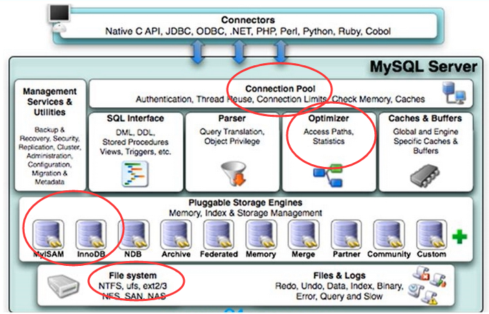

和其他数据库相比，MySQL有点与众不同，它的许多架构可以在很多不同场景中应用并发挥良好作用。主要体现在存储引擎的架构上，插件式的存储引擎架构将查询处理和其它的系统任务以及数据的存储提取相分离。这种架构可以根据业务的需求和实际需要选择合适的存储引擎。

1、连接层

最上面是一些客户端和连接服务，包含本地sock通信和大多数基于客户端/服务端工具实现的类似于tcp/ip的通信。主要完成一些类似于连接代理，授权认证以及相关的安全方案，在该层上引入了连接池的概念，为通过认证安全接入的客户端提供线程。同样在该层上可以实现基于SSL的安全连接。服务器也会为安全接入的每个客户端验证它所具有的操作权限。

2、服务层

第二层架构主要完成大多数的核心服务功能，如SQL接口，并完成缓存的查询，SQL的分析和优化及部分内置函数的执行。所有跨存储引擎的功能也在这一层实现。如过程，函数等。在该层，服务器会解析查询并创建相应的内部解析树，并对其完成相应的优化如确定查询表的顺序，是否利用索引等，最后生成相应的执行操作。如果是select语句，服务器还会查询内部的缓存。如果缓存空间足够大，这样在解决大量读操作的环境中能够很好的提高环境的性能。

3、引擎层

存储引擎层真正的负责了MySQL中数据的存储和读取，服务器通过API与存储引擎进行通信。不同的引擎具有的功能不同，这样我们可以根据自己的实际需要进行选取。

4、存储层

数据存储层，主要是将数据存储在运行于裸设备的文件系统之上，并完成与存储引擎的交互。

## 2、存储引擎

1、查看引擎命令

```mysql
show engines;
show variables like '%storage_engine%';
```

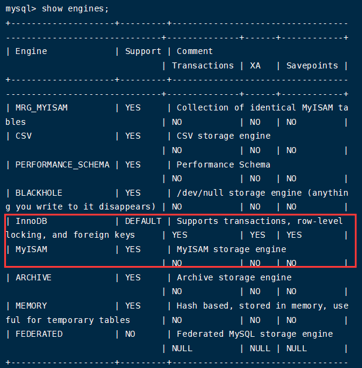

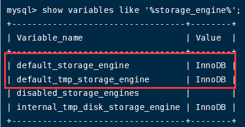

2、MyISAM和InnoDB的区别

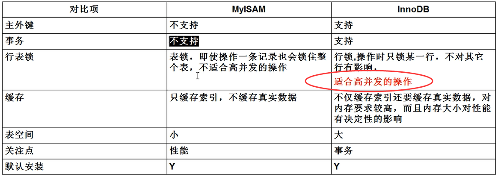

3、阿里淘宝使用的引擎

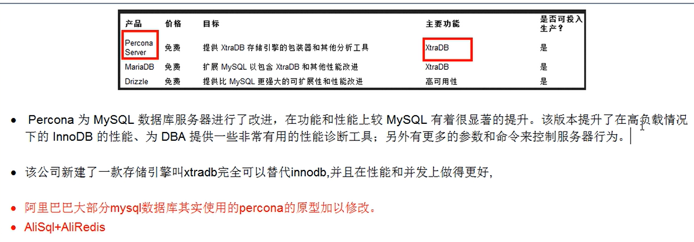

# 2 索引优化分析

## 1、SQL性能下降原因

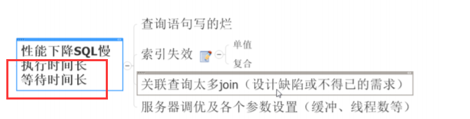

（1）单值/复合索引

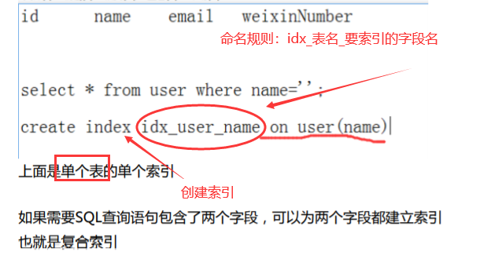

复合索引如下：

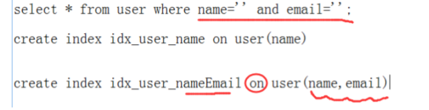

## 2、Join查询

1、SQL执行顺序

（1）手写的SQL

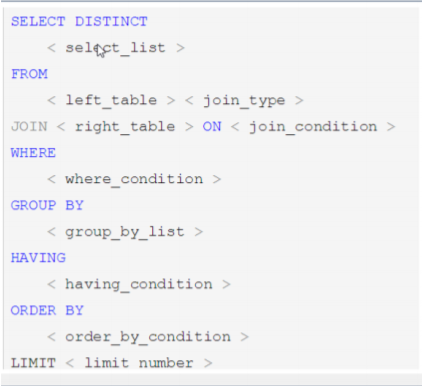

（2）机读

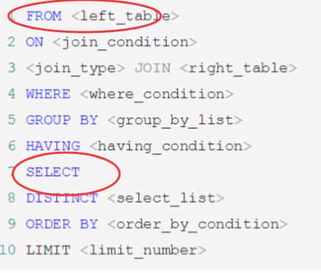

（3）总结

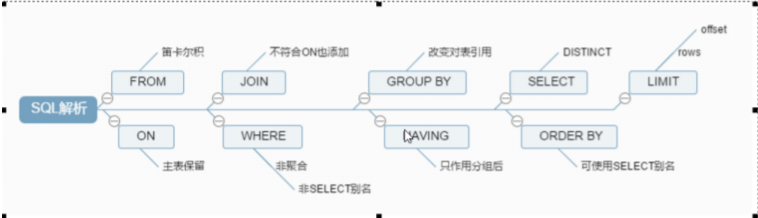

2、七种Join理论


参考博客：

```http
https://blog.csdn.net/weixin_41796956/article/details/85044152
```

3、Join的SQL编写

（1）新建table A/B

```mysql
use db01;
create table A(aID int not null,aName varchar(20));
insert into A values(1,'a01');
insert into A values(2,'a02');
insert into A values(3,'a03');
insert into A values(4,'a04');

create table A(aID int not null,aName varchar(20));
insert into A values(1,'b01');
insert into A values(2,'b02');
insert into A values(5,'b05');
insert into A values(6,'b06');
```

表结构：

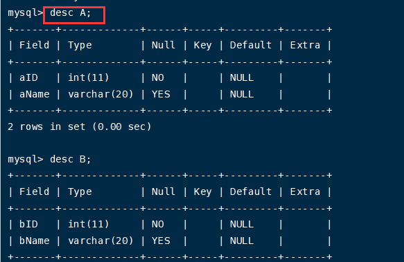

（2）左连接-left join

```mysql
select * from A left join B  on A.aID = B.bID;
```

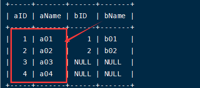

（3）全连接-full outer join-union

oracle支持full outer join，但是mysql不支持。使用union可以查询两表**独有**的数据，且能查询两表共有的数据而且不重复。

```mysql
-- union 联合两条sql的结果
mysql> select * from A left join B  on A.aID = B.bID
    -> union
    -> select * from A right join B  on A.aID = B.bID;
```

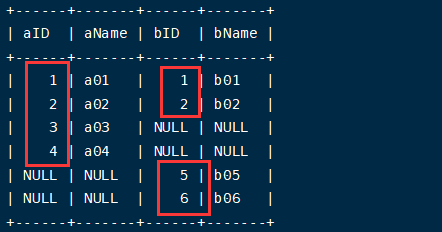

## 3、索引

### 1、介绍

1、概述

索引是一种数据结构，可以理解为排好序的快速查找数据的结构。

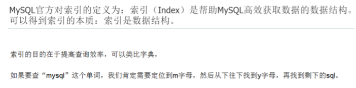

2、详解

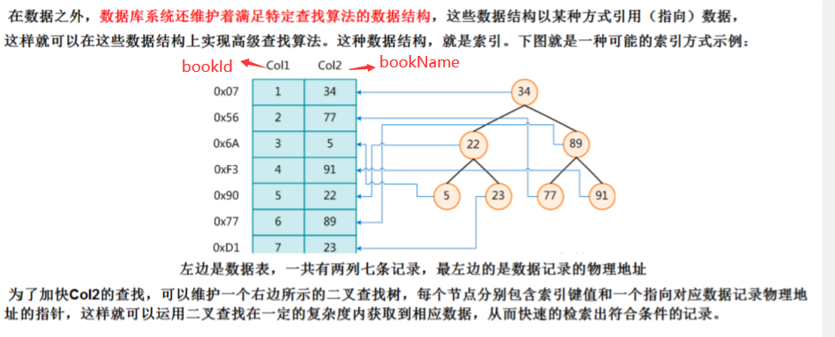

3、B树索引

数据本身之外，数据库还维护着一个满足特定查找算法的数据结构，这些数据结构以某种方式执行数据，这样就可以在这些数据结构的基础上实现高级查找算法，这种数据结构就是索引。


4、索引的优势


5、索引的劣势


6、索引分类

（1）单值索引：即一个索引只包含单个列，一个表可以有多个单列索引。

（2）唯一索引：索引列的值必须唯一，但允许有空值。

（3）符合索引：即一个索引包含多个列。

7、基本语法

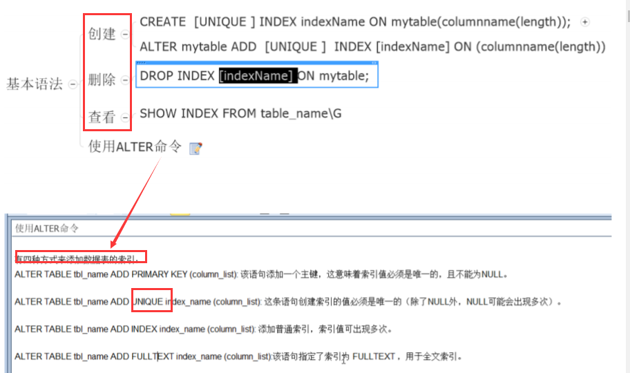

8、索引结构和检索原理

索引结构包含BTree索引，Hash索引，full-text全文索引，R-Tree索引。

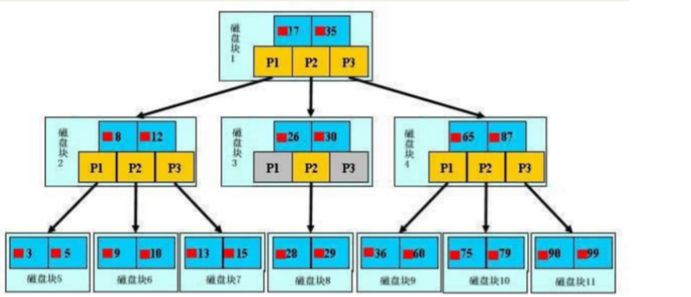

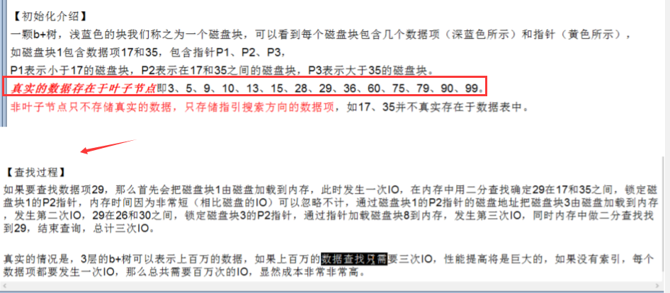

9、适合建立索引的情况

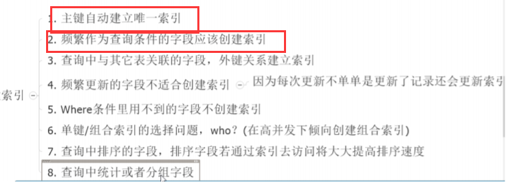

10、不适合建立索引的情况

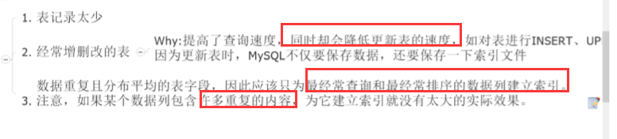

举例：

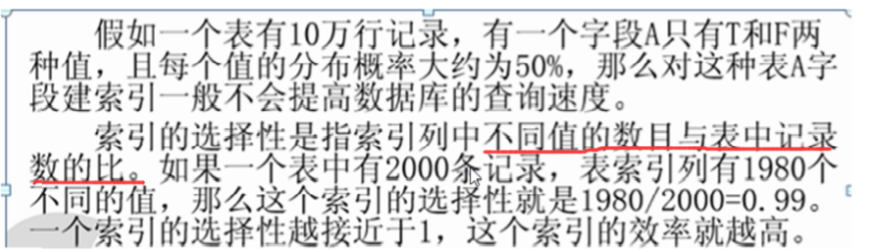

11、性能分析简介

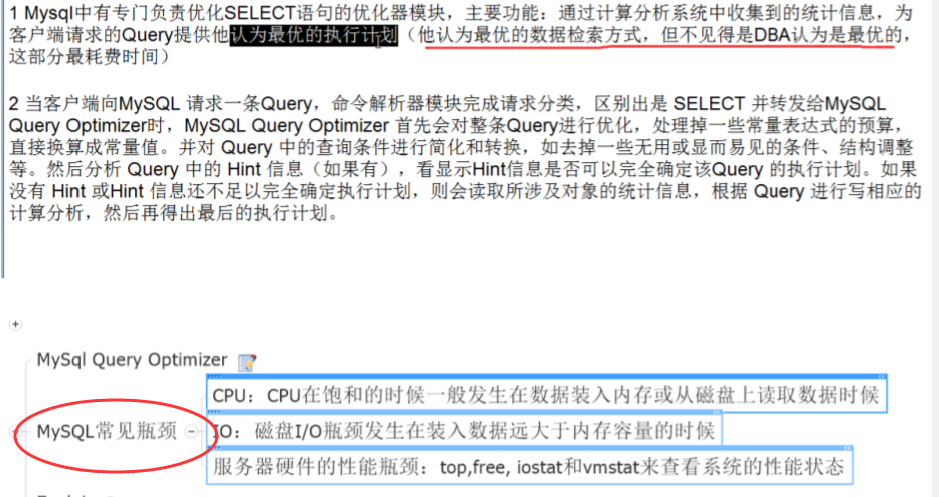

### 2、explain

1、介绍

（1）概述


（2）操作

```sql
explain SQL语句
```

执行计划包含的信息如下：

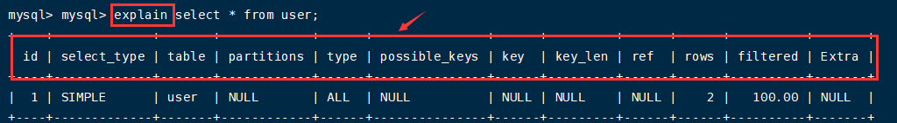

（3）作用


下面是执行计划包含信息的具体介绍：

2、explain的id介绍

select查询的序列号，包含一组数字，表示查询中执行select子句或者操作表的顺序。

分三种情况：

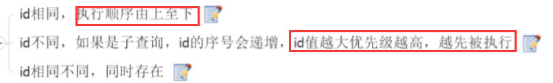

（1）id相同

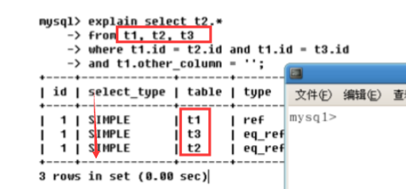

id相同，都是1，执行顺序是从上往下，加载顺序为t1,t3,t2。

（2）id不同

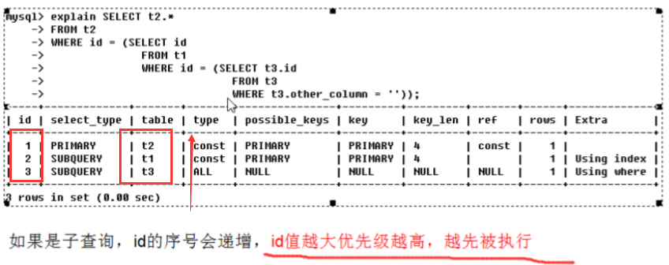

（3）id相同有不同

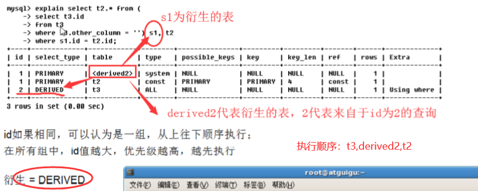

3、explain的select_type介绍

表示查询的类型，主要是用于区别普通查询、联合查询等。

包含的类型如下：

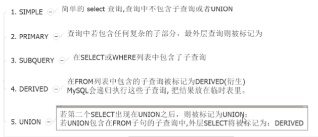

​	UNION RESULT：从UNION表中获取结果的SELECT。

4、explain的table介绍

显示这一行的数据是关于哪张表的。

5、explain的type介绍

type显示的访问类型，是比较重要的指标。一般来说，需要保证查询至少达到range级别，最好能够达到ref。

访问类型有下面几种：

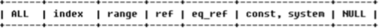

排序（从最好到最差）：

```ini
system>const>eq_ref>ref>range>index>All
```

详解：

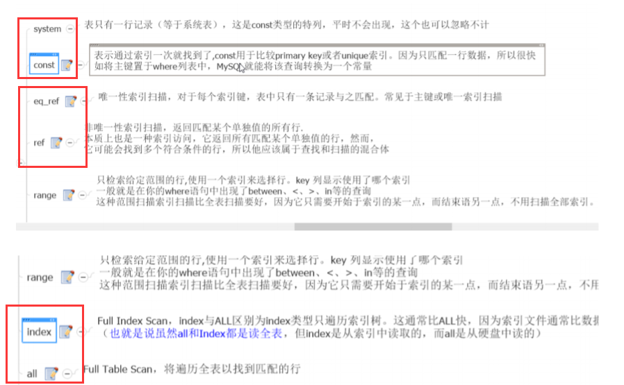

（1）system,const

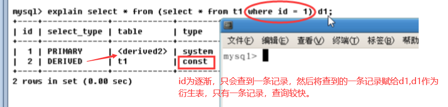

因为在t1中，id是唯一索引，所以通过一次索引（匹配到一条数据）就找到了它。

（2）eq_ref

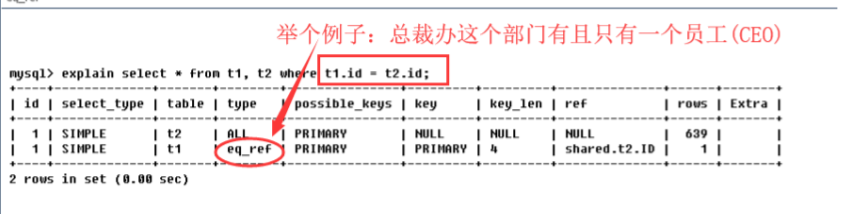

（3）ref

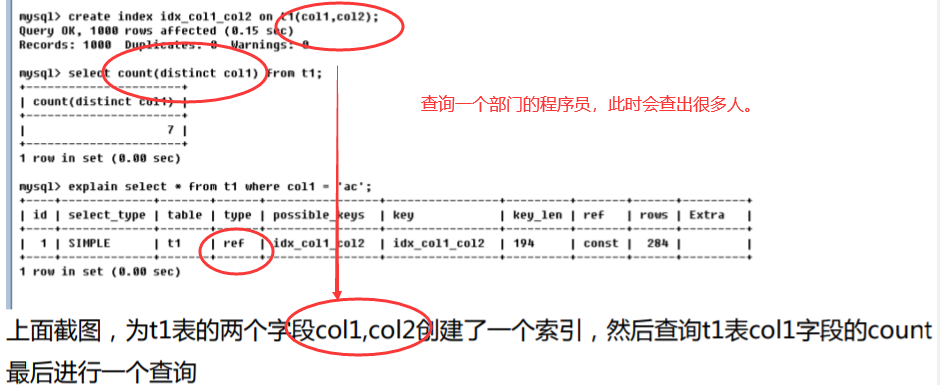

（4）range-范围查询

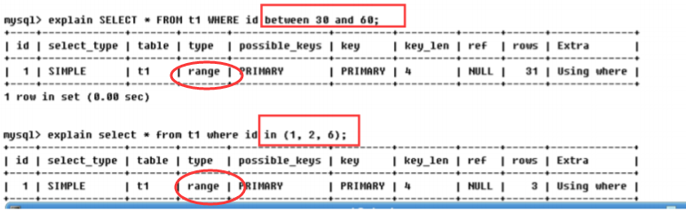

（5）index

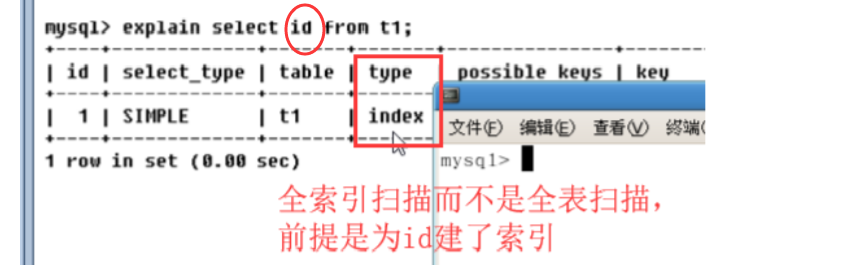

（6）All-全表扫描

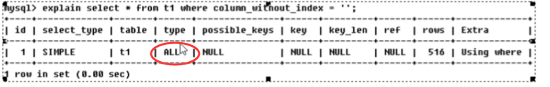

6、explain的possible_keys介绍


7、explain的key介绍

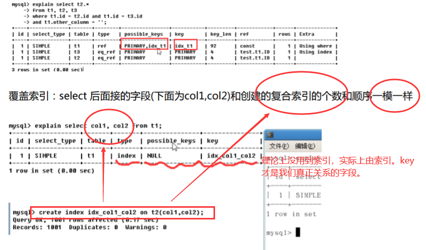

8、explain的key_len介绍


详解：

key_len大，查询的精度一般也大。理论上key_len越小越好，但是查询精度的提高必须得牺牲一定的空间。

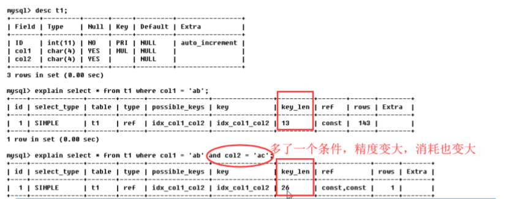

9、explain的ref介绍

显示索引的哪一列被使用了，如果可能的话，是一个常数。哪些列或者常量被用于查找索引列上的值。

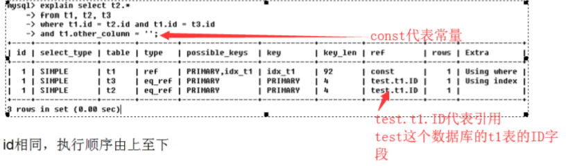

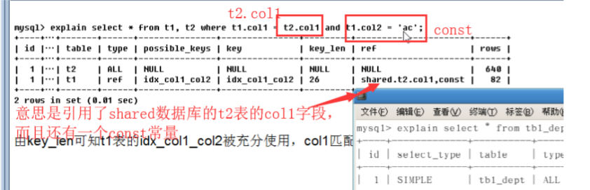

由key_len可知，t1表的idx_col1_col2被充分使用，col1匹配t2表的clo1，col2匹配一个常量，即‘ac’。

10、explain的rows介绍

根据表统计信息及索引选用情况，大致估算出所需的记录所需要读取的行数。

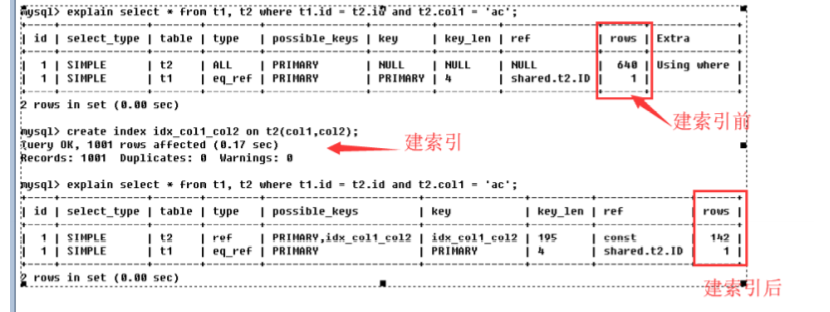

11、explain的Extra介绍

包含不适合在其他列中展示但是十分重要的额外信息。

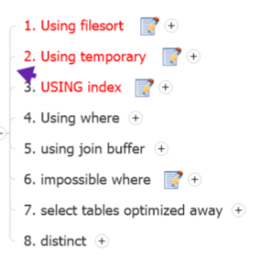

（1）Using filesort -九死一生

说明mysql会对数据使用一个外部的索引排序，而不是按照表内的索引顺序迸行读取。 MySQL中无法利用索引完成的排序操作称为:文件排序"。

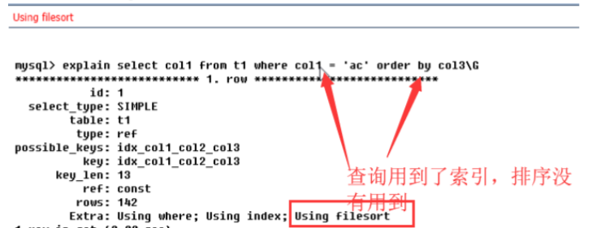

上面的查询，where是col1，order by 是col3，中间col2没有用到，被抽掉了，而索引建立的规则是 col1、col2 和col3，因此查询用到了索引，但是排序的时候用不到索引了。

当order的字段使用到了col2,col3：

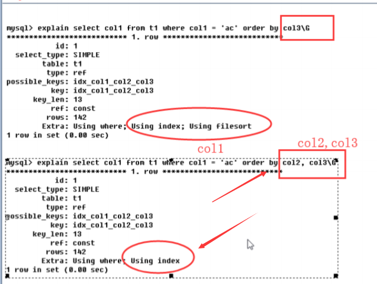

（2）Using temorary-十死无生 


用不上索引，还产生了临时表。

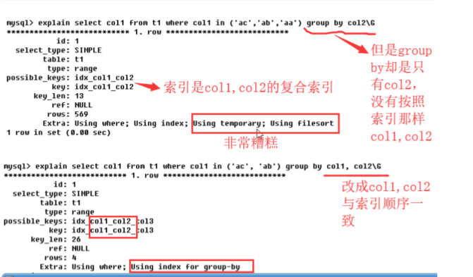

（3）using index-不错


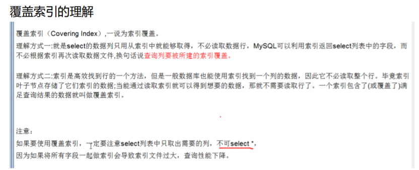

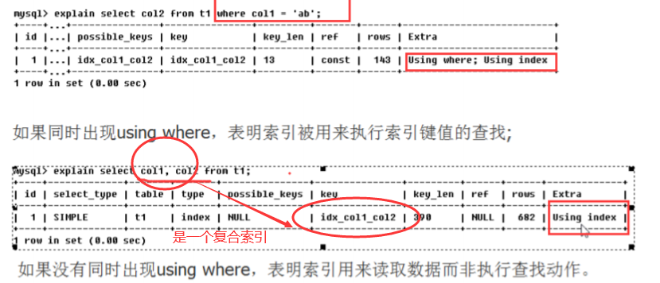

（4）Using where

表明使用到了where过滤。

（5）using join buffer

使用了连接缓存。

（6）impossible where

where子句的值总是false，不能用来获取任何元组。

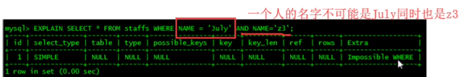

（7）select tables optimized away和distinct

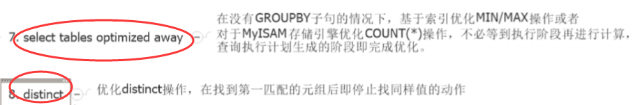

### 3、explain案例

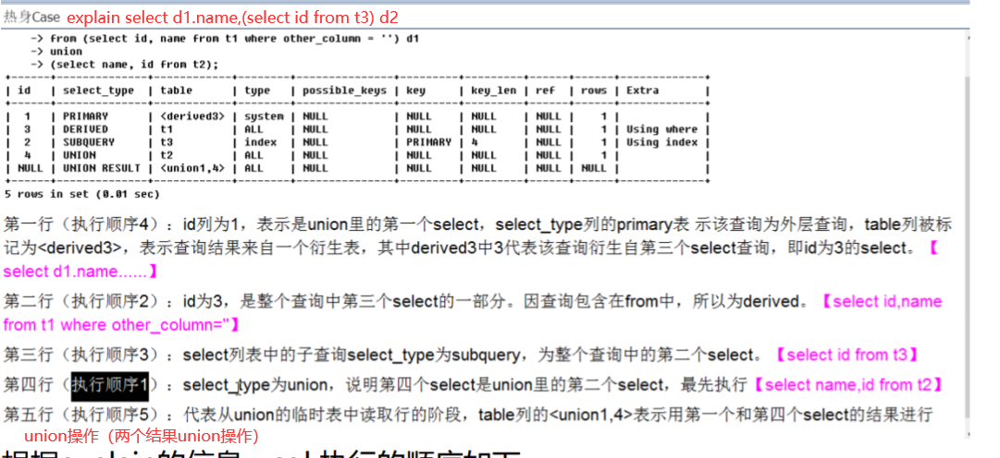

### 4、索引分析

#### 1、单表优化

1、建表SQL

```mysql
create table if not exists `article`(
`id` int(10) unsigned not null primary key auto_increment,
`author_id` int(10) unsigned not null,
`category_id` int(10) unsigned not null,
`views` int(10) unsigned not null,
`comments` int(10) unsigned not null,
`title` varbinary(255) not null, 
`contents` text not null
);

insert into `article`(`author_id`,`category_id`,`views`,`comments`,`title`,`contents`) values(1,1,1,1,'1','1');
insert into `article`(`author_id`,`category_id`,`views`,`comments`,`title`,`contents`) values(2,2,2,2,'2','2');
insert into `article`(`author_id`,`category_id`,`views`,`comments`,`title`,`contents`) values(1,1,3,3,'3','3');
```

2、案例

查询category_id为1且comments大于1的情况下，views最多的article_id。

```mysql
select id,author_id from article where category_id = 1 and comments > 1 order by views desc limit 1;
```

结果显示：出现了using filesort的情况。

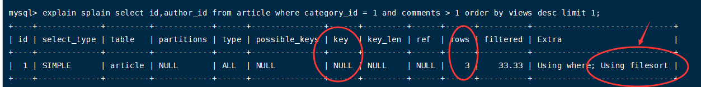

type是all,即最坏的情况，Extra里面还出现了Using filesort,也是最坏的情况，优化是必须的。

3、优化

（1）最基本思路，where 后面的设计字段全加上索引。

```mysql
#两种创建索引的方法
#alter table `article` add index idx_article_ccv(category_id,comments,views);
create index idx_article_ccv on article(category_id,comments,views);

#创建索引后查看
show INDEX FROM article;
```

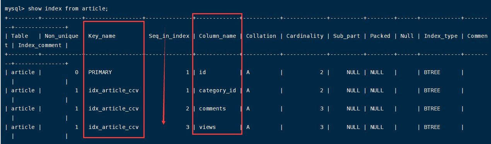

再使用explain查询一次，结果如下：

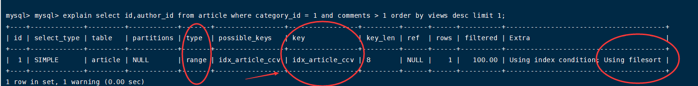

此时，索引使用上了，且全扫描变成变成了范围查询，但是仍然存在filesort。索引失效的原因如下：

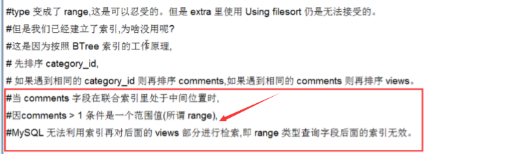

（2）既然comments字段是一个范围，因此加索引的时候不加上这个字段即可。

```mysql
#删除索引
DROP INDEX idx_article_ccv on article;
 
#创建索引
create index idx_article_cv on article(category_id,views);
```

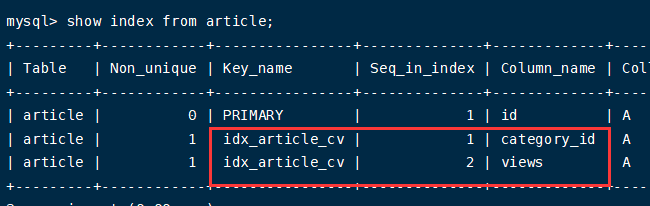

再使用explain查询一次，结果如下：

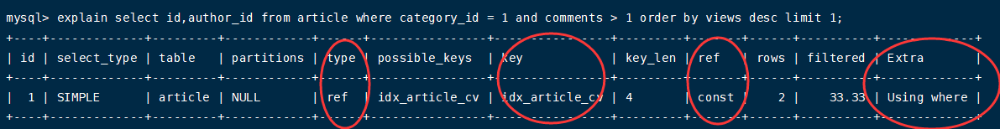

#### 2、两表优化

1、建表SQL

```mysql
create table if not exists `class`(
`id` int(10) unsigned not null auto_increment,
`card` int(10) unsigned not null,
primary key(`id`)
);

create table if not exists `book`(
`bookid` int(10) unsigned not null auto_increment,
`card` int(10) unsigned not null,
primary key(`bookid`)
);

-- 在class表中按照下面方式插入数据20个
INSERT into class(card) VALUES(FLOOR(1+RAND()*20));
-- book表同理
INSERT into book(card) VALUES(FLOOR(1+RAND()*20));
```

class表和book表都有20条记录，且都有card字段，join连接表时使用card字段。

```mysql
explain SELECT * FROM book left join class on class.card = book.card;
```

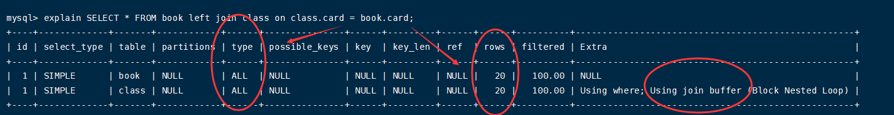

2、优化

（1）在book表中建立索引，用在card字段。

```mysql
alter table book add index Y(card);
```


（2）去除book表中建立的索引，在class表中创建索引，用在card字段。

```mysql
alter table class add index Y(card);
```

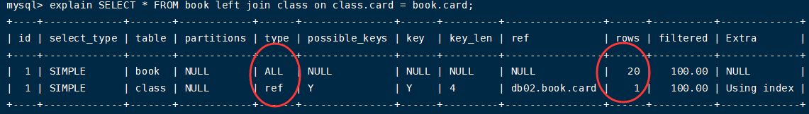

因此，对于左连接的联表查询，将索引建立在右表中比较好。原因如下：

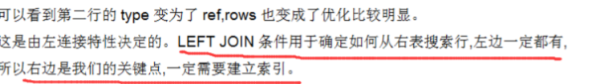

右连接同理，索引加在左表上。

#### 3、三表优化

1、建表SQL

```mysql
-- 在上一节的基础上，多加一个phone表
create table if not exists `phone`(
`phoneid` int(10) unsigned not null auto_increment,
`card` int(10) unsigned not null,
primary key(`phoneid`)
);

-- 插入20次数据
INSERT into phone(card) VALUES(FLOOR(1+RAND()*20));
```

三表查询语句：

```mysql
EXPLAIN SELECT * FROM class left join book on class.card=book.card left join phone on
book.card=phone.card;
```

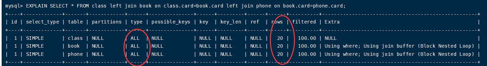

2、优化

（1）在book表和phone表的card 字段分别添加索引。

```mysql
alter table book add index Y(card);
alter table phone add index Z(card);
```

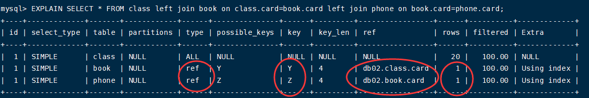

后两行的type都是ref，且rows减少，优化不错。因此，索引最好设置在需要经常查询的字段中。


### 5、索引失效

#### 1、建表SQL

```mysql
create table staffs(
id int primary key auto_increment,
name varchar(24) not null default "" comment '姓名',
age int not null default 0 comment '年龄',
pos varchar(20) not null default "" comment '职位',
add_time timestamp not null default current_timestamp comment '入职时间'
);

-- 插入数据
insert into staffs(name,age,pos,add_time) values('z3',22,'manager',now());
insert into staffs(name,age,pos,add_time) values('July',23,'dev',now());
insert into staffs(name,age,pos,add_time) values('li4',23,'dev',now());
insert into staffs(name,age,pos,add_time) values('2000',23,'dev',now());

-- 添加复合索引
alter table staffs add index idx_staffs_nameAgePos(name,age,pos);
```

#### 2、索引会失效的情况

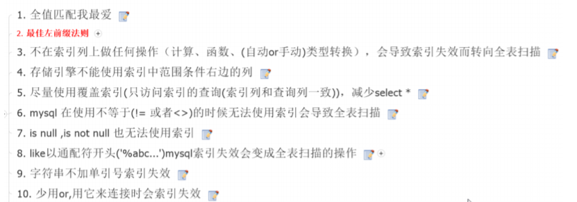

1、全局匹配我最爱/最佳左前缀法则

最佳左前缀法则：如果索引了多列，要遵守最左前缀法则，指的是查询从索引的最左前缀开始并且不跳过索引的列。

```mysql
-- 前缀的部分匹配能够使用到索引
EXPLAIN SELECT * FROM staffs WHERE name = 'July';
EXPLAIN SELECT * FROM staffs WHERE name = 'July' AND age=23;

-- 全匹配也是可以使用到索引
EXPLAIN SELECT * FROM staffs WHERE name = 'July' AND age=23 AND pos = 'dev';
```

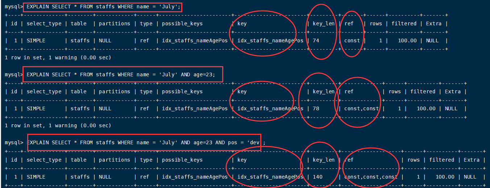

下面情况索引失效：

```mysql
EXPLAIN SELECT * FROM staffs WHERE age=23 AND pos = 'dev';
EXPLAIN SELECT * FROM staffs WHERE pos = 'dev';
```

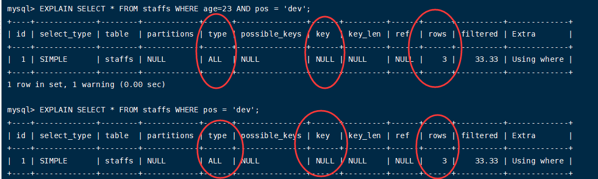

索引失效的原因是，查询没有从索引的最左前缀开始。跳过了name这列。

当索引从最左边开始查起，只是把构成索引的中间字段age去掉，此时也会用到索引，不过此时只是部分用到索引。

```mysql
EXPLAIN SELECT * FROM staffs WHERE name = 'July' AND pos = 'dev';
```

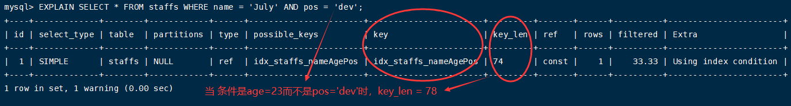

2、不要在索引列上做任何操作（计算、函数、(自动或者手动)类型转换），会导致索引失效转向全表扫描。

```mysql
EXPLAIN SELECT * FROM staffs WHERE name = 'July';

-- 使用mysql自己的函数（字符串截取），导致索引失效。
EXPLAIN SELECT * FROM staffs WHERE LEFT(name,4) = 'July';
```

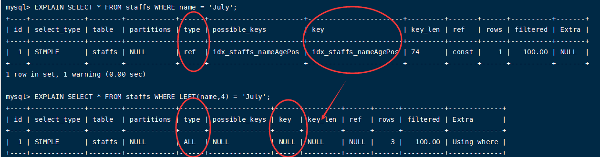

3、存储引擎不能使用索引中范围条件右边的列。

```mysql
EXPLAIN SELECT * FROM staffs WHERE name = 'July' AND age=23 AND pos = 'dev';

-- 把age=23改成一个范围age>23
EXPLAIN SELECT * FROM staffs WHERE name = 'July' AND age>23 AND pos = 'dev';
```

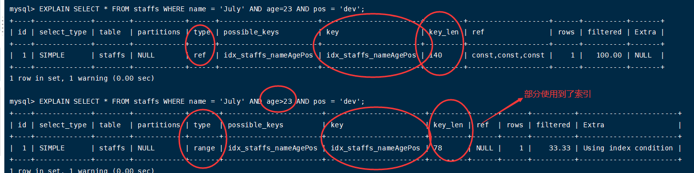

4、尽量使用覆盖索引(只访问索引的查询(索引列和查询列一致))，减少使用select *。

```mysql
EXPLAIN SELECT * FROM staffs WHERE name = 'July' AND age=23 AND pos = 'dev';

EXPLAIN SELECT name,age,pos FROM staffs WHERE name = 'July' AND age=23 AND pos = 'dev';
```

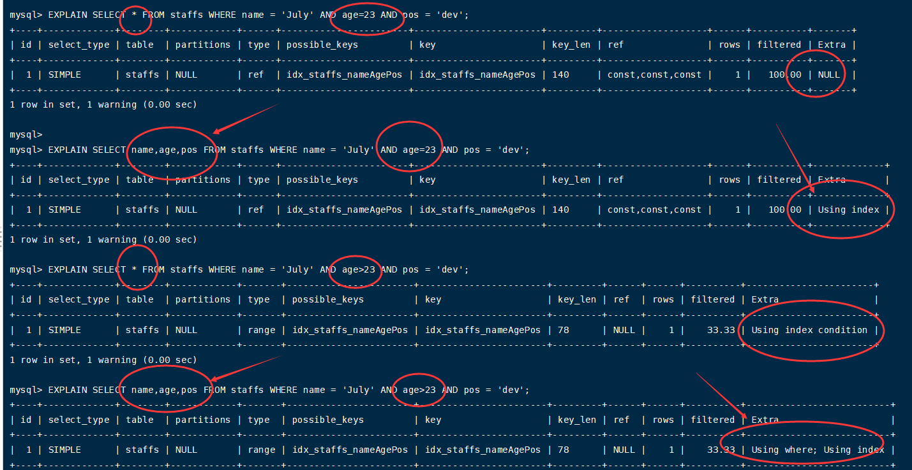

select 后面接的字段如果和使用的索引的字段一致的话，是有可能using index的。

5、mysql在使用不等于(!=或者<>)的时候无法使用索引会导致全表扫描。

```mysql
EXPLAIN SELECT * FROM staffs WHERE name = 'July';

-- =修改为 != <> 会导致索引失效
EXPLAIN SELECT * FROM staffs WHERE name != 'July';
EXPLAIN SELECT * FROM staffs WHERE name <> 'July';
```

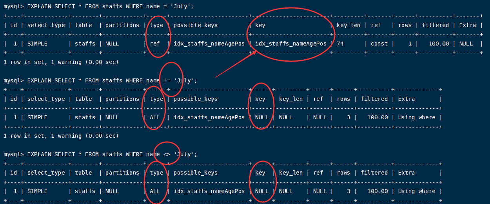

6、is null is not null 也无法使用索引

```mysql
EXPLAIN SELECT * FROM staffs WHERE name is NULL;
EXPLAIN SELECT * FROM staffs WHERE name is not NULL;
```

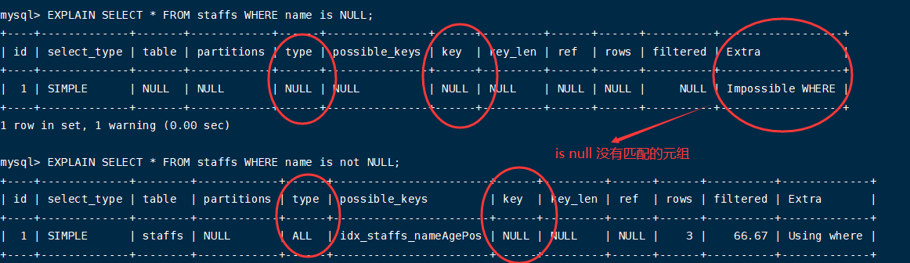

7、like以通配符开头（'%abc...'）索引失效，会变成全表扫描操作

（1）通配符在右边使用到了索引

```mysql
EXPLAIN SELECT * FROM staffs WHERE name like '%July%';
EXPLAIN SELECT * FROM staffs WHERE name like '%July';

-- 使用到了索引
EXPLAIN SELECT * FROM staffs WHERE name like 'July%';
```

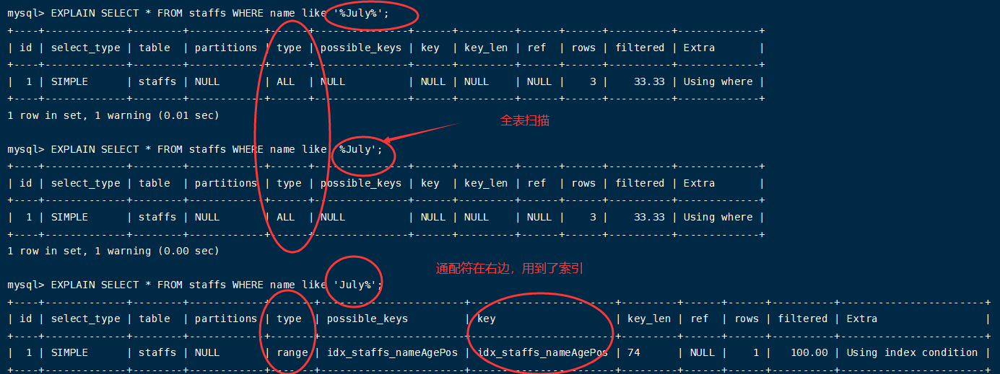

（2）解决like '%字符串%'时索引不被使用。

（a）建表SQL

```mysql
create table `tbl_user`(
id int(11) not null auto_increment,
name varchar(20) default null,
age int(11) default null,
email varchar(20) default null,
primary key (`id`)
)engine=innodb auto_increment=1 default charset=utf8;

-- 插入数据
insert into tbl_user(name,age,email)values('1aa1',21,'a@163.com');
insert into tbl_user(name,age,email)values('2aa2',22,'b@163.com');
insert into tbl_user(name,age,email)values('3aa3',23,'c@163.com');
insert into tbl_user(name,age,email)values('4aa4',24,'d@163.com');
insert into tbl_user(name,age,email)values('aa',25,'e@163.com');
```

（b）索引失效测试

```mysql
-- 添加索引前，全表扫描
explain select id from tbl_user where name like '%aa%';
explain select name from tbl_user where name like '%aa%';
explain select name,age from tbl_user where name like '%aa%';

-- 添加索引后 执行上面三条语句，全部变成index，而不是全表扫描。当查询的字段是非索引id时，也用到了索引，主要是id自带主键索引。
CREATE INDEX idx_user_nameAge ON tbl_user (name,age);
```

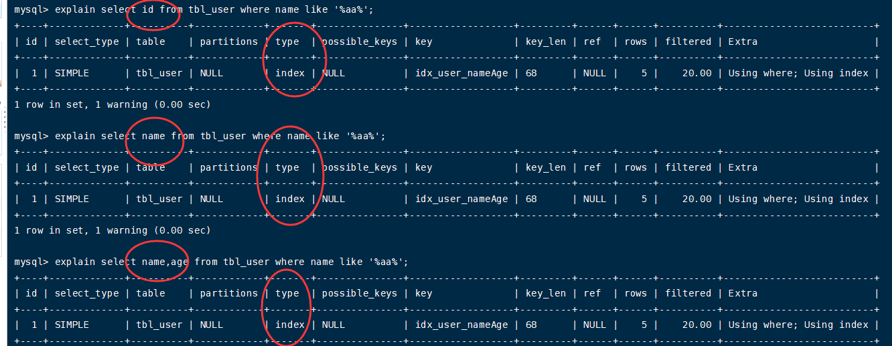

索引失效的情况，超出索引字段的范围，导致索引失效：

```mysql
explain select * from tbl_user where name like '%aa%';
-- 多了个email非索引字段
eXPLAIN SELECT id,name,age,email FROM tbl_user WHERE name LIKE '%aa%';
```


补充，在建立索引之后，单查email非索引字段，也会造成索引失效：

```mysql
 explain select email from tbl_user where name like '%aa%';
```

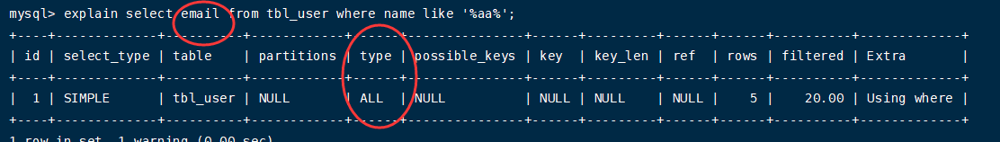

8、字符串不加单引号索引失效

不加单引号，会引起数据类型的转换（比如int到varchar转换）而导致全表扫描。

```mysql
Explain SELECT * FROM staffs WHERE name = '2000';

-- 去掉单引号，索引失效
Explain SELECT * FROM staffs WHERE name = 2000;
```

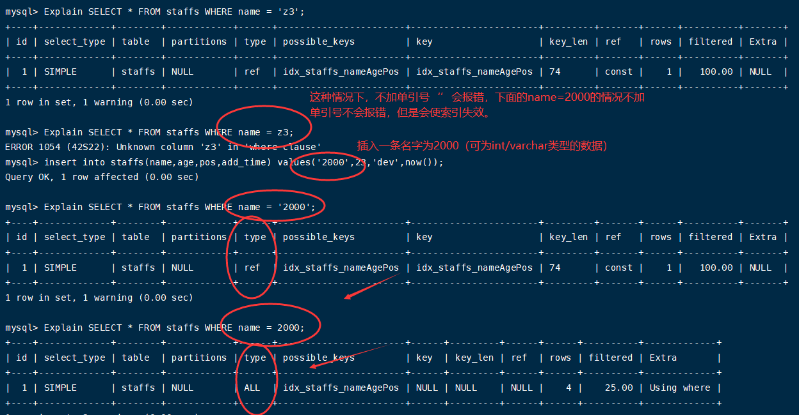

9、少用or，用它来连接时会索引失效

```mysql
Explain SELECT * FROM staffs WHERE name = 'July' or name = 'z3';
```

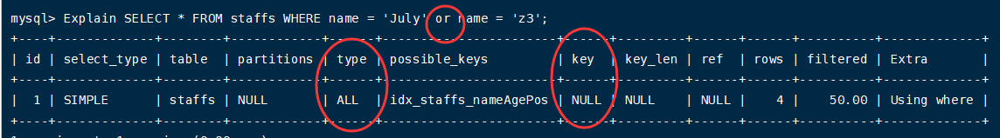

#### 3、小总结

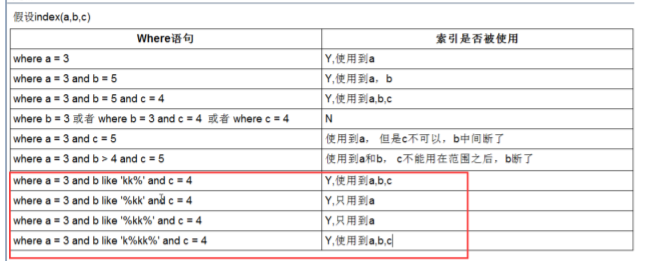

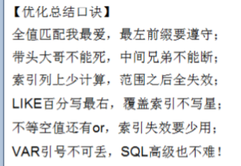

注：这里没有写出参考面试题，请参考相应的笔记文档，这里不再赘述。