# 查询截取分析

## 1、查询优化

### 1、小表驱动大表

1、对于mysql的优化分析步骤

（1）观察，至少跑一天，看看生产的慢SQL情况。

（2）开启慢查询日志，设置阈值，比如超过5秒钟的就是慢SQL，并将它抓取出来。

（3）explain+慢SQL分析

（4）show profile

（5）运维经理或者DBA，进行SQL数据库服务器的参数调优

总结

（1）查询优化

（2）慢查询的开启并捕获 

（3）explain+慢SQL分析 

（4）show profile 查询SQL在Mysql服务器里面的执行细节和生命周期情况 。

（5）SQL数据库服务器的参数调优。 

2、IN or EXISTS

（1）优化原则：小表驱动大表，即小的数据集驱动大的数据集，类似于下面的嵌套循环：

```java
// 只需要连接5次，每一次都可以执行1000次。小嵌套驱动大语句
for(int i = 5;....){
	for(int i = 1000;....){
		....
	}
}

//需要连接的次数为1000次，浪费时间
for(int i = 1000;....){
	for(int i = 5;....){
		....
	}
}
```

（2）IN

当B表的数据集必须小于A表的数据集时，使用in优于exists。

```mysql
select * from A where id in(select id from B);
-- 等价于下面的语句
for select id from B  -- 小表
for select * from A where A.id = B.id -- 大表
```

（3）EXISTS

当A表的数据集必须小于B表的数据集时，使用exists优于in。

```mysql
-- select 1(常量就可以，可以为3或者'x'等)。select 1可以换成任意东西，mysql会自动忽略select后面的内容。
select * from A where exists(select 1 from B where A.id = B.id);
-- 等价于下面的语句
for select * from A
for select * from B where A.id = B.id
```

exists解析如下：

```mysql
select _ from table where exists(subquery);
```

将主查询的数据，放到子查询中做条件验证，根据验证结果来决定主查询的数据结果是否得以保留。


### 2、order by关键字优化

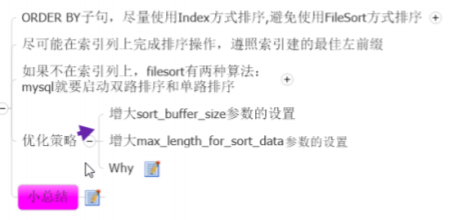

#### 1、建表SQL

```mysql
create table tb1A(
age int,
birth timestamp not null
);

-- 插入数据
insert into tb1A(age,birth) values(22,now());
insert into tb1A(age,birth) values(23,now());
insert into tb1A(age,birth) values(24,now());

-- 创建索引
create index idx_A_ageBirth on tb1A(age,birth);
```

#### 2、优化

1、执行下面的语句

（1）使用到索引且正常输出的情况

```mysql
EXPLAIN SELECT * FROM tb1A WHERE age>20 ORDER BY age;
EXPLAIN SELECT * FROM tb1A WHERE age>20 ORDER BY age,birth;
```

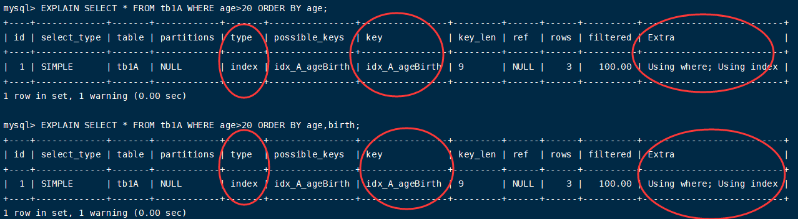

（2）使用到索引，但是出现filesort的情况

```mysql
EXPLAIN SELECT * FROM tb1A WHERE age>20 ORDER BY birth;
EXPLAIN SELECT * FROM tb1A WHERE age>20 ORDER BY birth,age;
```

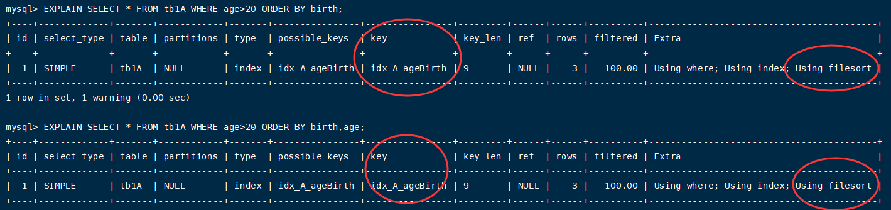

（3）SQL支持两种方式的扫描

FileSort和Index，其中Index效率较高，指MySQL扫描索引本身完成排序。FileSort方式效率较低。Order by满足两个情况，会支持Index排序：

```ini
order by 语句使用索引最左前列
使用where子句与order by子句条件列组合满足索引最左前列
```

2、单/双路排序

（1）单路排序

单路排序(mysql4.1后) 从磁盘读取查询需要的所有列,按照order by列在buffer对它们进行排序,然后扫描排序后的列表进行输出,.它的效率 更快一些,避免了第二次读取数据。并且把随机IO变成了顺序IO,但是它会使用更多的空间, 因为它把每一行都保存在内存中了。

由于单路是后出的，总体而言好于双路，其存在问题如下：


优化策略：

```ini
增大sort_buffer_size参数设置
增大max_length_for_sort_data参数设置
```

（2）双路排序


3、提高order by的速度

（1）Order by时select *是一个大忌只Query需要的字段,这点非常重要。在这里的影响是: 

（a）当Query的字段大小总和小于maxlength-for-sort-data而且排序字段不是TEXTIBLOB类型时,会用改进后的算 法-一单!|路排序,否则用老算法--多路排序。 

（b）两种算法的数据都有可能超出sort buffer的容量,超出之后,会创建tmp文件进行合并排序,导致多次I/O,但是用单 路排序算法的风险会更大一些,所以要提高sort-buffer-size。

（2）尝试提高sort buffer size 不管用哪种算法,提高这个参数都会提高效率,当然,要根据系统的能力去提高,因为这个参数是针对每个进程的 。

（3）尝试提高max-length-for-sort data |提高这个参数, 会增加用改进算法的概率。但是如果设的太高,数据总容量超出sort buffer size的概率就增大,明显症 状是高的磁盘1/O活动和低的处理器使用率。

4、小总结

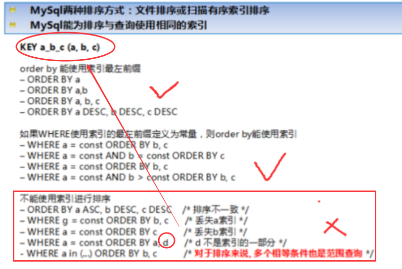

#### 3、group by关键字优化

和order by类似。


## 2、慢查询日志

### 1、介绍

1、概述

MySQL的慢查询日志是MySQL提供的一种日志记录,它用来记录在MySQL中响应时间超过阀值的语句,具体指运行 时间超过`long_query_time`值的SQL,则会被记录到慢查询日志中。 ∙

具体指运行时间超过`long_query_time`值的SQL,则会被记录到慢查询日志中。`long_query_time`的默认值为10,意 思是运行10秒以上的语句。

由他来查看哪些SQL超出了我们的最大忍耐时间值,比如一条sql执行超过5秒钟,我们就算慢SQL,希望能收集超过5秒 的sql,结合之前explain进行全面分析。

2、说明

默认情况下，MySQL数据库没有开启慢查询日志，需要我们手动来设置这个参数。 

当然，如果不是调优需要的话，一般不建议启动该参数，因为开启慢查询日志会或多或少带来一定的性能影响。慢查询日志支持将日志记录写入文件。

### 2、操作

1、查看开启情况

```mysql
show VARIABLES LIKE '%slow_query_log%';

-- 开启。开启慢查询日志只对当前数据库生效,如果MySQL重启后则会失
效。
set global slow_query_log=1;
```

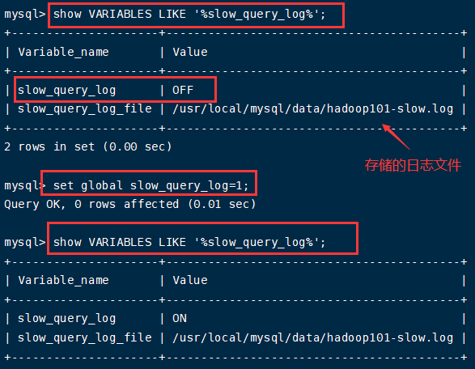

一般不建议永久开启慢查询日志，如果一定要做，只能修改配置文件my.cnf：

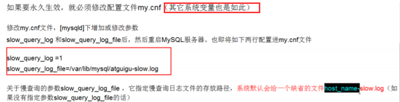

2、查看慢时间的阈值

```mysql
show VARIABLES LIKE '%long_query_time%';
```

long_query_time默认是10秒。也就是大于10秒的sql会记录在慢查询日志中。非大于等于。当SQL语句运行时间大于long_query_time设置的时间时，会在日志中记录下来。

为了测试，我们将该SQL语句执行的阈值时间设置为3S：

```mysql
set global long_query_time=3;
```

此时，虽然修改变量`long_query_time`，但是查询该变量`long_query_time`的值仍为10。

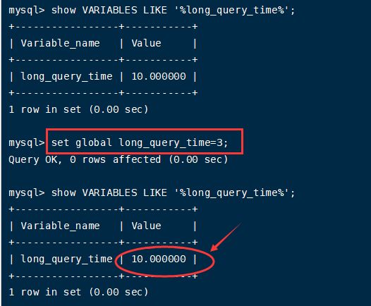

此时，我们需要重新开一个会话，或者使用下面的命令来查询，：

```mysql
show GLOBAL VARIABLES LIKE '%long_query_time%';
```

查询慢日志文件，可以看到下面的情况：

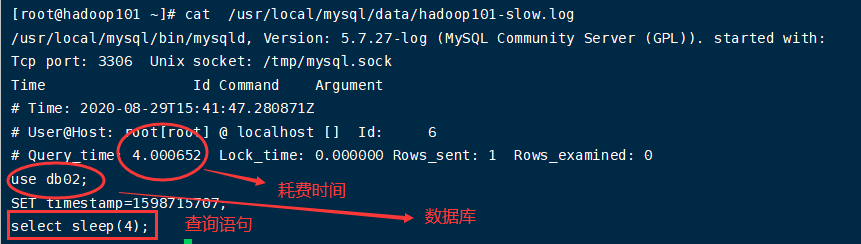

注：

对于上面日志的情况，我是需要在执行下面的SQL语句后，

```mysql
set global long_query_time=3;
```

重新断开当前的FinalShell连接，然后执行下面的语句看到的：

```mysql
select sleep(4);
```

3、设置阈值时间永久生效

```ini
-- [mysqld]下配置
slow_query_log=1;
slow_query_log_file=/usr/local/mysql/data/hadoop101-slow.log;
long_query_time=3;
log_output=FILE;
```

4、日志分析工具-mysqldumpslow

生产环境下，如果要手工分析日志，查找、分析SQL，是一个体力活，MySQL提供了日志分析工具mysqldumpslow。

（1）查看帮助信息

```shell
mysqldumpslow --help
```

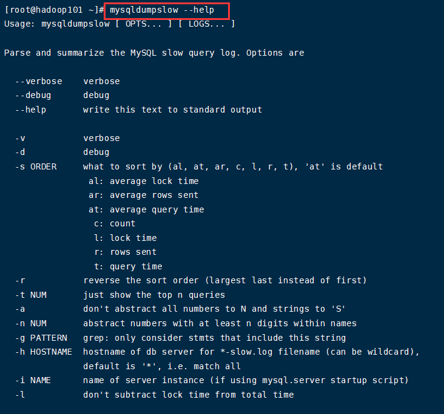

（2）参数


（3）常用命令 工作常用参考

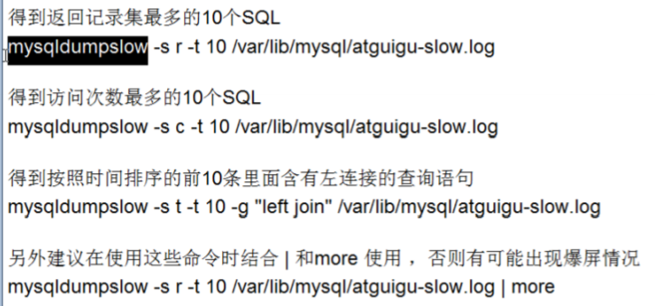


## 3、批量数据脚本

### 1、介绍

函数和存储过程的区别：函数有返回值，存储过程没有。

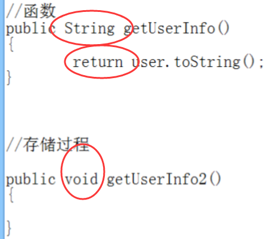

### 2、操作-向表里插入1000w条数据


1、建表SQL

```mysql
-- 新建库
create database bigData;
use bigData;


-- 部门表
create table dept(
id int unsigned primary key auto_increment,
deptno mediumint unsigned not null default 0,
dname varchar(20) not null default "",
loc varchar(13) not null default ""
)engine=innodb default charset=utf8;

-- 员工表
create table emp(
id int unsigned primary key auto_increment, 
empno mediumint unsigned not null default 0, /*编号*/
ename varchar(20) not null default "", /*名字*/
job varchar(9) not null default "",  /*工作*/
mgr mediumint unsigned not null default 0, /*上级编号*/
hiredate date not null, /*入职时间*/
sal decimal(7,2) not null, /*薪水*/
comm decimal(7,2) not null, /*红利*/
deptno  mediumint unsigned not null default 0,/*部门编号*/
)engine=innodb default charset=utf8;
```

2、设置参数log_bin_trust_function_creators

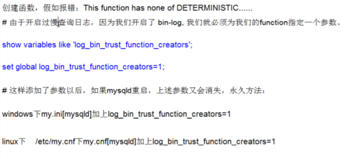

```mysql
show variables like 'log_bin_trust_function_creators';
set global log_bin_trust_function_creators = 1;
```

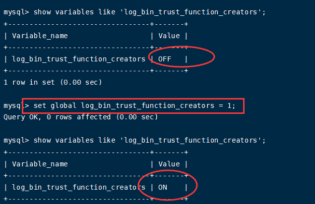

3、创建函数，保证每条数据都不同

（1）随机产生字符串

```mysql
-- delimiter 定界符
delimiter $$
 -- ran_string 函数名，返回值类型 varchar(255) 
CREATE FUNCTION `rand_string`(n int) RETURNS varchar(255) 
BEGIN
	-- 定义变量chars_str
  DECLARE chars_str VARCHAR(100) DEFAULT
  'abcdefghijklmnopqrstuvwxyzABCDEFGHIJKLMNOPQRSTUVWXYZ';
  -- 声明返回类型
  DECLARE return_str VARCHAR(255) DEFAULT '';
  DECLARE i INT DEFAULT 0;
  WHILE i < n DO
  -- 从 chars_str 中随机取一个字符；CONCAT函数将多个字符串连接成一个字符串。
  SET return_str = CONCAT(return_str,SUBSTRING(chars_str,FLOOR(1+RAND()*52),1));
  SET i = i + 1;
	END WHILE;
RETURN return_str;
END  $$
```

（2）随机产生部门编号

```mysql
delimiter $$
CREATE FUNCTION `rand_num`() RETURNS int(5)
BEGIN
  DECLARE i INT DEFAULT 0;
  -- 100~ 110之间部门号
  SET i=FLOOR(100+RAND()*10);
RETURN i;
END  $$

-- 加入要删除函数，使用下面命令
drop function rand_num;
```

4、创建存储过程

（1）向员工表emp中插入数据的过程

```mysql
delimiter $$
  CREATE  PROCEDURE `insert_emp`(IN START INT(10),IN max_num INT(10))
  BEGIN
    DECLARE i INT DEFAULT 0;
    -- 关闭每次插入数据后自动提交，节省时间
    SET autocommit = 0;
    REPEAT
    SET i = i + 1;
    INSERT INTO emp(empno,ename,job,mgr,hiredate,sal,comm,deptno)
    VALUES((START+i),rand_string(6),'SALESMAN',0001,CURDATE(),2000,400,rand_num());
    UNTIL i = max_num
  END REPEAT;
  -- 对于插入的50w条数据，一次性提交
  COMMIT; 
END $$
```

（1）向部门表dept中插入数据的过程

```mysql
delimiter $$
  CREATE PROCEDURE `insert_dept`(IN START int,IN max_num int)
  BEGIN
    DECLARE i INT DEFAULT 0;
    SET autocommit = 0;
    REPEAT
    SET i = i + 1;
    INSERT INTO dept(deptno,dname,loc) VALUES((START+i),rand_string(10),rand_string(8));
    UNTIL i = max_num
  END REPEAT;
  COMMIT;
END $$
```

5、调用存储过程

（1）向部门表dept中插入10个部门数据

```mysql
-- 换回分界符
delimiter ;

-- call表示调用函数
CALL insert_dept(100,10);
```

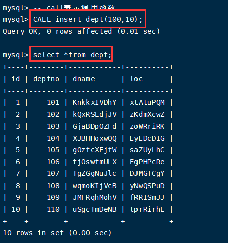

（2）向员工表emp中插入50万条数据

一共插入1000w，为了缓解数据库压力，20次完成。

```mysql
-- 换回分界符
delimiter ;

-- call表示调用函数
-- CALL insert_emp(1,500000);
-- 为了简便起见，插入1000条数据进行测试
CALL insert_emp(1,1000);
```

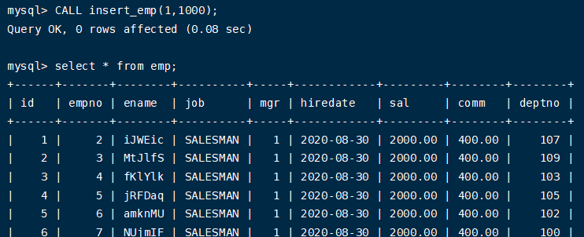

## 4、show profile

### 1、介绍

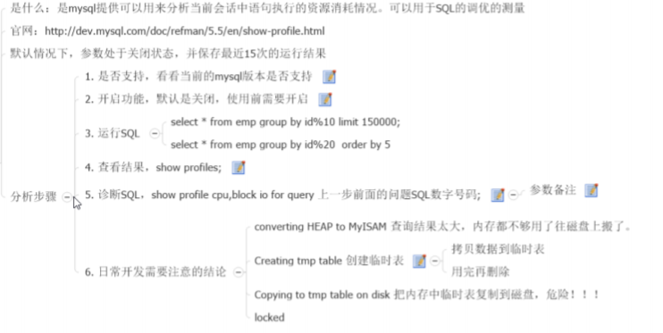

mysql用来分析当前会话中语句执行的资源消耗情况。

1、查看当前show profile状态

```mysql
-- 默认是关闭的，使用前需要进行开启
show variables like 'profiling';

-- 开启
set profiling=on;
```

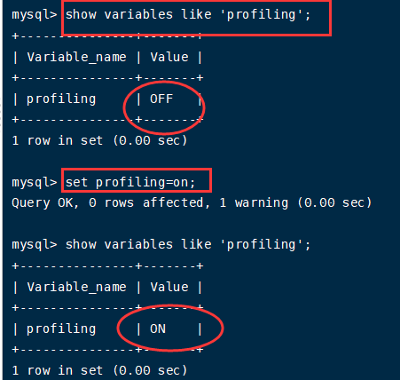

2、运行SQL

```mysql
select * from emp;
select * from emp limit 10;
```

3、查看结果

```mysql
show profiles;
```

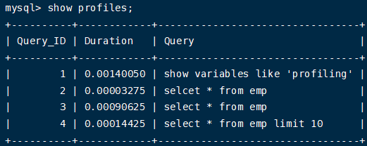

```mysql
-- 3 对应show profiles;查询中的query_id
show profile cpu,block io for query 3;
```

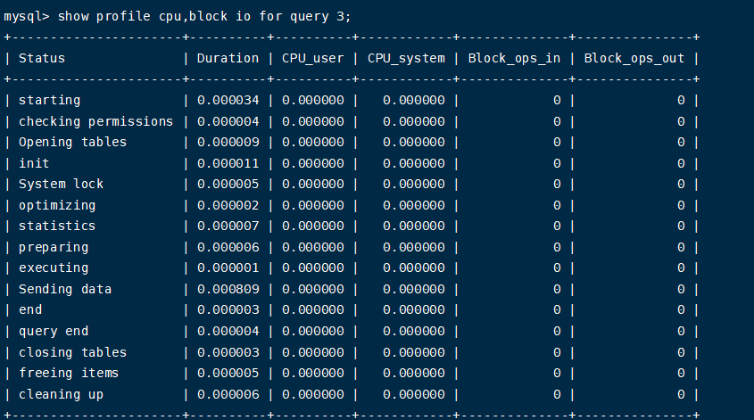

其中show profile后面还可以跟其他的参数：

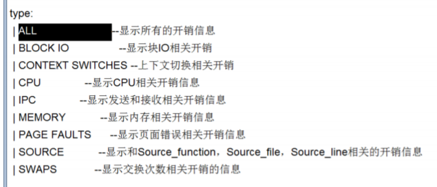

对于上文中查询的结果，我们需要关注那些指标：

+ converting HEAP to MYISAM：查询结果太大，内存不够用了，开始向磁盘上搬了
+ Creating tmp table：创建临时表（拷贝数据到临时表，用完之后再删除）
+ Copying to tmp table on disk （把内存中临时表复制到磁盘上，十分危险！！！）
+ locked

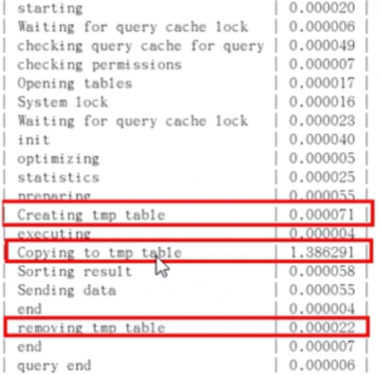

## 5、全局查询日志

生产环境中不要开启这个功能，主要在测试环境中使用。

1、配置启用

在my.cnf文件中，设置如下：

```ini
#开启
general_log=1

#记录日志文件的路径./path/logfile可以设置指定
general_log_file = /path/logfile

#输出格式
log_output=FILE
```

2、编码启用

```mysql
set global general_log=1;
set global log_output = 'TABLE';
```

此后，你所编写的sql语句，将会记录到mysql库里的general_log表中，可以使用下面的命令查看：

```mysql
-- mysql是一个系统的数据库
select * from mysql.general_log;
```

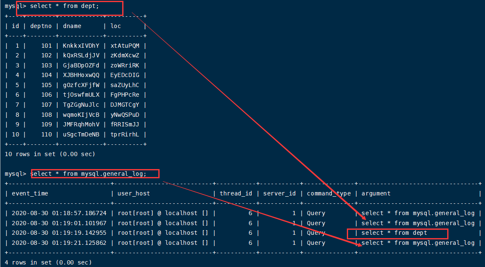

推荐使用show profile。


