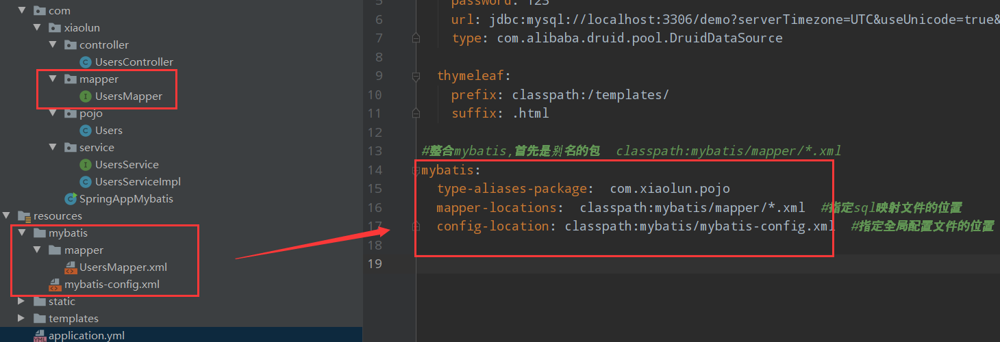
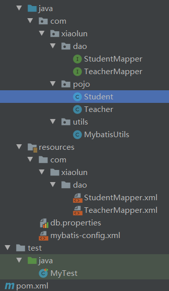
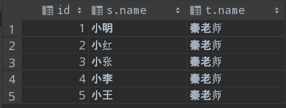
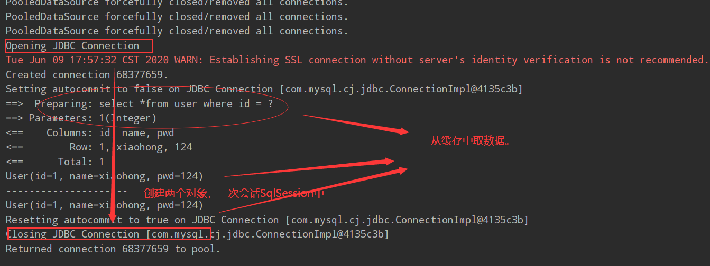
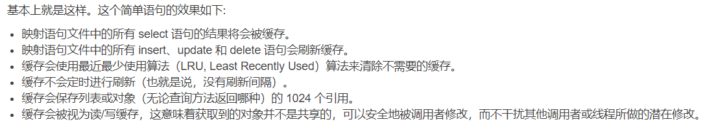
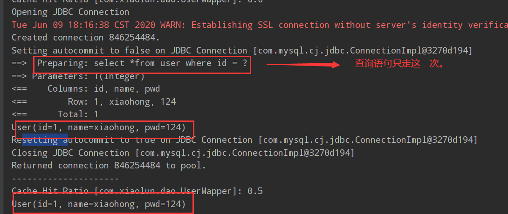
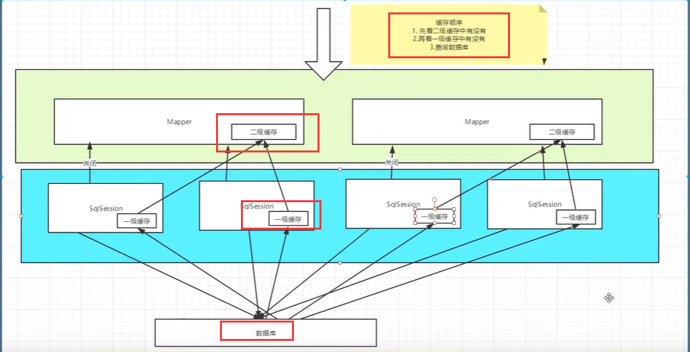

# 1 Spring中的Mybatis开发

官网：https://mybatis.org/mybatis-3/zh/index.html。

## 1.1 使用原生接口

### 1.1.1 新建maven工程

```html
<dependencies>
    <!-- 01启动器依赖 -->
    <dependency>
        <groupId>org.springframework.boot</groupId>
        <artifactId>spring-boot-starter-web</artifactId>
    </dependency>
        <!-- 02MyBatis依赖-->
    <dependency>
        <groupId>org.mybatis.spring.boot</groupId>
        <artifactId>mybatis-spring-boot-starter</artifactId>
        <version>2.1.2</version>
    </dependency>
    <!-- 03sprignboot整合mysql依赖包，数据库驱动 -->
    <dependency>
        <groupId>mysql</groupId>
        <artifactId>mysql-connector-java</artifactId>
        <version>8.0.11</version>
    </dependency>
</dependencies>
```

### 1.1.2 新建数据表

+ DML语句

```sql
CREATE TABLE `t_account` ( 
  `id` int NOT NULL AUTO_INCREMENT,
  `username` varchar(11) NOT NULL,
  `password` varchar(11) NOT NULL,
  `age` int NOT NULL,
  PRIMARY KEY (`id`)
) ENGINE=InnoDB DEFAULT CHARSET=utf8mb4 COLLATE=utf8mb4_0900_ai_ci;
```

### 1.1.3 新建数据表对应的实体类Account

```java
@AllArgsConstructor//自动生成全参数构造函数
@NoArgsConstructor//自动生成无参数构造函数
@Data
public class Account {
    private long id;//int没有添加
    private String username;
    private String password;
    private int age;
}
```

+ 对应得实体类和数据库对应联系起来。
+ `@AllArgsConstructor`表示自动生成全参数构造函数，`@NoArgsConstructor`表示自动生成无参数构造函数，正是加了`“lombok”`依赖的缘故。

### 1.1.4 创建mybatis的配置文件config.xml

```xml
<?xml version="1.0" encoding="UTF-8" ?>
<!DOCTYPE configuration PUBLIC "-//mybatis.org//DTD Config 3.0//EN" "http://mybatis.org/dtd/mybatis-3-config.dtd">
<configuration> <!--根节点-->
    <!--配置MyBatis的运行环境-->
    <environments default="development">
        <environment id="development">  <!--配置多个运行环境-->
            <!--配置JDBC事务管理-->
            <transactionManager type="JDBC"/>
            <!--配置JDBC数据源连接池-->
            <dataSource type="POOLED">
                <property name="driver" value="com.mysql.cj.jdbc.Driver"/>
                <property name="url" value="jdbc:mysql://localhost:3306/mybatis?serverTimezone=UTC&amp;useUnicode=true&amp;characterEncoding=UTF-8"/>
<!--              <property name="url" value="jdbc:mysql://localhost:3306/email?useUnicode=true&amp;characterEncoding=UTF-8" />-->
                <property name="username" value="root"/>
                <property name="password" value="123"/>
            </dataSource>
        </environment>
    </environments>
    <!--所有的Mapper.xml文件都需要到Mybatis中的核心配置文件中注册-->
</configuration>
```

+ config.xml文件名可自定义，<configuration>对应是一个根节点。
+ `“value="jdbc:”`这一句得问号“？”要英文书写，时区`“serverTimezone=UTC”`千万不能不写，`“&amp”`就是“&”得转义字符。
+ 如果mapper.xml文件没有在核心文佳中注册，将会报出下面的错误：

```java
org.apache.ibatis.binding.BindingException: Type interface com.xiaolun.dao.UserDao is not known to the MapperRegistry.
```

### 1.1.5 使用原生接口mapper.xml

```xml
<?xml version="1.0" encoding="UTF-8" ?>
<!DOCTYPE mapper
        PUBLIC "-//mybatis.org//DTD Mapper 3.0//EN"
        "http://mybatis.org/dtd/mybatis-3-mapper.dtd">
<!--namespace表示加载配置该文件的时候，寻找的路径（即当前带着包名的mapper路径,无后缀xml）com/xiaolun/mapper/AccountMapper.xml-->
<mapper namespace="com.xiaolun.mapper.AccountMapper">
        <insert id="save" parameterType="com.xiaolun.mapper.Account">
        insert into (username,password,age) values (#{username},#{password},#{age})
    </insert>
    <!--将下面代码注释-->
    <!--<update id=""></update>
    <delete id=""></delete>
	-->
</mapper>
```

+ `namespace`表示加载配置该文件的时候，寻找的路径（即当前带着包名的mapper路径,无后缀xml），通常设置为文件(xml)所在包`“com.xiaolun.mapper`”+文件名“`AccountMapper”`的形式，后面得“xml”不用带，通过后面得程序发现，这个“`AccountMapper.xml”`文佳扫描不到，需要在pom文件中引入“build”标签，将`“AccountMapper.xml`”扫描到。
+ mapper具有四个不同的标签CURD，分别对应`<insert>、<update> 、<delete>`和`< select>`，其中，id是实际调用mybatis方法时需要用到的参数，parameterType是调用对应方法时参数的数据类型（本文传入得参数对应得是一个实体类对象）。
+ 插入sql语句中`“#{username}”`对应刚好是接口中书写的传入参数传入对象得属性值。
+ 虽说上面得标签“`<update> 、<delete>`”只是书写，但是由于对应了相同得“id”值，在程序运行时，会报错。

### 1.1.6 注册AccountMapper.xml

```html
<mappers>
    <mapper resource="com/xiaolun/mapper/AccountMapper.xml"/>
</mappers>
```

+ 在全局配置文件config.xml中注册AccountMapper.xml。

### 1.1.7 执行添加操作

```java
public class Test {
    public static void main(String[] args) {
        //加载mybatis配置文件(使用类加载器),读取成一个流
        InputStream inputStream = Test.class.getClassLoader().getResourceAsStream("config.xml");
        SqlSessionFactoryBuilder sqlSessionFactoryBuilder = new SqlSessionFactoryBuilder();
        //将inputStream传进去，根据配置文件创建相应的工厂对象
        SqlSessionFactory sqlSessionFactory = sqlSessionFactoryBuilder.build(inputStream);
        SqlSession sqlSession =  sqlSessionFactory.openSession();
        //找到mapper中的插入方法（因为此时配置文件已经加载到环境中了，通过mapper中的id找到）
        String statement = "com.xiaolun.mapper.AccountMapper.save";
        //将参数传进去
        Account account = new Account(1L,"张三","1234",22);
        sqlSession.insert(statement,account);
        sqlSession.commit();//提交事务
    }
```

+ 调用MyBatis原生接口来执行添加操作，对应上面得三个方法。
+ `“com.xiaolun.mapper.AccountMapper.save”`对应`“<mapper namespace="com.xiaolun.mapper.AccountMapper">”+ “<insert>”`标签中的“id=save”得属性。
+ `“Account(1L,"张三","1234",22)”`正是由于实体类“Account”中添加了注解：`@AllArgsConstructor`和`@NoArgsConstructor`的缘故。

**报错解决**

程序执行时会遇到不能读取`java`里面的`xml`文件的错误，此时只能读取`resources`中的xml文件，增加`"<build>"`标签，引入`java`中得`xml`文件：

```html
<build>
    <resources>
        <resource>
            <directory>src/main/java</directory>
            <includes>
                <include>**/*.xml</include>
            </includes>
        </resource>
    </resources>
</build>
```

## 1.2 Mapper代理实现自定义接口

### 1.2.1 自定义接口，定义相关业务方法

```java
public interface AccountRepository {
    int save(Account account);
    int update(Account account);
    int deleteById(Long id);
    List <Account> findAll();
    Account findById(Long id);
}
```

+ 只需要写接口方法，该接口不需要写实现类，而是编写与方法相对应的`Mapper.xml`，定义接口方法对应的SQL语句。`Statement`标签会根据SQL执行的业务选择`“<insert>”`等不同的标签，mybatis框架会根据规则自动创建接口实现类的代理对象。

+ 规则：

`Mapper.xml`中`namespace`此时为接口的全类名，

`Mapper.xml`中的`statemen`t的id为接口对应的方法名，`parameterType`和接口中对应方法的参数类型一致，`resulType`和接口中方法的返回值类型一致。

```html
<?xml version="1.0" encoding="UTF-8" ?>
<!DOCTYPE mapper
        PUBLIC "-//mybatis.org//DTD Mapper 3.0//EN"
        "http://mybatis.org/dtd/mybatis-3-mapper.dtd">
<mapper namespace="com.xiaolun.repository.AccountRepository">
<!--    int save(Account account);-->
<!--    int update(Account account);-->
<!--    int deleteById(Long id);-->
<!--    List <Account> findAll();-->
<!--    Account findById(Long id);-->
    <insert id="save" parameterType="com.xiaolun.entity.Account">
        insert into t_account(username,password,age) values (#{username},#{password},#{age})
    </insert>

    <update id="update" parameterType="com.xiaolun.entity.Account">
        update t_account set username = #{username},password = #{password},age = #{age} where id = #{id}
    </update>

    <delete id="deleteById" parameterType="java.lang.Long">
        delete from t_account where id = #{id}
    </delete>
<!--    resultType返回值类型写泛型-->
    <select id="findAll" resultType="com.xiaolun.entity.Account">
        select *from t_account
    </select>

    <select id="findById" parameterType="java.lang.Long" resultType="com.xiaolun.entity.Account">
        select *from t_account where id = #{id}
    </select>
</mapper>
```

+ 在`"<insert>"`标签中的`resulType`没有值，默认就是“int”类型。xml文件名和接口名要保持一致。虽说一致，但它本质上还是`mapper`文件。

### 1.2.2 在全局文件中注册AccounRespority.xml

```html
<mapper resource="com/xiaolun/repository/AccountRepository.xml"></mapper>
```

+ 此时需要在全局配置文件（config.xml）追加一个标签。

### 1.2.3 调用接口代理对象完成业务操作

```java
public class Test02 {
    public static void main(String[] args) {
        InputStream inputStream = Test02.class.getClassLoader().getResourceAsStream("config.xml");
        SqlSessionFactoryBuilder sqlSessionFactoryBuilder = new SqlSessionFactoryBuilder();
        SqlSessionFactory sqlSessionFactory = sqlSessionFactoryBuilder.build(inputStream);
        SqlSession sqlSession =  sqlSessionFactory.openSession();
        //获取实现接口的代理对象(接口的运行实类传进来)
        AccountRepository accountRepository = sqlSession.getMapper(AccountRepository.class);
//        //添加对象
//        Account account = new Account(1L,"张三","1234",22);
//        int result = accountRepository.save(account); //result结果为1
//       sqlSession.commit();

        //查询对象
//        List<Account> list = accountRepository.findAll();
//        for (Account account1:list) {
//            System.out.println(account1);
//        }
//        sqlSession.close();

//        //通过id查询
//        Account account = accountRepository.findById(3L);
//        System.out.println(account);
//        sqlSession.close();

        //修改对象
//        Account account = accountRepository.findById(3L);
//        System.out.println(account);
//        account.setUsername("小明");
//        account.setPassword("000");
//        account.setAge(18);
//        int result = accountRepository.update(account);
//        sqlSession.commit();
//        System.out.println(account);
//        System.out.println(result);
//        sqlSession.close();

        //通过id删除对象
//        int result = accountRepository.deleteById(3L);
//        System.out.println(result);
//        sqlSession.commit();
//        sqlSession.close();
    }
```

+ 数据有变化（增加，删除，更新），要提交事务`“sqlSession.commit();”`。
+ 删除（更新，查询）操作会有返回值，表示删除的数量。

注：

+ 当将另一个项目中的相同的包复制到该项目下时，会发生找不到相应的包的错误，需要进行更新操作，具体参考解决问题标签（“spring boot”下）。



+ 上面这个图片反映的是`mapper.xml`文佳的位置，以及对应的在properties文件中配置的位置。

## 1.3 mapper.xml讲解

### 1.3.1 statement标签和parameterType

statement标签：select、update、delete、insert。

parameterType：参数数据类型（只能写一个）

1. 基本数据类型：比如通过id查询Account。

```html
<select id="findById" parameterType="long" resultType="com.xiaolun.entity.Account">
    select *from t_account where id = #{id}
</select>
```

+ 类型只是普通的“long”,不同于包装类。

2. 包装类，通过id查询Account。

通过包装类来接收数据，SQL语句同上，此时：`parameterType="java.lang.Long"`，可以处理`null`数据（基本数据类型不能接收`null`）

```java
Long id = Long.parseLong(“1”);//不加“L”
Account account = accountRepository.findById(3L);
System.out.println(account);
```

3. 多个参数，通过属性“username”和“age”来查询

```html
<select id="findByNameAndAge" resultType="com.xiaolun.entity.Account">
   select *from t_account where username = #{param1} and age = #{param2}
 </select>
```

+ 由于传入多个参数，这里将“`parameterType”`不写，同时，两个参数写法为： `“#{param1} and age = #{param2}”`（或`#{arg0} and age = #{ arg1}`）

4. JavaBean作为对象

```html
<update id="update" parameterType="com.xiaolun.entity.Account">
    update t_account set username = #{username},password = #{password},age = #{age} where id = #{id}
</update>
```

## 1.4 结果类型 resultType

### 1.4.1 多对一模型

**描述**

（学生和班级）多对一的关系

#### 1.4.1.1 学生类

```java
@Data // 注解在类上, 为类提供读写属性
public class Student {
    private long id;
    private String name;
    private Classes classes;//班级
}
```

#### 1.4.1.2 班级类

```java
@Data
public class Classes {
    private long id;
    private String name;
    private List<Student> Students; //完成班级和学生关联
}
```

#### 1.4.1.3 测试类

```java
public class Test03 {
    public static void main(String[] args) {
        InputStream inputStream = Test02.class.getClassLoader().getResourceAsStream("config.xml");
        SqlSessionFactoryBuilder sqlSessionFactoryBuilder = new SqlSessionFactoryBuilder();
        SqlSessionFactory sqlSessionFactory = sqlSessionFactoryBuilder.build(inputStream);
        SqlSession sqlSession =  sqlSessionFactory.openSession();
        StudentRespository studentRespository = sqlSession.getMapper(StudentRespository.class);
        System.out.println(studentRespository.findById(1L));
        sqlSession.close();
    }
}
```

#### 1.4.1.4 编写mapper接口

```java
public interface StudentRespository {
    Student findById(long id);
}
```

4.4.1.5 编写mapper.xml映射文件（核心）

```html
<?xml version="1.0" encoding="UTF-8" ?>
<!DOCTYPE mapper
        PUBLIC "-//mybatis.org//DTD Mapper 3.0//EN"
        "http://mybatis.org/dtd/mybatis-3-mapper.dtd">

<mapper namespace="com.xiaolun.repository.StudentRespository">
    <resultMap id="studentMap" type="com.xiaolun.entity.Student">
        <id column="id" property="id"></id>
        <result column="name" property="name"></result>
        <association property="classes" javaType="com.xiaolun.entity.Classes">
            <id column="cid" property="id"></id>
            <result column="cname" property="name"></result>
        </association>
    </resultMap>
    
    <select id="findById" parameterType="long" resultMap="studentMap">
        select s.id,s.name,c.id as cid,c.name as cname from student s,classes c  where (s.id = #{id} and s.cid = c.id);
    </select>
</mapper>
```

+ 当然需要在全局配置文件中注册该文件。

+ 将`”c.id`”和`“c.name”`整合成一个对象，通过间接映射的方式，需要通过“resultMap”属性来解决。其中，外面的`id(resultMap`标签的标识)可以自定义（在`“<select>”`标签中换成`“resultMap="studentMap”`引用）,

  type属性 :返回值的全限定类名。

  `“<association>”`表示一个将两个属性包装的标识，其中的“`id`和`name`属性，是母体`“classes”`本身的属性，

  `javaType`表示映射之后的结果（我们这里是一个`Student`对象），

  `property`：需要映射到`JavaBean` 的属性名称。

  `colume`:数据表的列名或者标签别名(结果集中的字段)。

+ 控制台输出：`Student(id=1, name=张三, classes=Classes(id=2, name=6班, Students=null))。`

注：

+ 在连接好数据库的基础上，点击`Database`中的“`QL”`按钮测试上述`SQL`语句的正确性，然后再使用`Mybastis`进行表格的查询，对比。

+ SQL语句

```sql
select s.id,s.name,c.id from student s,classes c where (s.id = 1 and s.cid = c.id);
```

+ XML文佳中的SQL语句

```xml
<select id="findById" parameterType="long" resultType="com.xiaolun.entity.Student">
    select s.id,s.name,c.id from student s,classes c  where (s.id = #{id} and s.cid = c.id);
</select>
```

+ 在SQL语句测试正确的情况下进行的Mybatis中sql语句的书写，其中传入的参数值`“s.id = #{id}`”我的理解为传入`student`的id属性值。

+ 在SQL语句中“`form`”前加了逗号“，”报错。
+ 上述Mybatis中的查询语句控制台显示结果为：“`Student(id=1, name=张三, classes=null)”`。显然“`classes=null”`是不对的。

这说明`Mybatis`关注结果集和类的映射。即将结果集（正常执行SQL语句时的结果）取出来和`student`的属性进行对比，然后（按照从左向右的顺序）将`s.id`赋值给`students.id,`将`s.name`赋值给`students.id`，但是结果集找不到`students. Classes`这个属性，所以就为`null`。

假如上述查询语句改为：`“select s.id as sid,s.name as sname,c.id,c.name”`时，控制台显示结果为“`Student(id=2, name=6班, classes=null)”。`

### 1.4.2 一对多模型

#### 1.4.2.1 编写ClassesRepository接口

```java
public interface ClassesRepository {
    public Classes findById(long id);
}
```

#### 1.4.2.2 编写ClassesRepository.xml映射文件

```html
<mapper namespace="com.xiaolun.repository.ClassesRepository">
<!--    Classes findById(long id); -->
<!--   classes的cid和cname对应
 -->
    <resultMap id="classesMap" type="com.xiaolun.entity.Classes">
        <id column="cid" property="id"></id>
        <result column="cname" property="name"></result>
<!--    要映射成一个集合：private List<Student> Students;  ofType:结合里面的泛型  -->
        <collection property="Students" ofType="com.xiaolun.entity.Student">
<!--      property="id"为student中的id      -->
            <id column="id" property="id"></id>
            <result column="name" property="name"></result>
        </collection>

    </resultMap>
    <select id="findById" parameterType="long" resultMap="classesMap">
        select s.id,s.name,c.id as cid,c.name as cname from student s,classes c  where (c.id = #{id} and s.cid = c.id);
    </select>
```

+ 当然，要想全局配置文件中注册改xml文件了。
+ 反向的将数据查出来。
+ 返回结果：`“Classes(id=2, name=6班, Students=[Student(id=1, name=张三, classes=null), Student(id=2, name=李四, classes=null), Student(id=3, name=王五, classes=null)]) ”，`可以将“6班”对应的学生全部查出来。

对比：

+ 主要看实体类，如果实体类是一个学生对应一个班级，一个对象我们使用`“<association>”`去映射（使用“`javaType”` ）；如果实体类中是个集合，我们使用`“<collection>”`去映射（使用ofType`）。

### 1.4.3 多对多模型

建立在多对多之上，就两个一对多，形成一个多对多。

实体之间的映射：客户和商品。

#### 1.4.3.1 编写Customer类

```java
@Data
@NoArgsConstructor
@AllArgsConstructor
public class Customer {
    private long id;
    private String name;
    List <Goods> goods;
}
```

#### 1.4.3.2 编写Goods类

```java
@Data
@AllArgsConstructor
@NoArgsConstructor
public class Goods {
    private long id;
    private String name;
    private List<Customer> customers; //商品里有多个客户
}
```

#### 1.4.3.3 CustomerRepository接口

```java
public interface CustomerRepository {
    Customer findById(long id);
}
```

#### 1.4.3.4 GoodsRepository接口

```java
public interface GoodsRepository {
    Goods findById(long id);
}
```

#### 1.4.3.5 CustomerRepository.xml

```html
<?xml version="1.0" encoding="UTF-8" ?>
<!DOCTYPE mapper
        PUBLIC "-//mybatis.org//DTD Mapper 3.0//EN"
        "http://mybatis.org/dtd/mybatis-3-mapper.dtd">
<mapper namespace="com.xiaolun.repository.CustomerRepository">
<!--    Customer findById(long id);-->
    <resultMap id="customerMap" type="com.xiaolun.entity.Customer">
        <id column="cid" property="id"></id>
        <result column="cname" property="name"></result>
<!--    goods为实体类中映射的属性    -->
        <collection property="goods" ofType="com.xiaolun.entity.Goods">
<!--      通过sql语句查询的gid、gname 来 映射goods里面的id和name -->
            <id column="gid" property="id"></id>
            <result column="gname" property="name"></result>
        </collection>
    </resultMap>

    <select id="findById" parameterType="long" resultMap="customerMap">
        select c.id cid,c.name cname,g.id gid,g.name gname from customer c,goods g,customer_goods cg where (c.id = #{id} and cg.cid = c.id and cg.gid = g.id);
    </select>
</mapper>

```

#### 1.4.3.6 GoodsRepository.xml

```html
<?xml version="1.0" encoding="UTF-8" ?>
<!DOCTYPE mapper
        PUBLIC "-//mybatis.org//DTD Mapper 3.0//EN"
        "http://mybatis.org/dtd/mybatis-3-mapper.dtd">
<mapper namespace="com.xiaolun.repository.GoodsRepository">
<!--   现在gid查询 -->
    <!--    Customer findById(long id);-->
    <resultMap id="goodsMap" type="com.xiaolun.entity.Goods">
        <id column="gid" property="id"></id>
        <result column="gname" property="name"></result>
        <!--    goods为实体类中映射的属性    -->
        <collection property="customers" ofType="com.xiaolun.entity.Customer">
            <!--      通过sql语句查询的gid、gname 来 映射goods里面的id和name -->
            <id column="cid" property="id"></id>
            <result column="cname" property="name"></result>
        </collection>
    </resultMap>

    <select id="findById" parameterType="long" resultMap="goodsMap">
        select c.id cid,c.name cname,g.id gid,g.name gname from customer c,goods g,customer_goods cg where (g.id = #{id} and cg.cid = c.id and cg.gid = g.id);
    </select>
</mapper>
```

## 1.5 动态SQL

使用动态SQL可以简化代码的开发，减少开发者的工作量，程序可以自动根据业务参数来决定SQL的组成。

```html
<select id="findByAccount" parameterType="com.xiaolun.entity.Account" resultType="com.xiaolun.entity.Account">
    select *from t_account where id = #{id} and username = #{username} and age = #{age} and password = #{password}
</select>
```

+ 可以发现上面的语句，当`id,username,password`和`age`全部和数据库中的数据相同时，返回值才不为“null”，但是我们如果缺少`“password”`这个属性时，即使数据库中具有除“`password”`属性的记录，查询数据仍然不能匹配，原因是，当去掉某一项数据时，该项的数值变成“`null`”，然后去替换查询语句“”，这样的话，数据库中就没有匹配的值，然后查询结果就是`null`，这是我们不想要的。

1. if标签

```html
<select id="findByAccount" parameterType="com.xiaolun.entity.Account" resultType="com.xiaolun.entity.Account">
    select *from t_account where
    <if test="id != 0">
        id = #{id}
    </if>
    <if test="username != null">
        and username = #{username}
    </if>
    <if test="age != 0">
        and age = #{age}
    </if>
    <if test="password != null">
        and password = #{password}
    </if>
</select>
```

+ if标签可以自动根据表达式的结果决定是否将对应的语句添加到SQL中，如果条件不成立就不添加；反之，就添加。
+ 使用`“where`”和（if标签）`“<if test="condition">”`结合的方法进行查询，这样的话，就可以解决查询过程中某一项属性值缺失的问题。
+ 遇到的问题，当将一条记录的`“id,name,password”`全部进行注释时，会出现SQL语句运行错误的情况，“select `*from t_account where and age = ?`”主要是其中的`“and”`没有去掉。

2. if标签和where标签

```html
<select id="findByAccount" parameterType="com.xiaolun.entity.Account" resultType="com.xiaolun.entity.Account">
    select *from t_account
    <where>
        <if test="id != 0">
            id = #{id}
        </if>
        <if test="username != null">
            and username = #{username}
        </if>
        <if test="age != 0">
            and age = #{age}
        </if>
        <if test="password != null">
            and password = #{password}
        </if>
    </where>
</select>
```

+ `where`标签可以自动判断是否要删除语句块中的“`and`”关键字，如果检测到“`where”和“and`”直接拼接，则自动删除“`and`”。通常情况下，if标签和where标签一起使用。
+ 使用if和where标签，将if标签使用where标签进行包裹，就可以去掉SQL语句中有连接池`“and`”的情况。
+ 遇到的问题：“`Mybatis TooManyResultsException: Expected one result (or null) to be returned by selectOne()”`，我们需要将数据返回类型改成`List`或`Map<String,String>`，以便接受多条返回记录。格式为：

`Map<String,Object> selectUserInfo(User user);`

`List<Map<String,Object>> selectUserInfo(User user);`

3. choose标签和when标签

```html
<select id="findByAccount" parameterType="com.xiaolun.entity.Account" resultType="com.xiaolun.entity.Account">
    select *from t_account
    <where>
        <choose>
            <when test="id != 0">
               id = #{id}
            </when>
            <when  test="username != null">
                and username = #{username}
            </when>
            <when test="age != 0">
                and age = #{age}
            </when>
            <when test="password != null">
                and password = #{password}
            </when>
        </choose>
    </where>
</select>
```

+ choose标签和when标签作用和if和where标签作用类似。

4. trim标签

```html
<select id="findByAccount" parameterType="com.xiaolun.entity.Account" resultType="com.xiaolun.entity.Account">
    select *from t_account
    <trim prefix="where" prefixOverrides="and">
        <if test="id != 0">
            id = #{id}
        </if>
        <if test="username != null">
            and username = #{username}
        </if>
        <if test="age != 0">
            and age = #{age}
        </if>
        <if test="password != null">
            and password = #{password}
        </if>
    </trim>
</select>
```

+ `trim`标签中的`prefix和suffix`属性会被用于生成实际的SQL语句，会和标签内部的语句进行拼接，如果语句前后出现了`prefixOverides`或者`suffixOverrides`属性中指定的值，`Mybatis`框架会自动将其删除。
+ 作用和“`where”`一致，用来出来关键字是否要添加。

+ `“<trim prefix="where" prefixOverrides="and">”` 用来判断`where`是否和`“and`”连接，连接的话，将其删除。

5. Set标签

Set标签用于update操作，会根据参数选择生成SQL语句。

+ 方法1:正常更新语句：

```html
<update id="update" parameterType="com.xiaolun.entity.Account">
    update t_account set username = #{username},password = #{password},age = #{age} where id = #{id}
</update>
```

+ 方法2：set标签

```html
<update id="update" parameterType="com.xiaolun.entity.Account">
    update t_account
    <set>
        <if test="username != null">
            username = #{username}
        </if>
        <if test="password != null">
            password = #{password}
        </if>
        <if test="age != 0">
            age = #{age}
        </if>
    </set>
   where id = #{id}
</update>
```

+ set标签之后只对数据中变化的项进行更新，其他项不进行不动，大大提高效率。

6.  foreach标签

```html
<select id="findByIds" parameterType="com.xiaolun.entity.Account" resultType="com.xiaolun.entity.Account">
        select *from t_account
        <where>
            <foreach collection="ids" open="id in(" close=")" item="id" separator=",">
                id = #{id}
            </foreach>
        </where>
</select>
```

+ foreach标签可以迭代生成一系列值，这个标签主要用于SQL的`in`语句。

+ 属性值：

  `item`表示集合中每一个元素进行迭代时的别名，`open`表示该语句以什么开始，`close`表示以什么结束，`separator`表示在每次进行迭代之间以什么符号作为分隔符。

+ 如果传入的是单参数且参数类型是一个List的时候，`collection`属性值为`list`。还有一种作为参数对象的某个字段的时候，例子： 如果`User`有属性`List ids`。入参是`User`对象，那么这个`collection = "ids`"。

## 1.6 Spring Boot整合MyBatis（Eclipse版本）

需求分析;通过使用Spring + SpringMVC + MyBatis整合实现一个对数据库的user表的CRUD的操作。

### 1.6.1 创建项目

#### 1.6.1.1 添加依赖

```html
<!-- 03MyBatis依赖,缺少版本会报错 -->
	<dependency>
		<groupId>org.mybatis.spring.boot</groupId>
		<artifactId>mybatis-spring-boot-starter</artifactId>
						<version>1.3.1</version>
	</dependency>		
<!-- 04sprignboot整合mysql依赖包，数据库驱动 -->
		<dependency>
			<groupId>mysql</groupId>
			<artifactId>mysql-connector-java</artifactId>
			<version>5.1.34</version><!--$NO-MVN-MAN-VER$-->
		</dependency>
<!-- 05alibaba的druid数据库连接池,要制定版本-->
		<dependency>
			<groupId>com.alibaba</groupId>
			<artifactId>druid</artifactId>
			<version>1.1.0</version>
		</dependency>
<!-- 06SpringBooT整合Thymeleaf依赖 -->
		<dependency>
			<groupId>org.springframework.boot</groupId>
			<artifactId>spring-boot-starter-thymeleaf</artifactId>
		</dependency>
```

+ 整合了MyBatis依赖，mysql依赖，druid依赖和Thymeleaf依赖，由于缺少Thymeleaf依赖，导致项目无法进行地址的跳转。

#### 1.6.1.2 修改yml文件

```yaml
#数据源配置
spring:
  datasource:
    driver-class-name: com.mysql.jdbc.Driver
    username: root
    password: 123
    url: jdbc:mysql://localhost:3306/demo
	type: com.alibaba.druid.pool.DruidDataSource
#包名的更改
mybatis:
	type-aliases-package:  com.qianfeng.pojo
```

+ `com.alibaba.druid.pool.DruidDataSource`路径：`druid-1.1.0.jar->com.alibaba.druid.pool->DruidDataSource`

#### 1.6.1.3 数据库表设计

```sql
CREATE TABLE "persondemo2" (
  "id" int(11) NOT NULL AUTO_INCREMENT,
  "name" varchar(255) COLLATE utf8_unicode_ci DEFAULT NULL,
  "age" int(11) DEFAULT NULL,
  PRIMARY KEY ("id")
) ENGINE=InnoDB AUTO_INCREMENT=4 DEFAULT CHARSET=utf8 COLLATE=utf8_unicode_ci;
```

#### 1.6.1.4 添加用户

##### 1.6.1.4.1 创建实体类Users 

```java
public class Users {
	private Integer id;
	private String name;
	private Integer age;
	public Integer getId() {
		return id;
	}
	public void setId(Integer id) {
		this.id = id;
	}
	public String getName() {
		return name;
	}
	public void setName(String name) {		this.name = name;
	}
	public Integer getAge() {
		return age;
	}
	public void setAge(Integer age) {
		this.age = age;
	}	
}
```

##### 1.6.1.4.2 创建mapper接口

```java
import com.qianfeng.pojo.Users;
public interface UsersMapper {	
	void insertUser(Users users);
}
```

+ 使用 mapper 接口来加载映射文件UsersMapper.xml。

##### 1.6.1.4.3 创建mapper映射文件

```xml
<?xml version="1.0" encoding="UTF-8"?>
<!DOCTYPE mapper
PUBLIC "-//mybatis.org//DTD Mapper 3.0//EN"
"http://mybatis.org/dtd/mybatis-3-mapper.dtd">
<mapper namespace="com.qianfeng.mapper.UsersMapper">
		<insert
				id="insertUser"
				parameterType="users">
		insert into users(name,sex,birthday)values(#{name},#{sex},#{birthday})
		</insert>
</mapper>
```

+ `parameterType="users":`由于在`application.yml`文件中指定了包名`（mybatis.type-aliases-package: com.qianfeng.pojo）`，这里只需要写形参即可，不需要加包名，如果没加包名的话，`parameterType="com.qianfeng.pojo.Users"。`
+ mapper接口名称和映射文件名称要一致，否则会找不到对应的映射文件。
+ `namespace`：该映射所属的命名空间，一个命名空间（对应一个dao接口)。
+ id：命名空间下的唯一标识，也对应dao里面的某个方法（相当于方法的实现），因此id 应该与方法名一致。
+ `parameterType`：传入该SQL语句的参数类型，可接收的类型有简单类型，pojo类型，map 类型等。

##### 1.6.1.4.4 创建业务层service

```java
@Service
@Transactional//事务
public class UsersServiceImpl implements UsersService {
	@Autowired//注入mapper接口
	private UsersMapper usersMapper;
	
	@Override
	public void addUser(Users users) {
		this.usersMapper.insertUser(users);
	}
}
```

##### 1.6.1.4.5 创建controller

```java
@Controller
@RequestMapping("/users")
public class UsersController {
	@Autowired
	private UsersService usersService;
	//页面跳转
	@RequestMapping("/{page}")
	public String showPage(@PathVariable String page) {
	return page;
	}
	//添加用户
	@RequestMapping("/addUsers")
	public String addUsers(Users users) {//调用业务层对象
		this.usersService.addUser(users);
		return "ok";
	}	
}
```

+ 我们首先考虑需求，用户首先进入的页面是填入数据，我们拿到用户的数据，进入页面的跳转，然后将数据放到数据库，以实现用户的添加。
+ 输入网址：http://localhost:8080/users/input，网址中有一个“users”主要是在该类上有个@RequestMapping("/users")注解，改变了地址。
+ 跳转地址为:http://localhost:8080/users/addUsers，完成界面返回“操作完成！”字样。

##### 1.6.1.4.6 编写页面

+ 添加用户界面

```html
<!DOCTYPE html>
<html>
<head>
<meta charset="UTF-8">
<title>添加用户</title>
</head>
<body>
    	<!--完成界面的跳转-->
	<form th:action="@{/users/addUsers}" method="post">
		用户姓名：
		<input type="text" name="name" />
		<br />
		用户年龄：
		<input type="text" name="age" />
		<br />
		<input type="submit" value="确认" />
		<br />
	</form>
</body>
</html>
```

+ 操作成功界面

```html
<!DOCTYPE html>
<html>
<head>
<meta charset="UTF-8">
<title>操作提示页面</title>
</head>
<body>
	操作成功!
</body>
</html>
```

##### 1.6.1.4.7 创建启动类

```java
@Spring BootApplication
@MapperScan("com.qianfeng.mapper") 
public class SpringAppMybatis {
	public static void main(String[] args) {
		SpringApplication.run(SpringAppMybatis.class, args);
	}
}
```

+ `@MapperScan("com.qianfeng.mapper")` 告诉Spring Boot，用于扫描MyBatis的`mapper`接口。

#### 1.6.1.5 查询用户界面

##### 1.6.1.5.1 mapper接口中添加方法

```java
List<Users> selectUsersAll();//查询用户
```

+ mapper.xml中添加sql语句

```html
<!-- 查找用户 -->
<select id="selectUsersAll" resultType="users">
		     select id,name,age frome users 
</select>
```

##### 1.6.1.5.2 业务层中添加查询方法

```java
@Override
public List<Users> findUsersAll() {//查询用户
    return this.usersMapper.selectUsersAll();
}
```

##### 1.6.1.5.3  controller中添加方法

```java
//查询全部用户
@RequestMapping("/findUserAll")
public String findUserAll(Model model) {
    List<Users> list = 			 this.usersService.findUsersAll();
    model.addAttribute("list",list);
    return "showUsers";
}
```

+ 跳转到showUsers.html文件中展示。

##### 1.6.1.5.4 添加页面

```html
<!DOCTYPE html>
<html>
<head>
<meta charset="UTF-8">
<title>Insert title here</title>
</head>
<body>
	<table border="1" style="width:300px;">
		<tr>
			<th>用户ID</th>
			<th>用户姓名</th>
			<th>用户年龄</th>
		</tr>
		<tr>
<tr th:each = "user : ${list}">
			<td th:text="${user.id}"></td>
			<td th:text="${user.name}"></td>
			<td th:text="${user.age}"></td>
		</tr>
		</table>
</body>
</html>
```

+ 遍历输出访问数据库的结果。

#### 1.6.1.6 用户更新-数据回显

主要是更新用户之前的查询，并将数据在页面中回显。

##### 1.6.1.6.1 mapper接口添加方法

```java
Users selectUsersById(Integer id); //根据id查询用户
```

+ mapper.xml中添加sql语句

```html
<!-- 根据Id查找用户 -->
<select
	id="selectUsersById"
	resultType="users">
	select (id,name,age) from persondemo2 where id = #{value}
</select>
```

##### 1.6.1.6.2  业务层中添加查询方法

```java
@Override
public Users findUserById(Integer id) {//根据id查询用户
		return this.usersMapper.selectUsersById(id);

```

##### 1.6.1.6.3 controller中添加方法

```java
//根据Id查询全部用户
@RequestMapping("/findUserById")
public String findUserById(Integer id,Model model) {
    Users user = this.usersService.findUserById(id);
    model.addAttribute("user",user);
    return "updateUser";
}
```

添加页面updateUser.html

```html
<!DOCTYPE html>
<html>
<head>
<meta charset="UTF-8">
<title>Insert title here</title>
</head>
<body>
<!-- 页面更新之前的 -->
	<form th:action="@{/users/editUser}" method="post">
		<input type="hidden" name = "id" th:field = "${user.id}">
		用户姓名：
		<input type="text" name="name" th:field = "${user.name}"/>
		<br />
		用户年龄：
		<input type="text" name="age" th:field = "${user.age}"/>
		<br />
		<input type="submit" value="确认" />
		<br />
	</form>
</body>
</html>
```

+ 这是页面更新之前的页面显示。

##### 1.6.1.6.4 修改showUsers.html界面

```html
<!DOCTYPE html>
<html>
<head>
<meta charset="UTF-8">
<title>展示用户更新</title>
</head>
<body>
	<table border="1" style="width: 300px;">
		<tr>
			<th>用户ID</th>
			<th>用户姓名</th>
			<th>用户年龄</th>
			<th>操作</th>
		</tr>
			<tr th:each="user : ${list}">
			<td th:text="${user.id}"></td>
			<td th:text="${user.name}"></td>
			<td th:text="${user.age}"></td>
			<td >  
		<a th:href = "@{/users/findUserById(id= ${user.id})}">更新用户</a>
			</td>
		</tr>
	</table>
</body>
</html>
```

+ 网址书写`"<tr th:each="user : ${list}">"`，控制台报错而找不到user。
+ 网址输入:http://localhost:8080/users/findUserAll,弹出这个数据库里面的数据。

#### 1.6.1.7 用户更新-数据更新

##### 1.6.1.7.1 mapper接口添加方法

```java
void updateUser(Users users);  //用于数据更新
```

+ mapper.xml中添加sql语句

```html
<!-- 数据更新 -->
<update
            id="updateUser"
            parameterType="users">
update persondemo2 set name = #{name},age = #{age} where id = #{id}
</update>
```

##### 1.6.1.7.2 业务层中添加方法

```java
@Override
public void updateUser(Users users) {
    this.usersMapper.updateUser(users);
}
```

##### 1.6.1.7.3 controller中添加方法

```java
// 更新用户
@RequestMapping("/editUser")
public String editUser(Users users) {
this.usersService.updateUser(users);
return "ok"; //返回成功界面
}
```

#### 1.6.1.8 删除用户

##### 1.6.1.8.1 mapper接口添加方法

```java
void deleteUserById(Integer id);//用户删除
```

+ mapper.xml中添加sql语句

```html
<!-- 数据删除 -->
<delete id="deleteUserById">
	delete from persondemo2  where id = #{value}
</delete>

```

+ persondemo2是demo2对应的表，写错时会报错。

##### 1.6.1.8.2 业务层中添加方法

```java
@Override
public void deleteUserById(Integer id) {//删除数据
    this.usersMapper.deleteUserById(id);
}
```

##### 1.6.1.8.3 controller中添加方法

```java
// 删除用户
@RequestMapping("/delUser")
public String delUser(Integer id) {
this.usersService.deleteUserById(id);
return "redirect:/users/findUserAll"; //跳转到查询页面
}
```

+ 删除数据之后，我们怎么办，选择1：跳转到成功页面，选择2：在查询操作页面，增加一个“删除操作”，删除后操作又重新返回这个页面。
+ `return "redirect:/users/findUserAll"` :跳转到查询页面,之前是跳转到`redirect:/users/findUserById`报错

##### 1.6.1.8.4 修改页面showUsers.html

```html
<!DOCTYPE html>
<html>
<head>
<meta charset="UTF-8">
<title>展示用户更新</title>
</head>
<body>
	<table border="1" style="width: 500px;">
		<tr>
			<th>用户ID</th>
			<th>用户姓名</th>
			<th>用户年龄</th>
			<th>操作</th>
		</tr>
			<tr th:each="user : ${list}">
			<td th:text="${user.id}"></td>
			<td th:text="${user.name}"></td>
			<td th:text="${user.age}"></td>
			<td >  
		<a th:href = "@{/users/findUserById(id= ${user.id})}">更新用户</a>
		<a th:href = "@{/users/delUser(id= ${user.id})}">删除用户</a>
			</td>
		</tr>
	</table>
</body>
</html>
```

# 2 狂神说拓展

## 2.1 第一个Mybatis程序

```yaml
#SpringBoot中需要在全局配置文件中，可以为映射文件添加别名。
mybatis:   
	type-aliases-package: com.xiaolun.pojo
	mapper-locations:   classpath:mybatis/mapper/*.xml  #指定SQL映射文件的位置
	#指定全局配置文件的位置（不然会报错）
	config-location:    classpath`:mybatis/mybatis-config.xml 
```

### 2.1.1 配置

1. **导入依赖**

```java
<dependencies>
        <!--01mysql驱动-->
        <dependency>
            <groupId>mysql</groupId>
            <artifactId>mysql-connector-java</artifactId>
            <version>8.0.11</version>
        </dependency>

        <!--02mybatis驱动-->
        <dependency>
            <groupId>org.mybatis</groupId>
            <artifactId>mybatis</artifactId>
            <version>3.5.2</version>
        </dependency>

        <dependency>
            <groupId>junit</groupId>
            <artifactId>junit</artifactId>
            <version>4.13</version>
        </dependency>
    
    	<!--04 lombok-->
        <dependency>
            <groupId>org.projectlombok</groupId>
            <artifactId>lombok</artifactId>
            <version>1.18.12</version>
        </dependency>
    </dependencies>
 </dependencies>
```

2. **编写mybatis工具类**

```java
//sqlSessionFactory --> sqlSession
public class MybatisUtils {

    private static SqlSessionFactory sqlSessionFactory;

    static {
        try {
            //使用mybatis获取sqlSessionFactory对象
            String resource = "mybatis-config.xml";
            InputStream inputStream = Resources.getResourceAsStream(resource);
            sqlSessionFactory = new SqlSessionFactoryBuilder().build(inputStream);
        } catch (IOException e) {
            e.printStackTrace();
        }
    }

    /**
     * 既然有了 SqlSessionFactory，我们可以从中获得 SqlSession 的实例。
     * SqlSession 提供了在数据库执行 SQL 命令所需的所有方法。
     */
    public static SqlSession getSqlSession(){
        return sqlSessionFactory.openSession();
    }
}
```

3. **编写mybatis-config.xml配置文件**

```xml
<?xml version="1.0" encoding="UTF-8" ?>
<!DOCTYPE configuration
        PUBLIC "-//mybatis.org//DTD Config 3.0//EN"
        "http://mybatis.org/dtd/mybatis-3-config.dtd">

<configuration>
    <environments default="development">
        <environment id="development">
            <transactionManager type="JDBC"/>
            <dataSource type="POOLED">
                <property name="driver" value="com.mysql.cj.jdbc.Driver"/>
                <property name="url" value="jdbc:mysql://localhost:3306/mybatis?serverTimezone=UTC&amp;useUnicode=true&amp;characterEncoding=UTF-8"/>
                <property name="username" value="root"/>
                <property name="password" value="123"/>
            </dataSource>
        </environment>
    </environments>
  <mappers>
        <mapper resource="com/xiaolun/dao/UserDaoMapper.xml"/>
    </mappers>
</configuration>
```

+ 在 < environments>中假如再添加一套环境 < environment>,比如

   `< environment id="test">`我们只需要写成 `< environments id="test">`，即将环境切换即可。

4. **数据库**

```sql
REATE TABLE `user` (
  `id` int NOT NULL AUTO_INCREMENT,
  `name` varchar(20) DEFAULT NULL,
  `pwd` varchar(20) DEFAULT NULL,
  PRIMARY KEY (`id`)
) ENGINE=InnoDB AUTO_INCREMENT=3 DEFAULT CHARSET=utf8mb4 COLLATE=utf8mb4_0900_ai_ci;
```

### 2.1.2 编写代码

1. **实体类**

```java
@Data
@NoArgsConstructor
@AllArgsConstructor
public class User {
    private int id;
    private String name;
    /**
    1、这里的属性需要和数据库中的关键字一致，不然对应的这一项为null/0。
    2、属性名不区分大小写，可以和数据库中数据匹配。
    **/
    private String pwd;
}
```

2. **Dao接口**

```java
public interface UserDao {
    List <User> getUserList();
      List<User> getUserLike(String value); //模糊查询，通配符
    
    int addUser(User user); //增加用户
    int addUser2(Map<String,Object> map); //使用Map来执行添加
}
```

3. **mapper.xml文件实现接口**

```java
<?xml version="1.0" encoding="UTF-8" ?>
<!DOCTYPE mapper
        PUBLIC "-//mybatis.org//DTD Mapper 3.0//EN"
        "http://mybatis.org/dtd/mybatis-3-mapper.dtd">

<!--namespace绑定一个对应的Dao/mapper接口-->
<mapper namespace="com.xiaolun.dao.UserDao">
    <select id="getUserList" resultType="com.xiaolun.pojo.User">
    select * from user
  </select>
    
     <!--模糊查询-->
    <select id="getUserLike" resultType="com.xiaolun.pojo.User">
    select * from user where name like  #{value}
  </select>
    
     <insert id="addUser" parameterType="com.xiaolun.pojo.User">
    <!--在测试中使用这个语句mapper.addUser(new User(3, "black", "123"));，构造语句中添加id属性不会报错-->
    insert into user(name,pwd) values(#{name},#{pwd})
  </insert>
    
       <!-- Map插入（对象中的属性，可以直接取出来）
    #{userName}传入的是map的key值-->
    <insert id="addUser2" parameterType="map">
    insert into user(name,pwd) values(#{userName},#{userPwd})
  </insert>
</mapper>
```

+ 由原来的`UserDaoImpl`实现类转变为一个`Mapper`配置文件。
+  在insert语句，后端代码实现过程中，传入的是一个User对象，xml文件能够自动获取User对象中属性的值（一一对应），然后执行插入操作。
+ **万能Map**:假如我们的实体类或者说数据库中的表，字段或者参数太多，我们可以考虑使用Map（将对象中的某一部分属性给提取出来）。
+ 在后端代码测试类中，使用通配符实现模糊查询
+ `UserDaoImpl`实现类代码如下：

```java
//在这里我们要引用大量重复的JDBC的代码，现在我们使用xml配置文件将这部分给省略掉。
public class UserDaoImpl implements UserDao {
    public List<User> getUserList() {

        //执行sql 和xml文件中的select查询语句对应
        String sql = " select * from user";
        return null;
    }
}
```

4. **测试类**

```java
public class UserDaoTest {

    @Test //查找用户
    public void test(){

        //第一步：获取sqlSession对象
        SqlSession sqlSession = MybatisUtils.getSqlSession();

        //执行sql (面向接口编程，传入参数是接口类)
        UserDao mapper = sqlSession.getMapper(UserDao.class);
        List<User> userList = mapper.getUserList();
        for (User user:userList) {
            System.out.println(user);
        }

        //关闭sqlSession
        sqlSession.close();
    }
    
      @Test //查询用户
    public void getUserLike(){

        //第一步：获取sqlSession对象
        SqlSession sqlSession = MybatisUtils.getSqlSession();

        //执行sql (面向接口编程，传入参数是接口类)
        UserDao mapper = sqlSession.getMapper(UserDao.class);
        //将名字中有姓李的查出来（模糊查询）
        List<User> userList = mapper.getUserLike("%李%");
        for (User user:userList) {
            System.out.println(user);
        }
        //关闭sqlSession
        sqlSession.close();
    }
    
    
     @Test //增加用户
    public void addtest(){

        //第一步：获取sqlSession对象
        SqlSession sqlSession = MybatisUtils.getSqlSession();

        //执行sql (面向接口编程，传入参数是接口类)
        UserDao mapper = sqlSession.getMapper(UserDao.class);
        mapper.addUser(new User(3, "black", "123"));

        //增删改操作需要提交事务（十分重要，否则会导致操作失败）
        sqlSession.commit();
        //关闭sqlSession
        sqlSession.close();
    }
    
     @Test //Map增加用户
    public void addtestMap(){

        //第一步：获取sqlSession对象
        SqlSession sqlSession = MybatisUtils.getSqlSession();

        //执行sql (面向接口编程，传入参数是接口类)
        UserDao mapper = sqlSession.getMapper(UserDao.class);
        Map<String,Object> map = new HashMap<String, Object>();
        map.put("userName", "phone");
        map.put("userPwd", "123");
        mapper.addUser2(map);

        //增删改需要提交事务
        sqlSession.commit();
        //关闭sqlSession
        sqlSession.close();
    }
}
```

+ 控制台输出

```java
//查找用户输出
User(id=1, name=xiaohong, pwd=124)
User(id=2, name=lkl, pwd=12)
```

**解决问题**

```java
//控制台输出报错信息：
java.lang.ExceptionInInitializerError
 Cause: java.io.IOException: Could not find resource com/xiaolun/dao/UserDaoMapper.xml
```

这主要是因为`maven`中由于约定大于配置，我们书写的配置文件可能会出现无法导出的问题，我们需要在`pom.xml`的`bulid`中配置`resources`，来防止我们的资源导出失败的问题。

```html
//需要在pom.xml文件中添加下面的代码
<build>
        <resources>
            <resource>
                <directory>src/main/resources</directory>
                <includes>
                    <include>**/*.properties</include>
                    <include>**/*.xml</include>
                </includes>
                <filtering>true</filtering>
            </resource>

            <resource>
                <directory>src/main/java</directory>
                <includes>
                    <include>**/*.properties</include>
                    <include>**/*.xml</include>
                </includes>
                <filtering>true</filtering>
            </resource>
        </resources>
    </build>
```

**总结**

模糊查询

1. Java代码执行的时候，传递统配符% %

```java
 List<User> userList = mapper.getUserLike("%李%");
```

2. 在XML文件的sql中拼接使用通配符，后端java正常传参数就可以。

```sql
select * from user where name like  "%"#{value}"%"
```

### 2.1.3 配置文件

#### 2.1.3.1 属性优化

属性（properties）可以在外部进行配置，并可以进行动态替换。你既可以在典型的 Java 属性文件中配置这些属性，也可以在 properties 元素的子元素中设置。

1. **创建db.properties文件**

```properties
driver = com.mysql.cj.jdbc.Driver
url =  jdbc:mysql://localhost:3306/mybatis?serverTimezone=Asia/Shanghai & useUnicode=true & characterEncoding=UTF-8
username = root
password = 123
```

+ 在resources目录下。

2. **在mybatis-config.xml中进行引用**

```xml
<configuration>
    <!--引入外部配置文件-->
    <properties resource="db.properties">
        <!-- 属性也可以在这里写，.properties文件中属性优先级高 -->
<!--        <property name="username" value="dev_user"/>-->
<!--        <property name="password" value="F2Fa3!33TYyg"/>-->
    </properties>

    <environments default="development">
        <environment id="development">
            <transactionManager type="JDBC"/>
            <dataSource type="POOLED">
                <property name="driver" value="${driver}"/>
                <property name="url" value="${url}"/>
                <property name="username" value="${username}"/>
                <property name="password" value="${password}"/>
            </dataSource>
        </environment>
    </environments>
```

+ 注意< properties>文件的加载顺序。

#### 2.1.3.2 resultMap结果集映射

`resultMap` 元素是 MyBatis 中最重要最强大的元素。ResultMap 的设计思想是，对简单的语句做到零配置，对于复杂一点的语句，只需要描述语句之间的关系就行了。主要是解决Java代码中的实体类和数据库中字段不一致的问题。

```java
pwd; //数据库字段
private String password; //Java属性
```

```xml
<mapper namespace="com.xiaolun.dao.UserDao">
    <resultMap id="userMap" type="com.xiaolun.pojo.User">
<!-- column:对应数据库中的字段，property对应实体类中的属性 -->
<!--  相同的字段就不用映射了-->
<!--      <result column="id" property="id"></result>-->
<!--      <result column="name" property="name"></result>-->
      <result column="pwd" property="password"></result>
    </resultMap>

    <select id="getUserById" resultMap="userMap">
    select * from user where id = #{id}
  </select>
</mapper>
```

## 2.2 拓展

**lombok使用方法**

1. 在IDEA中安装Lombok插件。
2. 在项目中导入Lombok的jar包。
3. 在实体类中加注解。

### 2.2.1 日志工厂

如果数据库操作出现了异常，可以使用日志进行排错。

我们需要在核心文件mybatis-config.xml中进行配置我们的日志。

```xml
    <settings>
        <!--标准的日志工厂实现-->
        <setting name="logImpl" value="STDOUT_LOGGING"/>
    </settings>
```

## 2.3 分页

### 2.3.1  Limit方式实现

1. **接口**

```java
    //分页
    List<User> getUserByLimit(Map<String,Integer> map);
```

2. **XML文件配置**

```xml
<!--分页-->
    <select id="getUserByLimit" parameterType="map" resultType="com.xiaolun.pojo.User" >
    select * from user limit #{startIndex},#{pageSize}
  </select>
```

3. **测试**

```java
@Test //分页
    public void getUserByLimit(){

        SqlSession sqlSession = MybatisUtils.getSqlSession();

        UserDao mapper = sqlSession.getMapper(UserDao.class);
        Map<String, Integer> map = new HashMap<String, Integer>();
        map.put("startIndex",0);
        map.put("pageSize",2);
        List<User> userByLimit = mapper.getUserByLimit(map);

        for (User user:userByLimit) {
            System.out.println(user);
        }
        //关闭sqlSession
        sqlSession.close();
    }
```

### 2.3.2 RowBound方式实现

1. **接口**

```java
List<User> getUserByRowBounds(); //将所有的数据查出来
```

2. **XML文件配置**

```xml
    <!--分页方式2-->
    <select id="getUserByRowBounds" resultType="com.xiaolun.pojo.User" >
    select * from user
  </select>
```

3.**测试**

```java
 @Test //分页2
    public void getUserByRowBounds(){

        SqlSession sqlSession = MybatisUtils.getSqlSession();
        //RowBounds实现
        RowBounds rowBounds = new RowBounds(1, 2);
        //通过java代码来实现分页
        //com.xiaolun.dao.UserDao.getUserByRowBounds = 接口全路径 + 方法
        // UserDao要大写
        List<User> userList = sqlSession.selectList("com.xiaolun.dao.UserDao.getUserByRowBounds", null, rowBounds);
        for (User user:userList) {
            System.out.println(user);
        }
        //关闭sqlSession
        sqlSession.close();
    }
```

+ 遇到的错误

```java
Mapped Statements collection does not contain value for com.xiaolun.dao.userDao.getUserByRowBounds
```

**拓展**

可以使用MyBatis 分页插件 PageHelper来实现分页。

参考官网：https://pagehelper.github.io/

## 2.4 动态SQL-foreach

1. **接口**

```java
//查询id= （1/2/3）中的用户
    List<User> queryForeach( Map<String, List<Integer>> map);
```

2. **XML文件配置**

```XML
<!--select * from user where (id = 1 or id = 2 or id = 3)-->
    <select id="queryForeach" parameterType="map" resultType="com.xiaolun.pojo.User">
        select * from user
        <where>
            <foreach collection="ids" item="id" separator="or" open="(" close=")">
                id = #{id}
            </foreach>
        </where>
    </select>
```

3. **测试**

```java
 @Test //测试foreach标签
    public void queryForeach(){

        SqlSession sqlSession = MybatisUtils.getSqlSession();

        UserDao mapper = sqlSession.getMapper(UserDao.class);
        Map<String, List<Integer>> map = new HashMap<String, List<Integer>>();
        List<Integer> ids = new ArrayList<Integer>();

        ids.add(1);
        ids.add(2);
        ids.add(3);
        map.put("ids", ids);

        List<User> userList = mapper.queryForeach(map);

        for (User user:userList) {
            System.out.println(user);
        }

        sqlSession.close();
    }
```

+ 控制台可以将id属于（1，2，3）范围i中的用户查找出来。

# 3 复杂环境

## 3.1 复杂环境搭建

**描述**

多个学生，对应一个老师。对于学生而言，**关联**一个老师；对于老师而言，**集合**（下面有多个学生）。

1. **创建数据表**

```sql
-- 创建学生表student
DROP TABLE IF EXISTS `student`; 
CREATE TABLE `student` (
  `id` int NOT NULL AUTO_INCREMENT,
  `name` varchar(30) DEFAULT NULL,
  `tid` int DEFAULT NULL,
  PRIMARY KEY (`id`),
  KEY `fktid` (`tid`),
  CONSTRAINT `fktid` FOREIGN KEY (`tid`) REFERENCES `teacher` (`id`)
) ENGINE=InnoDB AUTO_INCREMENT=6 DEFAULT CHARSET=utf8mb4 COLLATE=utf8mb4_0900_ai_ci;

-- ----------------------------
-- Records of student
-- ----------------------------
INSERT INTO `student` VALUES ('1', '小明', '1');
INSERT INTO `student` VALUES ('2', '小红', '1');
INSERT INTO `student` VALUES ('3', '小张', '1');
INSERT INTO `student` VALUES ('4', '小李', '1');
INSERT INTO `student` VALUES ('5', '小王', '1');

-- 创建老师表teacher
DROP TABLE IF EXISTS `teacher`;
CREATE TABLE `teacher` (
  `id` int NOT NULL AUTO_INCREMENT,
  `name` varchar(30) DEFAULT NULL,
  PRIMARY KEY (`id`)
) ENGINE=InnoDB AUTO_INCREMENT=2 DEFAULT CHARSET=utf8mb4 COLLATE=utf8mb4_0900_ai_ci;

-- ----------------------------
-- Records of teacher
-- ----------------------------
INSERT INTO `teacher` VALUES ('1', '秦老师');
```

之后对搭建的环境进行测试，使得环境中的老师或者学生表中数据能够正常显示，然后我们才可以进行下面的操作。

工具类`Utils`中的`MybatisUtils`类要添加上，这里不再赘述。

**项目整体结构**



## 3.2 多对一的处理

**描述**

从学生表中查询老师的信息。使用的sql语句为

```sql
select s.id,s.name,t.name  from student s,teacher t where s.tid = t.id;
```

使用sql命令后的控制台结果：



1. **创建实体类**

```java
@Data //学生类
public class Student {
    private int id;
    private String name;

    /**
     *    private int tid; //不能这样写，体现不出多对一的关系
     *    学生需要关联一个老师。（按照下面的格式书写，学生（存在这个属性）有个对象叫老师）
      */
    private Teacher teacher;
}
```

```java
@Data //教师类
public class Teacher {
    private int id;
    private String name;
}
```

2. **创建接口**

```java
public interface StudentMapper { //学生接口
    //查询所有的学生信息，以及对应的老师信息
    List<Student> getStudent();
}
```

```java
public interface TeacherMapper { //老师接口

    @Select("select * from teacher where id = #{tid}")
    Teacher getTeacher(@Param("tid") int id);
}
```

+ 上面注解书写查询语句的目的是为了在测试类中查看搭建的环境是否正常。本程序目前是测试学生接口`StudentMapper`。

3. **核心配置类**

```java
<?xml version="1.0" encoding="UTF-8" ?>
<!DOCTYPE configuration
        PUBLIC "-//mybatis.org//DTD Config 3.0//EN"
        "http://mybatis.org/dtd/mybatis-3-config.dtd">

<configuration>
    <!--引入外部配置文件-->
    <properties resource="db.properties">
    </properties>
    
    <environments default="development">
        <environment id="development">
            <transactionManager type="JDBC"/>
            <dataSource type="POOLED">
                <property name="driver" value="${driver}"/>
                <property name="url" value="${url}"/>
                <property name="username" value="${username}"/>
                <property name="password" value="${password}"/>
            </dataSource>
        </environment>
    </environments>
    <mappers>
        <!--这里老师报错，我们使用class的方式进行注册-->
        <mapper class="com.xiaolun.dao.StudentMapper"/>
        <mapper class="com.xiaolun.dao.TeacherMapper"/>
    </mappers>
</configuration>
```

4. **.properties配置类**

```java
driver = com.mysql.cj.jdbc.Driver
url =  jdbc:mysql://localhost:3306/mybatis?serverTimezone=UTC & useUnicode=true & characterEncoding=UTF-8
username = root
password = 123
```

5. **XML文件数据查询**

```xml
<?xml version="1.0" encoding="UTF-8" ?>
<!DOCTYPE mapper
        PUBLIC "-//mybatis.org//DTD Mapper 3.0//EN"
        "http://mybatis.org/dtd/mybatis-3-mapper.dtd">

<mapper namespace="com.xiaolun.dao.StudentMapper">
    
    
    
    <!--思路： 方式2：采用子查询方式
        1. 查询所有的学生信息
        2. 根据查询出来的学生id，寻找对应的老师。
    -->
    <select id="getStudent" resultMap="Student-Teacher">
        select *from student
    </select>

    <resultMap id="Student-Teacher" type="com.xiaolun.pojo.Student">
        <result column="id" property="id"></result>
        <result column="name" property="name"></result>

    <!--1. 复杂的属性teacher(Student类中的一个属性)，我们需要单独处理。
            我们需要将student表中的外键tid和teacher表中的id对应。

        2. 对象（老师）：association，集合：collection
        3.javaType:指定property的类型
        4.select表示嵌套的查询语句-->
        <association column="tid" property="teacher" javaType="com.xiaolun.pojo.Teacher" select="getTeacher">
        </association>
    </resultMap>

    <!-- 通过association标签中的select方法进行调用下面的查询语句，并将association中的tid值赋值给下面的#{tid}。-->
    <select id="getTeacher" resultType="com.xiaolun.pojo.Teacher">
        select *from teacher where id = #{tid}
    </select>

</mapper>
```

```xml
<!-- 使用嵌套(联表)查询方式-->
    <select id="getStudent" resultMap="Student-Teacher">
        select s.id sid, s.name sname, t.name tname
        from student s,
             teacher t
        where s.tid = t.id;
    </select>

    <!--返回的是一个结果-->
    <resultMap id="Student-Teacher" type="com.xiaolun.pojo.Student">
        <result column="sid" property="id"></result>
        <result column="sname" property="name"></result>
        <association property="teacher" javaType="com.xiaolun.pojo.Teacher">
            <!-- 在嵌套里面映射老师类Teacher的处理结果 -->
            <result column="tname" property="name"></result>
        </association>
    </resultMap>
```

6. **测试类**

```java
 @Test 
    public void test2(){

        SqlSession sqlSession = MybatisUtils.getSqlSession();

        StudentMapper mapper = sqlSession.getMapper(StudentMapper.class);
        List<Student> studentList = mapper.getStudent();
        for (Student student : studentList) {
            System.out.println(student);
        }
        //关闭sqlSession
        sqlSession.close();
    }
```

+ 控制台输出

```java
//方式1的输出结果
Student(id=1, name=小明, teacher=Teacher(id=1, name=秦老师))
Student(id=2, name=小红, teacher=Teacher(id=1, name=秦老师))
Student(id=3, name=小张, teacher=Teacher(id=1, name=秦老师))
Student(id=4, name=小李, teacher=Teacher(id=1, name=秦老师))
Student(id=5, name=小王, teacher=Teacher(id=1, name=秦老师))
    
//方式2的输出结果
    Student(id=1, name=小明, teacher=Teacher(id=0, name=秦老师))
Student(id=2, name=小红, teacher=Teacher(id=0, name=秦老师))
Student(id=3, name=小张, teacher=Teacher(id=0, name=秦老师))
Student(id=4, name=小李, teacher=Teacher(id=0, name=秦老师))
Student(id=5, name=小王, teacher=Teacher(id=0, name=秦老师))
```

## 3.3 一对多的处理

**描述**

从老师表中查询学生的信息。编写的sql语句和上文基本一致。

环境搭建和“多对一处理”基本一致。

1. **实体类**

```java
@Data
public class Student {
    private int id;
    private String name;
    private int tid;  //单纯的学生
}
```

```java
@Data
public class Teacher {
    private int id;
    private String name;

    //一个老师拥有多个学生
    private List<Student> students;
}
```

2. **接口**

```java
public interface TeacherMapper {

    //获取老师下学生信息
    Teacher getTeacher(@Param("tid") int id);
}
```

3. **XML文件数据查询**

```java
   <!-- 联表查询-->
<select id="getTeacher" resultMap="TeacherStudent">
       select s.id sid, s.name sname, t.name tname,t.id tid
        from student s,
             teacher t
        where s.tid = t.id and t.id = #{tid};
    </select>
    <resultMap id="TeacherStudent" type="com.xiaolun.pojo.Teacher">
        <!--下面这两行还是不能省略吧，不然会报错-->
        <result column="tid" property="id"></result>
        <result column="tname" property="name"></result>
        <!--javaType=""指定属性的类型
        ofType=""通过使用改方法来获取集合中的泛型信息-->
        <collection property="students" ofType="com.xiaolun.pojo.Student">
            <result column="sid" property="id"></result>
            <result column="sname" property="name"></result>
            <result column="tid" property="tid"></result>
        </collection>
    </resultMap>
```

```java
//子查询
<select id="getTeacher" resultMap="TeacherStudent">
        select *from teacher where id = #{tid}
    </select>

    <resultMap id="TeacherStudent" type="com.xiaolun.pojo.Teacher">
            <!-- 将下一行的id值传递给查询方法getStudentByTeacherId-->
        <collection property="students" javaType="ArrayList" ofType="com.xiaolun.pojo.Student" select="getStudentByTeacherId" column="id">
        </collection>
    </resultMap>

    <select id="getStudentByTeacherId" resultType="com.xiaolun.pojo.Student">
        select *from student where tid = #{id}
    </select>
```


+ **测试类**

```java
    @Test //测试
    public void test2(){

        SqlSession sqlSession = MybatisUtils.getSqlSession();

        TeacherMapper mapper = sqlSession.getMapper(TeacherMapper.class);
        Teacher teacher1 = mapper.getTeacher(1);
        System.out.println(teacher1);
        //关闭sqlSession
        sqlSession.close();
    }
```

+ 控制台输出结果

```java
//联表查询结果
Teacher(id=1, name=秦老师, students=[Student(id=1, name=小明, tid=1), Student(id=2, name=小红, tid=1), Student(id=3, name=小张, tid=1), Student(id=4, name=小李, tid=1), Student(id=5, name=小王, tid=1)])
//子查询输出结果
 Teacher(id=0, name=秦老师, students=[Student(id=1, name=小明, tid=1), Student(id=2, name=小红, tid=1), Student(id=3, name=小张, tid=1), Student(id=4, name=小李, tid=1), Student(id=5, name=小王, tid=1)])
```

+ 报错信息

```java
//将<result column="tid" property="id"/>和<result column="tname" property="name"/>注释之后，会弹出下面的报错信息
TooManyResultsException: Expected one result (or null) to be returned by selectOne(), but found: 5    
```

**总结**

`javaType`用来指定实体类中属性的类型,`ofType`用来指定映射到List或集合中的pojo类型,泛型中的约束类型.

# 4 缓存

## 4.1 介绍

缓存是指存在内存中的临时数据，将用户经常查询的数据放到缓存（内存）中，用户去查询数据就不用从磁盘上查询，从缓存中查询，减少了和数据库中的交互次数，从而提高查询效率，解决了高并发系统的性能问题。

对于经常查询且不经常改变的数据我们经常使用缓存。

### 4.1.1 Mybatis缓存

Mybatis中包含了一个非常强大的查询缓存特性，它可以非常方便地定制和配置缓存。其中，Mybatis默认定义了两级缓存：一级缓存和二级缓存。

默认情况下，只有一级缓存开启（SqlSession级别的缓存，称为本地缓存），二级缓存（全局缓存）需要手动开启和配置，是基于nameSpace级别的缓存（一个名称空间，对应一个二级缓存）。为了提高扩展性，Mybatis定义了缓存接口Cache。我们可以通过这个接口来定义二级缓存。

## 4.2 一级缓存

与数据库一次会话期间查询到的数据会放到本地缓存中，以后如果需要获取相同的数据，直接从缓存中拿，没必要再去查询数据库。

1. **开启日志**

```xml
 <settings>
        <!--标准的日志工厂实现-->
        <setting name="logImpl" value="STDOUT_LOGGING"/>
    </settings>
```

2. 测试在一个SqlSession中查询两次相同记录

```java
@Test //查询用户
    public void test(){

        SqlSession sqlSession = MybatisUtils.getSqlSession();

        UserMapper mapper = sqlSession.getMapper(UserMapper.class);
        //查询第一次
        User user = mapper.queryUserById(1);
        System.out.println(user);

        System.out.println("---------------------");
        //查询第二次
        User user2 = mapper.queryUserById(1);
        System.out.println(user2);

        //缓存结束时间
        sqlSession.close();
    }
```

3. **查看输出日志**



**缓存失效的情况：**



**总结：**

默认一级缓存是开启的，只在一次`SqlSession`中有效，也就是从拿到连接和关闭连接这个时间区间。相当于一个`Map`。

## 4.3 二级缓存

工作机制：

+ 一个会话查询一条数据，这个数据就会被放到当前会话的一级缓存中。
+ 如果当前会话关闭了，这个会话对应的一级缓存就没了，但我们想要的是，一级缓存中的数据保存到二级缓存中。
+ 新的会话查询信息，就可以从二级缓存中获取内容。
+ 不同的mapper查出的数据会放到自己对应的缓存中。

1. **开启全局缓存**

```xml
    <settings> 
        <!--标准的日志工厂实现-->
        <setting name="logImpl" value="STDOUT_LOGGING"/>
        <!--开启全局缓存-->
        <setting name="cacheEnabled" value="true"/>
    </settings>
```

+ 在mybatis-config.xml核心文件中配置。

2. **在使用二级缓存的XXXMapper.xml文件中开启缓存**

```xml
   <cache/>
```

3. **测试类**

```java
@Test //查询用户
    public void test(){

        SqlSession sqlSession = MybatisUtils.getSqlSession();
        SqlSession sqlSession2 = MybatisUtils.getSqlSession();

        UserMapper mapper = sqlSession.getMapper(UserMapper.class);
        UserMapper mapper2 = sqlSession2.getMapper(UserMapper.class);

        User user = mapper.queryUserById(1);
        System.out.println(user);
        sqlSession.close();

        System.out.println("---------------------");
        User user2 = mapper2.queryUserById(1);
        System.out.println(user2);
        sqlSession2.close();
    }
```



+ 报错问题

```java
//java实体类没有序列化而报错。
java.io.NotSerializableException: com.xiaolun.pojo.User
```

## 4.3 缓存原理



## 4.5 自定义缓存Ehcache

Ehcache是一个广泛使用的开源Java分布式缓存

1. **导入Ehcache的jar包**

```html
<!-- https://mvnrepository.com/artifact/org.mybatis.caches/mybatis-ehcache -->
<dependency>
    <groupId>org.mybatis.caches</groupId>
    <artifactId>mybatis-ehcache</artifactId>
    <version>1.2.1</version>
</dependency>
```

2. **在对应的xml文件中定义缓存**

```xml
<cache type="org.mybatis.caches.ehcache"/>
```

之后我么会配置一个ehcache.xml文件，来对应ehcache缓存。