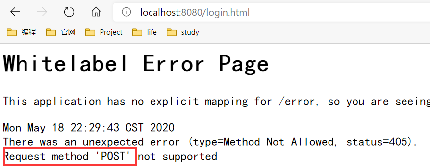

# 1 SpringSecurity环境搭建

## 1.1 介绍

在web开发中，安全是非功能性需求，但安全性是第一位的。可以使用过滤器和拦截器来实现安全性，但是需要使用大量的原生代码。我们应该在设计的时候添加进来。

1. 安全框架：shiro、SpringSecurity。

2. 主要实现的目标：实现认证（Authotication）和授权（Authorization）。

3. 权限

+ 功能权限
+ 访问权限
+ 菜单权限

4. 重要的类

+ WebSecurityConfigureAdapter：自定义security策略。
+ AuthenticationManagerBuilder:自定义认证策略。
+ @EnableWebSecurity：开启WebSecurity模式。

### 1.1.1 基本概念

1. 系统认证

+ 用户认证就是判断一个用户的身份是否合法的过程，也是为了保护系统的隐私数据与资源，用户的身份合法方可访问该系统的资源。

2. 会话

+ 用户认证通过后，为了避免用户的每次操作都进行认证可以将用户的信息保存在会话中。
+ 会话是为了保持当前用户的登录状态所提供的机制，常见的有基于session方式和基于token方式等。
+ 交互流程为：用户认证成功后，在服务器端生成用户相关的数据保存在session(会话)中，发给客户端的session_id存放在cookie中，这样，当用户客户端请求时带上session_id，就可以验证服务器端是否存在session数据，以此完成用户的合法校验，当用户退出系统或session过期销毁时，客户端的session_id也就无效了。

3. 授权

+ 认证是为了保证用户身份的合法性，授权则是为了更细粒度的对隐私数据进行划分。
+ 授权是在用户认证通过后发生的，控制不同的用户访问不同的资源。

4. 授权的数据模型

授权可简单理解为`who`对`what(which)`进行`how`操作。

+ who:即主体（subject）一般指用户。
+ what:即资源Resources（如系统菜单，系统商品信息等）。
+ how:访问许可（Permission）。主体、资源和权限的关系如下图所示。


+ 主体（用户id、账号、密码等）。
+ 资源（资源id,访问地址等）。
+ 权限（权限id，权限名称等）。
+ 角色（角色id，角色名称等）。
+ 角色和权限关系（角色id，权限id等）。
+ 主体和主体关系（主体id，主体id等）。三者之间关系如下：


### 1.1.2 RBAC

使用RBAC来实现授权。

#### 1.1.2.1 基于角色的访问控制

RBAC(Role-Based Access Control)按角色进行授权，比如：主体的角色是总经理，可以查询企业运营报表，查询员工工资信息等，访问流程为：


+ 授权代码：

```java
if(主体.hasRole("总经理角色id")){
	查询工资;
}
```

#### 1.1.2.2 基于资源的访问控制

RBAC是按照资源（或权限）进行授权。比如：用户必须拥有查询工资权限才可以查询员工工资信息等。


+ 授权代码

```java
if(主体.hasRole("查询工资权限标识")){
	查询工资;
}
```

+ 优点：系统设计时定义好查询工资的权限标识，即使查询工资所需要的角色变化为总经理或者部门经理也不需要更改授权代码，系统可扩展能力强。
+ 推荐这一种。

## 1.2 基于Session的认证方式

基于Session的认证机制由Servlet规范定制，用户通过HttpSession的操作方法即可实现。下面是HttpSession相关的操纵API。

|                    方法                     |          含义           |
| :-----------------------------------------: | :---------------------: |
|   HttpSession getSession(Boolean create)    | 获取当前HttpSession对象 |
| void setAttribute(String name,Object value) |   向session中存放对象   |
|      object getAttribute(String name)       |   向session中获取对象   |
|      void removeAttribute(String name)      |     移除session对象     |
|              void invalidate()              |    使HttpSession失效    |


# 2 表单登录

## 2.1 简单项目

1. 添加pom文件

```html
    <parent>
        <groupId>org.springframework.boot</groupId>
        <artifactId>spring-boot-starter-parent</artifactId>
        <version>2.2.5.RELEASE</version>
    </parent>

    <properties>
        <java.version>1.8</java.version>
    </properties>

    <dependencies>
        <!--01web-->
        <dependency>
            <groupId>org.springframework.boot</groupId>
            <artifactId>spring-boot-starter-web</artifactId>
        </dependency>
        <!--02security-->
        <dependency>
            <groupId>org.springframework.boot</groupId>
            <artifactId>spring-boot-starter-security</artifactId>
        </dependency>
    </dependencies>
```

+ 主要是添加Security的依赖，自动保护程序中的所有接口。

2. 创建测试类

```java
@Controller
public class TestController {

    @RequestMapping(value = "/hello")
    @ResponseBody
    public String hello(){
        return "你好";
    }
```

+ 当我们输入网址http://localhost:8080/hello时，会被重定向到http://localhost:8080/login界面进行登录。
+ 按Ctrl +H进行全局搜索，可以定位到`Using generated security password`位置。

3. 配置application.properties

```properties
spring.security.user.name=xiaolun #用户名
spring.security.user.password=123 #密码
```

+ 配置完成后，重启项目，就可以使用这里配置的用户名/密码登录了。

4. 在类中配置登录用户名和密码

```java
@Configuration
public class SecurityConfig extends WebSecurityConfigurerAdapter {
    @Bean //实类
    PasswordEncoder passwordEncoder() {  //对密码加密
        return NoOpPasswordEncoder.getInstance(); //无密码编码器，不加密
    }

    @Override
    protected void configure(AuthenticationManagerBuilder auth) throws Exception {
        auth.inMemoryAuthentication() //内存中，代码里面配置登录和密码
                .withUser("xiaolun")
                .password("123456")
                .roles("admin"); //配置角色
//                .and()   //使用and()配置很多个，可以看作结束标签
    }
}
```

+  `PasswordEncoder passwordEncoder`表示密码编码器进行加密，一般情况下，通过@Autowired 注入并使用 PasswordEncoder 接口的实例，然后调用其 matches 方法去匹配原密码和数据库中保存的“密码”。
+ `NoOpPasswordEncoder`表示只是简单地把字符序列转成字符串,也就是说,你输入的密码”123456”存储在数据库里仍然是”123456”,这样如果数据库被攻破的话,密码就直接泄露了,十分不安全。
+  `auth.inMemoryAuthentication`使用内存中授权的方式。
+ `and()`可以配置多个角色，将其看作结束标签。
+ 在类中配置授权方式，会取代`application.properties`中的配置。

## 2.2 自定义表单登录页

1. 前端界面

+ 引入`css,images,js`文件，放到`static`目录下。
+ 登录页面 `login.html`

```html
<!DOCTYPE html>
<html lang="zh-CN">
<head>
    <meta charset="UTF-8">
    <title>江南一点雨</title>

    <link rel="stylesheet" href="css/font-awesome-4.7.0/css/font-awesome.min.css">
    <link rel="stylesheet" href="css/style.css">

</head>
<body>

<div class="materialContainer">
    <div class="box">
        <div class="title">江南一点雨-登录</div>
        <form action="/login.html" method="post">
            <div class="input">
                <label for="name">用户名</label>
                <input type="text" name="username" id="name">
                <span class="spin"></span>
            </div>
            <div class="input">
                <label for="pass">密码</label>
                <input type="password" name="password" id="pass">
                <span class="spin"></span>
            </div>
            <div class="button login">
                <button type="submit">
                    <span>登录</span>
                    <i class="fa fa-check"></i>
                </button>
            </div>
        </form>
        <a href="javascript:" class="pass-forgot">忘记密码？</a>
    </div>

    <div class="overbox">
        <div class="material-button alt-2">
            <span class="shape"></span>
        </div>
        <div class="title">江南一点雨-注册</div>
        <div class="input">
            <label for="regname">用户名</label>
            <input type="text" name="regname" id="regname">
            <span class="spin"></span>
        </div>
        <div class="input">
            <label for="regpass">密码</label>
            <input type="password" name="regpass" id="regpass">
            <span class="spin"></span>
        </div>
        <div class="input">
            <label for="reregpass">确认密码</label>
            <input type="password" name="reregpass" id="reregpass">
            <span class="spin"></span>
        </div>
        <div class="button">
            <button>
                <span>注册</span>
            </button>
        </div>
    </div>
</div>

<script src="js/jquery.min.js"></script>
<script src="js/index.js"></script>

</body>
</html>
```

+ + 登录的表单action的界面为：`action="/login.html"`和config配置中的登录界面一致。

2. config配置

```java
@Configuration //配置类
@EnableWebSecurity //启用Spring Security
public class WebSecurityConfig extends WebSecurityConfigurerAdapter {
    /**
     * 通过configure方法，进行创建用户
     */
    @Override
    protected void configure(AuthenticationManagerBuilder auth) throws Exception {
        /**
         * 基于内存方式，构建两个用户账号：admin/123;user/123
         * 方式1:设置密码解码方式
         */
        //两个用户都可以登录
        auth.inMemoryAuthentication()
                .withUser("admin")
                .password(passwordEncoder().encode("123"))
                .roles();
        auth.inMemoryAuthentication()
                .withUser("user")
                .password(passwordEncoder().encode("123"))
                .roles();
    }

    //将静态资源放行
    @Override
    public void configure(WebSecurity web) throws Exception {
        web.ignoring().antMatchers("/css/**","/images/**","/js/**");
    }

    //配置登录页
    @Override
    protected void configure(HttpSecurity http) throws Exception {
        http.authorizeRequests()
                .anyRequest().authenticated() //所有请求认证之后才能访问。
                .and()
                .formLogin()//表单配置
                .loginPage("/login.html")//登录页面（登录的接口也是这个）
                .permitAll()//登录相关的页面都被放行
                .and()
                .csrf().disable(); //关掉csrf()
    }

    @Bean //方式2：通过@Bean注入指定的PasswordEncoder(密码加密)
    public PasswordEncoder passwordEncoder(){
        return new BCryptPasswordEncoder();
    }
}
```

+ 主要将静态资源放行和配置登录界面。


+ `loginPage("/login.html")`和前端界面的接口一致。

3. 输入网址：http://localhost:8080/login.html，在弹出的窗口中输入用户名和密码后进入下面界面：

   

在网址上追加“hello”输出界面为：


## 2.3 表单登录配置细节

1. 登录接口和登录页面区别

+ 登录页面就是你看到的浏览器展示出来的页面，登录接口则是提交登录数据的地方，就是登录页面里边的 form 表单的 action 属性对应的值。

+ 在 Spring Security 中，如果我们不做任何配置，默认的登录页面和登录接口的地址都是 `/login`。也就是说，默认会存在如下两个请求：

  + GET http://localhost:8080/login 
  + POST http://localhost:8080/login

  其中，如果是 GET 请求表示你想访问登录页面，如果是 POST 请求，表示你想提交登录数据。

+ 当我们配置了 loginPage 为 `/login.html` 之后，这个配置从字面上理解，就是设置登录页面的地址为 `/login.html`。

  实际上它还有一个隐藏的操作，就是登录接口地址也设置成 `/login.html` 了。换句话说，新的登录页面和登录接口地址都是 `/login.html`，现在存在如下两个请求:

  + GET http://localhost:8080/login.html
  + POST http://localhost:8080/login.html

  前面的 GET 请求用来获取登录页面，后面的 POST 请求用来提交登录数据。

2. 登录接口和登录页面分开配置

+ 在 `SecurityConfig` 中，我们可以通过 `loginProcessingUrl` 方法来指定登录接口地址，如下：

```java
.and()
.formLogin()
.loginPage("/login.html")
.loginProcessingUrl("/doLogin")
.permitAll()
```

+ + 这样配置之后，登录页面地址和登录接口地址就分开了，各是各的。此时我们还需要修改登录页面里边的 `action` 属性，改为 `/doLogin`，如下：

```html
<form action="/doLogin" method="post">
<!--省略-->
</form>
```

3. 登录参数

+ 登录表单中的参数是 `username` 和 `password`，注意，默认情况下，这个不能变：

```html
<form action="/login.html" method="post">
    <div class="input">
        <label for="name">用户名</label>
        <input type="text" name="username" id="name">
        <span class="spin"></span>
    </div>
    
    <div class="input">
        <label for="pass">密码</label>
        <input type="password" name="password" id="pass">
        <span class="spin"></span>
    </div>
    
    <div class="button login">
        <button type="submit">
            <span>登录</span>
            <i class="fa fa-check"></i>
        </button>
    </div>
</form>
```

+ 修改用户名和密码的参数

```java
.and()
.formLogin()
.loginPage("/login.html")
.loginProcessingUrl("/doLogin")
.usernameParameter("name")
.passwordParameter("passwd")
.permitAll()
.and()
```

+ + 此时前端页面的`name`属性值也要做相应的更新，即修改 `input` 的 `name` 属性值和服务端的对应

### 2.3.1 登录回调

#### 2.3.1.1 成功回调方法

+ onfig配置

```java
	and()
    .formLogin()//表单配置
    .loginPage("/login.html")//登录页面（登录的接口也是这个）
    .successForwardUrl("/s") //登录成功之后，跳转到“/s”界面中去(服务端跳转)
     // .defaultSuccessUrl("/s") //重定向（客户端界面）
    .permitAll()//登录相关的页面都被放行
    .and()
```

+ + 添加`successForwardUrl("/s")`，跳转到controller里面。
+ 编写controller方法

```java
//    @GetMapping("/s")
    @RequestMapping("/s")
    public String success(){
        return  "success";
    }
```

+ + 由于前端使用表单登录，使用的是POST方法，所以 `@GetMapping("/s")`会报出下面的错误。

    `@GetMapping`用于将HTTP get请求映射到特定处理程序的方法注解
    具体来说，`@GetMapping`是一个组合注解，是`@RequestMapping(method = RequestMethod.GET)`的缩写。



+ 输入http://localhost:8080/login.html，登录成功后，自动将 http://localhost:8080/s 界面中数据输出。但此时网址仍是http://localhost:8080/login.html。

  使用`.defaultSuccessUrl("/s")`则会进行客户端的跳转，即重定向，此时页面显示地址为：http://localhost:8080/s。

+ `defaultSuccessUrl` 中指定登录成功的跳转页面为 `/s`，此时分两种情况，如果你是直接在浏览器中输入的登录地址，登录成功后，就直接跳转到 `/s`，如果你是在浏览器中输入了其他地址，例如 `http://localhost:8080/hello`，结果因为没有登录，又重定向到登录页面，此时登录成功后，就不会来到 `/s` ，而是来到 `/hello` 页面。而`successForwardUrl` 表示不管你是从哪里来的，登录后一律跳转到 `successForwardUrl` 指定的地址。

#### 2.3.1.2 失败回调方法

1. 与登录成功相似，登录失败也是有两个方法：

- failureForwardUrl
- failureUrl

这两个方法在设置的时候也是设置一个即可。`failureForwardUrl` 是登录失败之后会发生服务端跳转，`failureUrl` 则在登录失败之后，会发生重定向。

### 2.3.2 注销登录

注销登录的默认接口是 `/logout`，我们也可以配置。

```java
.and()
.logout()
.logoutUrl("/logout")
.logoutRequestMatcher(new AntPathRequestMatcher("/logout","POST"))
.logoutSuccessUrl("/index")
.deleteCookies()
.clearAuthentication(true)
.invalidateHttpSession(true)
.permitAll()
.and()
```

+ 默认注销的 URL 是 `/logout`，是一个 GET 请求，我们可以通过 `logoutUrl` 方法来修改默认的注销 URL。
+ `logoutRequestMatcher` 方法不仅可以修改注销 `URL`，还可以修改请求方式，实际项目中，这个方法和 `logoutUrl` 任意设置一个即可。
+ `logoutSuccessUrl` 表示注销成功后要跳转的页面。
+ `deleteCookies` 用来清除 `cookie`。
+ `clearAuthentication` 和 `invalidateHttpSession` 分别表示清除认证信息和使 `HttpSession` 失效，默认可以不用配置，默认就会清除。

# 3 前后端分离，JSON交互

## 3.1 介绍

1. **有状态**

有状态服务，即服务端需要记录每次会话的客户端信息，从而识别客户端身份，根据用户身份进行请求的处理，典型的设计如 Tomcat 中的 Session。

例如登录：用户登录后，我们把用户的信息保存在服务端 session 中，并且给用户一个 cookie 值，记录对应的 session，然后下次请求，用户携带 cookie 值来（这一步有浏览器自动完成），我们就能识别到对应 session，从而找到用户的信息。这种方式目前来看最方便，但是也有一些缺陷，如下：

+ 服务端保存大量数据，增加服务端压力。
+ 服务端保存用户状态，不支持集群化部署。

2. **无状态**

微服务集群中的每个服务，对外提供的都使用 `RESTful` 风格的接口。而 `RESTful` 风格的一个最重要的规范就是：服务的无状态性，即：

- 服务端不保存任何客户端请求者信息。
- 客户端的每次请求必须具备自描述信息，通过这些信息识别客户端身份。

这种无状态性的好处：

- 客户端请求不依赖服务端的信息，多次请求不需要必须访问到同一台服务器。
- 服务端的集群和状态对客户端透明。
- 服务端可以任意的迁移和伸缩（可以方便的进行集群化部署）。
- 减小服务端存储压力。

3. **无状态登录的流程**

+ 首先客户端发送账户名/密码到服务端进行认证。
+ 认证通过后，服务端将用户信息加密并且编码成一个 `token`，返回给客户端。
+ 以后客户端每次发送请求，都需要携带认证的 `token`。
+ 服务端对客户端发送来的 `token` 进行解密，判断是否有效，并且获取用户登录信息。

事件

4. **优缺点**

+  `session` 最大的优点在于方便。你不用做过多的处理，一切都是默认的即可。缺点是如果你的前端是 `Android`、`iOS`、小程序等，这些 App 天然的就没有 `cookie`，如果非要用 session，就需要这些工程师在各自的设备上做适配，一般是模拟 `cookie`。
+ `JWT` 这样的无状态登录就展示出自己的优势了，这些登录方式所依赖的 `token` 你可以通过普通参数传递，也可以通过请求头传递，怎么样都行，具有很强的灵活性。

5. **前后端交互**

在前后端分离这样的开发架构下，前后端的交互都是通过 JSON 来进行，无论登录成功还是失败，都不会有什么服务端跳转或者客户端跳转之类。

## 3.2 项目测试

### 3.2.1 登录成功回调

之前我们配置登录成功的处理是通过如下两个方法来配置的：

- defaultSuccessUrl
- successForwardUrl

这两个都是配置跳转地址的，适用于前后端不分的开发。除了这两个方法之外，可以使用 `successHandler`来进行传送`json`数据，进行前后端分离。

```java
.successHandler((req, resp, authentication) -> {
Object principal = authentication.getPrincipal();
resp.setContentType("application/json;charset=utf-8");
PrintWriter out = resp.getWriter();
out.write(new ObjectMapper().writeValueAsString(principal));
out.flush();
out.close();
})
```

`successHandler` 方法的参数是一个 `AuthenticationSuccessHandler` 对象，这个对象中我们要实现的方法是 `onAuthenticationSuccess`。

onAuthenticationSuccess 方法有三个参数，分别是：

- HttpServletRequest
- HttpServletResponse
- Authentication

利用 `HttpServletRequest` 我们可以做服务端跳转，利用 `HttpServletResponse` 我们可以做客户端跳转，当然，也可以返回 `JSON` 数据。第三个 `Authentication` 参数则保存了我们刚刚登录成功的用户信息。

启动项目，输入网址：http://localhost:8080/login.html，在输入用户名和密码后，后台将JSON数据返回前端，如下：

```json
{
    "password":null,
    "username":"user",
    "authorities":[

    ],
    "accountNonExpired":true,
    "accountNonLocked":true,
    "credentialsNonExpired":true,
    "enabled":true
}
```

### 3.2.2 登录失败回调

```
.failureHandler((req, resp, e) -> {
resp.setContentType("application/json;charset=utf-8");
PrintWriter out = resp.getWriter();
out.write(e.getMessage());
out.flush();
out.close();
})
```

`Exception` 中则保存了登录失败的原因，我们可以将之通过 `JSON` 返回到前端。根据不同的异常类型，我们可以给用户一个更加明确的提示：

```java
resp.setContentType("application/json;charset=utf-8");
PrintWriter out = resp.getWriter();
RespBean respBean = RespBean.error(e.getMessage());
if (e instanceof LockedException) {
respBean.setMsg("账户被锁定，请联系管理员!");
} else if (e instanceof CredentialsExpiredException) {
respBean.setMsg("密码过期，请联系管理员!");
} else if (e instanceof AccountExpiredException) {
respBean.setMsg("账户过期，请联系管理员!");
} else if (e instanceof DisabledException) {
respBean.setMsg("账户被禁用，请联系管理员!");
} else if (e instanceof BadCredentialsException) {
respBean.setMsg("用户名或者密码输入错误，请重新输入!");
}
out.write(new ObjectMapper().writeValueAsString(respBean));
out.flush();
out.close();
```

### 3.2.3 未认证处理方案

如果用户没有登录就访问一个需要认证后才能访问的页面，这个时候，我们不应该让用户重定向到登录页面，而是给用户一个尚未登录的提示，前端收到提示之后，再自行决定页面跳转。

```java
.csrf().disable().exceptionHandling()
.authenticationEntryPoint((req, resp, authException) -> {
resp.setContentType("application/json;charset=utf-8");
PrintWriter out = resp.getWriter();
out.write("尚未登录，请先登录");
out.flush();
out.close();
}
```

在 Spring Security 的配置中加上自定义的 `AuthenticationEntryPoint` 处理方法，该方法中直接返回相应的 JSON 提示即可。服务端会直接给浏览器一个 JSON 提示，浏览器收到 JSON 之后，该干嘛干嘛。

### 3.2.4 注销登录

注销登录之后，系统自动跳转到登录页面，这也是不合适的，如果是前后端分离项目，注销登录成功后返回 JSON 即可，配置如下：

```java
.and()
.logout()
.logoutUrl("/logout")
.logoutSuccessHandler((req, resp, authentication) -> {
resp.setContentType("application/json;charset=utf-8");
PrintWriter out = resp.getWriter();
out.write("注销成功");
out.flush();
out.close();
})
.permitAll()
.and()
```

+ 完整程序代码

```java
@Configuration //配置类
@EnableWebSecurity //启用Spring Security
public class WebSecurityConfig extends WebSecurityConfigurerAdapter {
    /**
     * 通过configure方法，进行创建用户
     */
    @Override
    protected void configure(AuthenticationManagerBuilder auth) throws Exception {
        /**
         * 基于内存方式，构建两个用户账号：admin/123;user/123
         * 方式1:设置密码解码方式
         */
        //两个用户都可以登录
        auth.inMemoryAuthentication()
                .withUser("admin")
                .password(passwordEncoder().encode("123"))
                .roles();
        auth.inMemoryAuthentication()
                .withUser("user")
                .password(passwordEncoder().encode("123"))
                .roles();
    }

    //将静态资源放行
    @Override
    public void configure(WebSecurity web) throws Exception {
        web.ignoring().antMatchers("/css/**","/images/**","/js/**");
    }

    //配置登录页
    @Override
    protected void configure(HttpSecurity http) throws Exception {
        http.authorizeRequests()
                .anyRequest().authenticated() //所有请求认证之后才能访问。
                .and()
                .formLogin()//表单配置
                .loginPage("/login.html")//登录页面（登录的接口也是这个）
                .successHandler((req,resp,authentication) -> {  //登录成功的回调，不会跳转页面，而是返回一串json数据
                    resp.setContentType("application/json;charset = utf-8"); //返回json数据
                    PrintWriter out = resp.getWriter();
                    out.write(new ObjectMapper().writeValueAsString(authentication.getPrincipal())); //登录成功的用户信息
                    out.flush();
                    out.close();
                })
                .failureHandler((req,resp,exception) -> {  //登录失败的回调
                    resp.setContentType("application/json;charset = utf-8"); //返回json数据
                    PrintWriter out = resp.getWriter();
                    out.write(new ObjectMapper().writeValueAsString(exception.getMessage()));
                    out.flush();
                    out.close();
                })
                .permitAll()//登录相关的页面都被放行
                .and()
                .csrf().disable().
                exceptionHandling() //未认证处理方案
                .authenticationEntryPoint((req, resp, authException) -> {
                            resp.setContentType("application/json;charset=utf-8");
                            PrintWriter out = resp.getWriter();
                            out.write("尚未登录，请先登录");
                            out.flush();
                            out.close();
                        }
                );; //关掉csrf()
    }

    @Bean //方式2：通过@Bean注入指定的PasswordEncoder(密码加密)
    public PasswordEncoder passwordEncoder(){
        return new BCryptPasswordEncoder();
    }
}
```

# 4 授权

1. 配置界面

```java
@Configuration //配置类
@EnableWebSecurity //启用Spring Security
public class WebSecurityConfig extends WebSecurityConfigurerAdapter {


    /**
     * 通过configure方法，进行创建用户
     */
    @Override
    protected void configure(AuthenticationManagerBuilder auth) throws Exception {
        auth.inMemoryAuthentication()
                .withUser("javaboy")
                .password(passwordEncoder().encode("123"))
                .roles("admin");
        auth.inMemoryAuthentication()
                .withUser("xiaolun")
                .password(passwordEncoder().encode("123"))
                .roles("user");
    }

    //方法2，定义授权方式（没有成功）
//    @Bean
//    @Override
//    protected UserDetailsService userDetailsService() {
//        InMemoryUserDetailsManager manager = new InMemoryUserDetailsManager();
//        manager.createUser(User.withUsername("javaboy").password("123").roles("admin").build());
//        manager.createUser(User.withUsername("xiaolun").password("123").roles("user").build());
//        return manager;
//    }

    //上级具备下级的权限
    @Bean
    RoleHierarchy roleHierarchy(){
        RoleHierarchyImpl roleHierarchy = new RoleHierarchyImpl();
        roleHierarchy.setHierarchy("ROLE_admin > ROLE_user");
        return roleHierarchy;
    }

    //将静态资源放行
    @Override
    public void configure(WebSecurity web) throws Exception {
        web.ignoring().antMatchers("/css/**","/images/**","/js/**");
    }

    //配置登录页
    @Override
    protected void configure(HttpSecurity http) throws Exception {
        http.authorizeRequests()
                .antMatchers("/admin/**").hasRole("admin") //授权访问权限限制
                .antMatchers("/user/**").hasRole("user")
                .anyRequest().authenticated() //所有请求认证之后才能访问。（不能放在最前面，不然会报错）
                .and()
                .formLogin()//表单配置
                .loginPage("/login.html")//登录页面（登录的接口也是这个）
                .successHandler((req,resp,authentication) -> {  //登录成功的回调，不会跳转页面，而是返回一串json数据
                    resp.setContentType("application/json;charset = utf-8"); //返回json数据
                    PrintWriter out = resp.getWriter();
                    out.write(new ObjectMapper().writeValueAsString(authentication.getPrincipal())); //登录成功的用户信息
                    out.flush();
                    out.close();
                })
                .failureHandler((req,resp,exception) -> {  //登录失败的回调
                    resp.setContentType("application/json;charset = utf-8"); //返回json数据
                    PrintWriter out = resp.getWriter();
                    out.write(new ObjectMapper().writeValueAsString(exception.getMessage()));
                    out.flush();
                    out.close();
                })
                .permitAll()//登录相关的页面都被放行
                .and()
                .csrf().disable().
                exceptionHandling() //未认证处理方案
                .authenticationEntryPoint((req, resp, authException) -> {
                            resp.setContentType("application/json;charset=utf-8");
                            PrintWriter out = resp.getWriter();
                            out.write("尚未登录，请先登录");
                            out.flush();
                            out.close();
                        }
                );
    }

    @Bean //方式2：通过@Bean注入指定的PasswordEncoder(密码加密)
    public PasswordEncoder passwordEncoder(){
        return new BCryptPasswordEncoder();
    }
}
```

+  使用`RoleHierarchy`方法可以进行设置上级具备下级的权限。
+ 输入http://localhost:8080/login.html然后输入密码，就可以进行，当输入的角色为`admin`时，会访问后台所有的资源（包括：http://localhost:8080/user/hello和http://localhost:8080/admin/hello）。

2. controller界面

```java
@RestController
public class HelloController {

    @GetMapping("/hello")
    public String hello(){
        return  "hello Spring Security";
    }

    //测试授权方式
    @GetMapping("admin/hello")
    public String admin(){
        return  "admin";
    }

    @GetMapping("user/hello")
    public String user(){
        return  "user";
    }
}
```

# 5 将用户数据存入数据库

1. **JdbcUserDetailsManager**

使用 `JdbcUserDetailsManager` 可以让我们通过 JDBC 的方式将数据库和 `Spring Security` 连接起来。`JdbcUserDetailsManager` 自己提供了一个数据库模型。存储的脚本内容如下：

```sql
create table users(username varchar_ignorecase(50) not null primary key,password varchar_ignorecase(500) not null,enabled boolean not null);
create table authorities (username varchar_ignorecase(50) not null,authority varchar_ignorecase(50) not null,constraint fk_authorities_users foreign key(username) references users(username));
create unique index ix_auth_username on authorities (username,authority);
```

可以看到，脚本中有一种数据类型 `varchar_ignorecase`，这个其实是针对 `HSQLDB` 数据库创建的，而我们使用的 [MySQL](https://cloud.tencent.com/product/cdb?from=10680) 并不支持这种数据类型，所以这里需要大家手动调整一下数据类型，`将` `varchar_ignorecase` 改为 `varchar` 即可。

执行完 SQL 脚本后，我们可以看到一共创建了两张表：users 和 authorities。

- users 表中保存用户的基本信息，包括用户名、用户密码以及账户是否可用。
- authorities 中保存了用户的角色。
- authorities 和 users 通过 username 关联起来。

user表：


authorities表：


2. **config配置**

配置完成后，接下来，我们将上篇文章中通过 `InMemoryUserDetailsManager` 提供的用户数据用 `JdbcUserDetailsManager` 代替掉，如下：

```java
@Autowired
DataSource dataSource;
@Override
@Bean
protected UserDetailsService userDetailsService() {
    JdbcUserDetailsManager manager = new JdbcUserDetailsManager();
    manager.setDataSource(dataSource);
    if (!manager.userExists("javaboy")) {
        manager.createUser(User.withUsername("javaboy").password("123").roles("admin").build());
    }
    if (!manager.userExists("xiaolun")) {
        manager.createUser(User.withUsername("xiaolun").password("123").roles("user").build());
    }
    return manager;
}
```

这段配置的含义如下：

+ 首先构建一个 `JdbcUserDetailsManager` 实例。给 `JdbcUserDetailsManager` 实例添加一个 `DataSource` 对象。

+ 调用 `userExists` 方法判断用户是否存在，如果不存在，就创建一个新的用户出来（因为每次项目启动时这段代码都会执行，所以加一个判断，避免重复创建用户）。

+ 用户的创建方法和我们之前 `InMemoryUserDetailsManager` 中的创建方法基本一致。

3. **修改pom文件**

```html
<dependency>
    <groupId>org.springframework.boot</groupId>
    <artifactId>spring-boot-starter-jdbc</artifactId>
</dependency>
<dependency>
    <groupId>mysql</groupId>
    <artifactId>mysql-connector-java</artifactId>
</dependency>
```

+ 主要是添加数据库支持。

4. **编写properties文件**

```properties
spring.datasource.username=root
spring.datasource.password=123
spring.datasource.url=jdbc:mysql://localhost:3306/test01?useUnicode=true&characterEncoding=utf8&characterSetResults=utf8&serverTimezone=UTC
```

+ 这里并没有写驱动语句`spring.datasource.driver-class-name=com.mysql.cj.jdbc.Driver`，应该是pom文件中包含的缘故。

5. **启动项目**

项目启动成功后，我们就可以看到数据库中自动添加了两个用户进来，并且用户都配置了角色。如下图：


6. **测试**

以user身份进行登录，登录成功后，分别访问 `/hello`，`/admin/hello` 以及 `/user/hello` 三个接口，其中：

+ `/hello` 因为登录后就可以访问，这个接口访问成功。

+ `/admin/hello` 需要 `admin` 身份，所以访问失败。

+ `/user/hello` 需要 `user` 身份，所以访问成功。