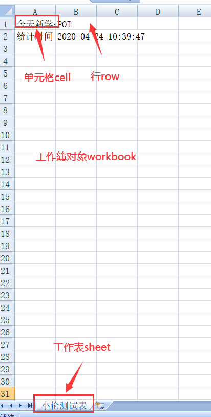

# 1 介绍

Apache POI官网：http://poi.apache.org/

EasyExcel官网：https://github.com/alibaba/easyexcel

EasyExcel官方文档:https://www.yuque.com/easyexcel/doc/easyexcel

1. 基本结构

+ HSSF-提供读写Microsoft Excel格式档案的功能。
+ XSSF-提供读写Microsoft Excel OOXML格式档案的功能。
+ HWPF-提供读写Microsoft Word格式档案的功能。
+ HSLF-提供读写Microsoft PowerPoint格式档案的功能。
+ HDGF-提供读写Microsoft Visio格式档案的功能。

# 2 Excel基本写操作

1. **Excel中的对象**

+ 工作簿
+ 工作表
+ 行
+ 列

2. **修改POM文件**

```html
<!--  导入依赖  -->
<dependencies>
    <!--xls(03)-->
    <dependency>
        <groupId>org.apache.poi</groupId>
        <artifactId>poi</artifactId>
        <version>3.9</version>
    </dependency>
    <!--xls(07)-->
    <dependency>
        <groupId>org.apache.poi</groupId>
        <artifactId>poi-ooxml</artifactId>
        <version>3.9</version>
    </dependency>
    <!--日期格式化工具-->
    <dependency>
        <groupId>joda-time</groupId>
        <artifactId>joda-time</artifactId>
        <version>2.10.1</version>
    </dependency>
    <!--test-->
    <dependency>
        <groupId>junit</groupId>
        <artifactId>junit</artifactId>
        <version>4.12</version>
    </dependency>
</dependencies>
```

+ 分别导入03和07版本的Excel的两个依赖。
+ 日期格式化工具推荐使用`joda-time`。
+ 引入`junit`进行下文代码的测试`@Test`。
+ 创建新工程Empty Project -> Project Setting->Project->java版本1.8->Modules->new Modules->Maven

3. **03版本Excel写数据代码**

```java
@Test 
public void testWrite03(){
    String Path = "D:\\a22IDEA\\poi-study\\src\\main\\resources";//文件路径
    //1、创建工作簿
    Workbook workbook = new HSSFWorkbook(); //03版本的Excel
    //2、创建一个工作表
    Sheet sheet = workbook.createSheet("小伦测试表"); //工作簿里面包含工作表
    //3、创建一行P(1,1)单元格
    Row row1 = sheet.createRow(0);
    //4、创建一个单元格
    Cell cell1 = row1.createCell(0); //第一行的第一个单元格
    cell1.setCellValue("今天新学技术");  //填入数据

    //(1,2)
    Cell cell2 = row1.createCell(1); //第一行的第二个单元格
    cell2.setCellValue("POI");  //填入数据

    //创建第二行数据(2,1)
    Row row2 = sheet.createRow(1);
    Cell cell2_1 = row2.createCell(0); //第一行的第一个单元格
    cell2_1.setCellValue("统计时间");
    //(2,2)
    Cell cell2_2 = row2.createCell(1); //第一行的第一个单元格
    String date = new DateTime().toString("yyyy-MM-dd HH:mm:ss"); //日期格式化工具joda-time用处
    cell2_2.setCellValue(date);

    //生成一张表（IO流）03版本使用xls结尾
    try {
        FileOutputStream fileOutputStream = new FileOutputStream(Path+"学习统计表.xls");
        workbook.write(fileOutputStream); //将工作簿写出
        fileOutputStream.close();// 关闭流
        System.out.println("学习统计表输出成功");
    } catch (Exception e) {
        e.printStackTrace();
    }
}
```

4. **07版本Excel写数据代码**

```java
@Test //07版本Excel文件测试
public void testWrite07(){
    String Path = "D:\\a22IDEA\\poi-study\\src\\main\\resources";//文件路径
    //1、创建工作簿
    Workbook workbook = new XSSFWorkbook(); //07版本的Excel
    //2、创建一个工作表
    Sheet sheet = workbook.createSheet("小伦测试表"); //工作簿里面包含工作表
    //3、创建一行P(1,1)单元格
    Row row1 = sheet.createRow(0);
    //4、创建一个单元格
    Cell cell1 = row1.createCell(0); //第一行的第一个单元格
    cell1.setCellValue("今天新学技术");  //填入数据

    //(1,2)
    Cell cell2 = row1.createCell(1); //第一行的第二个单元格
    cell2.setCellValue("POI");  //填入数据

    //创建第二行数据(2,1)
    Row row2 = sheet.createRow(1);
    Cell cell2_1 = row2.createCell(0); //第一行的第一个单元格
    cell2_1.setCellValue("统计时间");
    //(2,2)
    Cell cell2_2 = row2.createCell(1); //第一行的第一个单元格
    String date = new DateTime().toString("yyyy-MM-dd HH:mm:ss"); //日期格式化工具joda-time用处
    cell2_2.setCellValue(date);

    //生成一张表（IO流）03版本使用xlsx结尾
    try {
        FileOutputStream fileOutputStream = new FileOutputStream(Path+"学习统计表2.xlsx");
        workbook.write(fileOutputStream); //将工作簿写出
        fileOutputStream.close();// 关闭流
        System.out.println("学习统计表输出成功");
    } catch (Exception e) {
        e.printStackTrace();
    }
}
```

+ 相比于03版本的Excel代码，07版本的Excel代码改动地方为两处：
  + `new HSSFWorkbook()`变为`new XSSFWorkbook()`。
  + 文件后缀不同，07版本中`Path+"学习统计表2.xlsx"`使用 `.xlsx`结尾。
  + 面向接口编程，对象`new XSSFWorkbook()`变了，接口不用变。
+ xlsx表显示：



2.1 大数据量的导入

1. 大文件写HSSF

+ 缺点：最多只能处理65536行，否则会抛出异常。

  java.lang.IllegalArgumentException: Invalid row number (65536) outside allowable range (0..65535)

+ 优点：过程写入缓存，不操作磁盘，最后一次写入磁盘，速度快。

```java
 @Test //测试大数据
public void testWrite03BigData() throws Exception {
    //计算时间
    long begin = System.currentTimeMillis();
    //1、创建工作簿
    Workbook workbook = new HSSFWorkbook();
    //2、创建一个工作表
    Sheet sheet = workbook.createSheet();
    //写入数据
    for (int i = 0; i < 65536; i++) {
        Row row = sheet.createRow(i); //创建一行
        for (int cellNum = 0; cellNum < 10; cellNum++) { //每一列
            Cell cell = row.createCell(cellNum);
            cell.setCellValue(cellNum);
        }
    }
    System.out.println("over");
    FileOutputStream fileOutputStream = new FileOutputStream(Path+"testWrite03BigData.xls");
    workbook.write(fileOutputStream);
    fileOutputStream.close();
    long end = System.currentTimeMillis();
    System.out.println((double)(end-begin)/1000); //按秒来计数
}
```

+ 当写入数据超过6536时，就会抛出异常。
+ 所耗时间：2.7S左右。

2. 大文件写HSSF

+ 缺点：写数据时速度非常慢，非常耗内存，也会发生内存溢出，如100万条。
+ 优点：可以写入大量的数据，如20万条。

```java
@Test //测试07版本Excel大数据
public void testWrite07BigData() throws Exception {
    //计算时间
    long begin = System.currentTimeMillis();
    //1、创建工作簿
    Workbook workbook = new XSSFWorkbook();
    //2、创建一个工作表
    Sheet sheet = workbook.createSheet();
    //写入数据
    for (int i = 0; i < 65536; i++) {
        Row row = sheet.createRow(i); //创建一行
        for (int cellNum = 0; cellNum < 10; cellNum++) { //每一列
            Cell cell = row.createCell(cellNum);
            cell.setCellValue(cellNum);
        }
    }
    System.out.println("over");
    FileOutputStream fileOutputStream = new FileOutputStream(Path+"testWrite07BigData.xlsx");
    workbook.write(fileOutputStream);
    fileOutputStream.close();
    long end = System.currentTimeMillis();
    System.out.println((double)(end-begin)/1000); //按秒来计数
}
```

+ 耗时较长：27.74秒。

3. 大文件写SXSSF

+ 优点：可以写非常大的数据量，写数据速度快，占用较少的内存。
+ 注意：
  + 运行过程中会产生临时文件，需要清理临时文件。
  + 默认由100条数据保存到内存中，如果超过这数量，则将前面的数据写入到临时文件中。
  + 如果想自定义内存中的数据的数量，可以使用`new SXSSFWorkbook(数量)`

```java
@Test //测试SXSSFWorkbook
public void testWrite07BigDataS() throws Exception {
    //计算时间
    long begin = System.currentTimeMillis();
    //1、创建工作簿
    Workbook workbook = new SXSSFWorkbook();
    //2、创建一个工作表
    Sheet sheet = workbook.createSheet();
    //写入数据
    for (int i = 0; i < 65536; i++) {
        Row row = sheet.createRow(i); //创建一行
        for (int cellNum = 0; cellNum < 10; cellNum++) { //每一列
            Cell cell = row.createCell(cellNum);
            cell.setCellValue(cellNum);
        }
    }
    System.out.println("over");
    FileOutputStream fileOutputStream = new FileOutputStream(Path+"testWrite07BigDataS.xlsx");
    workbook.write(fileOutputStream);
    fileOutputStream.close();
    ((SXSSFWorkbook)workbook).dispose(); //清除临时文件
    long end = System.currentTimeMillis();
    System.out.println((double)(end-begin)/1000); //按秒来计数
}
```

+ 耗时：2.589S，比大文件写HSSF块好多倍。
+ 改变对象：new SXSSFWorkbook()。
+ `((SXSSFWorkbook)workbook).dispose()`; 表示清除临时文件。

# 3 Excel基本读操作

## 3.1 Excel基本读取及注意

```java
String Path = "D:\\a22IDEA\\poi-study\\src\\main\\resources";//文件路径
@Test
public void testRead03() throws Exception {

    //读取文件流
    FileInputStream fileInputStream = new FileInputStream(Path+"学习统计表.xls");
    Workbook workbook = new HSSFWorkbook(fileInputStream); //03版本的Excel
    Sheet sheet = workbook.getSheetAt(0);//反向操作，获取工作表
    Row row = sheet.getRow(0); //获取行
    Cell cell = row.getCell(0);//获取列
    //获取字符串类型（读取值的时候，一定要注意读取类型，否则会导致失败）
    System.out.println(cell.getStringCellValue()); //获取单元格数值
    fileInputStream.close();// 关闭流
}
```

+ 注意获取值的类型即可。

## 3.2 读取不同类型的数据

```java
 @Test //读取不同类型的数据
public void testCellType03() throws Exception {

    //读取文件流
    FileInputStream fileInputStream = new FileInputStream(Path + "学习统计表.xls");
    Workbook workbook = new HSSFWorkbook(fileInputStream); //03版本的Excel
    Sheet sheet = workbook.getSheetAt(0);//反向操作，获取工作表
    Row rowTitle = sheet.getRow(0); //获取第一行
    if (rowTitle != null) {
        //要掌握
        int CellCount = rowTitle.getPhysicalNumberOfCells(); //通过一行拿到第一行表头中列的长度
        for (int CellNum = 0; CellNum < CellCount; CellNum++) {
            Cell cell = rowTitle.getCell(CellNum);
            if (cell != null) {
                int cellType = cell.getCellType(); //得到数据类型
                String cellValue = cell.getStringCellValue();
                System.out.print(cellValue + "|"); //不换行
            }
        }
        System.out.println(); //换行输出
    }
    //获取表中的类型
    int rowCounts = sheet.getPhysicalNumberOfRows();//获取表中的行
    for (int rowNum = 1; rowNum < rowCounts; rowNum++) { //从第二行开始读取
        Row rowData = sheet.getRow(rowNum); //获取列
        if (rowData != null) {
            //读取列
            int CellCount = rowTitle.getPhysicalNumberOfCells();
            for (int CellNum = 0; CellNum < CellCount; CellNum++) {
                Cell cell = rowData.getCell(CellNum);
                String CellValue = "";
                //匹配列的数据类型
                if (cell != null) {
                    int cellType = cell.getCellType(); //返回数据类型
                    switch (cellType) {
                        case HSSFCell.CELL_TYPE_STRING: //字符串
                            CellValue = cell.getStringCellValue(); //将这个单元格中的值获取出来
                            break;
                        case HSSFCell.CELL_TYPE_BOOLEAN: //布尔类型
                            CellValue = String.valueOf(cell.getBooleanCellValue()); //强制类型转换
                            break;
                        case HSSFCell.CELL_TYPE_BLANK: //空(不需要读取，直接返回即可)
                            break;
                        case HSSFCell.CELL_TYPE_NUMERIC: //数字（日期、普通数字）
                            if (HSSFDateUtil.isCellDateFormatted(cell)) {//日期类
                                Date date = cell.getDateCellValue();
                                CellValue = new DateTime(date).toString("yyyy-MM-dd HH:mm:ss");
                            } else {
                                //不是日期格式，防止数字过长,使用科学计数法显示
                                cell.setCellType(HSSFCell.CELL_TYPE_STRING);
                                CellValue = cell.toString();
                            }
                            break;
                        case HSSFCell.CELL_TYPE_ERROR: //错误（不需要显示数据）
                            break;
                    }
                    System.out.println(CellValue); //输出最后的值
                }
            }
        }

    }
    fileInputStream.close();// 关闭流
}
```

+ 注意数据类型的转换。

+ 可以将上面代码封装一个工具类，传入参数为文件名：

  `public void testCellType03( FileInputStream fileInputStream) throws Exception{}`

## 3.3 计算公式

```JAVA
@Test//读取计算公式讲解
public void testFormula() throws Exception {
    String PathFile = "D:\\a22IDEA\\poi-study\\src\\main\\求和.xlsx";//文件路径
    //读取文件流
    FileInputStream fileInputStream = new FileInputStream(PathFile);
    Workbook workbook = new XSSFWorkbook(fileInputStream); //03版本的Excel
    Sheet sheet = workbook.getSheetAt(0);//反向操作，获取工作表
    //(4,0)即为所求和
    Row row = sheet.getRow(3); //获取行
    Cell cell = row.getCell(0);//获取列

    //拿到计算公式
    FormulaEvaluator formulaEvaluator = new XSSFFormulaEvaluator((XSSFWorkbook) workbook);

    //输出单元格内容，是个公式
    int cellType = cell.getCellType();
    switch (cellType){
        case Cell.CELL_TYPE_FORMULA: //公式
            String formula = cell.getCellFormula();
            System.out.println(formula);

            //计算
            CellValue evaluate = formulaEvaluator.evaluate(cell);
            String cellValue = evaluate.formatAsString();
            System.out.println(cellValue);
            break;
    }
    fileInputStream.close();// 关闭流
}
```

+ 了解即可。

# 4 EasyExcel的使用

暂时没有考虑，有点困难，可以使用上面介绍比较详细的开发文档进行测试。


