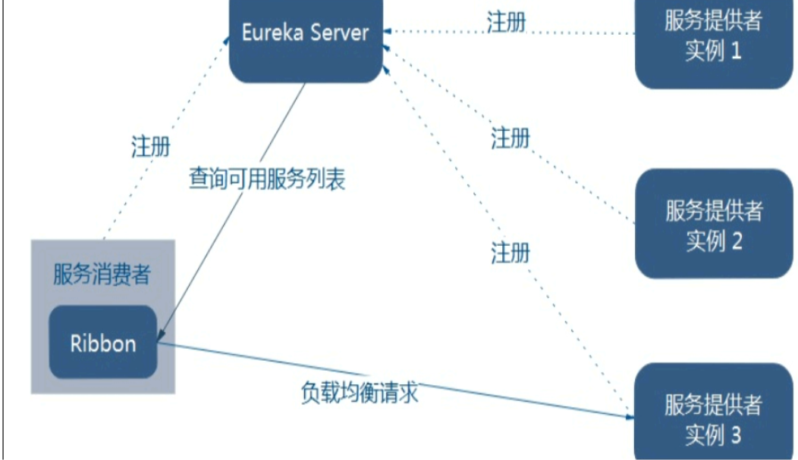
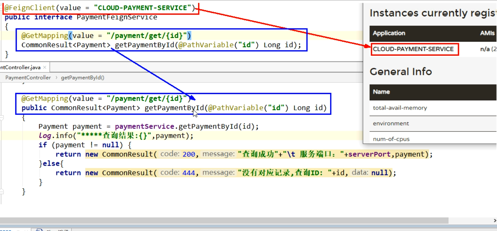

# 1 Zookeeper服务注册和发现

## 1、介绍


作用

（1）Zookeeper是一个分布式协调工具，可以实现注册中心功能。

（2）关闭Linux服务器的防火墙后启动Zookeeper服务器。

（3）Zookeeper服务器取代Eureka服务器，Zookeeper作为注册中心。

## 2、服务提供者cloud-provider-payment8004

### 1、创建项目

1、项目结构


2、添加yml文件

```yaml
#8004表示注册到zookeeper服务器的支付服务提供端口号
server:
  port: 8004

#服务别名 --- 注册zookeeper的 注册中心名称
#使用下面的39.96.161.64的地址并开通端口号，可以进行服务器的注册
spring:
  application:
    name: cloud-provider-payment
  cloud:
    zookeeper:
      connect-string: 39.96.161.64:2181
```

3、主启动类

```java
/**
 * @EnableDiscoveryClient
 *  此时不用添加Eureka
 *  该注解用于向使用consul或者zookeeper作为注册中心时注册服务
 */
@SpringBootApplication
@EnableDiscoveryClient
public class PaymentMain8004 {
	public static void main(String[] args) {
		SpringApplication.run(PaymentMain8004.class, args);
	}
}
```

4、Controller

```java
@RestController
@Slf4j
public class PaymentController {

	@Value("${server.port}")
	private String serverPort;

	@GetMapping(value = "/payment/zk")
	public String paymentzk(){
		return "springcloud with zookeeper:"+serverPort+"\t"+ UUID.randomUUID().toString();
	}
}
```

5、启动阿里云服务器上的zookeeper服务

6、启动`cloud-provider-payment8004`注册进zookeeper

（1）启动后遇到问题


​		这是因为我们服务器上使用的zookeeper的版本是3.4.10，而IDEA中导入的依赖中的版本是3.5.3，导致zookeeper版本jar包冲突。


（2）解决方法

```xml
 <!-- 只有这个是新的。SpringBoot整合Zookeeper客户端
            jar包冲突报错，jar包的排除和引入
         -->
<!--        <dependency>-->
<!--            <groupId>org.springframework.cloud</groupId>-->
<!--            <artifactId>spring-cloud-starter-zookeeper-discovery</artifactId>-->
<!--        </dependency>-->
<dependency>
    <groupId>org.springframework.cloud</groupId>
    <artifactId>spring-cloud-starter-zookeeper-discovery</artifactId>
    <!--先排除自身的zk3.5.3-->
    <exclusions>
        <exclusion>
            <groupId>org.apache.zookeeper</groupId>
            <artifactId>zookeeper</artifactId>
        </exclusion>
    </exclusions>
</dependency>
<!--再添加zk 3.4.10版本，与服务器的zk一致-->
<dependency>
    <groupId>org.apache.zookeeper</groupId>
    <artifactId>zookeeper</artifactId>
    <version>3.4.10</version>
</dependency>
```

7、测试

（1）输入http://localhost:8004/payment/zk，会在网页上返回一个端口和一串流水号。

（2）获得json串后用在线工具查看。

首先，启动zookeeper服务端后，使用下面的指令启动客户端，进行查看：

```shell
./zkCli.sh
```

通过下面的指令获取服务节点：

```
ls /
```

`cloud-provider-payment8004`节点是临时节点。

## 3、服务消费者cloud-consumerzk-order80

### 1、创建项目

1、项目结构


2、添加yml文件

```yaml
server:
  port: 80

spring:
  application:
    name: cloud-consumer-order
  cloud:
    #注册到zookeeper中的地址
    zookeeper:
      connect-string: 39.96.161.64:2181
```

3、启动类

```java
@SpringBootApplication
@EnableDiscoveryClient
public class OrderZKMain80 {
	public static void main(String[] args) {
		SpringApplication.run(OrderZKMain80.class,args);
	}
}
```

4、业务类

（1）配置Bean

```java
@Configuration
public class ApplicationContextConfig {

	@LoadBalanced
	@Bean
	public RestTemplate getRestTemplate() {
		return new RestTemplate();
	}
}
```

（2）controller

```java
@RestController
@Slf4j
public class OrderZKController {

	public static final String INVOME_URL = "http://cloud-provider-payment";

	@Resource
	private RestTemplate restTemplate;

	@GetMapping("/consumer/payment/zk")
	public String payment (){
		String result = restTemplate.getForObject(INVOME_URL+"/payment/zk",String.class);
		return result;
	}
}
```

5、启动cloud-consumerzk-order80注册进zookeeper

6、测试

​		此时，在环境中有`cloud-provider-payment8004`和`cloud-consumerzk-order80`同时运行。

（1）查看阿里云服务器的zookeeper的节点


（2）输入网址：http://localhost:8004/payment/zk

会在网页上返回一个端口和一串流水号。


（3）输入网址：http://localhost/consumer/payment/zk


# 2 Consul服务注册和发现

## 1、介绍

1、网址

介绍网址：https://www.consul.io/intro/index.html

下载网址：https://www.consul.io/downloads.html


2、作用

（1）服务发现：提供HTTP和DNS两种发现方式。

（2）健康监测：支持多种协议，HTTP、TCP、Docker、Shell脚本定制化。

（3）KV存储：key , Value的存储方式。

（4）多数据中心：Consul支持多数据中心。

（5）可视化Web界面。

## 2、安装并运行Consul

1、下载完成后只有一个consul.exe文件，硬盘路径下双击运行，使用下面的指令查看版本信息。

```ini
consul --version
```


2、使用开发模式启动

（1）使用下面的指令启动consul：

```ini
consul agent -dev
```

（2）通过以下地址可以访问Consul的首页：http://localhost:8500

（3）结果页面


## 3、服务提供者cloud-providerconsul-payment8006

### 1、创建项目

1、项目结构


2、添加yml文件

```yaml
#consul服务端口号
server:
  port: 8006

spring:
  application:
    name: consul-provider-payment
#consul 注册中心地址
  cloud:
    consul:
      host: localhost
      port: 8500
      discovery:
        service-name: ${spring.application.name}
```

3、主启动类

```java
@SpringBootApplication
@EnableDiscoveryClient
public class PaymentMain8006 {
   public static void main(String[] args) {
      SpringApplication.run(PaymentMain8006.class,args);
   }
}
```

4、业务类controller

```java
@RestController
@Slf4j
public class PaymentController {

   @Value("${server.port}")
   private String serverPort;

   @GetMapping(value = "/payment/consul")
   public String paymentConsul() {
      return "springcloud with consul: " + serverPort + "\t" + UUID.randomUUID().toString();
   }
}
```

5、测试

​		输入网址：http://localhost:8006/payment/consul，将会有一个端口号+ 一串流水号；输入网址：http://localhost:8500将会弹出下面的界面：


## 4、服务消费者cloud-consumerconsul-order80

### 1、创建项目

1、项目结构


2、添加yml文件

```yml
server:
  port: 80

spring:
  application:
    name: consul-consumer-order
  cloud:
    consul:
      host: localhost
      port: 8500
      discovery:
        service-name: ${spring.application.name}
```

3、主启动类

```java
@SpringBootApplication
@EnableDiscoveryClient
public class OrderConsulMain80 {
   public static void main(String[] args) {
      SpringApplication.run(OrderConsulMain80.class,args);
   }
}
```

4、业务类

（1）配置Bean

```java
@Configuration
public class ApplicationContextConfig {

   @LoadBalanced
   @Bean
   public RestTemplate getRestTemplate(){
      return new RestTemplate();
   }

}
```

（2）controller

```java
@RestController
@Slf4j
public class OrderConsulController {
	public static final String INVOME_URL = "http://consul-provider-payment";
	@Resource
	private RestTemplate restTemplate;

	@GetMapping("/consumer/payment/consul")
	public String payment() {
		String result = restTemplate.getForObject(INVOME_URL + "/payment/consul", String.class);
		return result;
	}
}
```

5、测试

（1）输入网址：http://localhost:8500，将会弹出下面的界面：


（2）输入网址：http://localhost/consumer/payment/consul，将会获得

cloud-providerconsul-payment8006的端口号+一串流水号。

## 5、三个注册中心的异同点

1、CAP

（1）C:Consistency(强一致性)

（2）A:Availability(可用性)

（3）P:Partition tolerance(分区容错)

CAP理论关注粒度是数据，而不是整体系统设计的策略。

2、分析


| 组件名    | 语言 | CAP  | 服务器健康检查 | 对外保留接口 | SpringBoot集成 |
| --------- | ---- | ---- | -------------- | ------------ | -------------- |
| Eureka    | Java | AP   | 可配支持       | HTTP         | 已集成         |
| Consul    | Go   | CP   | 支持           | HTTP/DNS     | 已集成         |
| Zookeeper | Java | CP   | 支持           | 客户端       | 已集成         |

（1）AP(Eureka)


（2）CP(Zookeeper/Consul)


# 3 Ribbon负载均衡服务调用

## 1、介绍


1、官网资料

网址：https://github.com/Netflix/ribbon/wiki/Getting-Started

目前Ribbon也进入维护阶段：


替代方案：


2、作用

（1）负载均衡


（a）集中式LB


（b）进程式LB


（2）总结

负载均衡+RestTemplate调用（80通过轮询负载访问8001/8002）。

## 2、负载均衡演示

1、架构说明

​		Ribbon其实就是一个软负载均衡的客户端组件，他可以和其他所需请求的客户端结合使用，和eureka结合只是其中的一个实例。




2、pom文件


3、RestTemplate的使用

（1）官网

https://docs.spring.io/spring-framework/docs/5.2.2.RELEASE/javadoc-api/org/springframework/web/client/RestTemplate.html


（2）getForObject方法/getForEntity方法


（3）postForObject/postForEntity


## 3、Ribbon核心组件IRule

1、根据特定算法从服务列表中选取一个要访问的服务。


2、如何替换

（1）修改cloud-consumer-order80模块

配置细节：


（2）新建package-com.xiaolun.myrule


（3）添加规则类

```java
@Configuration
public class MySelfRule {

    @Bean
    public IRule myRule(){
        return new RandomRule();//定义为随机
    }
}
```

（4）主启动类添加注解@RibbonClient

```java
@EnableEurekaClient
@SpringBootApplication
@RibbonClient(name = "CLOUD-PAYMENT-SERVICE",configuration = MySelfRule.class)
public class OrderMain80 {
    public static void main(String[] args) {
        SpringApplication.run(OrderMain80.class,args);
    }

}
```

（5）测试

输入网址：http://localhost/consumer/payment/get/5，可以随机访问。

## 4、手写负载均衡算法

1、原理


2、手写算法

（1）启动cloud-eureka-Server-7001/7002。

（2）改造cloud-provider-payment8001/8002

```java
//controller中添加下面的内容，当消费者访问时，可以将端口号返回
@GetMapping(value = "/payment/lb")
    public String getPaymentLB() {
    return serverPort;
}
```

（3）改造cloud-consumer-order80

（a）ApplicationContextBean去掉@LoadBalanced，主要是使用自己写的负载均衡。

（b）创建LoadBalancer接口


```java
public interface LoadBalancer {
	//收集服务器总共有多少台能够提供服务的机器，并放到list里面
	ServiceInstance instances(List<ServiceInstance> serviceInstances);

}
```

（c）LoadBalancer接口实现类

```java
@Component
public class MyLB implements LoadBalancer {

	private AtomicInteger atomicInteger = new AtomicInteger(0);

	//坐标
	private final int getAndIncrement() {
		int current;
		int next;
		do {
			current = this.atomicInteger.get();
			next = current >= 2147483647 ? 0 : current + 1;
		} while (!this.atomicInteger.compareAndSet(current, next));  //第一个参数是期望值，第二个参数是修改值
		System.out.println("*******第几次访问，次数next: " + next);
		return next;
	}

	@Override
	public ServiceInstance instances(List<ServiceInstance> serviceInstances) {  //得到机器的列表
		int index = getAndIncrement() % serviceInstances.size(); //得到服务器的下标位置
		return serviceInstances.get(index);
	}
}
```

（d）改造controller

```java
@Resource
private LoadBalancer loadBalancer;

@Resource
private DiscoveryClient discoveryClient;

@GetMapping(value = "/consumer/payment/lb")
	public String getPaymentLB() {
		List<ServiceInstance> instances = discoveryClient.getInstances("CLOUD-PAYMENT-SERVICE");
		if (instances == null || instances.size() <= 0) {
			return null;
		}
		ServiceInstance serviceInstance = loadBalancer.instances(instances);
		URI uri = serviceInstance.getUri();
		log.info("uri-----"+uri);
		return restTemplate.getForObject(uri + "/payment/lb", String.class);
	}
```

（e）测试

输入网址：http://localhost/consumer/payment/lb，浏览器输出：


端口8001/8002可以交替变换，即实现了负载均衡。

# 5 OpenFeign服务接口调用

## 1、介绍

1、概述


​		Feign是一个声明式的web服务客户端，让编写web服务客户端变得非常容易，只需创建一个接口并在接口上添加注解即可。

GitHub：https://github.com/spring-cloud/spring-cloud-openfeign

2、作用


3、Feign和OpenFeign的区别


## 2、OpenFeign使用步骤

核心：接口+注解：微服务调用接口+@FeignClient。

项目结构：


1、新建cloud-consumer-feign-order80，Feign在消费端使用。

2、添加pom文件

```xml
<dependency>
    <groupId>org.springframework.cloud</groupId>
    <artifactId>spring-cloud-starter-openfeign</artifactId>
</dependency>
```

3、添加yml文件

```yaml
server:
  port: 80

spring:
  application:
    name: cloud-order-service
eureka:
  client:
    register-with-eureka: true
    fetch-registry: true
    service-url:
      defaultZone: http://eureka7001.com:7001/eureka, http://eureka7002.com:7002/eureka
```

4、添加主启动类

```java
@SpringBootApplication
@EnableFeignClients //添加该注解
@EnableEurekaClient
public class OrderFeignMain80 {
	public static void main(String[] args) {
		SpringApplication.run(OrderFeignMain80.class, args);
	}
}
```

5、添加业务类

实现：业务逻辑接口+@FeignClient配置调用provider服务。

（1）新建PaymentFeignService接口并新增注解@FeignClient

```java
@Component
//CLOUD-PAYMENT-SERVICE服务的的名字
@FeignClient(value = "CLOUD-PAYMENT-SERVICE")
public interface PaymentFeignService {
	@GetMapping("/payment/get/{id}")
	public CommonResult<Payment> getPaymentById(@PathVariable("id") Long id);
}
```

​		注解`@FeignClient`是一个使用的标识，在启动类的注解`@EnableFeignClients`是一个启用标识。

（2）添加controller

```java
@RestController
public class OrderFeignController {

	@Resource
	private PaymentFeignService paymentFeignService;

	@GetMapping(value = "/consumer/payment/get/{id}")
	public CommonResult<Payment> getPaymentById(@PathVariable("id") Long id){
		return paymentFeignService.getPaymentById(id);
	}
}
```

5、测试

​		先启动2个eureka集群cloud-eureka-Server7001/7002，再启动2个微服务cloud-provider-payment8001/8002，最后启动cloud-consumer-feign-order80启动，输入地址：http://localhost/consumer/payment/get/5，


​		可以发现`Feign`自带负载均衡配置项，上图中的端口号8001/8002来回切换。

执行逻辑：

​		`cloud-consumer-feign-order80`模块此时作为消费者，当客户端输入地址后，地址首先会进入到`cloud-consumer-feign-order80`模块中`controller`中，即`OrderFeignController`的方法，执行完成后，该方法会到接口类`PaymentFeignService`中执行`@GetMapping`的方法，这样通过`OpenFeign`就可以调用`cloud-provider-payment8001/8002`，即消费者到服务者之间的网路就打通了。



## 3、超时控制

1、案例

（1）在服务提供方cloud-provider-payment8001/8002中的com.xiaolun.springcloud.controller中添加延时程序：

```java
@GetMapping(value = "/payment/feign/timeout")
public String paymentFeignTimeout() {
   try {
      TimeUnit.SECONDS.sleep(2);
   } catch (Exception e) {
      e.printStackTrace();
   }
   return serverPort;
}
```

（2）服务消费方cloud-consumer-feign-order80的接口com.xiaolun.service.PaymentFeignService中添加超时方法PaymentFeignService（和（1）中的方法对应）

```java
@GetMapping(value = "/payment/feign/timeout")
	public String paymentFeignTimeout();
```

（3）服务消费方cloud-consumer-feign-order80的控制类com.xiaolun.controller.OrderFeignController中添加超时方法PaymentFeignService

```java
@GetMapping(value = "/consumer/payment/feign/timeout")
public String paymentFeignTimeout(){
	return paymentFeignService.paymentFeignTimeout();
}
```

（4）测试

​		先启动2个eureka集群cloud-eureka-Server7001/7002，再启动2个微服务cloud-provider-payment8001/8002，最后启动cloud-consumer-feign-order80启动，输入地址：http://localhost/consumer/payment/feign/timeout，会有下面的错误界面


2、超时问题的解决


​		所以，我们需要在yml文件中开启超时的配置信息。因为OpenFeign默认支持Ribbon，如下图所示：


​		我们只需要在yml文件中添加如下的配置即可开启OpenFeign客户端超时控制：

```yaml
#设置feign客户端超时时间（OpenFeign默认支持ribbon）
ribbon:
  #指的是建立连接后从服务器读取可用资源所用的时间
  ReadTimeout:  5000
  #指的是建立连接所用的时间，适用于网络状况正常的情况下，两端连接时间
  ConnectTimeout: 5000
```

注：当我们只在cloud-provider-payment8001中添加方法时，而未在cloud-provider-payment8002中添加超时方式法，由于cloud-consumer-feign-order80会轮询的访问服务提供者，所以，在访问的过程中，有一次会出错。

## 4、日志打印

1、介绍


日志级别:


2、日志打印的配置

（1）目录结构


（2）在com.xiaolun.config下配置日志bean

```java
@Configuration
public class FeignConfig {

   @Bean
   Logger.Level feignLoggerLevel(){
      //代表自己开启的是一个详细日志
      return Logger.Level.FULL;
   }
}
```

（3）在yml文件中开启日志的Feign客户端

```yaml
logging:
  level:
    #feign日志以debug级别监控下面这个接口，并打印出全部日志信息
    com.xiaolun.service.PaymentFeignService: debug
```

（4）后台日志查看

