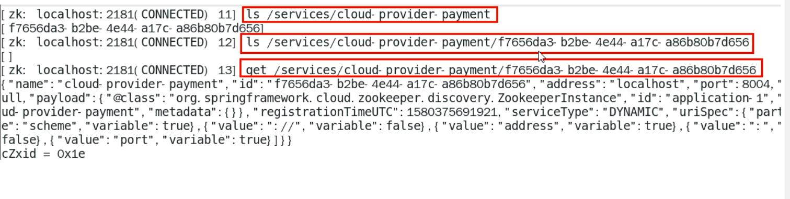
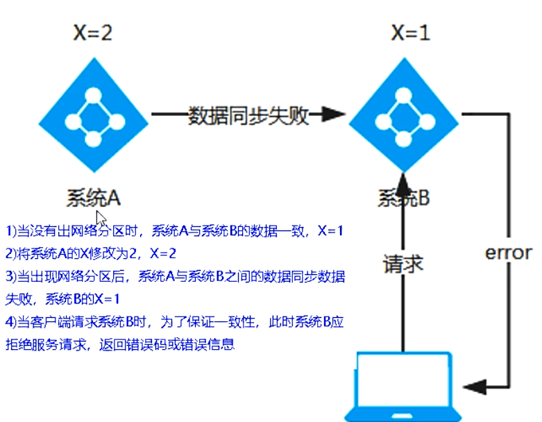

# 1 Zookeeper服务注册和发现

## 1、介绍


作用

（1）Zookeeper是一个分布式协调工具，可以实现注册中心功能。

（2）关闭Linux服务器的防火墙后启动Zookeeper服务器。

（3）Zookeeper服务器取代Eureka服务器，Zookeeper作为注册中心。

## 2、服务提供者cloud-provider-payment8004

### 1、创建项目

1、项目结构


2、添加yml文件

```yaml
#8004表示注册到zookeeper服务器的支付服务提供端口号
server:
  port: 8004

#服务别名 --- 注册zookeeper的 注册中心名称
#使用下面的39.96.161.64的地址并开通端口号，可以进行服务器的注册
spring:
  application:
    name: cloud-provider-payment
  cloud:
    zookeeper:
      connect-string: 39.96.161.64:2181
```

3、主启动类

```java
/**
 * @EnableDiscoveryClient
 *  此时不用添加Eureka
 *  该注解用于向使用consul或者zookeeper作为注册中心时注册服务
 */
@SpringBootApplication
@EnableDiscoveryClient
public class PaymentMain8004 {
	public static void main(String[] args) {
		SpringApplication.run(PaymentMain8004.class, args);
	}
}
```

4、Controller

```java
@RestController
@Slf4j
public class PaymentController {

	@Value("${server.port}")
	private String serverPort;

	@GetMapping(value = "/payment/zk")
	public String paymentzk(){
		return "springcloud with zookeeper:"+serverPort+"\t"+ UUID.randomUUID().toString();
	}
}
```

5、启动阿里云服务器上的zookeeper服务

6、启动`cloud-provider-payment8004`注册进zookeeper

（1）启动后遇到问题


​		这是因为我们服务器上使用的zookeeper的版本是3.4.10，而IDEA中导入的依赖中的版本是3.5.3，导致zookeeper版本jar包冲突。


（2）解决方法

```xml
 <!-- 只有这个是新的。SpringBoot整合Zookeeper客户端
            jar包冲突报错，jar包的排除和引入
         -->
<!--        <dependency>-->
<!--            <groupId>org.springframework.cloud</groupId>-->
<!--            <artifactId>spring-cloud-starter-zookeeper-discovery</artifactId>-->
<!--        </dependency>-->
<dependency>
    <groupId>org.springframework.cloud</groupId>
    <artifactId>spring-cloud-starter-zookeeper-discovery</artifactId>
    <!--先排除自身的zk3.5.3-->
    <exclusions>
        <exclusion>
            <groupId>org.apache.zookeeper</groupId>
            <artifactId>zookeeper</artifactId>
        </exclusion>
    </exclusions>
</dependency>
<!--再添加zk 3.4.10版本，与服务器的zk一致-->
<dependency>
    <groupId>org.apache.zookeeper</groupId>
    <artifactId>zookeeper</artifactId>
    <version>3.4.10</version>
</dependency>
```

7、测试

（1）输入http://localhost:8004/payment/zk，会在网页上返回一个端口和一串流水号。

（2）获得json串后用在线工具查看。

首先，启动zookeeper服务端后，使用下面的指令启动客户端，进行查看：

```shell
./zkCli.sh
```

通过下面的指令获取服务节点：

```
ls /
```

`cloud-provider-payment8004`节点是临时节点。

## 3、服务消费者cloud-consumerzk-order80

### 1、创建项目

1、项目结构


2、添加yml文件

```yaml
server:
  port: 80

spring:
  application:
    name: cloud-consumer-order
  cloud:
    #注册到zookeeper中的地址
    zookeeper:
      connect-string: 39.96.161.64:2181
```

3、启动类

```java
@SpringBootApplication
@EnableDiscoveryClient
public class OrderZKMain80 {
	public static void main(String[] args) {
		SpringApplication.run(OrderZKMain80.class,args);
	}
}
```

4、业务类

（1）配置Bean

```java
@Configuration
public class ApplicationContextConfig {

	@LoadBalanced
	@Bean
	public RestTemplate getRestTemplate() {
		return new RestTemplate();
	}
}
```

（2）controller

```java
@RestController
@Slf4j
public class OrderZKController {

	public static final String INVOME_URL = "http://cloud-provider-payment";

	@Resource
	private RestTemplate restTemplate;

	@GetMapping("/consumer/payment/zk")
	public String payment (){
		String result = restTemplate.getForObject(INVOME_URL+"/payment/zk",String.class);
		return result;
	}
}
```

5、启动cloud-consumerzk-order80注册进zookeeper

6、测试

​		此时，在环境中有`cloud-provider-payment8004`和`cloud-consumerzk-order80`同时运行。

（1）查看阿里云服务器的zookeeper的节点


（2）输入网址：http://localhost:8004/payment/zk

会在网页上返回一个端口和一串流水号。


（3）输入网址：http://localhost/consumer/payment/zk


# 2 Consul服务注册和发现

## 1、介绍

1、网址

介绍网址：https://www.consul.io/intro/index.html

下载网址：https://www.consul.io/downloads.html


2、作用

（1）服务发现：提供HTTP和DNS两种发现方式。

（2）健康监测：支持多种协议，HTTP、TCP、Docker、Shell脚本定制化。

（3）KV存储：key , Value的存储方式。

（4）多数据中心：Consul支持多数据中心。

（5）可视化Web界面。

## 2、安装并运行Consul

1、下载完成后只有一个consul.exe文件，硬盘路径下双击运行，使用下面的指令查看版本信息。

```ini
consul --version
```


2、使用开发模式启动

（1）使用下面的指令启动consul：

```ini
consul agent -dev
```

（2）通过以下地址可以访问Consul的首页：http://localhost:8500

（3）结果页面


## 3、服务提供者cloud-providerconsul-payment8006

### 1、创建项目

1、项目结构


2、添加yml文件

```yaml
#consul服务端口号
server:
  port: 8006

spring:
  application:
    name: consul-provider-payment
#consul 注册中心地址
  cloud:
    consul:
      host: localhost
      port: 8500
      discovery:
        service-name: ${spring.application.name}
```

3、主启动类

```java
@SpringBootApplication
@EnableDiscoveryClient
public class PaymentMain8006 {
   public static void main(String[] args) {
      SpringApplication.run(PaymentMain8006.class,args);
   }
}
```

4、业务类controller

```java
@RestController
@Slf4j
public class PaymentController {

   @Value("${server.port}")
   private String serverPort;

   @GetMapping(value = "/payment/consul")
   public String paymentConsul() {
      return "springcloud with consul: " + serverPort + "\t" + UUID.randomUUID().toString();
   }
}
```

5、测试

​		输入网址：http://localhost:8006/payment/consul，将会有一个端口号+ 一串流水号；输入网址：http://localhost:8500将会弹出下面的界面：


## 4、服务消费者cloud-consumerconsul-order80

### 1、创建项目

1、项目结构


2、添加yml文件

```yml
server:
  port: 80

spring:
  application:
    name: consul-consumer-order
  cloud:
    consul:
      host: localhost
      port: 8500
      discovery:
        service-name: ${spring.application.name}
```

3、主启动类

```java
@SpringBootApplication
@EnableDiscoveryClient
public class OrderConsulMain80 {
   public static void main(String[] args) {
      SpringApplication.run(OrderConsulMain80.class,args);
   }
}
```

4、业务类

（1）配置Bean

```java
@Configuration
public class ApplicationContextConfig {

   @LoadBalanced
   @Bean
   public RestTemplate getRestTemplate(){
      return new RestTemplate();
   }

}
```

（2）controller

```java
@RestController
@Slf4j
public class OrderConsulController {
	public static final String INVOME_URL = "http://consul-provider-payment";
	@Resource
	private RestTemplate restTemplate;

	@GetMapping("/consumer/payment/consul")
	public String payment() {
		String result = restTemplate.getForObject(INVOME_URL + "/payment/consul", String.class);
		return result;
	}
}
```

5、测试

（1）输入网址：http://localhost:8500，将会弹出下面的界面：


（2）输入网址：http://localhost/consumer/payment/consul，将会获得

cloud-providerconsul-payment8006的端口号+一串流水号。

## 5、三个注册中心的异同点

1、CAP

（1）C:Consistency(强一致性)

（2）A:Availability(可用性)

（3）P:Partition tolerance(分区容错)

CAP理论关注粒度是数据，而不是整体系统设计的策略。

2、分析


| 组件名    | 语言 | CAP  | 服务器健康检查 | 对外保留接口 | SpringBoot集成 |
| --------- | ---- | ---- | -------------- | ------------ | -------------- |
| Eureka    | Java | AP   | 可配支持       | HTTP         | 已集成         |
| Consul    | Go   | CP   | 支持           | HTTP/DNS     | 已集成         |
| Zookeeper | Java | CP   | 支持           | 客户端       | 已集成         |

（1）AP(Eureka)


（2）CP(Zookeeper/Consul)


