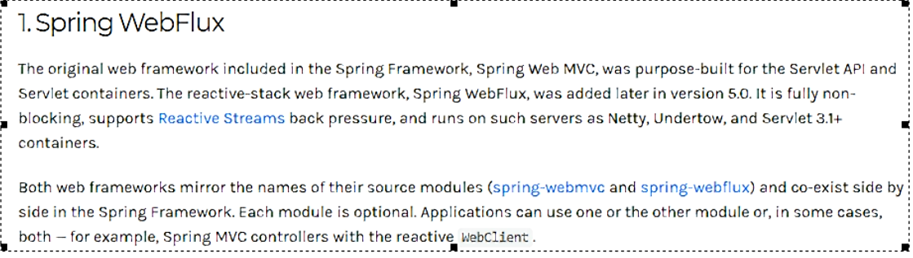
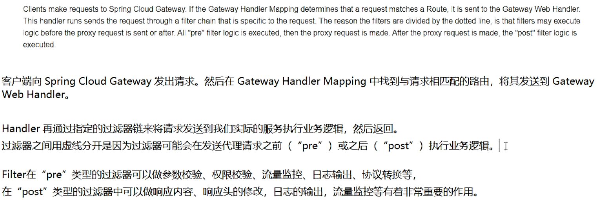

# 1 网关GateWay

## 1、介绍

1、官网

上一代zuul1.x：https://github.com/Netflix/zuul/wiki

当前gateway：https://cloud.spring.io/spring-cloud-static/spring-cloud-gateway/2.2.1.RELEASE/reference/html/

2、概述

总结：Spring Cloud Gateway 使用的Webflux中的reactor-netty响应式编程组件，底层使用了Netty通讯框架

源码结构：

2、作用

反向代理、鉴权、流量控制、熔断和日志监控。

微服务架构中网关位置：

3、选择GateWay的原因

（1）neflix不太靠谱，zuul2.0一直跳票,迟迟不发布

（2）SpringCloud Gateway具有如下特性

（3）SpringCloud Gateway与Zuul的区别

4、Zuul1.x模型

5、GateWay模型

（1）WebFlux介绍

（2）说明

## 2、三大核心概念

1、Route（路由）：路由是构建网关的基本模块，它由ID，目标URI，一系列的断言和过滤器组成，如果断言为true则匹配该路由。

2、Predicate（断言）：参考的是java8的java.util.function.Predicate开发人员可以匹配HTTP请求中的所有内容（例如请求头或请求参数），如果请求与断言相匹配则进行路由。

3、Filter(过滤)：指的是Spring框架中GatewayFilter的实例，使用过滤器，可以在请求被路由前或者之后对请求进行修改。

4、总体

## 3、工作流程

1、官网总结

2、核心逻辑

路由转发+执行过滤器链。

## 4、入门配置

