# SpringCloud Alibaba Sentinel实现熔断与限流

## 1 介绍

1、官网

https://github.com/alibaba/Sentinel

中文

https://github.com/alibaba/Sentinel/wiki/%E4%BB%8B%E7%BB%8D

2、概述

一句话解释，之前我们讲解过的Hystrix。

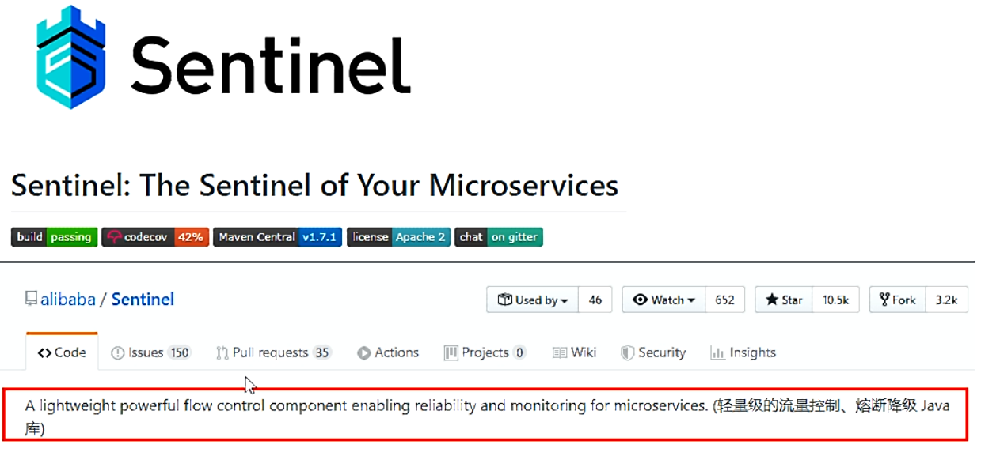

3、下载

https://github.com/alibaba/Sentinel/releases

4、作用


5、操作

（1）操作API

https://spring-cloud-alibaba-group.github.io/github-pages/greenwich/spring-cloud-alibaba.html#_spring_cloud_alibaba_sentinel

（2）服务使用中的各种问题

+ 服务雪崩

+ 服务降级

+ 服务熔断

+ 服务限流

## 2 安装Sentinel控制台

1、sentinel组件由2部分组成

前台8080+后台。


2、下载网址

https://github.com/alibaba/Sentinel/releases

我们将sentinel-dashboard-1.8.0.jar下载到本地。

3、运行命令

注意，此时java8环境OK，8080端口不能被占用。

```java
java -jar sentinel-dashboard-1.7.0.jar 
```


4、访问sentinel管理界面

```http
http://localhost:8080
```

登录账号密码均为sentinel。

## 3 初始化工程演示

项目名：cloudalibaba-sentinel-service8401。

项目结构：


1、添加pom

```xml
 <dependencies>
        <dependency>
            <groupId>com.xiaolun.springcloud</groupId>
            <artifactId>cloud-api-commons</artifactId>
            <version>${project.version}</version>
        </dependency>

        <dependency>
            <groupId>com.alibaba.cloud</groupId>
            <artifactId>spring-cloud-starter-alibaba-nacos-discovery</artifactId>
        </dependency>
        <!--后续做持久化会用到-->
        <dependency>
            <groupId>com.alibaba.csp</groupId>
            <artifactId>sentinel-datasource-nacos</artifactId>
        </dependency>

        <dependency>
            <groupId>com.alibaba.cloud</groupId>
            <artifactId>spring-cloud-starter-alibaba-sentinel</artifactId>
        </dependency>

        <dependency>
            <groupId>org.springframework.cloud</groupId>
            <artifactId>spring-cloud-starter-openfeign</artifactId>
        </dependency>

        <dependency>
            <groupId>org.springframework.boot</groupId>
            <artifactId>spring-boot-starter-web</artifactId>
        </dependency>
        <dependency>
            <groupId>org.springframework.boot</groupId>
            <artifactId>spring-boot-starter-actuator</artifactId>
        </dependency>

        <dependency>
            <groupId>org.springframework.boot</groupId>
            <artifactId>spring-boot-devtools</artifactId>
            <scope>runtime</scope>
            <optional>true</optional>
        </dependency>
        <dependency>
            <groupId>cn.hutool</groupId>
            <artifactId>hutool-all</artifactId>
            <version>4.6.3</version>
        </dependency>
        <dependency>
            <groupId>org.projectlombok</groupId>
            <artifactId>lombok</artifactId>
            <optional>true</optional>
        </dependency>
        <dependency>
            <groupId>org.springframework.boot</groupId>
            <artifactId>spring-boot-starter-test</artifactId>
            <scope>test</scope>
        </dependency>

    </dependencies>
```

2、添加yml

```yaml
server:
  port: 8401

spring:
  application:
    name: cloudalibaba-sentinel-service
  cloud:
    nacos:
      discovery:
        server-addr: localhost:8848
    sentinel:
      transport:
        dashboard: localhost:8080
        port: 8719  #默认8719，假如被占用了会自动从8719开始依次+1扫描。直至找到未被占用的端口

management:
  endpoints:
    web:
      exposure:
        include: '*'
```

3、主启动类

```java
@EnableDiscoveryClient
@SpringBootApplication
public class MainApp8401 {
   public static void main(String[] args) {
      SpringApplication.run(MainApp8401.class, args);
   }
}
```

4、业务类-controller

```java
@RestController
public class FlowLimitController {
   @GetMapping("/testA")
   public String testA() {
      return "------testA";
   }

   @GetMapping("/testB")
   public String testB() {

      return "------testB";
   }
}
```

5、测试

​		后台依次启动Sentinel8080，Nacos8848，cloudalibaba-sentinel-service8401。由于Sentinel采用的懒加载，我们需要使用下面的指令执行一两次访问即可：

```http
http://localhost:8401/testA
http://localhost:8401/testB
```


## 4 流控规则

### 1、基本介绍


### 2、直接（默认）

（1）配置及说明

系统默认为：直接快速失败（QPS）。


对于上图的配置，如果我们在1S秒内快速点击后访问下面的网址：

```http
http://localhost:8401/testA
```

将会弹出下面的信息：

```ini
Blocked by Sentinel (flow limiting)
```

​		在这里，我们会有这方面的考虑：对于上面调用的默认报错信息，我们是否可以有类似于fallback这样的兜底方法，进行后续处理？

（2）线程数直接快速失败


controller的修改：

```java
@RestController
public class FlowLimitController {
   @GetMapping("/testA")
   public String testA() {
      //暂停0.8秒
      try {
         TimeUnit.MILLISECONDS.sleep(2000);
      } catch (InterruptedException e) {
         e.printStackTrace();
      }
      return "------testA";
   }

   @GetMapping("/testB")
   public String testB() {

      return "------testB";
   }
}
```

即对于每一个线程都要服务2秒中，当我们开启两个线程访问下面网址时：

```http
http://localhost:8401/testA
```

第二个请求会失效。


### 3、关联

（1）当关联的资源达到阈值时，就限流自己。配置如下：


（2）配置postman

使用postman模拟并发密集访问testB。

（a）postman里新建多线程集合组


（b）将访问地址添加进新线程组


（c）配置线程并启动


（3）此时

在运行过程中，点击访问下面的网址：

```http
http://localhost:8401/testA
```

结果显示为：

```ini
Blocked by Sentinel (flow limiting)
```

testA挂掉了。

### 4、预热

（1）官网

https://github.com/alibaba/Sentinel/wiki/%E9%99%90%E6%B5%81---%E5%86%B7%E5%90%AF%E5%8A%A8

​		默认coldFactor为3，即请求QPS从threshold/3开始，经预热时长逐渐升至设定的QPS阈值。


（2）源码

```java
com.alibaba.csp.sentinel.slots.block.flow.controller.WarmUpController
```


（3）配置


（4）测试

点击访问下面的网址：

```http
http://localhost:8401/testB
```

刚开始不行，随着时间的增加可以抵挡住访问。

（5）应用场景

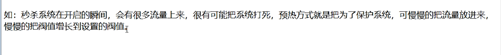

### 5、排队等待

（1）官网介绍

匀速排队，阈值必须设置为QPS。


（2）源码

```java
com.alibaba.csp.sentinel.slots.block.flow.controller.RateLimiterController
```

（3）sentinel配置


（4）postman配置


（5）修改controller

```java
@RestController
@Slf4j
public class FlowLimitController {
   @GetMapping("/testA")
   public String testA() {
      return "------testA";
   }

   @GetMapping("/testB")
   public String testB() {
      log.info(Thread.currentThread().getName()+"\t"+".....testB");
      return "------testB";
   }
}
```

控制台输出


## 5 降级

### 1、介绍

1、基本介绍


Sentinel的断路器是没有半开状态的。半开的状态系统自动去检测是否请求有异常，没有异常就关闭断路器恢复使用，有异常则继续打开断路器不可用。具体可以参考Hystrix。

### 2、RT

1、介绍


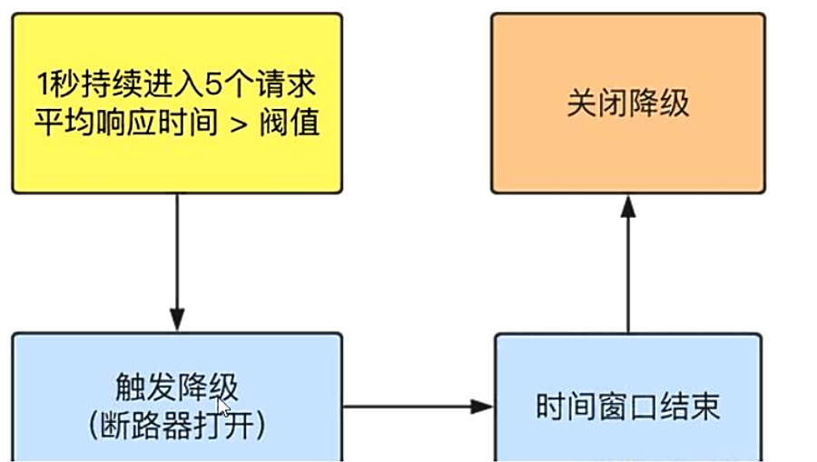

2、代码测试

1.7.0版sentinel：

（1）修改controller

```java
    @GetMapping("/testD")
    public String testD()
    {
        try { TimeUnit.SECONDS.sleep(1); } catch (InterruptedException e) { e.printStackTrace(); }
        log.info("testD 测试RT");

        return "------testD";
    }
```

（2）配置sentinel


1.8.0sentinel的配置如下：


（3）jmeter压测

在1秒中内发送10个请求。之后再点击访问下面的网址：

```http
http://localhost:8401/testD
```

此时，会弹出下面的提示信息：

```ini
Blocked by Sentinel (flow limiting)
```

（4）结论


### 3、异常比例

1、介绍


2、代码测试

（1）添加代码

```java
@GetMapping("/testD")
public String testD()
{
    log.info("testD 测试异常比例");
    int age = 10/0;
    return "------testD";
}
```

（2）配置sentinel


（3）jmeter压测

在1秒中内发送10个请求。之后再点击访问下面的网址：

```http
http://localhost:8401/testD
```

（4）结论


### 4、异常数

1、介绍

异常数是按照分钟统计的。


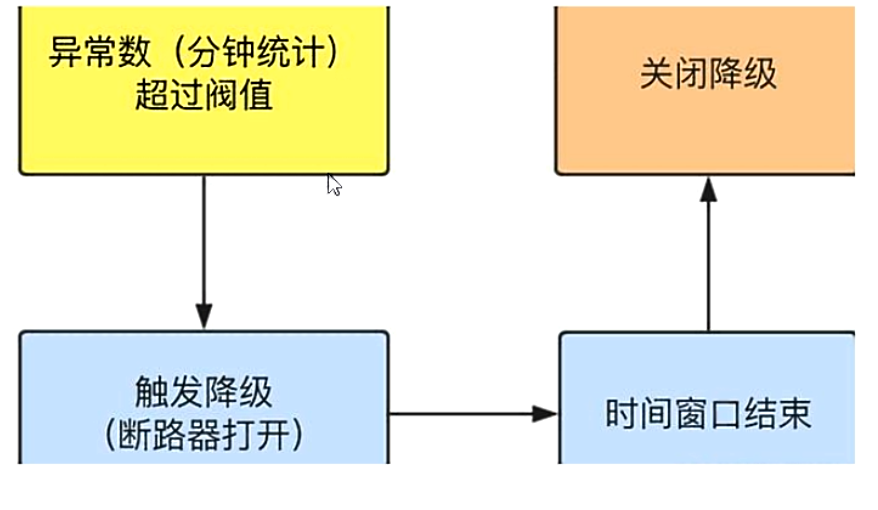

2、代码测试

（1）controller添加代码

```java
@GetMapping("/testE")
public String testE()
{
    log.info("testE 测试异常数");
    int age = 10/0;
    return "------testE 测试异常数";
}
```

（2）配置


1.8版本变成下面这样的：


## 6 热点key限流

1、介绍


2、官网

https://github.com/alibaba/Sentinel/wiki/热点参数限流

3、@SentinelResource引出

​		兜底方法分为系统默认和客户自定义两种，之前的案例都是限流出现问题后，使用sentinel系统默认的提示：

```ini
Blocked by Sentinel (flow limiting)
```

​		我们可不可以类似Hystrix一样，找到一种兜底方法，即使用注解@SentinelResource。

4、代码测试

（1）controller中添加代码

```java
@GetMapping("/testHotKey")
	@SentinelResource(value = "testHotKey",blockHandler = "deal_testHotKey")
	public String testHotKey(@RequestParam(value = "p1",required = false) String p1,
							 @RequestParam(value = "p2",required = false) String p2) {
		//int age = 10/0;  //异常测试
		return "------testHotKey";
	}

	//兜底方法
	public String deal_testHotKey (String p1, String p2, BlockException exception){
		return "------deal_testHotKey,o(╥﹏╥)o";
	}
```

注意：

```java
//配置1:异常打到了前台用户界面看不到，不友好
@SentinelResource(value = "testHotKey")

//配置2如上面代码的配置，此时方法testHostKey里面第一个参数只要QPS超过每秒1次，马上降级处理(用了我们自己定义的)
```

（2）sentinel配置


（3）测试

案例演示第一个参数p1,当QPS超过1秒1次点击后马上被限流。

```http
//异常情况，包含p1参数
http://localhost:8401/testHotKey?p1=abc
http://localhost:8401/testHotKey?p1=abc&p2=33

//正常情况
http://localhost:8401/testHotKey?p2=abc
http://localhost:8401/testHotKey
```

5、特殊情况

​		我们期望p1参数当它是某个特殊值时，它的限流值和平时不一样，假如当p1的值等于5时，它的阈值可以达到200。

（1）sentinel配置


热点参数的注意点，参数必须是基本类型或者String。

（2）测试

```http
//当p1等于5的时候，阈值变为200
http://localhost:8401/testHotKey?p1=5

//当p1不等于5的时候，阈值就是平常的1
http://localhost:8401/testHotKey?p1=3
```

6、异常情况的处理

将testHotKey方法的注释打开

```java
//int age = 10/0;
```

输入网址：

```http
http://localhost:8401/testHotKey
```

浏览器界面：


解释如下：


## 7 系统规则

1、介绍

网址：

```http
https://github.com/alibaba/Sentinel/wiki/%E7%B3%BB%E7%BB%9F%E8%87%AA%E9%80%82%E5%BA%94%E9%99%90%E6%B5%81
```

2、各参数配置说明

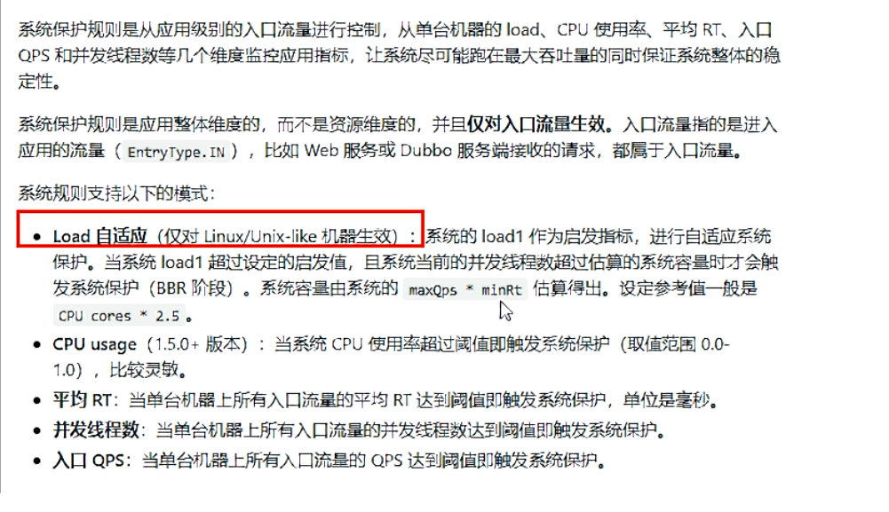


## 8 @SentinelResource配置

### 1、按资源名称限流+后续处理

1、修改cloudalibaba-sentinel-service8401。

（1）pom修改

添加下面的工具类：

```xml
<dependency>
    <groupId>com.xiaolun.springcloud</groupId>
    <artifactId>cloud-api-commons</artifactId>
    <version>${project.version}</version>
</dependency>
```

（2）新建业务类-RateLimitController

项目结构：


```java
@RestController
public class RateLimitController {
   @GetMapping("/byResource")
   @SentinelResource(value = "byResource", blockHandler = "handleException")
   public CommonResult byResource() {
      return new CommonResult(200, "按资源名称限流测试OK", new Payment(2020L, "serial001"));
   }

   public CommonResult handleException(BlockException exception) {
      return new CommonResult(444, exception.getClass().getCanonicalName() + "\t 服务不可用");
   }
}
```

（3）配置流控规则

对资源名称进行限流。


​		疯狂点击，超过设定的流控阈值（限流发送），将会返回了自己定义的限流处理信息。

访问网址：

```http
http://localhost:8401/byResource
```

注意：

（1）此时，我们关闭服务cloudalibaba-sentinel-service8401，在Sentinel控制台，会发现流控规则消失了，即此时的流控规则是临时的而非持久的。

（2）修改注解，将兜底处理方式去掉

```java
@SentinelResource(value = "byResource")
```


### 2、按照Url地址限流+后续处理

（1）在业务类RateLimitController中添加新方法

```java
@GetMapping("/rateLimit/byUrl")
@SentinelResource(value = "byUrl")
public CommonResult byUrl()
{
    return new CommonResult(200,"按url限流测试OK",new Payment(2020L,"serial002"));
}
```

（2）Sentinel控制台配置

​		通过访问的URL来限流，会返回Sentinel自带默认的限流处理信息。


（3）测试

点击访问下面网址：

```http
http://localhost:8401/rateLimit/byUrl
```

浏览器输出：


### 3、兜底方法遇到的问题


### 4、客户自定义限流处理逻辑

1、创建customerBlockHandler类用于自定义限流处理逻辑

项目结构：


```java
//自定义限流处理类
public class CustomerBlockHandler {
   public static CommonResult handlerException(BlockException exception) {
      return new CommonResult(4444, "自定义限流处理信息....CustomerBlockHandler");

   }
}
```

2、controller中添加新方法

```java
/**
 * 采用指定的类进行处理Sentinel,此时
 * blockHandlerClass：指定处理的类
 * blockHandler：指定处理的方法
 */
@GetMapping("/rateLimit/customerBlockHandler")
@SentinelResource(value = "customerBlockHandler",
      blockHandlerClass = CustomerBlockHandler.class,
      blockHandler = "handlerException")
public CommonResult customerBlockHandler() {
   return new CommonResult(200, "按客戶自定义", new Payment(2020L, "serial003"));
}
```

对应规则：


3、Sentinel控制台配置

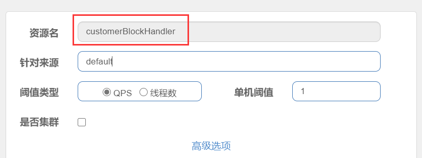

4、使用下面的网址进行测试

```java
http://localhost:8401/rateLimit/customerBlockHandler
```


5、更多注解属性说明

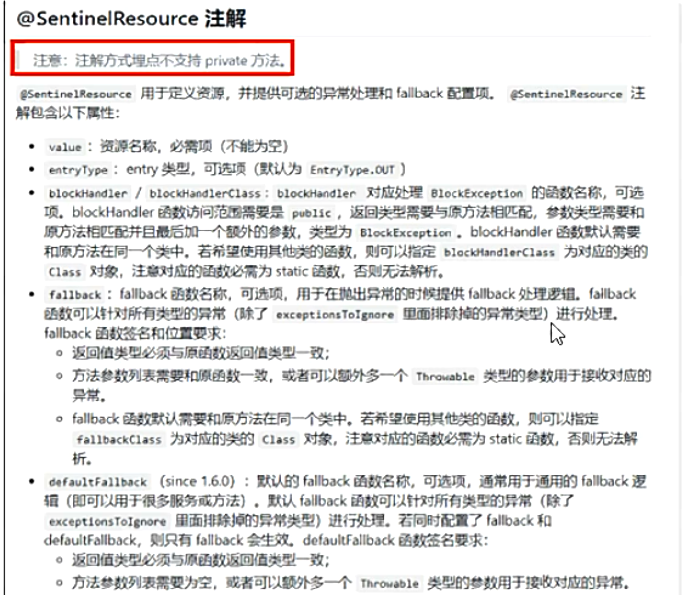

Sentinel主要有三个核心API

SphU定义资源；Tracer定义统计；ContextUtil定义了上下文。

## 9 服务熔断

### 1、sentinel整合ribbon

#### 1、新建cloudalibaba-provider-payment9003/9004

项目结构：


1、添加pom

```xml
<dependencies>
        <!--SpringCloud ailibaba nacos -->
        <dependency>
            <groupId>com.alibaba.cloud</groupId>
            <artifactId>spring-cloud-starter-alibaba-nacos-discovery</artifactId>
        </dependency>
        <dependency><!-- 引入自己定义的api通用包，可以使用Payment支付Entity -->
            <groupId>com.xiaolun.springcloud</groupId>
            <artifactId>cloud-api-commons</artifactId>
            <version>${project.version}</version>
        </dependency>
        <!-- SpringBoot整合Web组件 -->
        <dependency>
            <groupId>org.springframework.boot</groupId>
            <artifactId>spring-boot-starter-web</artifactId>
        </dependency>
        <dependency>
            <groupId>org.springframework.boot</groupId>
            <artifactId>spring-boot-starter-actuator</artifactId>
        </dependency>
        <!--日常通用jar包配置-->
        <dependency>
            <groupId>org.springframework.boot</groupId>
            <artifactId>spring-boot-devtools</artifactId>
            <scope>runtime</scope>
            <optional>true</optional>
        </dependency>
        <dependency>
            <groupId>org.projectlombok</groupId>
            <artifactId>lombok</artifactId>
            <optional>true</optional>
        </dependency>
        <dependency>
            <groupId>org.springframework.boot</groupId>
            <artifactId>spring-boot-starter-test</artifactId>
            <scope>test</scope>
        </dependency>
    </dependencies>
```

2、添加yml

```yaml
server:
  port: 9003

spring:
  application:
    name: nacos-payment-provider
  cloud:
    nacos:
      discovery:
        server-addr: localhost:8848 #配置Nacos地址

management:
  endpoints:
    web:
      exposure:
        include: '*'
```

3、主启动

```java
@SpringBootApplication
@EnableDiscoveryClient
public class PaymentMain9003 {
	public static void main(String[] args) {
		SpringApplication.run(PaymentMain9003.class, args);
	}
}
```

4、业务类-controller

```java
@RestController
public class PaymentController {
	@Value("${server.port}")
	private String serverPort;

	public static HashMap<Long, Payment> hashMap = new HashMap<>();

	//手写一个简易的数据库
	static {
		hashMap.put(1L, new Payment(1L, "28a8c1e3bc2742d8848569891fb42181"));
		hashMap.put(2L, new Payment(2L, "bba8c1e3bc2742d8848569891ac32182"));
		hashMap.put(3L, new Payment(3L, "6ua8c1e3bc2742d8848569891xt92183"));
	}

	@GetMapping(value = "/paymentSQL/{id}")
	public CommonResult<Payment> paymentSQL(@PathVariable("id") Long id) {
		Payment payment = hashMap.get(id);
		CommonResult<Payment> result = new CommonResult(200, "from mysql,serverPort:  " + serverPort, payment);
		return result;
	}

}
```

5、测试

​		依次启动nacos，sentinel，然后输入下面的地址进行测试该模块的正确性：

```http
http://localhost:9003/paymentSQL/1
```

#### 2、新建cloudalibaba-consumer-nacos-order84

项目结构：


1、添加pom

```xml
<dependencies>
    <dependency>
        <groupId>org.springframework.cloud</groupId>
        <artifactId>spring-cloud-starter-openfeign</artifactId>
    </dependency>
    <dependency>
        <groupId>com.alibaba.cloud</groupId>
        <artifactId>spring-cloud-starter-alibaba-nacos-discovery</artifactId>
    </dependency>
    <dependency>
        <groupId>com.alibaba.cloud</groupId>
        <artifactId>spring-cloud-starter-alibaba-sentinel</artifactId>
    </dependency>
    <dependency>
        <groupId>com.xiaolun.springcloud</groupId>
        <artifactId>cloud-api-commons</artifactId>
        <version>${project.version}</version>
    </dependency>
    <dependency>
        <groupId>org.springframework.boot</groupId>
        <artifactId>spring-boot-starter-web</artifactId>
    </dependency>
    <dependency>
        <groupId>org.springframework.boot</groupId>
        <artifactId>spring-boot-starter-actuator</artifactId>
    </dependency>
    <dependency>
        <groupId>org.springframework.boot</groupId>
        <artifactId>spring-boot-devtools</artifactId>
        <scope>runtime</scope>
        <optional>true</optional>
    </dependency>
    <dependency>
        <groupId>org.projectlombok</groupId>
        <artifactId>lombok</artifactId>
        <optional>true</optional>
    </dependency>
    <dependency>
        <groupId>org.springframework.boot</groupId>
        <artifactId>spring-boot-starter-test</artifactId>
        <scope>test</scope>
    </dependency>
</dependencies>
```

2、添加yml

```yaml
server:
  port: 84

spring:
  application:
    name: nacos-order-consumer
  cloud:
    nacos:
      discovery:
        server-addr: localhost:8848
    sentinel:
      transport:
        dashboard: localhost:8080
        port: 8719

service-url:
  nacos-user-service: http://nacos-payment-provider
```

3、主启动类

```java
@EnableDiscoveryClient
@SpringBootApplication
@EnableFeignClients
public class OrderNacosMain84 {
   public static void main(String[] args) {
      SpringApplication.run(OrderNacosMain84.class, args);
   }
}
```

4、业务类

（1）config

```java
@Configuration
public class ApplicationContextConfig {
	@Bean
	@LoadBalanced
	public RestTemplate getRestTemplate() {
		return new RestTemplate();
	}
}
```

（2）controller

```java
@RestController
@Slf4j
public class CircleBreakerController {

	public static final String SERVICE_URL = "http://nacos-payment-provider";

	@Resource
	private RestTemplate restTemplate;


	@RequestMapping("/consumer/fallback/{id}")
//	@SentinelResource(value = "fallback") //Sentinel控制台无任何配置
//	@SentinelResource(value = "fallback",fallback = "handlerFallback") //Sentinel控制台无任何配置，发现可以进行运行时异常的兜底
	@SentinelResource(value = "fallback",blockHandler = "blockHandler") //blockHandler进行sentinel控制台的配置
//	@SentinelResource(value = "fallback", fallback = "handlerFallback", blockHandler = "blockHandler",
//			exceptionsToIgnore = {IllegalArgumentException.class})
	public CommonResult<Payment> fallback(@PathVariable Long id) {
		CommonResult<Payment> result = restTemplate.getForObject(SERVICE_URL + "/paymentSQL/" + id, CommonResult.class, id);

		if (id == 4) {
			throw new IllegalArgumentException("IllegalArgumentException,非法参数异常....");
		} else if (result.getDate() == null) {
			throw new NullPointerException("NullPointerException,该ID没有对应记录,空指针异常");
		}
		return result;
	}

	//fallback管运行异常
	public CommonResult handlerFallback(@PathVariable Long id, Throwable e) {
		Payment payment = new Payment(id, "null");
		return new CommonResult<>(444, "兜底异常handlerFallback,exception内容  " + e.getMessage(), payment);
	}

	//blockHandler管配置违规
	public CommonResult blockHandler(@PathVariable Long id, BlockException blockException) {
		Payment payment = new Payment(id, "null");
		return new CommonResult<>(445, "blockHandler-sentinel限流,无此流水: blockException  " + blockException.getMessage(), payment);
	}
}
```

5、测试

​		依次启动nacos，sentinel，loudalibaba-provider-payment9003/9004，cloudalibaba-consumer-nacos-order84，然后输入下面的地址来进行测试。

```http
http://localhost:84/consumer/fallback/1
```

（1）没有任何配置

```java
@SentinelResource(value = "fallback")
```

会返回错误界面，对用户不友好。

（2）只配置fallback

```java
@SentinelResource(value = "fallback",fallback = "handlerFallback")
```

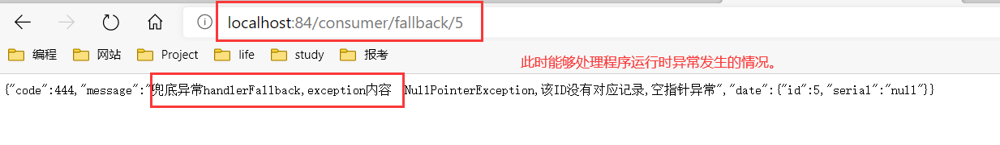

（3）只配置blockHandler

```java
@SentinelResource(value = "fallback",blockHandler = "blockHandler")
```

此时，sentinel需要进行下面的配置：


​		当刚开始点击的时候，会有error报错信息，之后快速点击，触发的Sentinel的降级规则，会被异常处理接管：


（4）fallback和blockHandler都配置

```java
@SentinelResource(value = "fallback", fallback = "handlerFallback", blockHandler = "blockHandler")
```

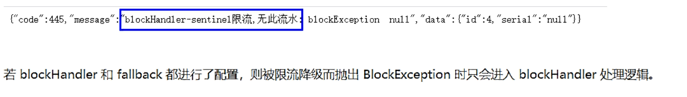

（5）忽略属性

```java
@SentinelResource(value = "fallback", fallback = "handlerFallback", blockHandler = "blockHandler",exceptionsToIgnore = {IllegalArgumentException.class})
```

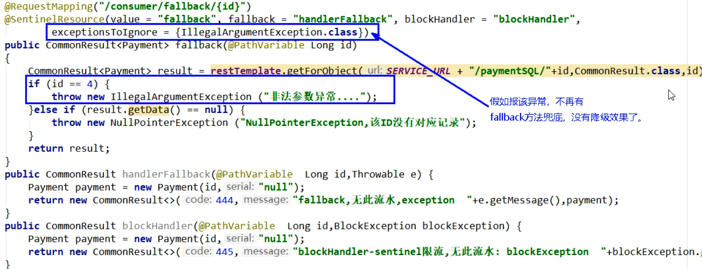

注意：

（1）热部署对java代码级生效及时，对@SentinelResource注解内属性，有时效果不好。因此，我们对该注解中的内容修改后，需要重启微服务。

（2）fallback管运行异常，blockHandler管配置违规。

### 2、sentinel整合OpenFeign

​		因为OpenFeign一般位于消费侧，所以修改cloudalibaba-consumer-nacos-order84模块。

目录结构：


1、添加pom依赖

```xml
<dependency>
    <groupId>org.springframework.cloud</groupId>
    <artifactId>spring-cloud-starter-openfeign</artifactId>
</dependency>
```

2、添加yml

```yaml
server:
  port: 84


spring:
  application:
    name: nacos-order-consumer
  cloud:
    nacos:
      discovery:
        server-addr: localhost:8848
    sentinel:
      transport:
        dashboard: localhost:8080
        port: 8719

service-url:
  nacos-user-service: http://nacos-payment-provider

#激活对Feign的支持
feign:
  sentinel:
    enabled: true
```

3、业务类

（1）带@FeignClient注解的业务接口

```java
@FeignClient(value = "nacos-payment-provider",fallback = PaymentFallbackService.class)
public interface PaymentService {
	@GetMapping(value = "/paymentSQL/{id}")
	public CommonResult<Payment> paymentSQL(@PathVariable("id") Long id);
}
```

（2）添加PaymentFallbackService实现类

```java
@Component
public class PaymentFallbackService implements PaymentService {
	@Override
	public CommonResult<Payment> paymentSQL(Long id)
	{
		return new CommonResult<>(44444,"服务降级返回,---PaymentFallbackService",new Payment(id,"errorSerial"));
	}
}
```

注意，此时接口类中要加上下面的属性：

```java
fallback = PaymentFallbackService.class
```

（3）controller

```java
// OpenFeign
@Resource
private PaymentService paymentService;

@GetMapping(value = "/consumer/paymentSQL/{id}")
public CommonResult<Payment> paymentSQL(@PathVariable("id") Long id) {
	return paymentService.paymentSQL(id);
}
```

​		可以发现，这个类和sentinel没有任何关系，在sentinel控制台不需要配置任何东西。

4、主启动类

添加下面的注解，支持Feign。

```java
@EnableFeignClients
```

5、测试

​		依次启动cloudalibaba-provider-payment9003，cloudalibaba-consumer-nacos-order84，输入下面的网址：

```http
http://localhost:84/consumer/paymentSQL/1
```

能够正常访问，当输入下面网址的时候，浏览器界面：

```java
http://localhost:84/consumer/paymentSQL/5
```

cloudalibaba-consumer-nacos-order84会自动降级，不会报错


​		当，故意关闭cloudalibaba-provider-payment9003微服务提供者，同样输入上面的网址，此时cloudalibaba-consumer-nacos-order84消费侧会自动降级，不会被耗死。


### 3、熔断框架比较

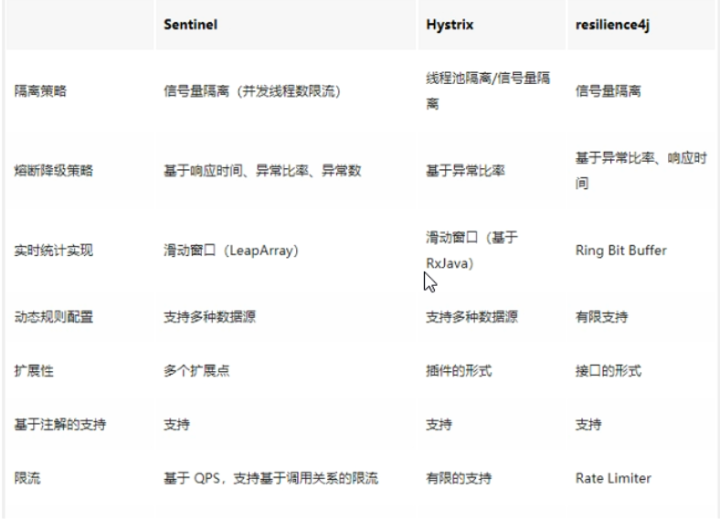


## 10 规则持久化

1、介绍

（1）概述

​		一旦我们重启应用，Sentinel规则将消失，生产环境需要将配置规则进行持久化。

（2）操作

​		将限流配置规则持久化进Nacos保存，只要刷新cloudalibaba-sentinel-service8401某个rest地址，sentinel控制台的流控规则就能看到，只要Nacos里面的配置不删除，针对cloudalibaba-sentinel-service8401上Sentinel上的流控规则持续有效。

2、测试

操作cloudalibaba-sentinel-service8401模块。

（1）添加pom依赖

```xml
<dependency>
            <groupId>com.alibaba.csp</groupId>
            <artifactId>sentinel-datasource-nacos</artifactId>
</dependency>
```

（2）配置yml

```yaml
server:
  port: 8401

spring:
  application:
    name: cloudalibaba-sentinel-service
  cloud:
    nacos:
      discovery:
        server-addr: localhost:8848
    sentinel:
      transport:
        dashboard: localhost:8080
        port: 8719  #默认8719，假如被占用了会自动从8719开始依次+1扫描。直至找到未被占用的端口
      #和transport对齐
      datasource:
        ds1:
          nacos:
            server-addr: localhost:8848
            dataId: cloudalibaba-sentinel-service
            groupId: DEFAULT_GROUP
            data-type: json
            rule-type: flow

management:
  endpoints:
    web:
      exposure:
        include: '*'
```

（3）添加nacos配置逻辑


内容解析：

```json
[
    {
         "resource": "/retaLimit/byUrl",
         "limitApp": "default",
         "grade":   1,
         "count":   1,
         "strategy": 0,
         "controlBehavior": 0,
         "clusterMode": false    
    }
]
```

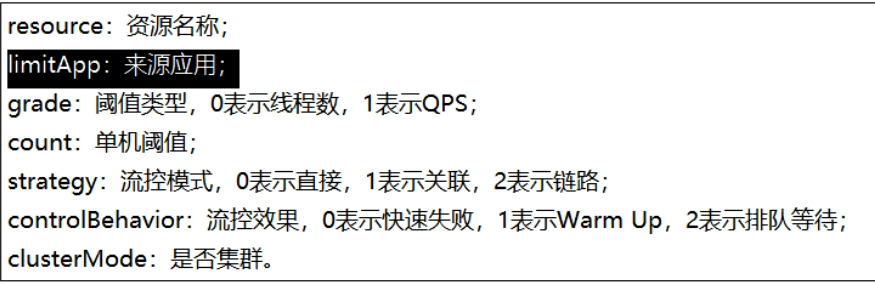

（4）测试

启动cloudalibaba-sentinel-service8401，访问下面的网址：

```http
http://localhost:8401/rateLimit/byUrl
```

发现流控规则已存在，快速点击时，该规则也奏效。

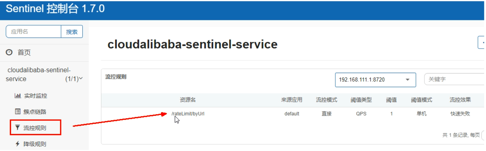

​		停止cloudalibaba-sentinel-service8401模块，再次查看流控规则时，发现该规则消失。当我们再次启动该模块的时候，其规则会再次出现（多访问一下上面网址），规则也没有变。

主要原因是，其保存到了数据库中：

