# 1 JVM体系结构概述

## 1、JVM位置

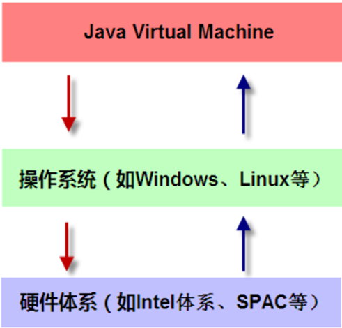

JVM是运行在操作系统之上的，它与硬件没有直接的交互。

## 2、JVM体系结构概览

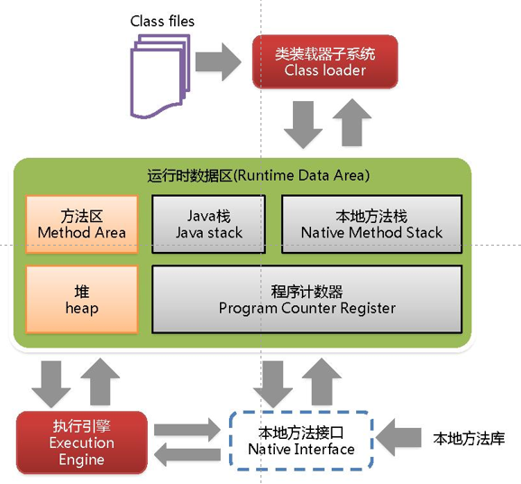

在运行数据区，有亮色和暗色的区别：对于亮色所有线程共享，灰色表示线程私有；同时亮色存在垃圾回收机制。

## 3、类装载器-ClassLoader

1、介绍

（1）负责加载class文件，class文件在文件开头有特定的文件标示，将class文件字节码内容加载到内存中，并将这些内容转换成方法区中的运行时数据结构并且ClassLoader只负责class文件的加载，至于它是否可以运行，则由Execution Engine决定 。

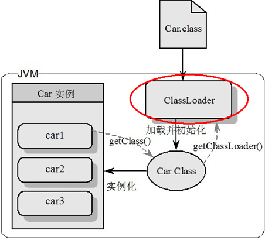

2、加载器

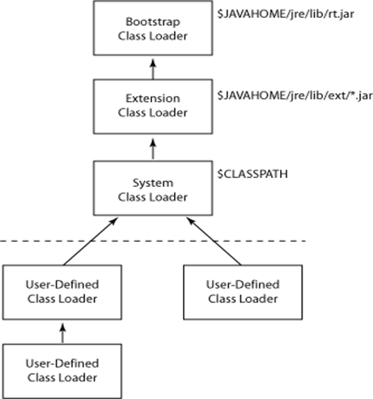

（1）虚拟机自带的加载器

+ 启动类加载器（Bootstrap）C++

+ 扩展类加载器（Extension）Java

+ 应用程序类加载器（AppClassLoader）Java也叫系统类加载器，加载当前应用的classpath的所有类

（2）用户自定义加载器

Java.lang.ClassLoader的子类，用户可以定制类的加载方式。

```java
public class MyObject {
   public static void main(String[] args) {
//    Object object = new Object();
      /**
       * Object是系统自带的
       * 1、object.getClass() 找到一瓶水的模板 （由手里的这瓶水得到水的模板）
       * 由小class得到大Class。
       * 2、object.getClass().getClassLoader() 这瓶水的模板是由那个快递员端过来的，
       * 通过这个订单编号，找这家快递公司
       * 3、Bootstrap加载器 返回null
       */
//    System.out.println(object.getClass()); //class java.lang.Object
//    System.out.println(object.getClass().getClassLoader()); //null

      /**
       * MyObject 是我们自己书写的类
       * AppClassLoader加载器
       */
      MyObject myObject = new MyObject();
      System.out.println(myObject.getClass()); //class com.xiaolun.MyObject
      //sun.misc.Launcher$AppClassLoader@18b4aac2
      System.out.println(myObject.getClass().getClassLoader());
      //sun.misc.Launcher$ExtClassLoader@1b6d3586
      System.out.println(myObject.getClass().getClassLoader().getParent());
      //null
      System.out.println(myObject.getClass().getClassLoader().getParent().getParent());
   }
}
```

3、双亲委派

​		当一个类收到了类加载请求，他首先不会尝试自己去加载这个类，而是把这个请求委派给父类去完成，每一个层次类加载器都是如此，因此所有的加载请求都应该传送到启动类加载其中，只有当父类加载器反馈自己无法完成这个请求的时候（在它的加载路径下没有找到所需加载的`Class`），子类加载器才会尝试自己去加载。

​		采用双亲委派的一个好处是：比如加载位于 `rt.jar` 包中的类 `java.lang.Objec`t，不管是哪个加载器加载这个类，最终都是委托给顶层的启动类加载器进行加载，这样就保证了使用不同的类加载器最终得到的都是同样一个 `Object`对象。 

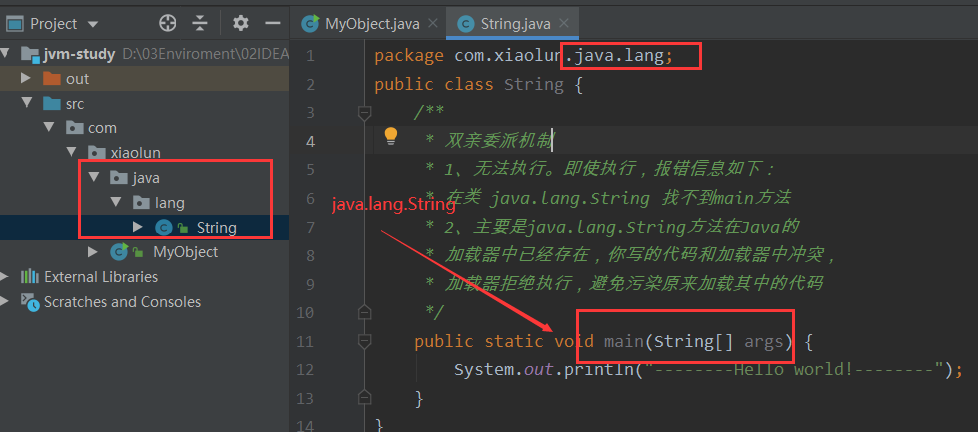

4、Execution Engine

Execution Engine执行引擎负责解释命令，提交操作系统执行。

## 4、本地接口

1、Native Interface本地接口

​		本地接口的作用是融合不同的编程语言为 `Java` 所用，它的初衷是融合 `C/C++`程序，Java 诞生的时候是 `C/C++`横行的时候，要想立足，必须有调用 `C/C++`程序，于是就在内存中专门开辟了一块区域处理标记为`native`的代码，它的具体做法是 `Native Method Stack`中登记 `native`方法，在`Execution Engine` 执行时加载`native libraies`。

 		目前该方法使用的越来越少了，除非是与硬件有关的应用，比如通过Java程序驱动打印机或者Java系统管理生产设备，在企业级应用中已经比较少见。因为现在的异构领域间的通信很发达，比如可以使用 `Socket`通信，也可以使用`Web Service`等等，不多做介绍。

2、Native Method Stack

​		它的具体做法是Native Method Stack中登记native方法，在Execution Engine 执行时加载本地方法库。

3、代码讲解

```java
public class NativeInterfaceDemo {
   public static void main(String[] args) {
      Thread thread = new Thread();
      thread.start();
      /**
       *  1、thread.start()两次会报错：java.lang.IllegalThreadStateException
       *   at java.lang.Thread.start(Thread.java:708)
       *   2、
       */
//    thread.start();
   }
}
```

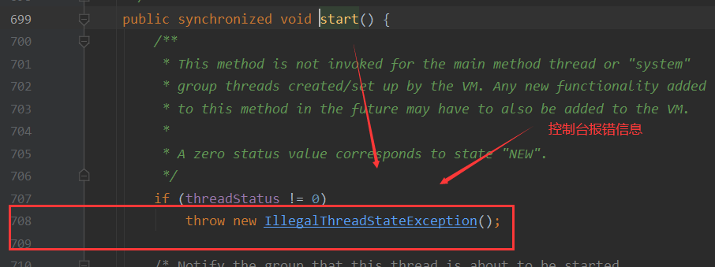

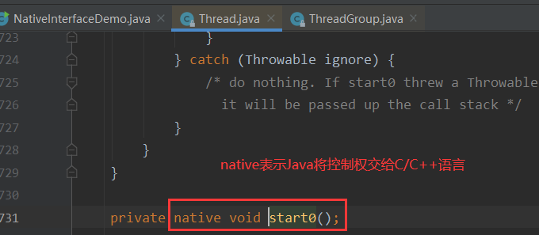

可以发现，native是一个关键字，有声明，但是没有方法的实现。

## 5、PC寄存器

​		每个线程都有一个程序计数器（记录了方法之间的调用和执行情况，类似于排班值日表），是线程私有的，就是一个指针，指向方法区中的方法字节码（用来存储指向下一条指令的地址,也即将要执行的指令代码），由执行引擎读取下一条指令，是一个非常小的内存空间，几乎可以忽略不记。

​		这块内存区域很小，它是**当前线程所执行的字节码的行号指示器**，字节码解释器通过改变这个计数器的值来选取下一条需要执行的字节码指令。

​		如果执行的是一个Native方法，那这个计数器是空的。

​		用以完成分支、循环、跳转、异常处理、线程恢复等基础功能。不会发生内存溢出(OutOfMemory=OOM)错误

## 6、方法区-Method Area

​		供各线程共享的运行时内存区域。它存储了每一个类的结构信息，例如运行时常量池（`Runtime Constant Pool`）、字段和方法数据、构造函数和普通方法的字节码内容。

​		上面讲的是规范，在不同虚拟机里头实现是不一样的，最典型的就是永久代(`PermGen space`)和元空间(`Metaspace`)。

注意：实例变量存在堆内存中，和方法区无关。

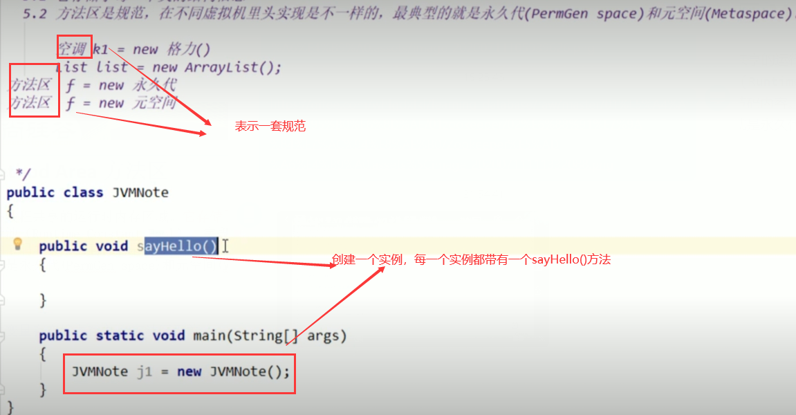

## 7、栈-Stack

1、介绍

（1）栈管运行，堆管存储。

（2）栈也叫栈内存，主管Java程序的运行，是在线程创建时创建，它的生命期是跟随线程的生命期，线程结束栈内存也就释放，**对于栈来说不存在垃圾回收问题**，只要线程一结束该栈就Over，生命周期和线程一致，是线程私有的。8种基本类型的变量+对象的引用变量+实例方法都是在函数的栈内存中分配。

（3）栈存储内容

栈帧中主要保存3 类数据：

+ 本地变量（Local Variables）:输入参数和输出参数以及方法内的变量；

+ 栈操作（Operand Stack）:记录出栈、入栈的操作；

+ 栈帧数据（Frame Data）:包括类文件、方法等等。

2、栈运行原理

​		栈中的数据都是以栈帧（Stack Frame）的格式存在，栈帧是一个内存区块，是一个数据集，是一个有关方法(Method)和运行期数据的数据集，当一个方法A被调用时就产生了一个栈帧 F1，并被压入到栈中，

A方法又调用了 B方法，于是产生栈帧 F2 也被压入栈，

B方法又调用了 C方法，于是产生栈帧 F3 也被压入栈，

……

执行完毕后，先弹出F3栈帧，再弹出F2栈帧，再弹出F1栈帧……

遵循“先进后出”/“后进先出”原则。

​		每个方法执行的同时都会创建一个栈帧，用于存储局部变量表、操作数栈、动态链接、方法出口等信息，每一个方法从调用直至执行完毕的过程，就对应着一个栈帧在虚拟机中入栈到出栈的过程。栈的大小和具体JVM的实现有关，通常在256K~756K之间,与等于1Mb左右。

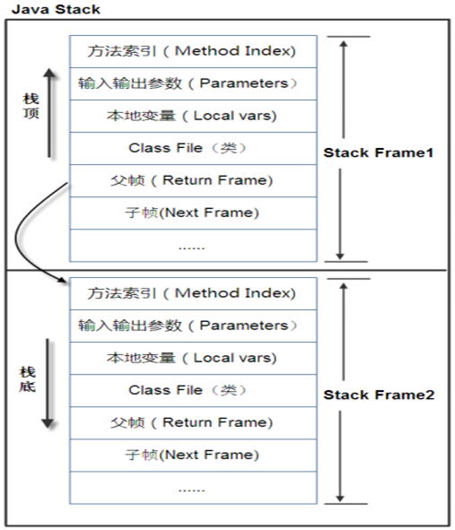

图示在一个栈中有两个栈帧：

栈帧 2是最先被调用的方法，先入栈，然后方法 2 又调用了方法1，栈帧 1处于栈顶的位置，栈帧 2 处于栈底，执行完毕后，依次弹出栈帧 1和栈帧 2，

线程结束，栈释放。 

​		每执行一个方法都会产生一个栈帧，保存到栈(后进先出)的顶部，顶部栈就是当前的方法，该方法执行完毕 后会自动将此栈帧出栈。

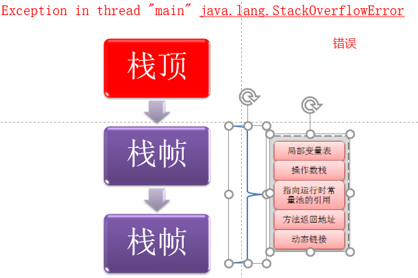

3、栈+堆+方法区的交互关系

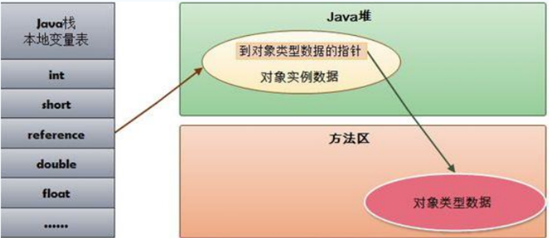

​		HotSpot是使用指针的方式来访问对象；Java堆中会存放访问**类元数据**的地址，reference存储的就直接是对象的地址。

# 2 堆（Heap）体系结构概述

### 1、介绍

​		一个JVM实例只存在一个堆内存，堆内存的大小是可以调节的。类加载器读取了类文件后，需要把类、方法、常变量放到堆内存中，保存所有引用类型的真实信息，以方便执行器执行，堆内存分为三部分：

+ Young Generation Space 新生区          Young/New

+ Tenure generation space 养老区           Old/ Tenure

+ Permanent Space             永久区             Perm

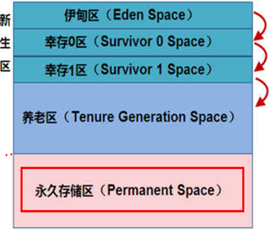

### 2、Heap堆new对象流程

​		新生区是类的诞生、成长、消亡的区域，一个类在这里产生，应用，最后被垃圾回收器收集，结束生命。新生区又分为两部分： 伊甸区（Eden space）和幸存者区（Survivor pace） ，所有的类都是在伊甸区被new出来的。

​		幸存区有两个： 0区（Survivor 0 space）和1区（Survivor 1 space）。当伊甸园的空间用完时，程序又需要创建对象，JVM的垃圾回收器将对伊甸园区进行垃圾回收(Minor GC)，将伊甸园区中的不再被其他对象所引用的对象进行销毁。然后将伊甸园中的剩余对象移动到幸存 0区。若幸存 0区也满了，再对该区进行垃圾回收，然后移动到 1 区。那如果1 区也满了呢？再移动到养老区。若养老区也满了，那么这个时候将产生MajorGC（FullGC），进行养老区的内存清理。若养老区执行了Full GC之后发现依然无法进行对象的保存，就会产生OOM异常“OutOfMemoryError”。

​		如果出现java.lang.OutOfMemoryError: Java heap space异常，说明Java虚拟机的堆内存不够。原因有二：

（a）Java虚拟机的堆内存设置不够，可以通过参数-Xms、-Xmx来调整。

（b）代码中创建了大量大对象，并且长时间不能被垃圾收集器收集（存在被引用）。

### 3、传值测试

```java
public class TransferValueDemo01 {
   public void changeVlue(int age){
       age = 30;
   }
   public void changeValue2(Person person){
      person.setPersonname("xxx");
   }
   public void changeValue3(String str){
      str = "xxx";
   }

   public static void main(String[] args) {
      TransferValueDemo01 test = new TransferValueDemo01();
      int age = 20;
      test.changeVlue(age);
      //age --> 20
      System.out.println("age --> " + age);

      Person person = new Person("abc");
      test.changeValue2(person);
      //personname --> xxx（引用的值改变了）
      System.out.println("personname --> " + person.getPersonname());
      
      String str = "abc";
      test.changeValue3(str);
      System.out.println("string --> " + str); //string --> abc
   }
}
```

讲解：

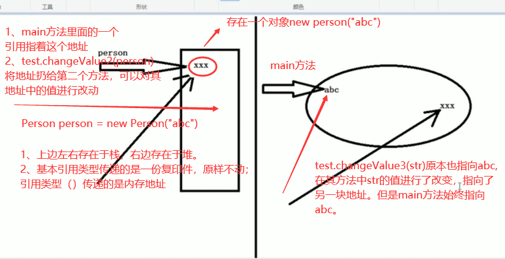

### 4、MinorGC过程

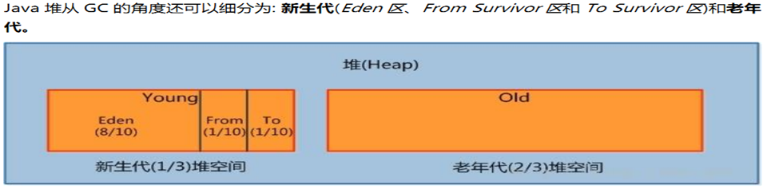

该过程主要暴扣三个过程：复制->清空->互换

口诀：

​	from区和to区，他们的位置和名分，不是固定的，每次GC后会交换，谁空谁是to。

（1）eden、SurvivorFrom 复制到 SurvivorTo，年龄+1 

​		首先，当Eden区满的时候会触发第一次GC,把还活着的对象拷贝到SurvivorFrom区，当Eden区再次触发GC的时候会扫描Eden区和From区域,对这两个区域进行垃圾回收，经过这次回收后还存活的对象,则直接复制到To区域（如果有对象的年龄已经达到了老年的标准，则赋值到老年代区），同时把这些对象的年龄+1

（2）清空 eden、SurvivorFrom 

​		然后，清空Eden和SurvivorFrom中的对象，也即复制之后有交换，谁空谁是to

（3）SurvivorTo和 SurvivorFrom 互换 

​		最后，SurvivorTo和SurvivorFrom互换，原SurvivorTo成为下一次GC时的SurvivorFrom区。部分对象会在From和To区域中复制来复制去,如此交换15次(由JVM参数MaxTenuringThreshold决定,这个参数默认是15),最终如果还是存活,就存入到老年代

### 5、永久带

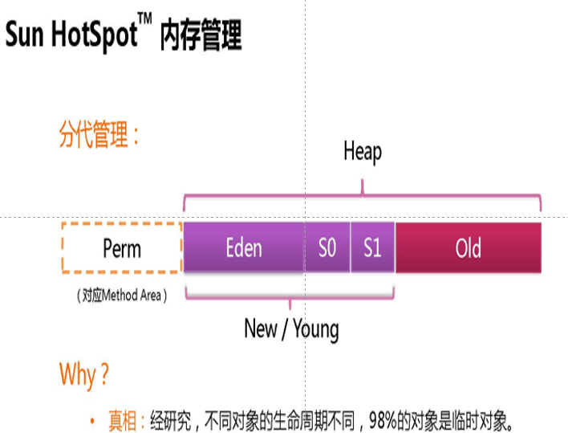

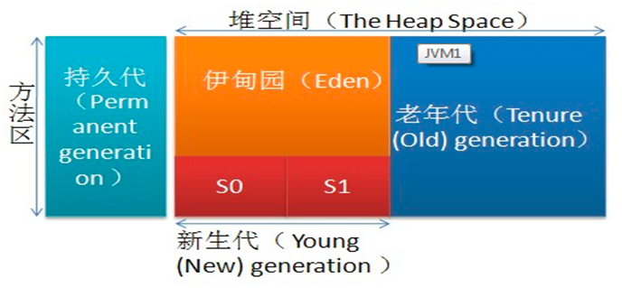

​		实际而言，方法区（Method Area）和堆一样，是各个线程共享的内存区域，它用于存储虚拟机加载的：类信息+普通常量+静态常量+编译器编译后的代码等等，虽然JVM规范将方法区描述为堆的一个逻辑部分，但它却还有一个别名叫做Non-Heap(非堆)，目的就是要和堆分开。

 		对于HotSpot虚拟机，很多开发者习惯将方法区称之为“永久代(Parmanent Gen)” ，但严格本质上说两者不同，或者说使用永久代来实现方法区而已，永久代是方法区(相当于是一个接口interface)的一个实现，jdk1.7的版本中，已经将原本放在永久代的字符串常量池移走。

永久区（Java7之前有）介绍

​		永久存储区是一个常驻内存区域，用于存放`JDK`自身所携带的 `Class,Interface` 的元数据，也就是说它存储的是运行环境必须的类信息，被装载进此区域的数据是不会被垃圾回收器回收掉的，关闭 JVM 才会释放此区域所占用的内存。

# 3 堆参数调优入门

## 1、介绍

（1）JVM垃圾收集(Java Garbage Collection )。

（2）Java7

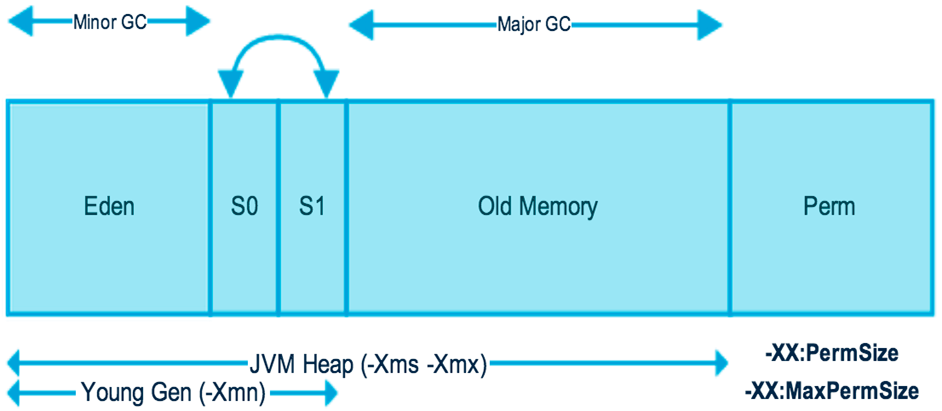

（2）Java8

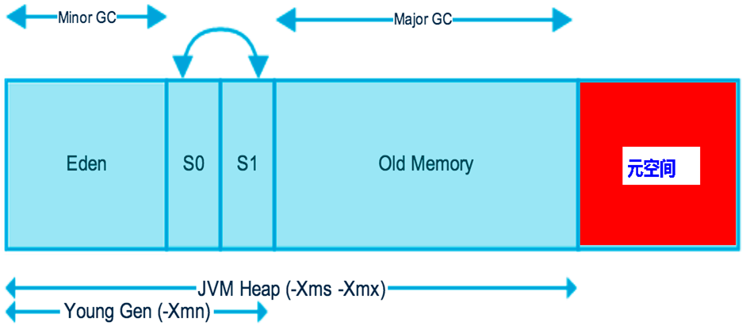

​		在Java8中，永久代已经被移除，被一个称为**元空间**的区域所取代。元空间的本质和永久代类似。

元空间与永久代之间最大的区别在于：

​		永久带使用的JVM的堆内存，但是Java8以后的元空间并不在虚拟机中而是使用本机物理内存。

​		因此，默认情况下，元空间的大小仅受本地内存限制。类的元数据放入 native memory, 字符串池和类的静态变量放入 java 堆中，这样可以加载多少类的元数据就不再由MaxPermSize 控制, 而由系统的实际可用空间来控制。

## 2、调优


```java
public class Demo01 {
   public static void main(String[] args) {
      long maxMemory = Runtime.getRuntime().maxMemory();//返回 Java 虚拟机试图使用的最大内存量。
      long totalMemory = Runtime.getRuntime().totalMemory();//返回 Java 虚拟机中的内存总量。
      /**
       * -Xmx 最大分配内存，默认为物理内存的1/4 16G/4 = 4G
       * -Xms 设置初始化分配大小,默认为物理内存的 1/64（
       * 类似于出厂空调的初始化温度配置）
       */
      //MAX_MEMORY = 3787980800（字节）、3612.5MB
      System.out.println("-Xmx:MAX_MEMORY = " + maxMemory + "（字节）、" + (maxMemory / (double) 1024 / 1024) + "MB");
      //Init_MEMORY = 255328256（字节）、243.5MB
      System.out.println("-Xms：Init_MEMORY = " + totalMemory + "（字节）、" + (totalMemory / (double) 1024 / 1024) + "MB");
   }
}
```

​		发现默认的情况下分配的内存是总内存的“1 / 4”、而初始化的内存为“1 / 64”。

（1）采用下面的方式进行调优

```ini
#保证 初始堆内存和最大堆内存一致，防止其忽高忽低。
-Xms1024m -Xmx1024m -XX:+PrintGCDetails
```

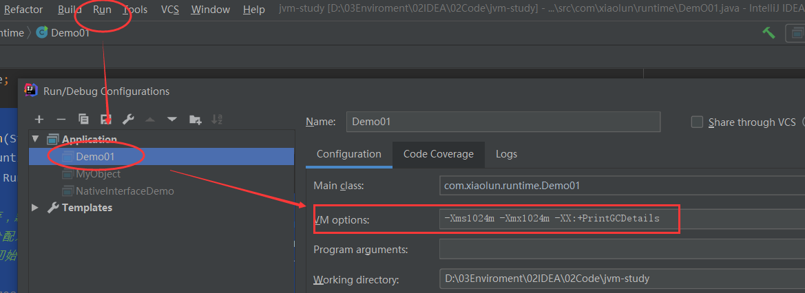

（2）通过下面的方式证明，堆内存有两个区

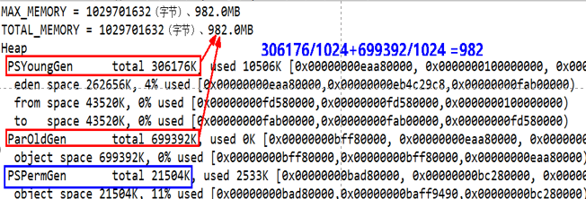

（3）通过下面的方式将内存撑爆

```java
public class Demo02 {
   public static void main(String[] args) {
      //在堆内存中存放10M个字节，会将堆内存撑爆
      //java.lang.OutOfMemoryError: Java heap space
      byte[] bytes = new byte[10*1024*1024];
   }
}
```

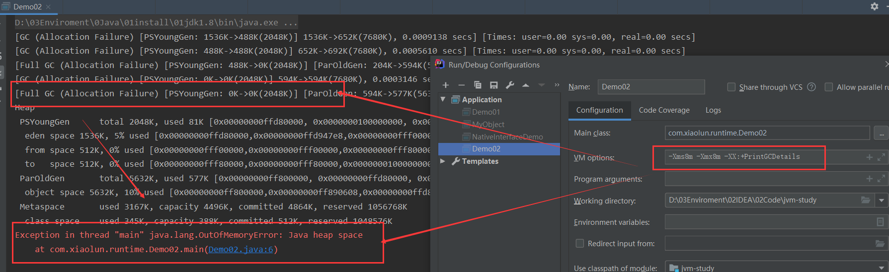

# 4、GC垃圾回收

## 1、输出详细GC手机日志信息

（1）GC

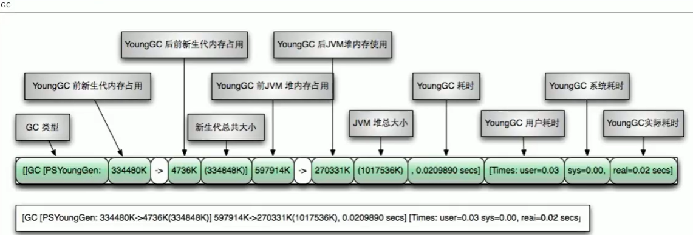

（2）FullGC

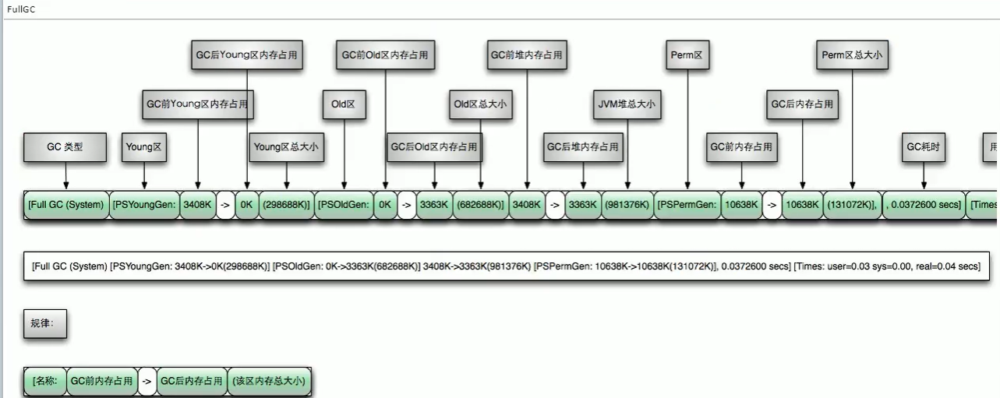

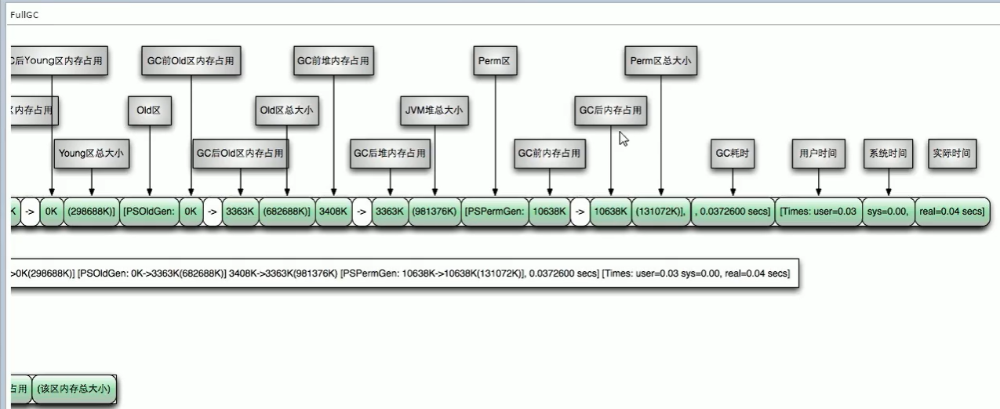

## 2、分代收集算法

包含下面的内容

（1）次数上频繁收集Young区

（2）次数上较少收集Old区

（3）基本不动元空间

## 3、GC4大算法

### 1、GC算法概述


（1）JVM在进行GC时，并非每次都对上面三个内存区域一起回收的，大部分时候回收的都是指新生代。
		因此GC按照回收的区域又分了两种类型，一种是普通GC（minor GC），一种是全局GC（major GC or Full GC）。

（2）Minor GC和Full GC的区别
　　普通GC（minor GC）：只针对新生代区域的GC,指发生在新生代的垃圾收集动作，因为大多数Java对象存活率都不高，所以Minor GC非常频繁，一般回收速度也比较快。 
　　全局GC（major GC or Full GC）：指发生在老年代的垃圾收集动作，出现了Major GC，经常会伴随至少一次的Minor GC（但并不是绝对的）。Major GC的速度一般要比Minor GC慢上10倍以上 

### 2、引用计数法

1、介绍

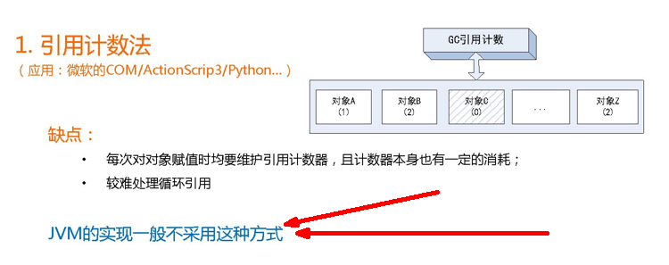

2、代码演示

```java
public class RefCountGC
{
  private byte[] bigSize = new byte[2 * 1024 * 1024];//这个成员属性唯一的作用就是占用一点内存
  Object instance = null;
 
  public static void main(String[] args)
  {
    RefCountGC objectA = new RefCountGC();
    RefCountGC objectB = new RefCountGC();
      //objectA，objectB相互指向，GC无法回收
    objectA.instance = objectB;
    objectB.instance = objectA;
    objectA = null;
    objectB = null;
 	
      //手动开启GC，类似线程。一般禁用
    System.gc();
  }
}
```

### 3、复制算法-Copying

1、年轻代中使用的是Minor GC，这种GC算法采用的是复制算法(Copying)。

2、原理图


​		复制算法的基本思想就是将内存分为两块，每次只用其中一块，当这一块内存用完，就将还活着的对象复制到另外一块上面。复制算法不会产生内存碎片。

3、缺点

（1）它浪费了一半的内存，这太要命了。 

（2）如果对象的存活率很高，我们可以极端一点，假设是100%存活，那么我们需要将所有对象都复制一遍，并将所有引用地址重置一遍。复制这一工作所花费的时间，在对象存活率达到一定程度时，将会变的不可忽视。 所以从以上描述不难看出，复制算法要想使用，最起码对象的存活率要非常低才行，而且最重要的是，我们必须要克服50%内存的浪费。

### 4、标记清除(Mark-Sweep)

1、老年代一般是由标记清除或者是标记清除与标记整理的混合实现。

2、原理图


​		用通俗的话解释一下标记清除算法，就是当程序运行期间，若可以使用的内存被耗尽的时候，GC线程就会被触发并将程序暂停，随后将要回收的对象标记一遍，最终统一回收这些对象，完成标记清理工作接下来便让应用程序恢复运行。

主要进行两项工作，第一项则是标记，第二项则是清除。  
  标记：从引用根节点开始标记遍历所有的GC Roots， 先标记出要回收的对象。
  清除：遍历整个堆，把标记的对象清除。 

3、缺点

（1）首先，它的缺点就是效率比较低（递归与全堆对象遍历），而且在进行GC的时候，需要停止应用程序，这会导致用户体验非常差劲。

（2）其次，主要的缺点则是这种方式清理出来的空闲内存是不连续的，这点不难理解，我们的死亡对象都是随机的出现在内存的各个角落的，现在把它们清除之后，内存的布局自然会乱七八糟。而为了应付这一点，JVM就不得不维持一个内存的空闲列表，这又是一种开销。而且在分配数组对象的时候，寻找连续的内存空间会不太好找。 

### 5、标记压缩(Mark-Compact)

1、老年代一般是由标记清除或者是标记清除与标记整理的混合实现。

2、原理图

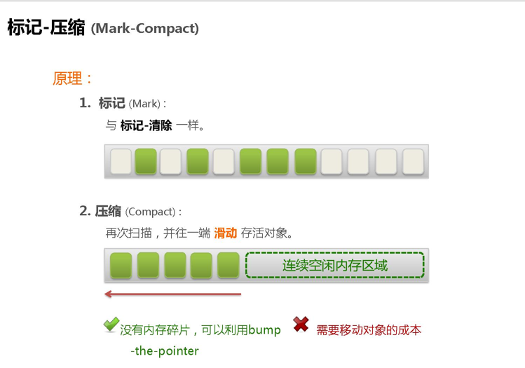

​		在整理压缩阶段，不再对标记的对象做回收，而是通过所有存活对像都向一端移动，然后直接清除边界以外的内存。
​		可以看到，标记的存活对象将会被整理，按照内存地址依次排列，而未被标记的内存会被清理掉。如此一来，当我们需要给新对象分配内存时，JVM只需要持有一个内存的起始地址即可，这比维护一个空闲列表显然少了许多开销。 

　　标记/整理算法不仅可以弥补标记/清除算法当中，内存区域分散的缺点，也消除了复制算法当中，内存减半的高额代价

3、缺点

​		标记/整理算法唯一的缺点就是效率也不高，不仅要标记所有存活对象，还要整理所有存活对象的引用地址。
​		从效率上来说，标记/整理算法要低于复制算法。

### 6、小结

​		老年代的特点是区域较大，对像存活率高。这种情况，存在大量存活率高的对像，复制算法明显变得不合适。一般是由标记清除或者是标记清除与标记整理的混合实现。

​		Mark阶段的开销与存活对像的数量成正比，这点上说来，对于老年代，标记清除或者标记整理有一些不符，但可以通过多核/线程利用，对并发、并行的形式提标记效率。

​		Sweep阶段的开销与所管理区域的大小形正相关，但Sweep“就地处决”的特点，回收的过程没有对像的移动。使其相对其它有对像移动步骤的回收算法，仍然是效率最好的。但是需要解决内存碎片问题。

​		Compact阶段的开销与存活对像的数据成开比，如上一条所描述，对于大量对像的移动是很大开销的，做为老年代的第一选择并不合适。

​			基于上面的考虑，老年代一般是由标记清除或者是标记清除与标记整理的混合实现。以hotspot中的CMS回收器为例，CMS是基于Mark-Sweep实现的，对于对像的回收效率很高，而对于碎片问题，CMS采用基于Mark-Compact算法的Serial Old回收器做为补偿措施：当内存回收不佳（碎片导致的Concurrent Mode Failure时），将采用Serial Old执行Full GC以达到对老年代内存的整理。