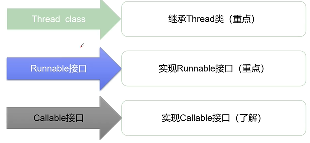
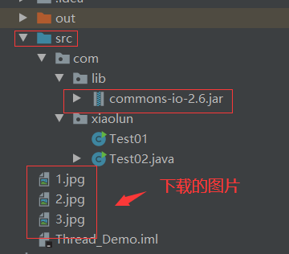
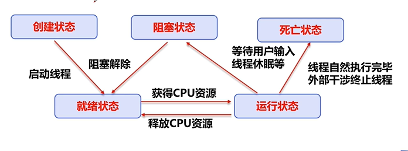
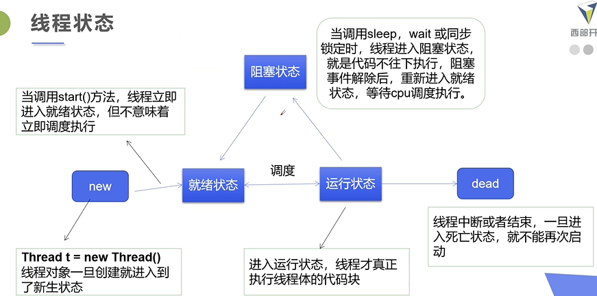
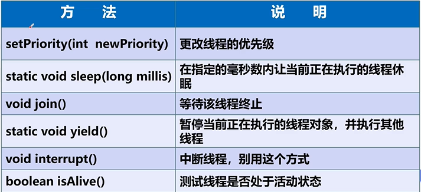
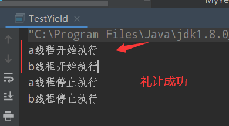
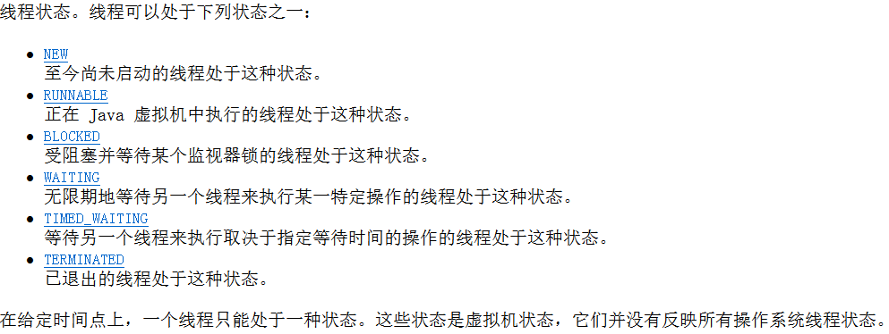

# 1 线程简介

1. 程序是指令和数据的有序集合，其本身没有任何运行的含义，是一个静态的概念。
2. 进程是执行程序的一次执行过程，是一个动态的概念。是系统资源分配的单位。如果一个进程中开辟了多条线程，线程的运行由调度器安排调度，调度器是和操作系统相关的，先后顺序是不能人为干预的。
3. 通常一个进程包含多干个线程，一个进程中中至少有一个进程。线程是CPU调度和执行的单位。是独立的执行路径。当程序运行时，即使自己没有创建线程，后台也有多个线程，例如主线程，gc线程。线程会带来额外的开销，如cpu调度时间，并发控制开销。每个线程都有自己的工作内存交互，内存控制不当会造成数据不一致。
4. main（）称之为主线程，为系统的入口，用于执行整个程序。
5. 对同一份资源操作时，会存在资源抢夺的问题，需要假如并发控制。

#  2 继承Thread类

1. 线程创建的三种方式：




```java
public class Test01 extends Thread {

    public static void main(String[] args) {
        //main线程，主线程

        //创建一个线程对象
        Test01 test01 = new Test01();
        test01.start();//调用start()方法开启线程

        for (int i = 0; i < 20; i++) {
            System.out.println("我在学习多线程---"+ i);

        }
    }

    //run方法线程体
    @Override
    public void run() {
        for (int i = 0; i < 20; i++) {
            System.out.println("我在看代码------"+ i);
        }
    }
}
```

+ 输出结果：交叉进行输出。
+ 步骤：
  + 自定义线程类继承Thread类。
  + 重写run()方法，编写线程执行体。
  + 创建线程对象，调用start()方法启动线程。

# 3 网图下载

```java
public class Test02 extends Thread{
    private String url; //网络图片地址
    private String name; //保存的文件名

    public Test02(String url,String name){
        this.url = url;
        this.name = name;
    }

    @Override
    public void run() {
        WebDownloader webDownloader = new WebDownloader();
        try {
            webDownloader.downloader(url, name);
            System.out.println("下载的文件名："+ name);
        } catch (Exception e) {
            e.printStackTrace();
        }
    }

    public static void main(String[] args) {
        //使用构造方法，对url和name进行变量初始化。
        Test02 t1 = new Test02("http://pic.ruiwen.com/allimg/1708/598c8d3752d8939511.jpg?x-oss-process=style/qr.ruiwen", "1.jpg");
        Test02 t2 = new Test02("http://pic.ruiwen.com/allimg/1708/598c8d37882aa94153.jpg?x-oss-process=style/qr.ruiwen", "2.jpg");
        Test02 t3 = new Test02("http://pic.ruiwen.com/allimg/1708/598c8d37c8e9a56734.jpg?x-oss-process=style/qr.ruiwen", "3.jpg");
        t1.start();
        t2.start();
        t3.start();
    }
}

//下载器
class WebDownloader{

    //下载方法
    public void downloader(String url,String name) throws Exception {
        //commons-io-2.6.jar已经实现的方法
        FileUtils.copyURLToFile(new URL(url), new File(name));
    }
}
```

+ 导入apache的jar包，`commons-io-2.6.jar`，使用`Add as Library...`，将jar包放到库中。其中，文件夹顺序为：



# 4 实现Runnable接口

```java
public class Test03 implements Runnable{
    @Override
    public void run() {
        for (int i = 0; i < 20; i++) {
            System.out.println("我在看代码------"+ i);
        }
    }

    public static void main(String[] args) {
        //创建Runnable接口的实现类对象
        Test03 test03 = new Test03();

        //创建线程对象，通过线程对象开启我们的线程，代理模式。
        new Thread(test03).start();

        for (int i = 0; i < 20; i++) {
            System.out.println("我在学习多线程---"+ i);
        }
    }
}
```

+ 步骤：

  + 定义MyRunnable类实现Runnable接口。
  + 实现run方法，编写线程执行体。
  + 创建线程对象，调用start()方法启动线程。

  推荐使用该方法。

# 5 初识并发问题

```java
//多个线程操作同一个对象
public class Test04 implements Runnable{
    //票数
    private int tickNum = 10;

    @Override
    public void run() {
        while (true){
            if (tickNum <= 0){
                break;
            }

            //模拟延时
            try {
                Thread.sleep(200);
            } catch (InterruptedException e) {
                e.printStackTrace();
            }
            System.out.println(Thread.currentThread().getName() + "拿了第"+(tickNum--)+"票");
        }
    }

    public static void main(String[] args) {
        Test04 ticket = new Test04();

        new Thread(ticket, "小明").start();
        new Thread(ticket, "老师").start();
        new Thread(ticket, "黄牛党").start();
    }
}
```

+ 遇到问题：多个线程操作同一个资源的情况下，线程不安全，会出现数据紊乱的情况。

# 6 龟兔赛跑

+ 首先来个赛道距离，然后要离重点越来越近。
+ 判断比赛是否结束。
+ 打印出胜利者。
+ 龟兔赛跑开始。
+ 乌龟是赢的，兔子需要睡觉，用延时模拟兔子睡觉。
+ 乌龟赢得比赛。

```java
public class Race implements Runnable{

    //胜利者
    private static String winner;

    @Override
    public void run() {
        for (int i = 0; i <= 100; i++) {

            //模拟兔子休息
            if (Thread.currentThread().getName().equals("兔子") && (i % 10 == 0)){
                try {
                    Thread.sleep(1);
                } catch (InterruptedException e) {
                    e.printStackTrace();
                }
            }

            //判断是否比赛结束
            boolean flag = gameOver(i);
            //如果比赛结束了，就停止程序
            if (flag) {
                break;
            }

            System.out.println(Thread.currentThread().getName()+"-->跑了"+i+"步");
        }
    }

    //判断是否赢得比赛
    private boolean gameOver(int steps){
        //判断是否有胜利者
        if (winner != null){ //有胜利者
            return true;
        }else {
            if (steps >= 100){
                winner = Thread.currentThread().getName();
                System.out.println("胜利者是："+ winner);
                return true;
            }
        }
        return false;
    }

    public static void main(String[] args) {
        Race race = new Race(); //一条赛道

        new Thread(race, "兔子").start();
        new Thread(race, "乌龟").start();
    }
}

```

# 7 实现Callable接口（了解）

1. 过程讲解

   + 实现该接口，需要返回值类型。

   + 重写call方法，需要抛出异常。

   + 创建目标对象。

   + 创建执行服务：

     ExecutorService ser = Executors.newFixedThreadPool(1);

   + 提交执行：

     Future<Boolean> result1 = ser.submit(t1);

   + 获取结果：

     boolean r1 = result1.get();

   + 关闭服务：

     ser.shutdownNow();

```java
public class Test05 implements Callable<Boolean> {
    private String url; //网络图片地址
    private String name; //保存的文件名

    public Test05(String url,String name){
        this.url = url;
        this.name = name;
    }
    @Override
    public Boolean call() throws Exception {
        WebDownloader webDownloader = new WebDownloader();
        try {
            webDownloader.downloader(url, name);
            System.out.println("下载的文件名："+ name);
        } catch (Exception e) {
            e.printStackTrace();
        }
        return true;
    }


    public static void main(String[] args) throws Exception {
        Test05 t1 = new Test05("http://pic.ruiwen.com/allimg/1708/598c8d3752d8939511.jpg?x-oss-process=style/qr.ruiwen", "1.jpg");
        Test05 t2 = new Test05("http://pic.ruiwen.com/allimg/1708/598c8d37882aa94153.jpg?x-oss-process=style/qr.ruiwen", "2.jpg");
        Test05 t3 = new Test05("http://pic.ruiwen.com/allimg/1708/598c8d37c8e9a56734.jpg?x-oss-process=style/qr.ruiwen", "3.jpg");
        // 创建执行服务：
        ExecutorService ser = Executors.newFixedThreadPool(3);

        //提交执行：
        Future<Boolean> r1 = ser.submit(t1);
        Future<Boolean> r2 = ser.submit(t2);
        Future<Boolean> r3 = ser.submit(t3);

        //获取结果：
        boolean rs1 = r1.get();
        boolean rs2 = r2.get();
        boolean rs3 = r3.get();

        //都是返回：true
        System.out.println(rs1);
        System.out.println(rs2);
        System.out.println(rs3);
        // 关闭服务：
        ser.shutdownNow();
    }
}
```

+ 可以定义返回值，以及抛出异常，但是实现方式复杂。

# 8 实现静态代理

```java
public class StaticProxy {
    public static void main(String[] args) {
        You you = new You(); //你要结婚
//        you.HappyMarry(); //不这样调用，使用（婚庆公司）代理方式调用，此时婚庆公司会做好多事before()。

        WeddingCompany weddingCompany = new WeddingCompany(you); //传入目标对象，我。（you 赋值给 Marry类型 target，可以吗？ ）
        weddingCompany.HappyMarry(); //通过代理调函数

        //核心分析
//        new Thread(()-> System.out.println("我爱你")).start(); //lamda表达式，和下式对比，都是使用代理模式，类似。
//        new WeddingCompany(new You()).HappyMarry();

    }
}

interface Marry{
    void HappyMarry();
}

//真实角色，我去结婚
class You implements Marry{

    @Override
    public void HappyMarry() {
        System.out.println("我要结婚了，很开心-------");
    }
}

//代理角色，帮助你去结婚
class WeddingCompany implements Marry{

    //代理谁-> 真实目标角色-我
    private Marry target;

    public WeddingCompany(Marry target){
        this.target = target;
    }

    @Override
    public void HappyMarry() {
        before();
        this.target.HappyMarry(); //这就是真实对象调用的一个结婚
        after();
    }

    private void before() {
        System.out.println("结婚之前，布置线程");
    }
    private void after() {
        System.out.println("结婚之后，收尾款");
    }
}
```

+ 总结：真实对象和代理对象都要实现同一个接口，代理对象要代理真实角色。
+ 好处：代理对象可以做很多真实对象难处理的事情，进而让真实对象专注做自己的事情。
+ `WeddingCompany weddingCompany = new WeddingCompany(you);` 需要传入目标对象（我）给婚庆公司。（`you` 赋值给 `Marry`类型 `target`，可以吗？？？ you也是实现类`Marry`接口）

# 9 Lamda表达式

1. 好处：
   + 避免匿名内部类定义过多。
   + 可以让你的代码看起来更简洁。
   + 去除一些无效的代码，只留下核心的逻辑。

2. Function Interface（函数式接口）是学习Java8 lamda表达式的关键所在。函数式接口定义为：
   + 任何接口，如果只包含唯一一个抽象方法，那么他就是函数式接口。
   + 对于函数式接口，我们可以通过lamda表达式来创建该接口的对象。

```java
//函数式接口
public interface Runnable{
	public abstract void run();
}
```

3. 推导`lamda`表达式-接口无参数情况

```java
public class Test01 {

    //3.静态内部类
    static class Like2 implements ILike{
        @Override
        public void lamda() {
            System.out.println("I like lamda2");
        }
    }

    public static void main(String[] args) {
        ILike like = new Like();
        like.lamda();

        like = new Like2();
        like.lamda();

        //4.局部内部类
        class Like3 implements ILike{
            @Override
            public void lamda() {
                System.out.println("I like lamda3");
            }
        }
        like = new Like3();
        like.lamda();

        //5.匿名内部类,没有类的名称，必须借助接口或者父类
        like = new ILike() {
            @Override
            public void lamda() {
                System.out.println("I like lamda4");
            }
        };
        like.lamda();

        //用lamda简化
        like = ()-> {
                System.out.println("I like lamda5");
        };
        like.lamda();
    }
}

//1.定义一个函数式接口
interface ILike{
    void lamda();
}

//2.实现类
class Like implements ILike{
    @Override
    public void lamda() {
        System.out.println("I like lamda");
    }
}
```

4. 推导`lamda`表达式-接口有参数情况

```java
public class Test02 {
    public static void main(String[] args) {
        ILove love = new Love();
        love.love(2);

        //匿名内部类
        love = new ILove() {
            @Override
            public void love(int a) {
                System.out.println("我爱你"+ a);
            }
        };
        love.love(3);

        //lamda表达式
        love = (int a)-> {
                System.out.println("我爱你"+ a);
        };
        love.love(4);

        //简化1：简化参数类型
        love = (a)-> {
            System.out.println("我爱你"+ a);
        };
        love.love(5);

        //简化2：简化括号
        love = a-> {
            System.out.println("我爱你"+ a);
        };
        love.love(6);

        //简化2：简化花括号
        love = a-> System.out.println("我爱你"+ a);
        love.love(7);
    }
}

interface ILove{
    void love(int a);
}

class Love implements ILove{
    @Override
    public void love(int a) {
        System.out.println("我爱你"+ a);
    }
}
```

+ lamda表达式，只有一行代码的情况下，才可以简化一行，如果有多行，需要用代码块包裹。
+ 前提是接口为函数式接口。
+ 多个参数也可以去掉参数类型，要去掉都去掉，记得保留括号。

# 10 线程五大状态





+ 线程方法



## 10.1 线程停止

+ 不推荐使用JDK提供的已废弃的stop(),destory()方法。
+ 推荐线程自己停下来。
+ 建议使用一个标志位进行终止变量，当flag=false，则终止线程运行。

```java
public class TestStop implements Runnable{

    //1.设置一个标志位
    private boolean flag = true;

    @Override
    public void run() {
        int i = 0;
        //2.线程中使用该标识
        while(flag){
            System.out.println("run...Thread"+(i++));
        }
    }

    //3.对外提供方法，改变标识
    public void stop(){
        this.flag = false;
    }

    public static void main(String[] args) {
        TestStop testStop = new TestStop();
        new Thread(testStop).start();

        for (int i = 0; i < 1000; i++) {
            System.out.println("main"+ i );
            if (i == 900){
                //4.调用stop方法，切换标志位，让线程停止
                testStop.stop();
                System.out.println("线程停止了");
            }
        }
    }
}
```

## 10.2 线程休眠

+ `sleep`存在异常`InterruptedException`，在时间达到后线程进入就绪状态。
+ 可以用来模拟网络延时（可以放大问题发生的可能性），倒计时等。
+ 每一个对象都有一把锁，sleep不会释放锁。

1. 模拟倒计时

```java
public class TestSleep2  {
    public static void main(String[] args) throws InterruptedException {
        //打印当前系统时间
        Date startTime = new Date(System.currentTimeMillis());
        while (true){
            Thread.sleep(1000);
            System.out.println(new SimpleDateFormat("HH:mm:ss").format(startTime));
            startTime = new Date(System.currentTimeMillis());//更新当前时间
        }
    }

    //模拟倒计时
    public static void tenDown() throws InterruptedException {
        int num = 10;
        while (true){
            Thread.sleep(1000);
            System.out.println();
            if (num <= 0){
                break;
            }
        }
    }
}
```

## 10.3 线程礼让

+ 礼让线程，就是让当前正在执行的线程暂停，但不阻塞，此时可以将线程从运行状态转化为就绪状态。
+ 需要让CPU调度，礼让不一定成功。

```java
public class TestYield {
    public static void main(String[] args) {
        MyYeild myYeild = new MyYeild();

        new Thread(myYeild,"a").start();
        new Thread(myYeild,"b").start();
    }
}

class MyYeild implements Runnable{

    @Override
    public void run() {
       System.out.println(Thread.currentThread().getName()+"线程开始执行");
        Thread.yield(); //线程礼让
        System.out.println(Thread.currentThread().getName()+"线程停止执行");
    }
}
```

+ 输出结果：



## 10.4 线程强制执行

+ Join合并线程，待此线程执行完成后，再执行其他线程，其他线程阻塞，可以理解为插队。

```java
public class TestJoin implements Runnable{
    @Override
    public void run() {
        for (int i = 0; i < 1000; i++) {
            System.out.println("线程vip来了"+ i);
        }
    }

    public static void main(String[] args) throws Exception {

        //启动我们的线程
        TestJoin testJoin = new TestJoin();
        Thread thread = new Thread(testJoin);
        thread.start();

        //主线程被子线程插队
        for (int i = 0; i < 500; i++) {
            if(i == 200){
                thread.join(); //插队
            }
            System.out.println("main"+ i);
        }
    }
}
```

## 10.5 观测线程状态



```java
public class TestState {
    public static void main(String[] args) throws InterruptedException {
        Thread thread = new Thread(() -> {
            for (int i = 0; i < 5; i++) {
                try {
                    Thread.sleep(1000);
                    System.out.println("i等于："+ i);
                } catch (InterruptedException e) {
                    e.printStackTrace();
                }
            }
            System.out.println("///////");
        });

        //观测状态
        Thread.State state = thread.getState();
        System.out.println(state); //new

        //观察启动后
        thread.start(); //启动线程
        state = thread.getState();
        System.out.println(state); //Run

        while(state != Thread.State.TERMINATED){ //只要线程不终止，就一直输出状态。
            Thread.sleep(100);
            state = thread.getState(); //更新线程状态
            System.out.println("输出状态"+state);
        }
    }
}
```

+ 控制台输出

```java
NEW
RUNNABLE
输出状态TIMED_WAITING
输出状态TIMED_WAITING
...
输出状态TIMED_WAITING
i等于：4
///////
输出状态TERMINATED
```

## 10.6 线程的优先级

+ Java提供一个线程调度器来监控程序中启动后进入就绪状态的所有线程，线程调度器按照优先级决定应该调度那个线程来执行。
+ 线程优先级用数字表示，范围1-10.
  + Thread.MIN_PRIORITY = 1;
  + Thread.MIN_PRIORITY = 5;
  + Thread.MIN_PRIORITY = 10;
+ 获取优先级：`getPriority().setPriority(int xx);`

```java
public class TestPriority {
    public static void main(String[] args) {
        System.out.println(Thread.currentThread().getName() + "-->" +Thread.currentThread().getPriority());

        MyPriority myPriority = new MyPriority();

        Thread t1 = new Thread(myPriority);
        Thread t2 = new Thread(myPriority);
        Thread t3 = new Thread(myPriority);
        Thread t4 = new Thread(myPriority);

        //先设置优先级再启动
        t1.start();

        t2.setPriority(1);
        t2.start();

        t3.setPriority(4);
        t3.start();

        t4.setPriority(Thread.MAX_PRIORITY);
        t4.start();
    }
}
class  MyPriority implements Runnable{
    @Override
    public void run() {
        System.out.println(Thread.currentThread().getName() + "-->" +Thread.currentThread().getPriority());
    }
}
```

+ 控制台输出

```java
main-->5
Thread-3-->10
Thread-0-->5
Thread-2-->4
Thread-1-->1
```

## 10.7 守护线程

+ 线程分为用户线程和守护线程。
+ 虚拟机必须确保用户线程执行完毕，不用等待守护线程执行完毕，比如垃圾回收线程等。

```java
public class TestDaemon {
    public static void main(String[] args) {
        God god = new God();
        You1 you1 = new You1();

        Thread thread = new Thread(god);
        thread.setDaemon(true); //默认是false，表示的是用户线程，正常的线程都是用户线程。

        thread.start(); //上帝守护线程启动
        new Thread(you1).start(); //你，用户线程启动

    }
}

//上帝
class God implements Runnable{
    @Override
    public void run() {
        while(true){
            System.out.println("------上帝保佑你-------");
        }
    }
}

//你
class You1 implements Runnable{
    @Override
    public void run() {
        for (int i = 0; i < 36500; i++) {
            System.out.println("你一生都开心的或者");
        }
        System.out.println("-----------goodbye world!-----------");
    }
}
```

+ 会发现上帝线程并不是一直存活，会在用户线程执行完毕后死亡。

## 10.8 线程同步机制

+ 并发：多个线程操作同一个资源。
+ 对于并发问题，我们需要线程同步这样一种等待机制，将多个需要同时访问此对象额线程进入这个对象的等待池中形成队列，等待前面线程使用完毕，下一个线程再使用。
+ 形成条件：队列+锁。

1. 为了保证数据在方法中被访问的正确性，在访问时加入锁机制（synchronized）,当一个线程获得对象的排他锁，独占资源，其他线程必须等待，使用后释放锁即可。存在以下问题：

+ 一个线程持有锁会导致其他所有需要此锁的线程挂起。
+ 在多线程竞争下，加锁，释放锁会导致比较多的上下文切换和调度延时，引起性能问题。
+ 如果一个优先级高的线程等待一个优先级低的线程释放锁，会导致优先级倒置，引起性能问题。

### 10.8.1 三大不安全案例

1. 不安全的买票

```java
public class UnsafeBuyTicket {
    public static void main(String[] args) {
        BuyTicket station = new BuyTicket();

        new Thread(station,"苦逼的我").start();
        new Thread(station,"帅气的你").start();
        new Thread(station,"可恶的黄牛党").start();
    }
}

class BuyTicket implements Runnable{

    private int ticket = 10;  //票
    boolean flag = true; //外部停止方式

    @Override
    public void run() {
        //买票
        while(flag){
            try {
                buy();
            } catch (Exception e) {
                e.printStackTrace();
            }
        }
    }

    private void buy() throws Exception {
        //判断是否有票
        if (ticket <= 0){
            flag = false;
            return;
        }
        //模拟延时
        Thread.sleep(100);
        //买票
        System.out.println(Thread.currentThread().getName()+ "拿到"+ (ticket--));
    }
}
```

+ 控制台输出结果

```
帅气的你拿到10
可恶的黄牛党拿到9
苦逼的我拿到8
苦逼的我拿到7
可恶的黄牛党拿到7
帅气的你拿到6
帅气的你拿到5
苦逼的我拿到3
可恶的黄牛党拿到4
帅气的你拿到2
可恶的黄牛党拿到1
苦逼的我拿到0
帅气的你拿到-1
```

2. 不安全的取钱

```java
public class UnsafeBank {
    public static void main(String[] args) {
        //账户
        Account account = new Account(100, "结婚基金");

        Drawing you = new Drawing(account, 50, "你");
        Drawing girlfriend = new Drawing(account, 100, "girlfriend");

        you.start();
        girlfriend.start();

    }
}

//账户
class Account{
    int money; //余额
    String name;//卡名

    public Account(int money, String name) {
        this.money = money;
        this.name = name;
    }
}

//银行，模拟取款
class Drawing extends Thread{

    Account account; //账户
    int drawingMoney; //取了多少钱
    int nowMoney; //现在手里还剩多少钱

    public Drawing(Account account,int drawingMoney,String name){
        super(name);
        this.account = account;
        this.drawingMoney = drawingMoney;
    }

    //取钱
    @Override
    public void run() {
        //判断有没有钱
        if (account.money -drawingMoney < 0){
            System.out.println(Thread.currentThread().getName()+"钱不够，取不了");
            return;
        }

        try {
            Thread.sleep(1000);
        } catch (InterruptedException e) {
            e.printStackTrace();
        }

        //卡内余额=余额-你取的钱
        account.money = account.money - drawingMoney;
        //你手里的钱
        nowMoney = nowMoney+drawingMoney;

        System.out.println(account.name +"余额："+ account.money);
//        Thread.currentThread().getName() = this.getName()
        System.out.println(this.getName() +"手里的钱："+ nowMoney);
    }
}
```

3. 不安全的集合

```java
public class UnsafeList {
    public static void main(String[] args) throws Exception {
        List<String> list = new ArrayList<>();
        for (int i = 0; i < 10000; i++) {
            new Thread(()->{
                list.add(Thread.currentThread().getName());
            }).start();
        }
        Thread.sleep(1000);

        System.out.println(list.size());
    }
}
```

+ 执行结果：9998。

# 11 同步方法及同步块

由于我们可以通过`private`关键字来保证数据对象只能被方法访问，所以我们只需要针对方法提出一套机制，这套机制就是`synchronized`关键字，它包括两种用法：`synchronized`方法和`synchronized`块。

**同步方法**

```java
public synchronized void method(int args){} //同步方法
```

`synchronized`方法控制对象的访问，每个对象对应一把锁，每个`synchronized`方法都必须获得调用该方法的对象的锁才能执行，否则线程会阻塞，方法一旦执行，就独占该锁，直到该方法返回才释放锁，后面被阻塞的线程才能获得这个锁，继续执行。

缺陷：若将每一个大的方法申明为`synchronized`将会影响效率。所以方法里面需要修改的内容需要锁，锁的太多，浪费资源。

**同步块**

```java
synchronized（obj）{} //同步块
```

`obj`被称为同步监视器，它可以为任何对象，但是推荐使用共享资源为同步监视器；同步方法中无需指定同步监视器，因为同步方法的同步监视器是`this`,就是对象本身，或者`class`。

**同步监视器的执行过程**

+ 第一个线程访问，锁定监视器，执行其中代码。
+ 第二个线程访问，发现同步监视器被锁定，无法访问。
+ 第一个线程访问完毕，解锁同步监视器。
+ 第二个线程访问，发现同步监视器没有锁，然后锁定并访问。

1、不安全的买票

```java
	// synchronized 同步方法，锁的是this
	private synchronized void buy() throws Exception {}
```

+ 控制台输出

```java
苦逼的我拿到10
可恶的黄牛党拿到9
帅气的你拿到8
可恶的黄牛党拿到7
苦逼的我拿到6
可恶的黄牛党拿到5
帅气的你拿到4
帅气的你拿到3
可恶的黄牛党拿到2
可恶的黄牛党拿到1
```

2、不安全的取钱

```java
 //取钱
@Override //synchronized在这里锁不住银行这个对象
public void run() {

    //锁的对象是变化的量，需要增删改的对象。
    synchronized (account){ //锁的是账户
        //判断有没有钱
        if (account.money -drawingMoney < 0){
            System.out.println(Thread.currentThread().getName()+"钱不够，取不了");
            return;
        }

        try {
            Thread.sleep(1000);
        } catch (InterruptedException e) {
            e.printStackTrace();
        }

        //卡内余额=余额-你取的钱
        account.money = account.money - drawingMoney;
        //你手里的钱
        nowMoney = nowMoney+drawingMoney;

        System.out.println(account.name +"余额："+ account.money);
        //        Thread.currentThread().getName() = this.getName()
        System.out.println(this.getName() +"手里的钱："+ nowMoney);
    }
}
```

+ 控制台输出

```java
结婚基金余额：50
你手里的钱：50
girlfriend钱不够，取不了
```

3、不安全的集合

```java
public class UnsafeList {
    public static void main(String[] args) throws Exception {
        List<String> list = new ArrayList<>();
        for (int i = 0; i < 10000; i++) {
            new Thread(()->{
                synchronized (list){ //增加锁
                    list.add(Thread.currentThread().getName());
                }
            }).start();
        }
        Thread.sleep(1000);

        System.out.println(list.size());
    }
}
```

+ 此时控制台输出为10000。

## 11.1 CopyOnWriteArrayList

```java
public class TestJUC {
    public static void main(String[] args) throws InterruptedException {
        CopyOnWriteArrayList<String> list = new CopyOnWriteArrayList<String>();
        for (int i = 0; i < 10000; i++) {
            new Thread(()->{
                list.add(Thread.currentThread().getName());
            }).start();
        }

        Thread.sleep(1000);
        System.out.println(list.size());
    }
}
```

+ 控制台输出结果为：10000。正常输出。

# 12 死锁

多个线程各自占有一些资源，并且互相等待其他线程占有的资源，而导致两个或多个线程都在等待对方释放资源，导致停止执行的情况。某一个同步块同时拥有”两个以上对象的锁“时，就可能会发生”死锁“的问题。

**死锁避免条件**

产生死锁的四个必要条件

+ 互斥条件：一个资源每次只能被一个进程使用。
+ 请求和保持条件：一个进程因请求资源而阻塞时，对已获得的资源保持不放。
+ 不剥夺条件：进程已获得的资源，在未使用完之前，不能强行剥夺。
+ 循环等待条件：若干进程之间形成一种头尾相接的循环等待资源关系。

上面列出了死锁的四个必要条件，我们想拌饭破其中的一个或多个条件就可以避免死锁的发生。

```java
//死锁：多个线程互相抱着对方需要的资源，然后形成僵持。
public class DeadLock {
    public static void main(String[] args) {
        Makeup g1 = new Makeup(0, "灰姑娘");
        Makeup g2 = new Makeup(1, "白雪公主");

        g1.start();
        g2.start();
    }
}

//口红
class Lipstick{
}

//镜子
class Mirror{
}

class Makeup extends Thread{

    //需要的资源只有一份，使用static来保证只有一份
    static Lipstick lipstick = new Lipstick();
    static Mirror mirror = new Mirror();

    int choice; //选择
    String girlName; //使用化妆品的人

    Makeup(int choice,String girlName){
        this.choice = choice;
        this.girlName = girlName;
    }

    @Override
    public void run() {
        //化妆
        try {
            makeup();
        } catch (Exception e) {
            e.printStackTrace();
        }
    }

    //互相持有对方的锁，就是需要拿到对方的资源
    public void makeup() throws Exception {
        if (choice == 0){
            synchronized (lipstick){
                System.out.println(this.girlName+"获得口红的锁");
                Thread.sleep(1000);
                synchronized (mirror){
                    System.out.println(this.girlName+"获得镜子的锁");
                }
            }
        }else {
            synchronized (mirror){
                System.out.println(this.girlName+"获得镜子的锁");
                Thread.sleep(2000);
                synchronized (lipstick){
                    System.out.println(this.girlName+"获得镜子的锁");
                }
            }
        }
    }
}//死锁：多个线程互相抱着对方需要的资源，然后形成僵持。
public class DeadLock {
    public static void main(String[] args) {
        Makeup g1 = new Makeup(0, "灰姑娘");
        Makeup g2 = new Makeup(1, "白雪公主");

        g1.start();
        g2.start();
    }
}

//口红
class Lipstick{
}

//镜子
class Mirror{
}

class Makeup extends Thread{

    //需要的资源只有一份，使用static来保证只有一份
    static Lipstick lipstick = new Lipstick();
    static Mirror mirror = new Mirror();

    int choice; //选择
    String girlName; //使用化妆品的人

    Makeup(int choice,String girlName){
        this.choice = choice;
        this.girlName = girlName;
    }

    @Override
    public void run() {
        //化妆
        try {
            makeup();
        } catch (Exception e) {
            e.printStackTrace();
        }
    }

    //互相持有对方的锁，就是需要拿到对方的资源
    public void makeup() throws Exception {
        if (choice == 0){
            synchronized (lipstick){
                System.out.println(this.girlName+"获得口红的锁");
                Thread.sleep(1000);
                synchronized (mirror){
                    System.out.println(this.girlName+"获得镜子的锁");
                }
            }
        }else {
            synchronized (mirror){
                System.out.println(this.girlName+"获得镜子的锁");
                Thread.sleep(2000);
                synchronized (lipstick){
                    System.out.println(this.girlName+"获得镜子的锁");
                }
            }
        }
    }
}
```

+ 在一个`synchronized`同步块中，在没有释放资源的情况下，还想拿到资源，造成死锁。
+ 控制台输出

```java
灰姑娘获得口红的锁
白雪公主获得镜子的锁
```

对`synchronized`的同步块进行修改

```java
public void makeup() throws Exception {
    if (choice == 0){
        synchronized (lipstick){
            System.out.println(this.girlName+"获得口红的锁");
        } //lipstick进行释放。
        //将同步块拿出来
        Thread.sleep(1000);
        synchronized (mirror){
            System.out.println(this.girlName+"获得镜子的锁");
        }
    }else {
        synchronized (mirror){
            System.out.println(this.girlName+"获得镜子的锁");
        }
        Thread.sleep(2000);
        synchronized (lipstick){
            System.out.println(this.girlName+"获得镜子的锁");
        }
    }
}
```

+ 控制台输出结果

```java
白雪公主获得镜子的锁
灰姑娘获得口红的锁
灰姑娘获得镜子的锁
白雪公主获得镜子的锁
```

# 13 Lock(锁)

从JDK5.0开始，Java提供了更强大的线程同步机制-通过显示定义同步锁对象来实现同步。同步锁使用`Lock`对象充当。

`java.util.concurrent.locks.Lock`接口是控制多个线程对共享资源进行访问的工具。锁提供了对共享资源的独占访问，每次只能有一个线程对`Lock`对象加锁，线程开始访问共享资源之前应该首先获得`Lock`对象。

`ReentrantLock`类（可重入锁）实现了`Lock`，它拥有与`synchronized`相同的并发性和内存定义，在实现线程安全的控制中，比较常见的是`ReentrantLock`，可以显式加锁，释放锁。

```java
public class TestLock {
    public static void main(String[] args) {
        TestLock2 testLock2 = new TestLock2();

        new Thread(testLock2).start();
        new Thread(testLock2).start();
        new Thread(testLock2).start();
    }
}

//买票的例子
class TestLock2 implements Runnable{

    int tickNums = 10;

    //定义lock锁
    private final ReentrantLock lock = new ReentrantLock();
    @Override
    public void run() {
        while(true){
            lock.lock(); //显式加锁
            try{  //保证线程安全的代码
                if (tickNums > 0){
                    System.out.println(tickNums --);
                    try {
                        Thread.sleep(1000);
                    } catch (InterruptedException e) {
                        e.printStackTrace();
                    }
                }else {
                    break;
                }
            }finally {
                lock.unlock(); //显式解锁
            }
        }
    }
}
```

+ 控制台按顺序正常输出:10，9....1。

# 14 线程协作

这牵涉到线程通信问题，我们考虑一种应用场景：生产者和消费者问题。

假设仓库中只能存放一件产品，生产者将生产出来的产品放入仓库，消费者将仓库中的产品取走消费；假如仓库中没有产品，则生者需要将产品放入仓库，反之，生产者需要停止生产并等待，同理，如果仓库中放有产品，则消费者可以将产品取走并消费，反之，停止消费并等待，直到仓库中再次放入产品为止。

**分析**

这是一个线程同步的问题，生产者和消费者共享同一个资源，并且二者互为依赖和条件。

因此，对于生产者而言，没有生产产品之前，要通知消费者等待，而生产了产品之后，需要立刻通知消费者消费；对于消费者而言，在消费之后，要通知生产者自己已经结束消费，生产者需要生产新的产品以供消费。

在该问题中，仅有`synchronized`关键字是不够的。

+ `synchronized`可阻止并发更新同一个共享资源，实现了同步。
+ `synchronized`不能用来实现不同线程之间的通信。

**线程通信**

Java提供了几个方法解决线程之间的通信问题。

|     方法名      |                             作用                             |
| :-------------: | :----------------------------------------------------------: |
|     wait()      | 表示线程一直等待，直到其他线程通知，与sleep不同，会释放锁。  |
| wait(long time) |                      指定等待的毫秒数。                      |
|   notify（）    |                   唤醒一个处于等待的线程。                   |
|   notifyAll()   | 唤醒同一个对象上所有调用wait()方法的线程，优先级别高的线程优先调度。 |

均是`Object`类的方法，都只能在同步方法或者同步代码块中使用，否则会抛出异常：`IIIegalMonitorStateException`。

## 14.1 管程法

+ 生产者：负责生产数据的模块（可能是方法，对象，线程和进程等）。
+ 消费者：负责处理数据的模块（可能是方法，对象，线程和进程等）。
+ 缓冲区：消费者不能直接使用生产者的数据，他们之间有个"缓冲区"。

此时，生产者将生产好的数据放入缓冲区，消费者从缓冲区中拿数据。

```java
public class TestPC {
    public static void main(String[] args) {
        SynContainer container = new SynContainer();
        new Product(container).start();
        new Consumer(container).start();
    }
}

//生产者
class Product extends Thread{
    SynContainer container;
    public Product(SynContainer container){
        this.container = container;
    }

    //生产
    @Override
    public void run() {
        for (int i = 0; i < 100; i++) {
            container.push(new Chicken(i));
            System.out.println("生产了"+i+"只鸡");
        }
    }
}

//消费者
class Consumer extends Thread{
    SynContainer container;
    public Consumer(SynContainer container){
        this.container = container;
    }

    //消费
    @Override
    public void run() {
        for (int i = 0; i < 100; i++) {
            System.out.println("消费了---->"+container.pop().id+"只鸡");
        }
    }
}

//产品
class Chicken{
    int id; //产品编号

    public Chicken(int id) {
        this.id = id;
    }
}

//缓冲区
class SynContainer{

    //需要一个容器大小
    Chicken[] chickens = new Chicken[10];
    //容器计数器
    int count = 0;

    //生产者放入产品
    public synchronized void push(Chicken chicken){
        //如果容器满了，需要等待消费者消费
        if (count == chickens.length){
            //通知消费者消费，生产者进入等待状态
            try {
                this.wait();
            } catch (InterruptedException e) {
                e.printStackTrace();
            }
        }

        //如果没有满，生产者需要丢入产品
        chickens[count] = chicken;
        count ++;

        //可以通知消费者消费了
        this.notifyAll();
    }

    //消费者消费产品
    public synchronized Chicken pop(){
        //判断能否消费
        if (count == 0){
            //等待消费者生产，消费者进入等待状态
            try {
                this.wait();
            } catch (InterruptedException e) {
                e.printStackTrace();
            }
        }

        //如果可以消费
        count --;
        Chicken chicken = chickens[count];

        //吃完了，通知生产者生产
        this.notifyAll();
        return chicken;
    }
}
```

+ 控制台输出结果

```java
生产了0只鸡
生产了1只鸡
生产了2只鸡
生产了3只鸡
生产了4只鸡
生产了5只鸡
生产了6只鸡
生产了7只鸡
生产了8只鸡
生产了9只鸡
生产了10只鸡
消费了---->9只鸡
生产了11只鸡
消费了---->10只鸡
...
```

## 14.2 信号灯法

设置并判断一个标志位，假如等于true,就让它等待，反之，就让其通知另外一个人。

```java
public class TestPC2 {
    public static void main(String[] args) {
        Tv tv = new Tv();
        new Player(tv).start();
        new Water(tv).start();
    }
}

//生产者：演员
class Player extends Thread{
    Tv tv;
    public Player (Tv tv){
        this.tv = tv;
    }

    @Override
    public void run() {
        for (int i = 0; i < 20; i++) {
            if (i%2 == 0){
                this.tv.play("--->快乐大本营播放中");
            }else {
                this.tv.play("--->抖音播放中");
            }
        }
    }
}

//消费者:观众
class Water extends Thread{
    Tv tv;
    public Water( Tv tv){
        this.tv = tv;
    }

    @Override
    public void run() {
        for (int i = 0; i < 20; i++) {
            tv.watch(); //观众只管看
        }
    }
}

//产品:节目
class Tv{
    //演员表演，观众观看
    //观众观看，演员表演
    String voice; //表演的界面
    boolean flag = true; //设置的标志位

    //表演
    public synchronized void play(String voice){
        if (!flag){
            try {
                this.wait();
            } catch (InterruptedException e) {
                e.printStackTrace();
            }
        }
        System.out.println("演员表演了:"+voice);

        //通知观众观看
        this.notifyAll();
        this.voice = voice; //更新观看界面
        this.flag = !this.flag; //更新标志位
    }

    //观看
    public synchronized void watch(){
        if (flag){
            try {
                this.wait();
            } catch (InterruptedException e) {
                e.printStackTrace();
            }
        }
        System.out.println("观众观看了:"+voice);
        //通知演员表演
        this.notifyAll();
        this.flag = !this.flag;
    }
}
```

+ 控制台输出

```java
演员表演了:--->快乐大本营播放中
观众观看了:--->快乐大本营播放中
演员表演了:--->抖音播放中
观众观看了:--->抖音播放中
演员表演了:--->快乐大本营播放中
观众观看了:--->快乐大本营播放中
演员表演了:--->抖音播放中
观众观看了:--->抖音播放中
演员表演了:--->快乐大本营播放中
观众观看了:--->快乐大本营播放中
...
```

# 15 线程池

经常创建和销毁、使用量特别大的资源，比如并发情况下的线程，对系统的性能影响很大。因此，我们可以提前创建多个线程，事先放到线程池中，使用时直接获取，使用完放到池中，就可以避免频繁创建销毁，实现重复利用。

**好处**

+ 提高了响应速度（减少了创建新线程的时间）。

+ 降低资源消耗（重复利用线程池中线程，不需要每次都创建）

+ 便于线程管理

  corePoolSize:核心池大小。

  maximumPoolSize:最大线程数。

  keepAliveTime:线程没有任务时最多保持多长时间会终止。

  **使用线程池**

  JDK5.0起提供了线程池相关的API:`ExecutorServic`e和`Executors`。

  `ExecutorServic`e是真正的线程池接口。常见的子类为：ThreadPoolExecutor

  ```java
  void execute(Runnable command)//执行任务/命令，没有返回值，一般用来执行Runnable。
  <T> Future<T>submit(Callable<T>task)//执行任务，有返回值，一般用来执行Callable。
  void shutdown(); // 关闭连接池
  ```

  `Executors`：工具类、线程池的工厂类，用于创建并返回不同类型的线程池。

```java
public class TestPool {
    public static void main(String[] args) {
        //1、创建服务，创建线程池
        ExecutorService service = Executors.newFixedThreadPool(10);  //newFixedThreadPool()：参数为线程池大小
        service.execute(new MyThread());
        service.execute(new MyThread());
        service.execute(new MyThread());
        service.execute(new MyThread());

        //2、关闭连接
        service.shutdown();
    }
}

class MyThread implements Runnable{

    @Override
    public void run() {
        System.out.println(Thread.currentThread().getName());
    }
}
```

+ 控制台输出

```java
pool-1-thread-1
pool-1-thread-4
pool-1-thread-3
pool-1-thread-2
```

