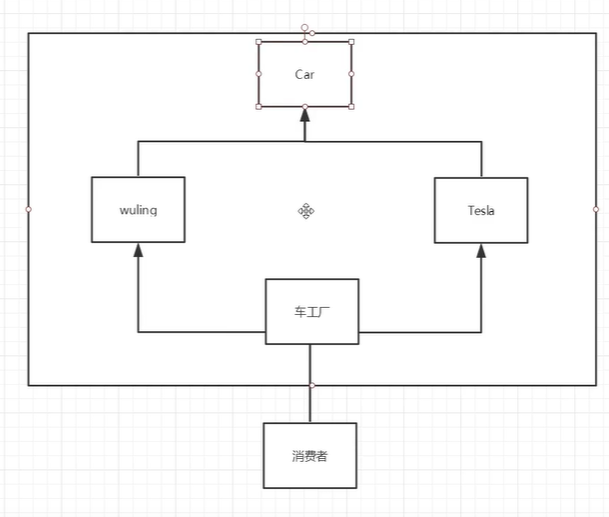
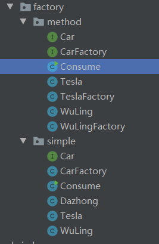
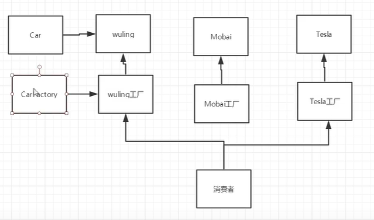
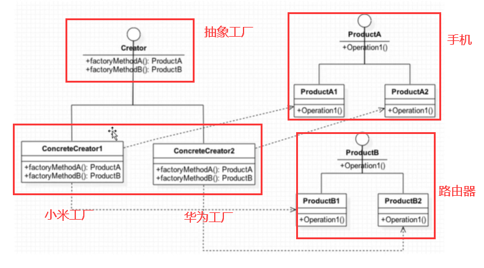
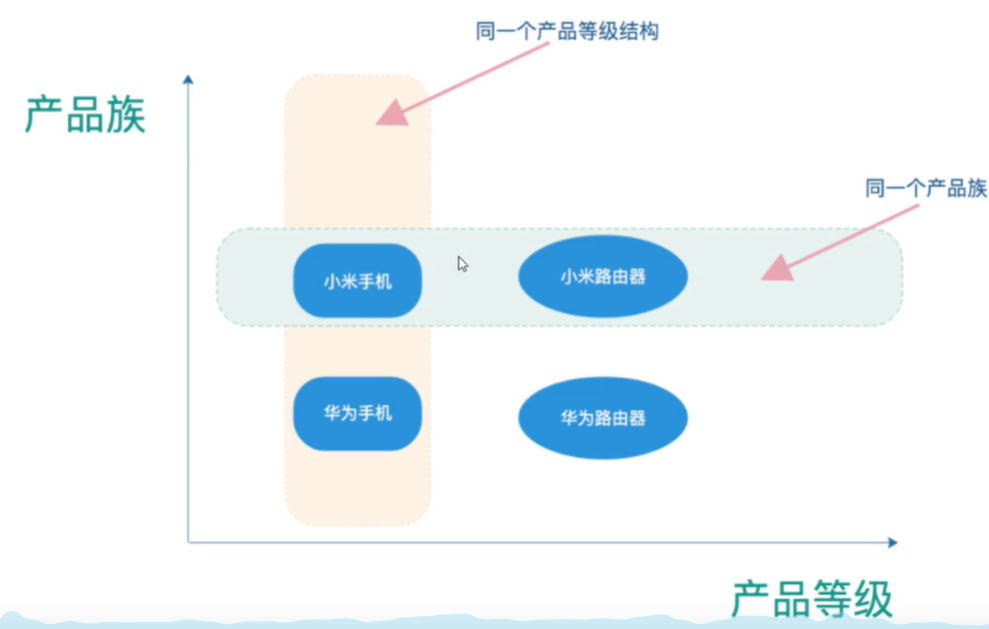
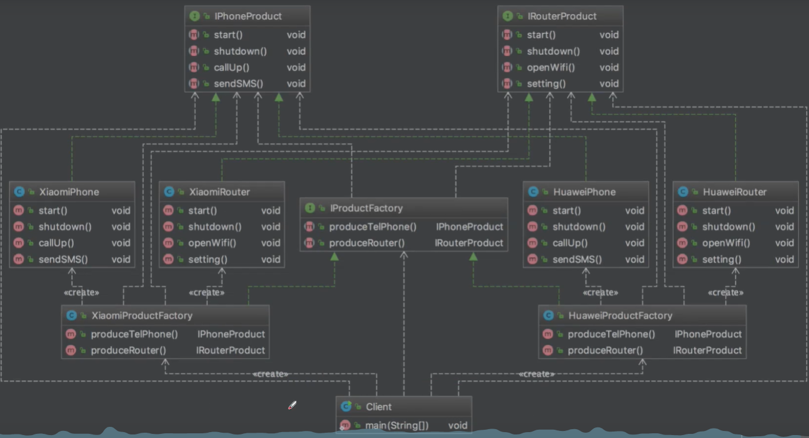
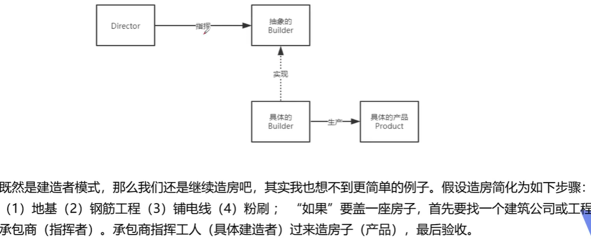
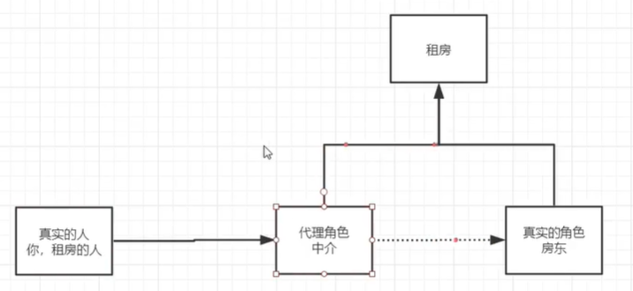
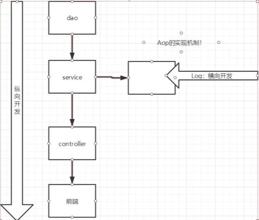

# 1 创建型模式

## 1.1 单例模式

该模式就是采取一定的方法保证在整个的软件系统中，对于某个类只能存在一个对象实例，并且该类知提供一个取得该对象实例的方法。

### 1.1.1 饿汉式（静态变量）

```java
//饿汉式（静态变量）
public class Singleton {
    //1.构造器私有化,这样的话，外部不能new出对象
    private Singleton(){
    }
    //2.本类内部创建对象实例
    private static final Singleton instance = new Singleton();
    //3. 提供一个公有的静态方法，返回实例对象
    public static Singleton getInstance(){
        return instance;
    }
}
```

+ **测试**

```java
public class Test {
    public static void main(String[] args) {
        //测试
        Singleton instance = Singleton.getInstance();
        Singleton instance2 = Singleton.getInstance();
        System.out.println(instance.hashCode());
        System.out.println(instance2.hashCode());
    }
}
```

可以发现二者输出的`hasCode()`是相同的。

**优点**

这种写法比较简单，就是在类加载的时候就完成了实例化，避免了线程同步问题。

**缺点**

在类加载的时候完成了实例化，假如没有使用这个类，将会造成内存的浪费。

也可以写成下面的写法：

**饿汉式（静态代码块）**

```java
private static final Singleton2 instance;

//在静态代码块执行时，创建单例对象
static {
    instance = new Singleton2();
}
```

上文的饿汉式（静态变量）只需要做上文这样的更改就行了，其他不需要大的改动。优缺点和饿汉式（静态变量）一致。

### 1.1.2 懒汉式（线程不安全）

```java
//懒汉式（线程不安全）
public class Singleton3 {
    private static  Singleton3 instance;
    private Singleton3(){
    }

    //提供一个静态的公有方法，当使用到该方法时，才去创建instance
    public static Singleton3 getInstance(){
        if (instance == null){
            instance = new Singleton3();
        }
        return instance;
    }
}
```

**优点**

起到了满加载的效果，在使用的时候才创建实例对象。

**缺点**

不能在单线程下使用，这是因为，在多线程下，一个线程进入到`if (instance == null)`的判断语句，还没有来得及往下执行，另一个线程也通过了这个判断语句，便会产生多个实例，所以在多线程环境中不推荐使用这种方式。

我们可以使用下面的方式来保证线程安全。

**懒汉式（线程安全，同步方法）**

```java
//加入线程同步方法，解决线程安全问题。
public static synchronized Singleton4 getInstance(){
    if (instance == null){
        instance = new Singleton4();
    }
    return instance;
}
```

优点：解决了线程不安全问题。

缺点：降低执行效率，每个线程在像获得实例的时候，执行`getInstance`方法都要执行同步，而实际上，这个方法只需要执行一次实例化就好了，后面的想获得该类实例，只需要`return`就行了。因此，在实际开发中，不推荐使用这种方式。

**懒汉式（线程安全，同步代码块）**

```java
public static  Singleton5 getInstance(){
    if (instance == null){
        synchronized (Singleton.class){
            instance = new Singleton5();
        }
    }
    return instance;
}
```

但是这种同步并不能起到线程同步的作用。假如一个线程进入到`if (instance == null)`的判断语句，还没有来得及往下执行，另一个线程也通过了这个判断语句，这样就会产生多个实例。因此，在实际开发中，不能使用这种方式。

### 1.1.3 双重检查(Double-check)

```java
//双重检查
public class Singleton6 {
    //用volatile修饰的变量，线程在每次使用变量的时候，都会读取变量修改后的值。
    private static volatile Singleton6 instance;
    private Singleton6(){
    }

    public static Singleton6 getInstance(){
        if (instance == null){
            //进到这个同步代码中的只能是一个线程
            synchronized (Singleton.class){
                if (instance == null){
                    instance = new Singleton6();
                }
            }
        }
        return instance;
    }
}
```

实例化代码只用来执行一次，后面再次访问时，通过判断语句 `if (instance == null)`直接`return`实例化对象，所以该模式线程安全，延迟加载，效率较高。

在实际开发中，推荐使用这种设计模式。

### 1.1.4 静态内部类

```java
//静态内部类
public class Singleton7 {
    private Singleton7(){
    }
    private static class SingletonInstance{
        private static final Singleton7 INSTANCE = new Singleton7();
    }
    public static Singleton7 getInstance(){
        return SingletonInstance.INSTANCE;
    }
}
```

**静态内部类的特点**

1. 外部类被装载的时候，静态内部类并不会立即被装载。
2. 当调用上面代码的`getInstance()`方式时，静态内部类会被装载，并且只会装载一次。通过这种方式可以完成`Singleton7`的实例化。

静态内部类创建实例化的方式采用了类加载的机制来保证初始化实例时只有一个线程。（在类初始化过程中，别的线程无法进入）

**优点**

避免了线程不安全的问题，利用静态内部类特点可以实现延迟加载，效率较高。推荐使用。

### 1.1.4 枚举方式

```java
//枚举类型
public class Singleton8{
    public static void main(String[] args) {
        SingletonEnum instance = SingletonEnum.INSTANCE;
        SingletonEnum instance2 = SingletonEnum.INSTANCE;
        System.out.println(instance.hashCode());
        System.out.println(instance2.hashCode());
    }

}

enum SingletonEnum{
    INSTANCE; //属性
    //定义方法
    public void sayok(){
        System.out.println("ok");
    }
}
```

使用枚举类型是借助了`JDK1.5`添加的枚举来实现单例模式，不仅可以避免多线程同步的问题，而且还能防止反序列化重新创建新的对象。这是Effective Java作者Josh Block推荐使用的方式，因此，推荐使用。

### 1.1.5 注意事项

1. 在我们的`JDK`中，`java.lang.Runtime`就是典型的单例模式，它使用的是一个饿汉式的单例模式。

2. 单例模式保证了系统内存中该类只存在一个对象，节省了系统资源，对于需要频繁创建销毁的对象，使用单例模式可以提高系统性能。
3. 当想实例化一个单例类的时候，必须要记住使用相应的获取对象的方法，而不是使用`new`。

## 1.2  工厂模式

### 1.2.1 介绍

1. **作用**

实现了创建者和调用者的分离。详细分类为：

+ 简单工厂模式（静态工厂模式）

用来生产同一等级结构中的任意产品（对于增加新的产品，需要覆盖原有代码）。

虽然在某种程度上不符合设计原则，但实际使用最多。根据设计原则，工厂方法模式比较适合；根据实际业务，简单工厂模式比较适合。

+ 工厂方法模式

用来生产同一等级结构中的固定产品（支持增加任意产品）。

+ 抽象工厂模式

围绕一个超级工厂创建其他工厂。该超级工厂又被称为其他工厂的工厂。不可以增加产品，但是可以增加产品族。

2. **OOP七大原则**

+ 开闭原则：一个软件的实体应该对外扩展开放，对修改关闭。
+ 依赖反转原则：要针对接口编程，不针对实现编程。
+ 迪米特法则：只与你直接的朋友通信，而避免和陌生人通信。

3. **核心本质**

+ 实例化对象不使用new，用工厂方法代替。
+ 将选择实现类，创建对象统一管理和控制。从而将调用者和我们的实现类解耦。

4. **应用场景**

+ JDK中的Calendar的getInstance方法。
+ JDBC中的Connection对象的获取。
+ Spring中IOC容器创建管理bean对象。
+ 反射中Class对象的newInstance方法。

### 1.2.2 创建项目

#### 1.2.2.1 简单工厂模式

1. **创建Car接口**

```java
public interface Car {
    void name();
}
```

2. **创建车工厂**

```java
public class CarFactory {
    //方法1
    public static Car getCar(String car){
        if (car.equals("wuling")){
            return new WuLing(); //我们不用管怎么实现的。
        }else if (car.equals("Tesla")){
            return new Tesla(); //我们不用管怎么实现的。
        }else {
            return null;
        }
    }
}
```

+ 车工厂就是来拿车的，我们只需要传入车的名字即可。
+ 加入要增加一辆车，我们需要对上面的代码进行修改(这不符合开闭原则，对修改是关闭的)。

3. **车的实现类**

```java
public class WuLing implements Car {
    @Override
    public void name() {
        System.out.println("五菱宏光");
    }
}

public class Tesla implements Car {
    @Override
    public void name() {
        System.out.println("特斯拉");
    }
}
```

4. **消费者实现类**

```java
public class Consume {
    public static void main(String[] args) {
        //普通方法买车（需要造出一个车，才买）
//        Car car = new WuLing();
//        Car car2 = new Tesla();

        //使用工厂创建(我们不用直接去创建它)
        Car car = CarFactory.getCar("wuling");
        car.name();
    }
}
```



#### 1.2.2.2 工厂方法模式



1. **创建车工厂接口**

```java
public interface CarFactory {
    Car getCar();
}
```

2. **分别创建对应的汽车工厂**

```java
public class WuLingFactory implements CarFactory {
    @Override
    public Car getCar() {
        return new WuLing();
    }
}

public class TeslaFactory implements CarFactory{
    @Override
    public Car getCar() {
        return new Tesla();
    }
}
```

3. **消费者实现类**

```java
public class Consume {
    public static void main(String[] args) {
        Car car = new WuLingFactory().getCar();
        Car car2 = new TeslaFactory().getCar();

        car.name();
        car2.name();
    }
}
```



## 1.3 抽象工厂模式

### 1.3.1 介绍

1. **定义**

抽象工厂模式提供了一个创建一系列相关或者相互依赖对象的接口，无需指定他们具体实现的类。

2. **使用场景**

+ 客户端（应用层）不依赖于产品类实例如何被创建、实现等细节。
+ 强调一系列相关产品对象（属于同一个产品族）一起使用创建对象需要大量的重复代码。
+ 提供一个产品类的库，所有的产品以同样的接口出现，从而使得客户端不依赖于具体的实现。

3. **优点**

具体产品在应用层的代码隔离，无需关心创建的细节。将一系列的产品统一到一起创建。

4. **缺点**

规定了所有被创建的产品集合，产品簇中扩展新的产品困难。增加了系统的抽象性和理解难度。

### 1.3.2 创建项目

1. **创建手机产品接口**

```java
//手机产品接口
public interface IphoneProduct {
    void start(); //开机
    void shutdown();//关机
    void callup(); //关机
    void sendSMS(); //发短信
}
```

2. **创建路由器接口**

```java
//路由器产品接口
public interface IRouterProduct {
    void start(); //开机
    void shutdown();//关机
    void openWifi(); //打开wifi
    void setting(); //设置参数
}
```

3. **创建小米/华为手机实现类**

```java
public class XiaomiPhone implements IphoneProduct {
    @Override
    public void start() {
        System.out.println("开启华为手机");
    }

    @Override
    public void shutdown() {
        System.out.println("关闭华为手机");
    }

    @Override
    public void callup() {
        System.out.println("华为打电话");
    }

    @Override
    public void sendSMS() {
        System.out.println("华为发短信");
    }
}
```

4. **创建小米/华为路由器实现类**

```java
public class XiaomiRouter implements IRouterProduct {
    @Override
    public void start() {
        System.out.println("启动小米路由器");
    }

    @Override
    public void shutdown() {
        System.out.println("关闭小米路由器");
    }

    @Override
    public void openWifi() {
        System.out.println("打开小米wifi");
    }

    @Override
    public void setting() {
        System.out.println("小米设置");
    }
}
```

5. **创建抽象工厂**

```java
public interface IProductFactory {

    //生产手机
    IphoneProduct iphoneProduct();

    //生产路由器
    IRouterProduct iRouterProduct();
}
```

6. **创建小米/华为工厂生产**

```java
/小米手机和路由器由小米工厂生产
public class XiaomiFactory implements IProductFactory {
    @Override
    public IphoneProduct iphoneProduct() {
        return new XiaomiPhone();
    }

    @Override
    public IRouterProduct iRouterProduct() {
        return new XiaomiRouter();
    }
}
```

7. **客户端测试类**

```java
public class Client {
    public static void main(String[] args) {
        System.out.println("---------小米系列产品---------");
        //小米工厂
        XiaomiFactory xiaomiFactory = new XiaomiFactory();

        //小米生产手机
        IphoneProduct iphoneProduct = xiaomiFactory.iphoneProduct();
        iphoneProduct.start();
        iphoneProduct.shutdown();
        iphoneProduct.callup();
        iphoneProduct.sendSMS();

        //小米生产路由器
        IRouterProduct iRouterProduct = xiaomiFactory.iRouterProduct();
        iRouterProduct.start();
        iRouterProduct.shutdown();
        iRouterProduct.openWifi();
        iRouterProduct.setting();

    }
}
```







## 1.4 建造者模式

### 1.4.1 介绍

1. **定义**

将一个复杂对象的构建与它的表示相分离，使得同样的构建过程可以创建不同的表示。

2. **作用**

在用户不知道对象的建造过程和细节的情况下就可以创建复杂的对象。用户只需要给出指定的复杂对象的类型和内容，建造者模式负责按照顺序创建复杂对象（将内部的建造过程和细节隐藏起来）

建造者模式属于创建型模式，它提供了一个创建对象的最佳方式。

3. **例子**

工厂（建造者模式）：复杂制造汽车（组装过程和细节再工厂内）。工厂模式生产零件，建造者模式构建复杂对象。

汽车购买者（用户）：你只需要说出你需要的型号（对象的类型和内容），然后直接购买就可以使用了（不需要指导汽车石如何组装的（车门，发动机，方向盘等））

### 1.4.2 创建项目

#### 1.4.2.1 常规用法



1. **创建抽象的建造者**

```java
//抽象的建造者，定义一些方法和接口
public abstract class Builder {
    //建房子的四个步骤
    abstract void builderA();  //地基
    abstract void builderB();  //钢筋水泥
    abstract void builderC();  //铺电线
    abstract void builderD();  //粉刷

    //完工，得到具体的产品
    abstract Product getProduct();
}
```

2. **创建产品类**

```java
//产品，房子
public class Product {
    private String buildA;
    private String buildB;
    private String buildC;
    private String buildD;

    public String getBuildA() {
        return buildA;
    }

    public void setBuildA(String buildA) {
        this.buildA = buildA;
    }

    public String getBuildB() {
        return buildB;
    }

    public void setBuildB(String buildB) {
        this.buildB = buildB;
    }

    public String getBuildC() {
        return buildC;
    }

    public void setBuildC(String buildC) {
        this.buildC = buildC;
    }

    public String getBuildD() {
        return buildD;
    }

    public void setBuildD(String buildD) {
        this.buildD = buildD;
    }

    @Override
    public String toString() {
        return "Product{" +
                "buildA='" + buildA + '\'' +
                ", buildB='" + buildB + '\'' +
                ", buildC='" + buildC + '\'' +
                ", buildD='" + buildD + '\'' +
                '}';
    }
}
```

3. **创建指挥类**

```java
//指挥：核心，负责指挥构建一个工程，工程如何构建，由它决定(构建过程)
public class Director {
    //指挥一个抽象的建造者(指挥工人按照顺序建房子)
    public Product build(Builder builder){
        builder.builderA(); //核心的构建顺序在这里
        builder.builderB();
        builder.builderC();
        builder.builderD();

        return builder.getProduct();
    }
}
```

4. **创建具体的建造者**

```java
//具体的建造者：工人（完成这些步骤，返回产品）
public class Worker extends Builder {
    private Product product; //需要完成的产品

    public Worker(){ //具体的工人
        product = new Product(); //任务来源，由工人直接创造的
    }
    //下面的产品并没有人去调用，没有顺序
    @Override
    void builderA() {
        product.setBuildA("地基");
        System.out.println("地基");
    }

    @Override
    void builderB() {
        product.setBuildB("钢筋水泥");
        System.out.println("钢筋水泥");
    }

    @Override
    void builderC() {
        product.setBuildC("铺电线");
        System.out.println("铺电线");
    }

    @Override
    void builderD() {
        product.setBuildD("粉刷");
        System.out.println("粉刷");
    }

    @Override
    Product getProduct() {
        return product;
    }
}
```

5. **测试类**

```java
public class Test {
    public static void main(String[] args) {//表示层
        //指挥
        Director director = new Director();
        //指挥具体的工人完成产品
        Product build = director.build(new Worker());
        build.toString();
    }
}
```

+ 控制台输出：

```java
地基
钢筋水泥
铺电线
粉刷
```

上面的例子是Builder模式的常规用法，导演类Director在Builder模式中起着很重要的作用，它用于指导具体构建者如何构建产品，控制调用先后顺序，并向调用者返回完整的产品类。但是有些情况下需要简化系统结构，可以把Director和抽象建造者进行结合。

通过静态内部类方式实现零件无序装配构造，这种方式使用更加灵活，更符合定义。内部有复杂对象的默认实现，使用时可以根据用户需求自由定义更改内容，并且无需改变具体的构造方式。就可以生产出不同复杂产品。

比如：麦当劳的套餐，服务者（具体建造者）可以随意搭配任意几种产品（零件）组成一套套餐（产品），然后出售给客户。比第一种方式少了指挥者，主要是因为第二种方式把指挥者交给用户来操作，使得产品创建更加简单灵活。

#### 1.4.2.2 改进用法

1. **创建抽象的建造者**

```java
//抽象的建造者，定义一些方法和接口
public abstract class Builder {
    //假如产品，不进行赋值任何东西，就是默认的套餐汉堡、可乐啥的，假如赋值一些自定义选择，就是不一样
    abstract Builder builderA(String msg);  //汉堡
    abstract Builder builderB(String msg);  //可乐
    abstract Builder builderC(String msg);  //薯条
    abstract Builder builderD(String msg);  //甜点

    //得到具体的产品
    abstract Product getProduct();
}
```

2. **创建产品类**

```java
//产品，套餐
public class Product {
    //默认的套餐
    private String buildA = "汉堡";
    private String buildB = "可乐";
    private String buildC = "薯条";
    private String buildD = "甜点";

    public String getBuildA() {
        return buildA;
    }

    public void setBuildA(String buildA) {
        this.buildA = buildA;
    }

    public String getBuildB() {
        return buildB;
    }

    public void setBuildB(String buildB) {
        this.buildB = buildB;
    }

    public String getBuildC() {
        return buildC;
    }

    public void setBuildC(String buildC) {
        this.buildC = buildC;
    }

    public String getBuildD() {
        return buildD;
    }

    public void setBuildD(String buildD) {
        this.buildD = buildD;
    }

    @Override
    public String toString() {
        return "Product{" +
                "buildA='" + buildA + '\'' +
                ", buildB='" + buildB + '\'' +
                ", buildC='" + buildC + '\'' +
                ", buildD='" + buildD + '\'' +
                '}';
    }
}
```

3. **创建工人类**

```java
//具体的建造者：工人（完成这些步骤，返回产品）
public class Worker extends Builder {
    private Product product; //需要完成的产品

    public Worker() {
        product = new Product();
    }

    @Override
    Builder builderA(String msg) {
        product.setBuildA(msg);
        return this;
    }

    @Override
    Builder builderB(String msg) {
        product.setBuildB(msg);
        return this;
    }

    @Override
    Builder builderC(String msg) {
        product.setBuildC(msg);
        return this;
    }

    @Override
    Builder builderD(String msg) {
        product.setBuildD(msg);
        return this;
    }

    @Override
    Product getProduct() {
        return product;
    }
}
```

4. **测试类**

```java
public class Test {
    public static void main(String[] args) {//表示层
        //服务员
        Worker worker = new Worker();
        //获得最终的产品(这里是默认值)
//        Product product = worker.getProduct();
        //链式编程（通过work自己去选择套餐），自定义组合，如果不组合，也有默认套餐
        Product product = worker.builderA("全家桶").builderB("雪碧").getProduct();
        System.out.println(product);
    }
}
```

+ 控制台输出：

```java
Product{buildA='全家桶', buildB='雪碧', buildC='薯条', buildD='甜点'}
```

**优点**

产品的建造和表示分离，实现了解耦。使用建造者模式可以使客户端不必知道产品内部组成的细节。

将复杂产品的创建步骤分解在不同的方法中，使得创建过程更加清晰。

具体的建造者类之间是相互独立的，这有利于系统的扩展。增加新的具体建造者无需修改原有类库的代码，符合“开闭原则”。

**缺点**

建造者模式所创建的产品一般具有较多的共同点，其组成部分相似；如果产品之间的差异性很大，则不适合使用建造者模式，因此其使用范围受到一定的限制。

如果产品的内部变化比较复杂，可能会导致需要定义很多具体建造者类来实现这种变化，导致系统变得很庞大。

## 1.5 代理模式

代理模式是Spring AOP底层（面试：Spring AOP 和Spring MVC）。

### 1.5.1 静态代理

#### 1.5.1.1 介绍

**角色分析**

+ 抽象角色：一般会使用接口或者抽象类来解决。
+ 真实角色：被代理的角色。
+ 代理角色：代理真实角色。之后，我们会做一些附属操作。
+ 客户：访问代理对象的人。

**优点**

可以直接使真实角色的操作更加纯粹，不用关注一些公共的业务，公共业务就交给了代理角色，进而实现了业务的分工。同时，公共业务发生扩展的时候，也方便集中管理。

**缺点**

一个真实角色会产生一个代理角色，代码量会翻倍，开发效率会降低。

#### 1.5.1.2 创建简单工程

**案例描述**

客户租房过程。



1. **接口**

```java
//租房
public interface Rent {
    void rent(); //租房
}
```

2. **真实角色**

```java
//房东
public class Host implements Rent {
    public void rent() {
        System.out.println("房东--->出租房子");
    }
}
```

3. **代理角色**

```java
//中介(实现接口的原因，是为房东出租房子)
public class Proxy implements Rent{
    private Host host; //使用那个房东就可以了

    public Proxy() {
    }
    public Proxy(Host host) {
        this.host = host;
    }

    public void rent() {
        seeHouse();
        host.rent();
        Ht();
        Fare();
    }

    //附属操作：带你看房
    public void seeHouse(){
        System.out.println("中介 --> 带你看房");
    }

    //附属操作：签合同
    public void Ht(){
        System.out.println("中介 --> 签合同");
    }

    //附属操作：收中介费
    public void Fare(){
        System.out.println("中介 --> 收中介费");
    }
}
```

4. **客户端访问代理角色**

```java
//客户
public class Client {
    public static void main(String[] args) {
        //直接找房东进行租房
//        Host host = new Host();
//        host.rent();
        //房东需要出租房子
        Host host = new Host();

        //代理,中介帮房东出租房子，但是代理角色会有一些附属操作。
        Proxy proxy = new Proxy(host);

        //你不用直接面对房东，直接找中介租房即可。
        proxy.rent(); //代理出租房子
    }
}
```

+ 控制台输出

```java
中介 --> 带你看房
房东--->出租房子
中介 --> 签合同
中介 --> 收中介费
```

+ 编码步骤

接口 -> 真实角色 -> 代理角色 -> 客户端访问代理角色。

#### 1.5.1.3 创建实际工程

**业务描述**

在公司已写好的用户增删改查的代码基础上，添加输出日志功能。

1. **创建接口**

```java
public interface UserService {
    void add();
    void delete();
    void update();
    void query();
}
```

2. **真实对象实现接口**

```java
public class UserServiceImpl implements UserService {
    public void add() {
        //添加日志消息
//        System.out.println("使用add方法");

        /**
         *  系统架构已经搭建完成，但是公司要求：需要在该方法上增加新的语句，即增加日志消息log
         *  但是在已经写好的架构上增加新东西，无疑会改变原有的结构，使代码维护变得困难。
         *  注意：改动原有的业务代码，在公司是大忌。
         */
        System.out.println("增加一个用户");
    }

    public void delete() {
        System.out.println("删除一个用户");
    }

    public void update() {
        System.out.println("修改一个用户");
    }

    public void query() {
        System.out.println("查询一个用户");
    }
}
```

3. **创建代理**

```java
/**
 * 代理需要代替真实角色。
 * 新增一个代码，并没有改变原来的代码结构。
 */
public class UserServiceProxy implements UserService {

    private UserServiceImpl userService; //真实角色

    //注入方式。
    public void setUserService(UserServiceImpl userService) {
        this.userService = userService;
    }

    public void add() {
        log("add");
        userService.add();
    }

    public void delete() {
        log("delete");
        userService.delete();
    }

    public void update() {
        log("update");
        userService.update();
    }

    public void query() {
        log("query");
        userService.query();
    }

    //日志方法
    public void log(String msg){
        System.out.println("使用了"+msg+"方法");
    }
}
```

4. **客户端测试类**

```java
public class Client {
    public static void main(String[] args) {
        UserServiceImpl userService = new UserServiceImpl();

        //使用代理模式
        UserServiceProxy proxy = new UserServiceProxy();
        proxy.setUserService(userService);
        proxy.add();
    }
}
```

+ 控制端输出结果

```java
使用了add方法
增加一个用户
```

+ 加深理解代理模式



### 1.5.2 动态代理

+ 动态代理和静态代理角色一样。
+ 动态代理的代理类是自动生成的，不是直接写好的。

分为两种情况：

第一种是有接口的情况，我们使用的是基于接口的动态代理（JDK动态代理）。此时创建接口实现类代理对象，来增强类的方法。


第二种是没有接口的情况，我们使用的是基于CGLIB（Code Generator Library）代码生成库的动态代理。此时创建子类的代理对象，来增强类的方法。


在实现的过程中，我们需要了解两个类：`Proxy`（代理）和`InvocationHandler`（调用处理程序）。

**优点**

一个动态代理类代理的是一个接口，一般就是对应的一类业务；一个动态代理可以代理多个类，只要是实现了同一个接口即可。

#### 1.5.2.1 创建简单项目

1. **创建接口**

```java
//租房
public interface Rent {
    void rent(); //租房
}
```

2. **真实对象**

```java
//房东
public class Host implements Rent {
    public void rent() {
        System.out.println("房东--->出租房子");
    }
}
```

3. **代理处理类**

```java
//使用这个类，自动生产代理类
public class ProxyInvocationHandler implements InvocationHandler {

    //被代理的接口
    private Rent rent;

    public void setRent(Rent rent){
        this.rent = rent;
    }

    //生成得到代理类
    public Object getProxy(){
        return Proxy.newProxyInstance(this.getClass().getClassLoader(),rent.getClass().getInterfaces(),this);
    }

    //接口的方法，用来处理代理实例，并返回结果
    public Object invoke(Object proxy, Method method, Object[] args) throws Throwable {

        //代理类附加操作
        seeHouse();

        //代理的本质是使用反射机制来实现的
        Object result = method.invoke(rent, args);
        return result;
    }


    public void seeHouse(){
        System.out.println("中介----->看房子");
    }
}
```

4. **测试类**

```java
public class Client {
    public static void main(String[] args) {
        //真实角色
        Host host = new Host();

        //代理角色：动态生成，没有指定
        ProxyInvocationHandler pih = new ProxyInvocationHandler();

        //处理要调用的接口对象
        pih.setRent(host);
        Rent proxy = (Rent) pih.getProxy();
        proxy.rent();
    }
}
```

+ 控制台输出

```java
中介----->看房子
房东--->出租房子
```

可以将上面的代理处理类进行抽象成一个工具类：

```java
public class ProxyInvocationHandler implements InvocationHandler {

    //被代理的接口
    private Object target;

    public void setTarget(Rent target){
        this.target = target;
    }

    //生成得到代理类
    public Object getProxy(){
        return Proxy.newProxyInstance(this.getClass().getClassLoader(),target.getClass().getInterfaces(),this);
    }

    //接口的方法，用来处理代理实例，并返回结果
    public Object invoke(Object proxy, Method method, Object[] args) throws Throwable {

        //代理的本质是使用反射机制来实现的
        Object result = method.invoke(target, args);
        return result;
    }
}
```

#### 1.5.2.2 尚硅谷项目

**需要用到的类和方法**

Class Proxy（java.lang.reflect.proxy）下的方法：


```ini
第一个参数：类加载器
第二个参数：增强方法所在的类实现的那个接口，支持多个接口。
第三个参数：实现这个接口InvocationHandle，创建代理对象，在其中写增强的方法。
```

1. **创建接口，定义方法**

```java
public interface UserDao {
    int add(int a,int b);
    String update(String id);
}
```

2. **创建接口实现类，实现方法**

```java
public class UserDaoImpl implements UserDao {

    @Override
    public int add(int a, int b) {
        //在执行method.invoke()时执行
        System.out.println("被增强的方法add()执行了-------------");
        return (a+b);
    }

    @Override
    public String update(String id) {
        return id;
    }
}
```

3. **代理类和测试类**

```java
public class JDKProxy {
    public static void main(String[] args) {
        //创建接口代理对象
        Class[] interfaces = {UserDao.class};
        UserDaoImpl userDao = new UserDaoImpl();
        UserDao dao = (UserDao)Proxy.newProxyInstance(JDKProxy.class.getClassLoader(), interfaces, new UserDaoProxy(userDao));
        int result = dao.add(1, 2);
        System.out.println("result="+result);
    }
}

//创建代理对象代码
class UserDaoProxy implements InvocationHandler{
    //1 把创建的是谁的代理对象使用有参构造的方式传递过来。
    private Object obj;

    public UserDaoProxy(Object obj) {
        this.obj = obj;
    }

    //增强逻辑的代码
    @Override
    public Object invoke(Object proxy, Method method, Object[] args) throws Throwable {
        //方法之前
        System.out.println("方法执行之前。。。。。");
        //我们可以通过method.getName()来得到需要增强不同的方法，进而可以进行其他的操作。
        System.out.println("method.getName()----->"+method.getName());
        System.out.println("传递的参数:"+ Arrays.toString(args));

        /** 执行被增强的方法(通过invoke传对象和参数)
         * obj对象中带有参数args的 method方法。res，也既是该方法的返回值。
         */
        Object res = method.invoke(obj, args);

        //方法之后
        System.out.println("方法执行之后。。。。。。"+obj);
        return res;
    }
}
```

+ 控制台输出

```ini
方法执行之前。。。。。
method.getName()----->add
传递的参数:[1, 2]
被增强的方法add()执行了-------------
方法执行之后。。。。。。com.xiaolun.proxy.UserDaoImpl@4c3e4790
result=3
```

可以发现，确实当方法add()执行后，关于这个方法的附属方法执行了。

## 1.6 原型模式

以原来对象为模板，进行复制一份的过程。

1. **原型**

```java
/**
* 视频的原型
 * 无良up主，克隆别人的视频。
 * 1. 实现一个接口
 * 2. 重写一个方法clone()
 */
public class Video implements Cloneable{
    private String name; //视频名字
    private Date createTime; //创建日期

    public Video() {
    }

    public Video(String name, Date createTime) {
        this.name = name;
        this.createTime = createTime;
    }

    public String getName() {
        return name;
    }

    public void setName(String name) {
        this.name = name;
    }

    public Date getCreateTime() {
        return createTime;
    }

    public void setCreateTime(Date createTime) {
        this.createTime = createTime;
    }

    @Override
    public String toString() {
        return "Visio{" +
                "name='" + name + '\'' +
                ", createTime=" + createTime +
                '}';
    }

    @Override
    protected Object clone() throws CloneNotSupportedException {
        return super.clone();
    }
}
```

2. **复制者**

```java
public class Bibi {
    public static void main(String[] args) throws CloneNotSupportedException {
        //原型对象
        Date date = new Date();
        Video v1 = new Video("xiaolun", date);
        System.out.println("v1--->"+v1);
        System.out.println("v1的hascode()---->"+v1.hashCode());

        //通过v1创建v2
        //克隆出来的脆响确实和原来的对象一样。
        Video v2 = (Video) v1.clone();
        System.out.println("v2--->"+v2);
        System.out.println("v2的hascode()---->"+v2.hashCode());
    }
}
```

+ 控制台输出

```java
v1--->Visio{name='xiaolun', createTime=Tue Jun 23 16:36:54 CST 2020}
v1的hascode()---->1735600054
v2--->Visio{name='xiaolun', createTime=Tue Jun 23 16:36:54 CST 2020}
v2的hascode()---->21685669
```

但是上面的克隆属于浅克隆，当`v1`对应的时间发生变化的时候，v2对应的时间也发生变化，这是我们不想看到的，我们应该进行深克隆。


1. **改造克隆代码**

```java
 @Override
    protected Object clone() throws CloneNotSupportedException {
        Object obj = super.clone();
        //需要将这个对象的属性也进行克隆，然后将新属性赋值给新的对象。
        Video v = (Video)obj;
        v.createTime = (Date) this.createTime.clone();
        return obj;
    }
```

2. **测试**

```java
public static void main(String[] args) throws CloneNotSupportedException {
    //原型对象
    Date date = new Date();
    Video v1 = new Video("xiaolun", date);
    Video v2 = (Video) v1.clone();
    System.out.println("v1--->"+v1);
    System.out.println("v2--->"+v2);

    System.out.println("------------------------------------");
    date.setTime(222222);
    System.out.println("v1--->"+v1);
    System.out.println("v2--->"+v2);
}
```

+ 控制台输出,可以看到实现了深克隆。

```java
v1--->Visio{name='xiaolun', createTime=Tue Jun 23 16:54:40 CST 2020}
v2--->Visio{name='xiaolun', createTime=Tue Jun 23 16:54:40 CST 2020}
------------------------------------
v1--->Visio{name='xiaolun', createTime=Thu Jan 01 08:03:42 CST 1970}
v2--->Visio{name='xiaolun', createTime=Tue Jun 23 16:54:40 CST 2020}
```


# 2 结构型模式

## 2.1 结构型模式

作用：在程序的结构上松耦合，从而扩大整体的类结构，用来解决更大的问题。

该模式使得原本由于接口不兼容而不能在一起工作的那些类可以一起工作。、

**角色分析**

+ 目标接口：客户所希望的接口（`USB`），目的可以是具体的或抽象的类，也可以是接口。
+ 需要适配的类：需要适配的类或适配类（网线接口）。
+ 适配器：通过包装一个需要适配的对象，把原接口转换成目标接口。


**对象适配器的特点**

+ 一个对象适配器可以把多个不同的适配者适配到同一个目标。

**类适配器缺点**

+ 对于Java，C#不支持多重类继承的语言，一次最多只能适配一个适配类，不能同时适配多个适配者。类适配器模式中的目标抽象类只能为接口，不能为类，其使用具有一定的局限性。

**输入场景**

可以将输入的字节流变成字符流。


### 2.1.1 测试

1. **需要适配的类**

```java
/**
 * 适配器模式
 * 1. 要被适配的类：网线。
 */
public class Adaptee {

    public void request(){
        System.out.println("连接网线上网");
    }
}
```

2. **适配器**

```java
//接口转换器的抽象实现。
public interface NetToUsb {

    //处理请求，网线插到USB上。
    void handlerRequest();
}
```

```java
public class Adapter2 implements NetToUsb {

    private Adaptee adaptee; //网线私有，组合到这里来了。

    //在创建网线类的时候，将网线插进去即可。
    public Adapter2(Adaptee adaptee) {
        this.adaptee = adaptee;
    }

    @Override
    public void handlerRequest() {
        adaptee.request();
    }
}
```

3. **测试类**

```java
/**
 * 客户端类：电脑，想上网，插不上网线。
 */
public class Computer {

    //我们的电脑需要连接我们的转接器才能够上网
    public void net(NetToUsb adapter){
        //上网的具体实现，找一个转接头
        adapter.handlerRequest();
    }

    public static void main(String[] args) {
        //电脑，适配器，网线
        Computer computer = new Computer(); //电脑
        Adaptee adaptee = new Adaptee(); //网线
        Adapter2 adapter = new Adapter2(adaptee); //适配器器

        computer.net(adapter);
    }
}
```

控制台输出：

```imi
连接网线上网
```

## 2.2 桥接模式

该模式是将抽象部分与它的实现部分分离，使它们都可以独立的变化。它是一种对象结构型模式，又称为接口模式。


该场景中有两个变化的维度：品牌和类型。


**优点**

桥接模式提高了系统的可扩展性，在两个变化维度中任意扩展一个维度，都不需要修改原来的系统。符合开闭原则，就像一座桥，将两个变化的维度连接起来了。

所以，一个类中存在两个独立变化的维度，且这两个维度都需要进行扩展，推荐使用桥接模式。

**缺点**

该模式的引入会增加系统的理解和设计难度，由于聚合关联关系建立在抽象层，要开开发者针对抽象进行设计和编程。

同时，该模式要求开发人员需要能够正确识别出系统中两个独立变化的维度，因此，其使用范围具有一定的局限性。


### 2.2.1 测试


1. **品牌接口类**

```java
//品牌
public interface Brand {
    void info();
}
```

1. **品牌接口实现的类**

```java
//联想品牌
public class Lenvo implements Brand {

    @Override
    public void info() {
        System.out.println("联想");
    }
}
```

```java
//苹果品牌
public class Apple implements Brand {

    @Override
    public void info() {
        System.out.println("苹果");
    }
}
```

2. **电脑类型**

```java
//抽线的电脑类
public abstract class Computer {
    //组合，品牌，搭建的桥梁（电脑类型中放置品牌）
    protected Brand brand;

    public Computer(Brand brand) {
        this.brand = brand;
    }

    public void info(){
        //品牌输出
        brand.info();
    }
}

class Deskktop extends Computer{

    public Deskktop(Brand brand) {
        super(brand);
    }

    //重写父类方法
    @Override
    public void info() {
        super.info();
        //类型输出
        System.out.println("台式机");
    }
}

class Laptop extends Computer{

    public Laptop(Brand brand) {
        //将品牌传给父类Computer，父类中的Brand接口是一座桥。
        super(brand);
    }

    //重写父类方法
    @Override
    public void info() {
        super.info(); //输出类型
        System.out.println("笔记本"); //输出品牌
    }
}
```

3. **测试类**

```java
public class Test {
    public static void main(String[] args) {
        //苹果笔记本（组装，笔记本+品牌），将两个好不相干的东西给拼接起来了。
        Computer computer = new Laptop(new Apple());
        computer.info();
        //联想台式机
    }
}
```

+ 控制台输出

```
苹果
笔记本
```

